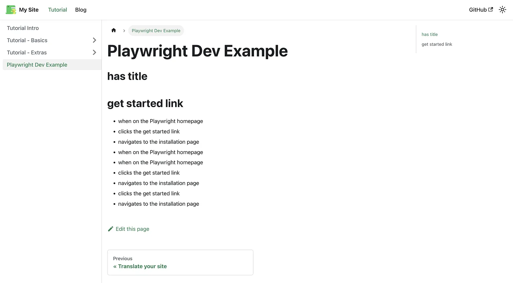

https://www.npmjs.com/package/@test2doc/playwright/v/0.0.2

Just for clarification, this is a work in progress. This is just the proof of concept right now, but it is possible to play with it. There will be breaking changes coming in the near future was I attempt to improve the markdown and best practices around how to write tests.
<!-- truncate -->
So I'm looking for feedback on ways to improve and if this is something you think you could use.

So this is the [Playwright](https://playwright.dev/) reporter that generates markdown to make documentation based off your test. I'm intending to also add [Docusaurus](https://docusaurus.io/) metadata to the markdown in the near future, but for right now it just pumps out pretty generic markdown so can work with any static site generator that uses markdown.

## Example Playwright Test
Slightly modifying the example Playwright test we get something like

```ts
import { test, expect } from '@playwright/test';

test.describe('Playwright Dev Example ', () => {
  test('has title', async ({ page }) => {
    await page.goto('https://playwright.dev/');

    // Expect a title "to contain" a substring.
    await expect(page).toHaveTitle(/Playwright/);
  });

  test('get started link', async ({ page }) => {
    await test.step('when on the Playwright homepage', async () => {
      await page.goto('https://playwright.dev/');
    });

    await test.step('clicks the get started link', async () => {
    // Click the get started link.
    await page.getByRole('link', { name: 'Get started' }).click();
    })

    await test.step('navigates to the installation page', async () => {
      // Expects page to have a heading with the name of Installation.
      await expect(page.getByRole('heading', { name: 'Installation' })).toBeVisible();
    });
  });
})
```

## Example Markdown generated
```md
# Playwright Dev Example 

## has title

## get started link

- when on the Playwright homepage
- clicks the get started link
- navigates to the installation page
- when on the Playwright homepage
- when on the Playwright homepage
- clicks the get started link
- navigates to the installation page
- clicks the get started link
- navigates to the installation page
```

## Example Docusaurus
