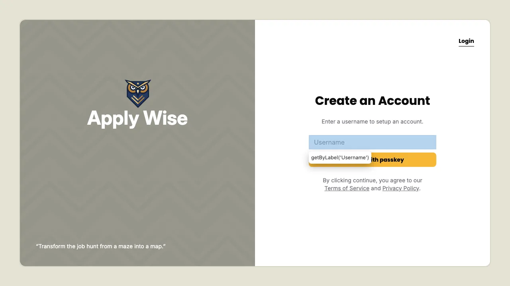
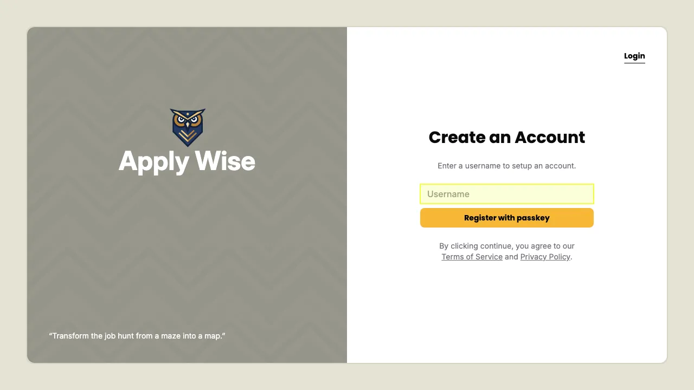

So, I’ve been working through the [Redwood SDK fullstack](https://docs.rwsdk.com/tutorial/full-stack-app/setup/) tutorial. I thought it would be an interesting and moderately complicated app to write Playwright tests for, and a great way to dogfood `test2doc`. Well, I’ve found many [issues](https://github.com/Null-Sweat-LLC/theDenverNexus/issues?q=is%3Aissue%20state%3Aclosed).

Finding issues while dogfooding is obviously wonderful as it shows test2doc working in a real world example and real world pain points. And then I figure out how to mitigate and improve the experience.
<!-- truncate -->
So, let’s go over some of the new features and fixes that I’ve added since the last post.

## New Screenshot Implementation
Originally, I just used the native Playwright screenshot feature, and it turns out that it would always give some debug output.

### Old Screenshot

### New Screenshot

Now you can see that there is no debug selector on screen, and the highlight is now yellow.

I’m going to eventually [add a label and arrow](https://github.com/Null-Sweat-LLC/theDenverNexus/issues/114) to allow for changing the color of the highlighter, but for now, this is functional.

### Screenshot bugs
There were also a few other bugs related to when the reporter and screenshots were being taken. I’m pretty sure I’ve resolved them in [this issue](https://github.com/Null-Sweat-LLC/theDenverNexus/issues/72), but if anyone encounters any other oddities, please let me know.

## Filtering Tests
This actually didn’t require any code on my behalf, but I did document how to filter out tests using [tags](https://playwright.dev/docs/test-annotations#tag-tests) so that you can either opt tests in to doc generation or opt out of doc generation.

How to do this is outlined in [the README file](https://github.com/Null-Sweat-LLC/theDenverNexus/tree/main/packages/test2doc-playwright#filtering-tests).

## Ignoring Setup Files
How does one handle authenticated tests in playwright? Turns out, you need to [make a setup file](https://playwright.dev/docs/auth). And since we only want this for setting up the authentication tokens and not for documentation, test2doc currently ignores these files.

In the purely hypothetical chance that you think we need to add doc generation for setup files, please leave a comment below or create a [GitHub issue](https://github.com/Null-Sweat-LLC/theDenverNexus/issues).

## And Fixing a Few Things That Should Have Just Worked
Things like

- [Allowing for multiple projects](https://github.com/Null-Sweat-LLC/theDenverNexus/issues/134)
- [Allowing tests with duplicate names](https://github.com/Null-Sweat-LLC/theDenverNexus/issues/92)
- [Not requiring a describe block for test suites](https://github.com/Null-Sweat-LLC/theDenverNexus/issues/60)

These were obvious oversights on my part that I didn’t realize were important until I started to dogfood, and then I instantly learned why they were so critical.

If there are other obvious things you see. Please let me know so I can prioritize fixing them.

## Next Time on Test2Doc…
I’m hoping to finally have a working tutorial for you all. I feel like I’ve worked through most of the big issues, so I'm hoping in just a few weeks (famous last words) that I’ll have the tutorial up and running and ready for sharing.

Try it out and let me know what breaks!