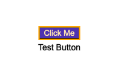
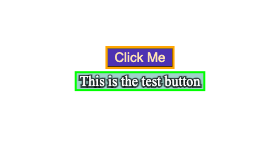
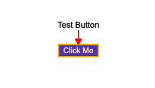
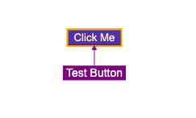
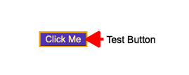
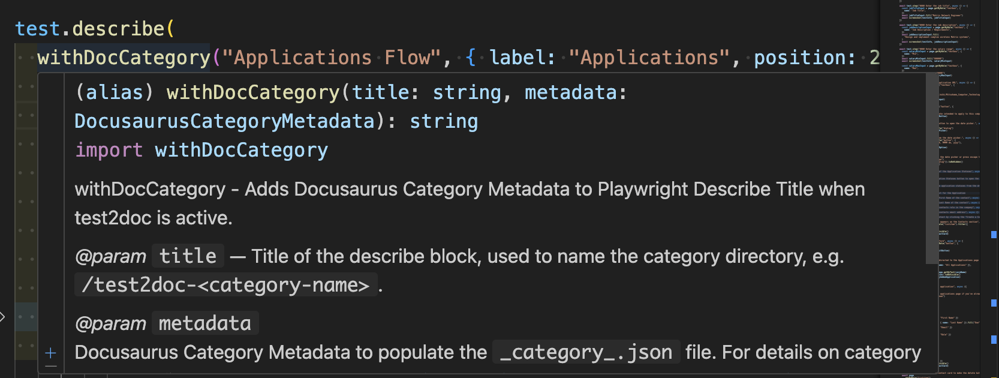
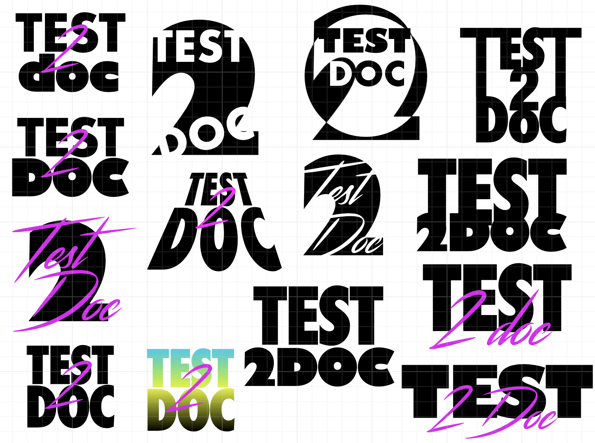
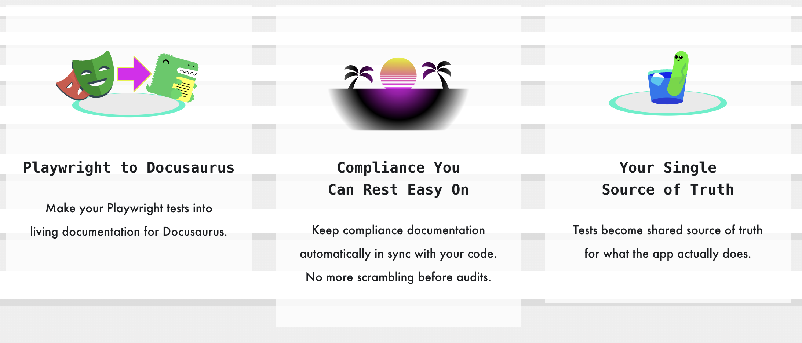

The API has been stable for a few weeks now and I just finished a redesign of [test2doc.com](https://test2doc.com/) (you might be reading it on there now).

So let's talk about some of the fun new stuff you'll see with v1.
<!-- truncate -->
## New Screenshot Functionality
You can now add:

### Labels

#### Example of Basic Label

The text "Test Button" is the label, in case that wasn't obvious. The label might not always be the clearest. It can easily get confused for actual content that might be oddly positioned on the page. Which is also why we added the ability to style the box a bit.

#### Example of Styling a Label

With a bit of styling, you can also change the highlighter color and the box around the label to emphasize it more. And if that's not good enough, we also added...

### Arrows
#### Example of an arrow pointing to the highlighted element

This way you can emphasize the highlighted element better. You can even style the arrow a bit with color and change its size.

#### Example of styling arrow and label

#### Example of styling arrow with larger stroke

### Positioning Labels
As you've seen on the other screenshots, it's possible to position the label and arrow above, below, or to the sides of the highlighted element. But wait, there's more!

#### Example of positioning multiple labels by degree

## JSDoc
A nice-to-have is quick references in IDEs. So I added JSDoc to `screenshot`, `withDocMeta`, and `withDocCategory` so you can get some nice quick references and not need to look up the docs all the time.

#### Example of JSDoc

## New Doc Site
So I've been revamping test2doc.com into a docs site. It used to be a very simple splash page to parody the Star Wars opening scroll with a call to action to subscribe to the newsletter. I thought it was very fun, and I got a comment from someone who really liked it, but it did not lead to a single subscription to the newsletter. I assume this is because the call to action was extremely far down to scroll to.

Anyway, I transferred the [README](https://www.npmjs.com/package/@test2doc/playwright?activeTab=readme) to the docs, broke it into sections, and added screenshots to help illustrate the points they trying to make better. I do think the docs are better, and I do actually want to try and dogfood test2doc on itself to see if I can generate docs for the site from the tests. That's a TBD, but should be a fun experiment.

### New Branding
I want test2doc to be the future of documentation and testing. So to capture that essence, I wanted to go with that kind of 1980's synthwave/vaporwave retrofuturism.

Turning tests into documentation isn't exactly a new idea. We've seen it with things like Cucumber and SpecFlow, but the difference is they approach it from trying to make technical specifications into a technical implementation for documentation. I'm trying to make technical specifications into a non-technical documentation. It's not new, per se; it's retro and futuristic. Really, what better than synthwave to capture this feel?

#### New Logo

So, since I was redesigning the site, I drew on my design background to create a new logo. This is the one I landed on. It uses Futura Condensed Extra Bold for "Test" and Gill Sans UltraBold for the "2 Doc".

Both are wonderfully modern fonts attempting to capture a futuristic feel. Futura was made by the German Bauhaus movement to capture the machine-age. Gill Sans was made to compete with Futura by the London Underground. Ironically, these two typefaces work beautifully together and really have a shared essence of futurism.

#### Logo Explorations concepts

I explored a few other ideas before landing on the logo I did. I originally wanted to have a hand script style font. I looked at using [Streamster](https://youssef-habchi.com/fonts/streamster) as it was literally designed to capture the feel of synthwave. But after talking with a few people, they mentioned it was hard to read and that they were confusing the text as "TestDoc2." So, I figured...fine, I'll do some more explorations and see if I can make it more legible. Though, readability was not a hard requirement.

Also, I had my heart set on using Futura and Gill Sans from almost the get-go. They're just very pretty fonts.

#### Colors
Part of the synthwave aesthetic is bright neon colors, so I fell back on magenta, yellow, cyan, and black. Ironically the four colors used for printing ([CMYK](https://en.wikipedia.org/wiki/CMYK_color_model)).

Now most brands have 2 colors; a primary and secondary. They occasionally toss in a tertiary for accents. I also added in a quaternary with black, and sometimes swapped it for white, depending on light or dark mode. This is too many colors for a brand, but you know what; rules are meant to be broken. And I like to describe myself in three simple words, "I am a rebel."

The problem is that these colors are extremely intense and hard to look at for a long while. Which is antithetical to documentation. You want people to look at the docs long enough to get the information they're looking for. So I did mute the colors a bit on the doc pages.

### Imagery

This was pretty fun to work on. I built these images using [Affinity Designer](https://affinity.serif.com/en-us/designer) (which I also used for the logos). It's a handy and basic vector art program that allows me to do design without needing to pay the Adobe tax (No shade to Adobe, they do have the better product, I just don't want to need to keep paying them).

#### Playwright to Docusaurus

This was easy to do. Just grab the SVG logos off their sites and add a little arrow to show we can turn Playwright tests into Docusaurus docs. This is literally what the reporter does. So it's pretty straightforward.

#### Sunset

The broken sun is very classic synthwave imagery. It was pretty easy to make. I started with a 20‑pixel‑high rectangle and reduced it by 5 pixels at each step, then used the result as a mask over the circle. It creates a nice kind of scan line effect for the sunset.

The palm trees are just a simple triangle I bent using the Bézier handles from the pen tool. Then I added some crescent shapes to make the palm leaves. It turned out pretty good, and I like that kind of simplistic lo-fi effect.

#### Cool Cucumber

I needed a third image, and I thought about a funny little saying about "cool as a cucumber." So I thought it might make for a fun image.

This was a bit more complex than the other images, because I needed to slice up the glass and cucumber to create the illusion of depth. But I'm pretty happy with the results.

I did run into an error, where the gradient I originally added to the sunglasses didn't render correctly. After trying a few different things, I just gave up and made them black lenses. Which I'm a bit disappointed in, because I wanted fun summery yellow to magenta glasses, but this still gets the effect I'm going for. So I can accept it (for now...).

### Newsletter
I'm moving the newsletter off Substack and using [Mailgun](https://www.mailgun.com/) to send emails automatically when I publish a new post. You might even be reading this now from your mailbox (though extremely unlikely).

The whole reason I did this was to automate the newsletter with blog post updates. Which Substack does not currently offer any APIs to handle this kind of automation. And I really don't want to have to manually take the markdown and parse it, and manually add it to Substack. And since Substack isn't really meeting my needs, I figured, how hard could it be to just do it myself?

Moderately complicated.

Still doable, but it did require some setup. But you know what. I'm a goddamn engineer. I'm not trying to send humans to the moon. I'm just sending some emails when I make a post. Anyway, the automation is all set up. There is a bug with [images being broken](https://github.com/dethstrobe/theDenverNexus/issues/253) for the emails...which I'll be looking into *soon*. So next email you get from me, that'll have working images. I swear.

Also, in the footer, there is a signup form. If you're not subscribed, please do. That is assuming you want to hear about the latest from test2doc. Don't just pity subscribe to my newsletter; that'd be silly.

## Thanks for the support
If you've gotten to this point, thanks for sticking around.

It's been a wild ride to get to v1. And my next blog post will be to announce the tutorial on how to use test2doc with RedwoodSDK (unless something more important comes up...again...), because other than a few small bugs, I'm pretty sure the tutorial is the most important thing for me to work on next.

And please, if you're using test2doc please give me some feedback on if it's helpful to you, or if you run into any issues, or even come up with improvements in DX.