import Tabs from '@theme/Tabs';
import TabItem from '@theme/TabItem';

By the end of this lesson, you'll have:
- A working RedwoodSDK application running locally
- A styled login page using modern UI components
- A basic Playwright e2e test suite
- A basic Docusaurus

## Project Generation and Structure
The first thing we'll do is set up our project.
<Tabs groupId="package-managers">
  <TabItem value="npm" label="npm" default>
```sh
npx create-rwsdk applywize
cd applywize
npm install
npm run dev
```
  </TabItem>
  <TabItem value="yarn" label="yarn">
```sh
npx create-rwsdk applywize
cd applywize
yarn install
yarn run dev
```
  </TabItem>
  <TabItem value="pnpm" label="pnpm">
```sh
npx create-rwsdk applywize
cd applywize
pnpm install
pnpm dev
```
  </TabItem>
</Tabs>

This will create a new RWSDK project called applywize, inside a directory called applywize, using the standard starter project template, install the dependencies, and run the development server.

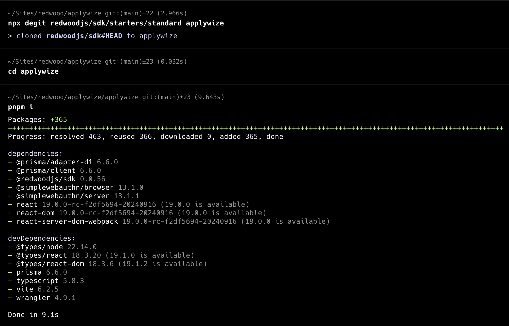

The developer server will typically be running on http://localhost:5173.

If you check it out in the browser! You're up and running!

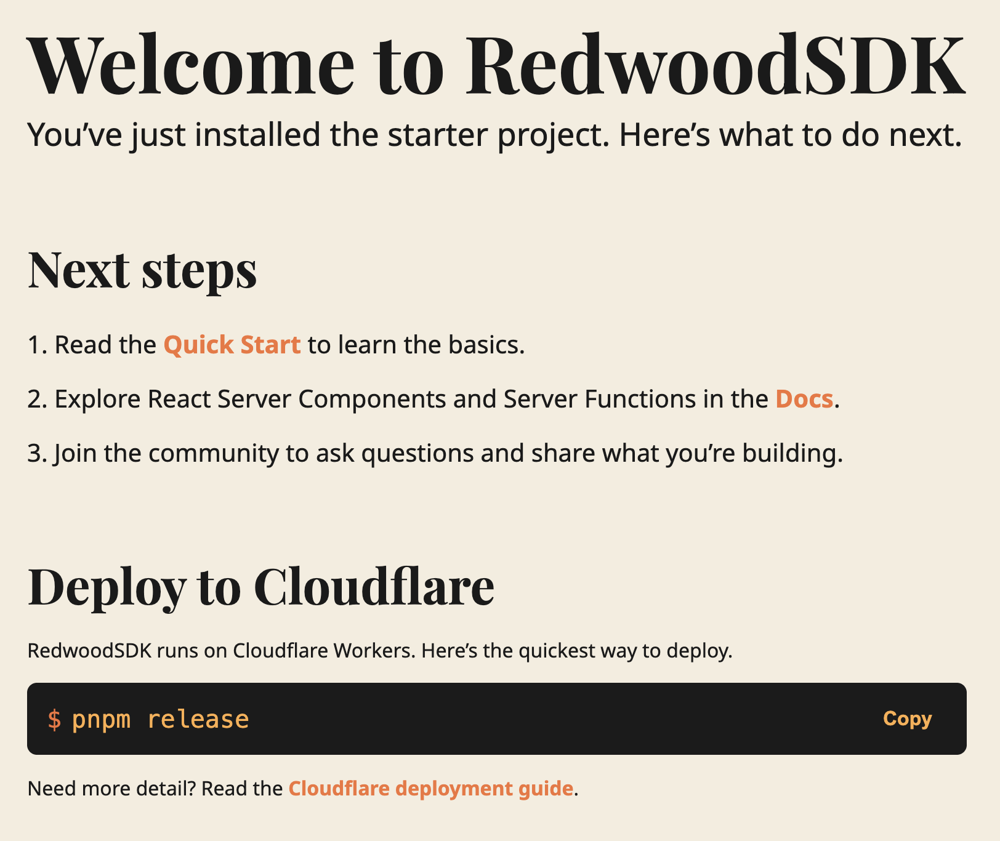

Inside, the `applywize` directory, you should have a bunch of different files and folders.

Don't worry about understanding every file right now. Here are the key ones:

- `src/app/pages/` - Where we'll build our application pages
- `prisma/schema.prisma` - Database structure

> For the tutorial, we're starting with the standard starter project. When you start building your own projects, if you use a different starter template, the files and folders may vary slightly.

## Our Database

The first time you run `pnpm dev`, it creates the `.wrangler` directory. This directory is used by Cloudflare's Miniflare (your local Cloudflare environment). It contains your local database, caching information, and configuration data.

## Setup Tooling
For this project we're going to use a few tools to make our lives a bit easier.

### .gitignore
For this tutorial, we'll have some files get generated that we won't want to track in git. So we'll generate a .gitignore file to not track these.
```sh
node --eval 'require("fs").writeFileSync(".gitignore", `# Node modules\nnode_modules\n\n# Logs\nlogs\n*.log\n\n# Vite build output\ndist\n\n# MacOS\n.DS_Store\n\n# pnpm store directory\n.pnpm-store\n\n# Vite cache\n.vite\n\n# Coverage directory used by tools like istanbul\ncoverage\n\n# Temporary files\n*.tmp\n*.temp\n.wrangler/\nworker-configuration.d.ts\n\n# Playwright\n/test-results/\n/playwright-report/\n/blob-report/\n/playwright/.cache/\nplaywright/.auth\n`)'
```

### Prettier
Prettier is a code formatting tool designed to make code consistent in styling and formatting, to reduce debates on teams arguing on coding style guidelines.

You don't technically need this at all, and you can feel free to ignore this section, but I've found it to be very helpful and reduce cognitive load while producing more consistent coding standards.

I also turned off ending semicolons, but feel free to delete this rule if you like. There are also 2 experiment rules I have enabled, which you can also remove if you have strong feelings on them.

<Tabs groupId="package-managers">
  <TabItem value="npm" label="npm" default>
```sh
npm install --save-dev --save-exact prettier
node --eval "fs.writeFileSync('.prettierrc','{\n  \"semi\": false,\n  \"experimentalTernaries\": true,\n  \"experimentalOperatorPosition\": \"start\"\n}')"
node --eval "fs.writeFileSync('.prettierignore','# Ignore artifacts:\nbuild\ncoverage\nnode_modules\ndist\ntest-results\nplaywright-report')"
```
  </TabItem>
  <TabItem value="yarn" label="yarn">
```sh
yarn add --dev --exact prettier
node --eval "fs.writeFileSync('.prettierrc','{\n  \"semi\": false,\n  \"experimentalTernaries\": true,\n  \"experimentalOperatorPosition\": \"start\"\n}')"
node --eval "fs.writeFileSync('.prettierignore','# Ignore artifacts:\nbuild\ncoverage\nnode_modules\ndist\ntest-results\nplaywright-report')"
```
  </TabItem>
  <TabItem value="pnpm" label="pnpm">
```sh
pnpm add --save-dev --save-exact prettier
node --eval "fs.writeFileSync('.prettierrc','{\n  \"semi\": false,\n  \"experimentalTernaries\": true,\n  \"experimentalOperatorPosition\": \"start\"\n}')"
```
  </TabItem>
</Tabs>

#### Using Prettier in VSCode
If using VSCode, I also recommend setting up autoformatting on save, and turning on auto save on focus change and setting the formatter to prettier

And if you had not done so already, add the [Prettier Extension](https://marketplace.visualstudio.com/items?itemName=esbenp.prettier-vscode).

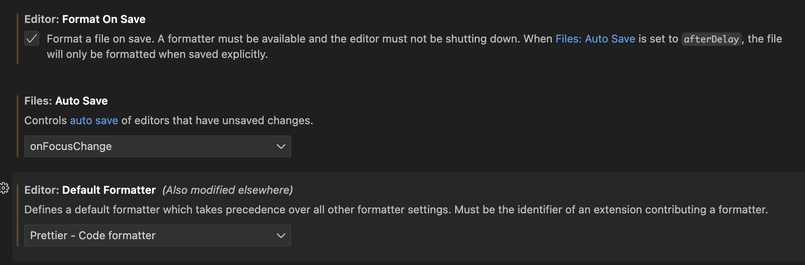

### ESLint
ESLint is a tool for identifying and reporting on patterns found in Typescript/JavaScript code, with the goal of making code more consistent and avoiding bugs.

<Tabs groupId="package-managers">
  <TabItem value="npm" label="npm" default>
```sh
npm install --save-dev eslint @eslint/js @typescript-eslint/eslint-plugin @typescript-eslint/parser eslint-plugin-react eslint-plugin-react-hooks eslint-plugin-playwright eslint-config-prettier typescript-eslint globals
```
  </TabItem>
  <TabItem value="yarn" label="yarn">
```sh
yarn add --dev eslint @eslint/js @typescript-eslint/eslint-plugin @typescript-eslint/parser eslint-plugin-react eslint-plugin-react-hooks eslint-plugin-playwright eslint-config-prettier typescript-eslint globals
```
  </TabItem>
  <TabItem value="pnpm" label="pnpm">
```sh
pnpm add --save-dev eslint @eslint/js @typescript-eslint/eslint-plugin @typescript-eslint/parser eslint-plugin-react eslint-plugin-react-hooks eslint-plugin-playwright eslint-config-prettier typescript-eslint globals
```
  </TabItem>
</Tabs>

Now, create an `eslint.config.js` file in the root of your project:

```sh
node --eval 'require("fs").writeFileSync("eslint.config.js", `import tsPlugin from "@typescript-eslint/eslint-plugin"\nimport tsParser from "@typescript-eslint/parser"\nimport reactPlugin from "eslint-plugin-react"\nimport reactHooksPlugin from "eslint-plugin-react-hooks"\nimport playwrightPlugin from "eslint-plugin-playwright"\nimport eslintConfigPrettier from "eslint-config-prettier"\nimport tseslint from "typescript-eslint"\nimport eslint from "@eslint/js"\nimport globals from "globals"\n\nexport default [\n  {\n    ignores: [\n      "**/node_modules/**",\n      "**/dist/**",\n      "**/build/**",\n      "**/.generated/**",\n      "**/.vite/**",\n      "**/.wrangler/**",\n      "**/playwright-report/**",\n      "**/test-results/**",\n      "**/*.config.js",\n      "**/*.config.ts",\n      "**/*.config.mjs",\n      "**/doc/**",\n      "**/worker-configuration.d.ts",\n    ],\n  },\n\n  eslint.configs.recommended,\n\n  {\n    files: ["src/**/*.{ts,tsx}", "tests/**/*.ts"],\n\n    languageOptions: {\n      parser: tsParser,\n      parserOptions: {\n        project: "./tsconfig.json",\n        tsconfigRootDir: import.meta.dirname,\n      },\n      globals: {\n        ...globals.node,\n        ...globals.browser,\n      },\n    },\n\n    plugins: {\n      "@typescript-eslint": tsPlugin,\n      react: reactPlugin,\n      "react-hooks": reactHooksPlugin,\n      playwright: playwrightPlugin,\n    },\n\n    rules: {\n      ...tseslint.configs.recommendedTypeChecked[0].rules,\n      "@typescript-eslint/no-floating-promises": "error",\n      "@typescript-eslint/await-thenable": "error",\n      "@typescript-eslint/no-misused-promises": "error",\n      "@typescript-eslint/no-unused-vars": [\n        "warn",\n        { argsIgnorePattern: "^_" },\n      ],\n      "no-empty-pattern": "off",\n      ...reactPlugin.configs.recommended.rules,\n      ...reactHooksPlugin.configs.recommended.rules,\n      "react/react-in-jsx-scope": "off",\n    },\n\n    settings: {\n      react: { version: "detect" },\n    },\n  },\n\n  eslintConfigPrettier,\n]` )'
```

This sets up ESLint with TypeScript, React, React Hooks, and Playwright support, while disabling rules that conflict with Prettier.

### TailwindCSS
TailwindCSS is a library that generates helper classes that you are using for your project. Because it only generates the styles that you are using in your project, it helps keep your CSS files light while also co-locating styles with it's usage on the HTML (or in our case JSX).

Since the RedwoodSDK is based on React and Vite, we can work through the ["Using Vite" documentation](https://tailwindcss.com/docs/installation/using-vite).

#### Install TailwindCSS
<Tabs groupId="package-managers">
  <TabItem value="npm" label="npm" default>
```sh
npm install --save-dev tailwindcss @tailwindcss/vite
```
  </TabItem>
  <TabItem value="yarn" label="yarn">
```sh
yarn add --dev tailwindcss @tailwindcss/vite
```
  </TabItem>
  <TabItem value="pnpm" label="pnpm">
```sh
pnpm add --save-dev tailwindcss @tailwindcss/vite
```
  </TabItem>
</Tabs>

#### Configure the Vite Plugin

```ts {2,7-9,15} title="vite.config.mts"
import { defineConfig } from "vite";
import tailwindcss from '@tailwindcss/vite'
import { redwood } from "rwsdk/vite";
import { cloudflare } from "@cloudflare/vite-plugin";

export default defineConfig({
  environments: {
    ssr: {},
  },
  plugins: [
    cloudflare({
      viteEnvironment: { name: "worker" },
    }),
    redwood(),
    tailwindcss(),
  ],
});
```

#### Import Tailwind CSS. (You'll need to create the `src/app/styles.css` file.)
```css title="src/app/styles.css"
@import "tailwindcss";
```

#### Import the CSS file at the top of your file and include a `link` tag in the `head` of the `Document.tsx` file.
```tsx title="src/app/Document.tsx" {1,5}
import styles from "./styles.css?url";
...
<head>
  ...
  <link rel="stylesheet" href={styles} />
  ...
</head>
```

#### Test the Tailwind
Run `pnpm run dev` and go to http://localhost:5173/

Let's replace some of the Header's styling with TailwindCSS classes to make sure it's working.

```tsx {1,2,5} title="src/app/pages/Welcome.tsx"
 <header className="mb-8 text-center">
  <h1 className="text-4xl font-bold text-red-500 mb-4">
    Welcome to RedwoodSDK
  </h1>
  <p className="text-lg text-gray-600">
    You’ve just installed the starter project. Here’s what to do next.
  </p>
</header>
```

It should render something like this.
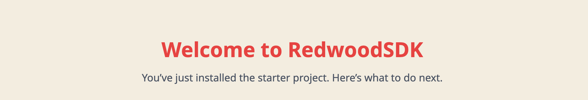

### Setting up Custom Fonts

First, let's add the fonts that we'll need for our project. We're using [Poppins](https://fonts.google.com/specimen/Poppins) and [Inter](https://fonts.google.com/specimen/Inter), both can be found on [Google Fonts](https://fonts.google.com/).

From the font specimen page (for both fonts), click on the **"Get Font"** button.

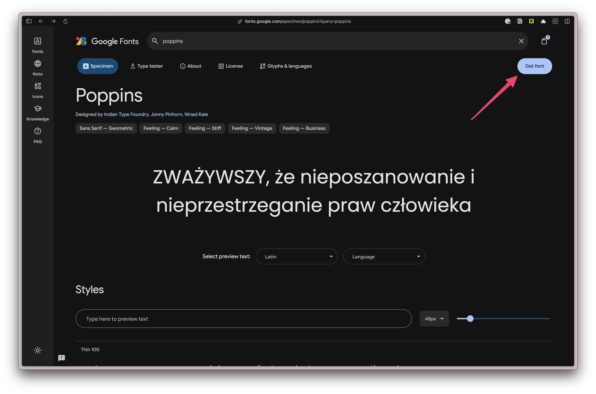

Once both fonts have been added, click on the **"View selected families" button** on the top right. Then, click on the "Get Embed Code" button.

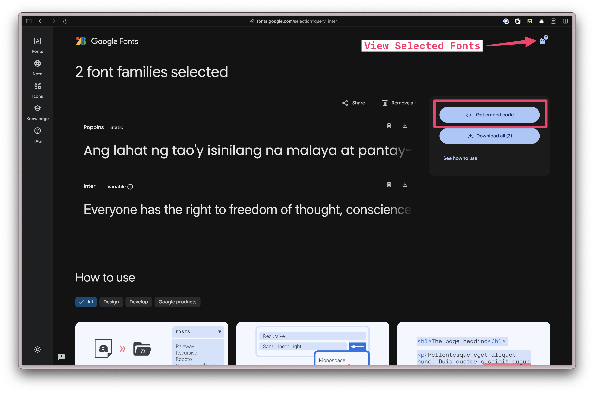

Next, let's only select the font weights that we'll need for our project.

Under **Poppins**, click on the **"Change Styles"** button. Turn everything off except for **"500"** and **"700"**.

Under **Inter**, if you click on the **"Change Styles"** button, you'll see the settings are slightly different. That's because this is variable font. A variable font is a single font file that contains multiple variations of a typeface, allowing for dynamic manipulation of the font. Meaning, nothing to do here.

Next, select the `@import` radio button and copy the code.

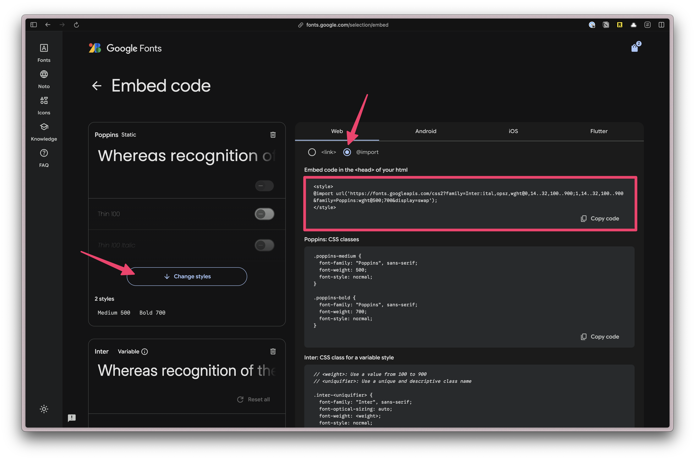

Paste the code at the top of our `styles.css` file. Then, remove the `<style>` tags:

```css title="src/app/styles.css" {1}
@import url('https://fonts.googleapis.com/css2?family=Inter:ital,opsz,wght@0,14..32,100..900;1,14..32,100..900&family=Poppins:wght@500;700&display=swap');

@import "tailwindcss";
```

Next, we need to add a custom configuration. In TailwindCSS v4, all customizations happen in the CSS file.

Below the `@import "tailwindcss";` line, add the following:

```css title="src/app/styles.css" startLineNumber={5}
@theme {
  --font-display: "Poppins", sans-serif;
  --font-body: "Inter", sans-serif;
}
```

In Tailwind, all theme variables are defined inside the `@theme` directive. These influence which utility classes exist within our project.
You can find more information in the [TailwindCSS Docs.](https://tailwindcss.com/docs/theme)

If you're unsure how the font-family is written, you can find it in the CSS class definition on the Google Fonts page. Here, Poppins and Inter are both in quotes and capitalized: `"Poppins"` and `"Inter"`.

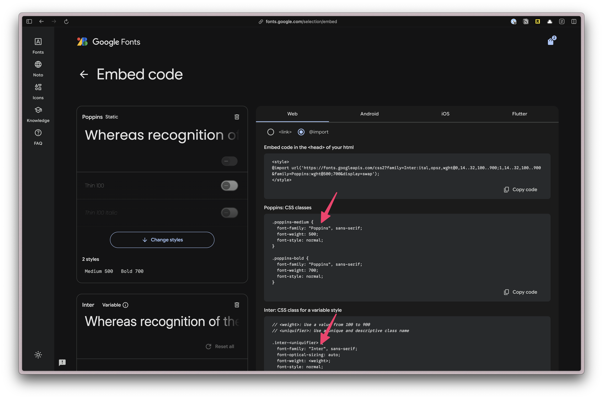

Now, you can use the classes `font-display` and `font-body` in your project.

### Setting up our Custom Color Palette

Defining colors is similar, except we'll prepend each color value with `--color-`.

```css title="src/app/styles.css" showLineNumbers=false {3-14}
@theme {
  ...
  --color-bg: #e4e3d4;
  --color-border: #eeeef0;

  --color-primary: #f7b736;
  --color-secondary: #f1f1e8;
  --color-destructive: #ef533f;

  --color-tag-applied: #b1c7c0;
  --color-tag-interview: #da9b7c;
  --color-tag-new: #db9a9f;
  --color-tag-rejected: #e4e3d4;
  --color-tag-offer: #aae198;
}
```
We're using three different groups of colors:
- semantically named colors: background and border
- buttons: primary, secondary, and destructive
- tag colors: applied, interview, new, rejected, and offer

Now, we can use these colors for backgrounds (`bg-bg`), borders (`border-border`), and text (`text-destructive`).

Let's test to make sure our custom colors are working. On the `Welcome.tsx` file, let's add a few `className` to the `<main>` tag:

```tsx title="src/app/pages/Welcome.tsx" {4}
...
  return (
    ...
    <main className="bg-bg border border-border rounded-lg p-6">
      ...
    </main>
  );
}
```

When you visit http://localhost:5173/, you should see a beige background color, a lighter border with rounded corners:

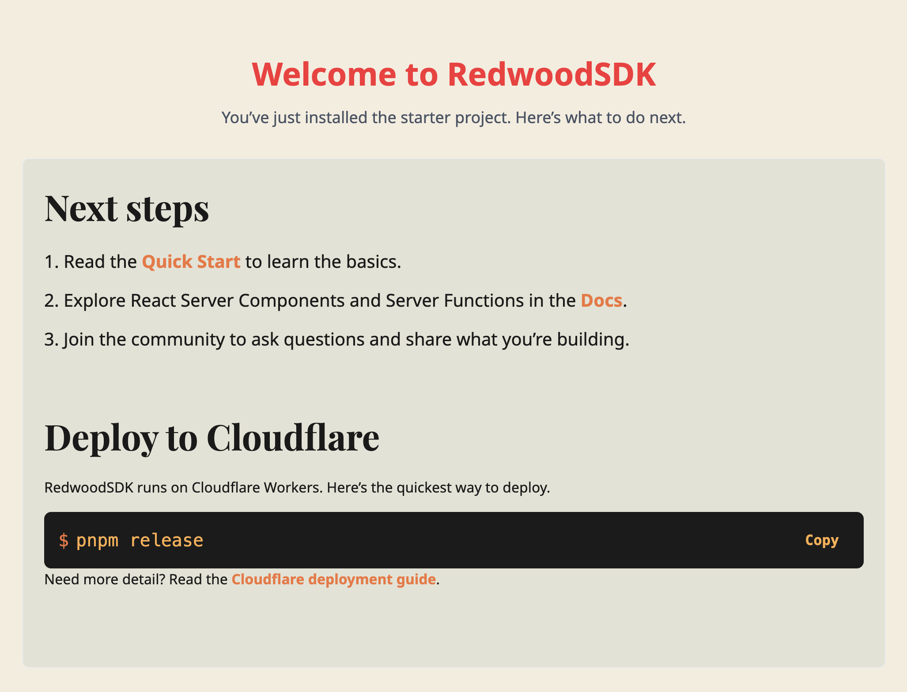


### shadcn/ui UI Components

Now, let's install shadcn/ui. You can also use the [shadcn/ui Vite Installation instructions](https://ui.shadcn.com/docs/installation/vite) or follow along here:

#### Install shadcn/ui

<Tabs groupId="package-managers">
  <TabItem value="npm" label="npm" default>
```sh
npx shadcn@latest init
```
  </TabItem>
  <TabItem value="yarn" label="yarn">
```sh
yarn shadcn@latest init
```
  </TabItem>
  <TabItem value="pnpm" label="pnpm">
```sh
pnpm dlx shadcn@latest init
```
  </TabItem>
</Tabs>
It will ask you what theme you want to use. Let's go with **Neutral**.

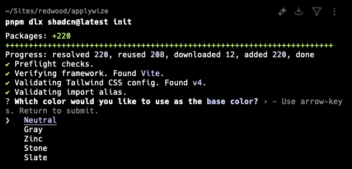

This command will create a `components.json` file in the root of your project. It contains all the configuration for our shadcn/ui components.

Let's modify the default paths so that it will put our components in the `src/app/components/ui` folder.

```json title="components.json"
...
  "aliases": {
    "components": "@/app/components",
    "utils": "@/lib/utils",
    "ui": "@/app/components/ui",
    "lib": "@/lib",
    "hooks": "@/app/hooks"
  },
```

#### Now, you should be able to add shadcn/ui components

<Tabs groupId="package-managers">
  <TabItem value="npm" label="npm" default>
```sh
npx shadcn@latest add
```
  </TabItem>
  <TabItem value="yarn" label="yarn">
```sh
yarn shadcn@latest add
```
  </TabItem>
  <TabItem value="pnpm" label="pnpm">
```sh
pnpm dlx shadcn@latest add
```
  </TabItem>
</Tabs>

Select the following by hitting the `Space` key:
- Alert
- Avatar
- Badge
- Breadcrumb
- Button
- Calendar
- Dialog
- Popover
- Select
- Sheet
- Sonner
- Table

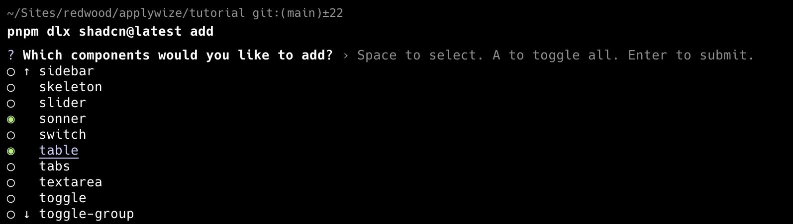

When you've selected all the components you want to add, hit `Enter`. This will add all the components inside the `src/app/components/ui` folder.

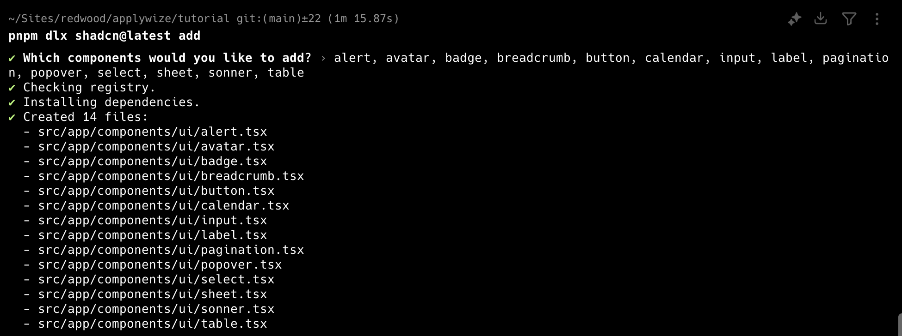

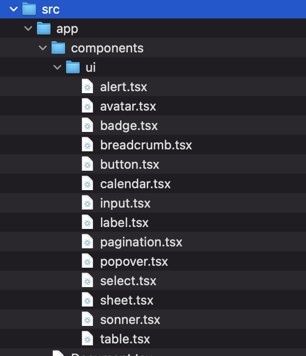

Instead of selecting components from a list, you can also add them individually by running `pnpm dlx shadcn@latest add <component-name>`.

  You can find a complete list of all the shadcn/ui components on their [official documentation](https://ui.shadcn.com/docs/components).

#### Test out the shadcn/ui component

If you want to make sure everything is installed correctly, head over to the `src/app/pages/Welcome.tsx` file and let's use our shadcn/ui `Button` component.

Change the `<button>` tag to use a capital `B`. This will reference the `Button` component, instead of the standard HTML button. You'll also need to import the `Button` component at the top of the file.

```ts {4,6}
import { Button } from "@/app/components/ui/button";
...
  return (
    <Button onClick={handleCopy} className={styles.copyButton}>
      {copied ? "Copied!" : "Copy"}
    </Button>
  );
...
```

You won't notice anything rendering or behaving differently, but as long as the app runs with `pnpm dev` you know it's working after you made the change.

### Test2Doc
Test2Doc is a reporter for [Playwright](#playwright) designed to build documentation for [Docusaurus](#docusaurus). We're going to leverage these tools to automate documentation generation and follow test driven development (TDD) principles to implement Applywize.

This section is the same [install guide found here](../../../docs/getting-started/install).

#### Playwright
Playwright is a end-to-end (e2e) testing framework. It's a powerful browser automation tool that will start up to simulate how users will interact with your software.

We'll install Playwright here. You can also use the [Playwright Installation instructions](https://playwright.dev/docs/intro#installing-playwright) or follow along here:


<Tabs groupId="package-managers">
  <TabItem value="npm" label="npm" default>
```sh
npm init playwright@latest
```
  </TabItem>
  <TabItem value="yarn" label="yarn">
```sh
yarn create playwright
```
  </TabItem>
  <TabItem value="pnpm" label="pnpm">
```sh
pnpm create playwright
```
  </TabItem>
</Tabs>
When prompted, choose / confirm:

- TypeScript or JavaScript (default: TypeScript) - **Typescript**
- Tests folder name (default: tests) - **tests**
- Add a GitHub Actions workflow (defaults: true) - **false** (we won't be covering how to configure GitHub Actions in this tutorial)
- Install Playwright browsers (default: yes) - **yes**

#### Docusaurus
Docusaurus is a popular static site generator designed for software documentation. We'll be installing a docusaurus package in the `doc` at the root of the project to house the docs that test2doc will generate from the tests.

You can follow the install guide [here](https://docusaurus.io/docs/installation) or continue to follow here:

<Tabs groupId="package-managers">
  <TabItem value="npm" label="npm">
```sh
npm init docusaurus@latest doc classic -- --typescript
```
  </TabItem>
  <TabItem value="yarn" label="yarn">
```sh
yarn create docusaurus@latest doc classic --typescript
```
  </TabItem>
  <TabItem value="pnpm" label="pnpm">
```sh
pnpm create docusaurus@latest doc classic --typescript
```
  </TabItem>
</Tabs>

#### Install Test2Doc reporter
A reporter is a library designed to process the output of tests and present the data. Normally, we'll see reporters like the standard [html reporter](https://playwright.dev/docs/test-reporters#html-reporter). Test2Doc is a reporter that outputs markdown intended to be used with Docusaurus.

To find the guide to install the reporter, you can be found [here](../../../docs/getting-started/install#install-the-reporter), or you can be follow the instructions below:

<Tabs groupId="package-managers">
  <TabItem value="npm" label="npm" default>
```sh
npm install @test2doc/playwright -D
```
  </TabItem>
  <TabItem value="yarn" label="yarn">
```sh
yarn add @test2doc/playwright --dev
```
  </TabItem>
  <TabItem value="pnpm" label="pnpm">
```sh
pnpm install @test2doc/playwright -D
```
  </TabItem>
</Tabs>

Then we need to generate a `playwright-test2doc.config.ts` at the root of the file.

```ts title="playwright-test2doc.config.ts"
import { defineConfig, devices } from "@playwright/test"

export default defineConfig({
  testDir: './tests',
  reporter: [
    ['@test2doc/playwright', { 
      outputDir: './doc/docs'
    }]
  ],
  fullyParallel: false,
  workers: 1,
  retries: 0,
  projects: [
    {
      name: 'chromium',
      use: { ...devices['Desktop Chrome'] },
    },
  ],
});
```

We also need to update the `package.json` so we can run Playwright tests and generate docs from the command line.

```json title="package.json"
{
  ...
  "scripts": {
    ...
    "test": "playwright test --ui",
    "doc": "TEST2DOC=true playwright test --config=playwright-test2doc.config.ts"
  }
  ...
}
```

We'll run Playwright with the UI enabled, so we can run tests in watch mode. This way tests can rerun when we make changes.

If you run `pnpm test` you should see the example tests will run. And if you run `pnpm doc` it should output so markdown files for those tests in `doc/docs/test2doc-example.md`.

## Code on GitHub
You can find the code for this section on [GitHub](https://github.com/dethstrobe/applywize2/tree/tutorial-2).

## Further reading

- [TailwindCSS](https://tailwindcss.com/)
- [shadcn/ui](https://ui.shadcn.com/)
- [Playwright](https://playwright.dev/)
- [Docusaurus](https://docusaurus.io/)

You've successfully created your first RedwoodSDK application 🎉 and have it running locally on your development server. Your project also includes TailwindCSS for styling and shadcn/ui for UI components. You've customized your design system with fonts and colors to match the Applywise brand. And we have Playwright tests running, outputting markdown to our doc site, and a Docusaurus site to host the generated markdown.

Most importantly, you have a solid foundation to build on.

## What's Coming Next?

In the next lesson, we'll focus on setting up the database that will power our application. You'll learn how to:

- Design database tables to store job applications, companies, and contacts
- Understand how different pieces of data connect through relationships
- Set up Prisma as your database toolkit and create your first database schema
- Run migrations to create your database structure
- Add sample data so you can start building features
