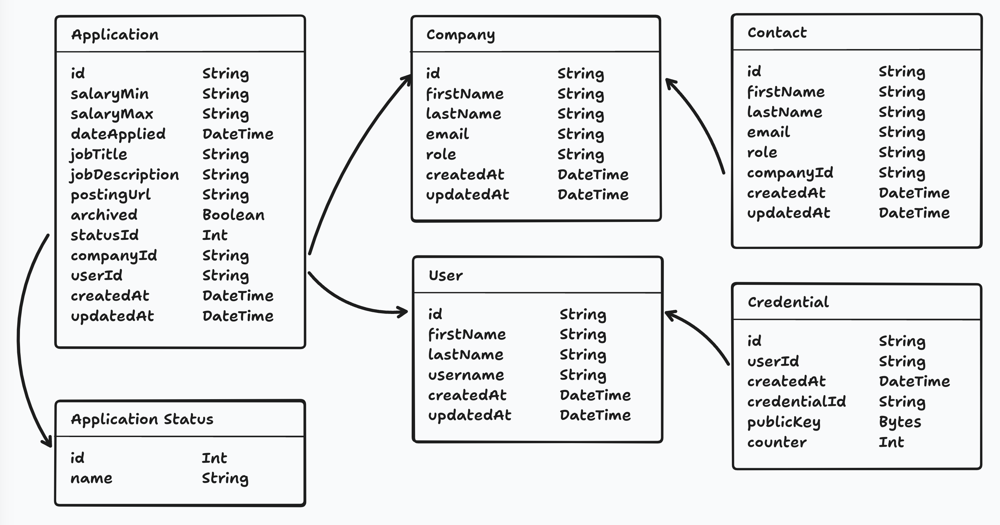

By the end of this lesson, you'll have:
- A working database with tables to store job applications, companies, and contacts
- Understanding of how different pieces of data connect to each other (relationships)
- Sample data in your database so you can start building features
- Knowledge of how to make changes to your database structure safely using migrations

## Why Do We Need a Database?
Right now our app can't remember anything. When you refresh the page, everything is gone. A database lets our app store and remember information permanently, like our job applications.

## Setting up our Database with Durable Objects

RedwoodSDK uses **Cloudflare SQLite Durable Objects** as its database solution. Each SQLite Durable Object is a database instance that runs in its own isolated instance. As the name implies it uses SQLite. And we'll be using **Kysely** as a type-safe SQL query builder. 

## What is SQLite?
SQLite is a lightweight, file-based database that's perfect for getting started with database development.

Unlike larger database systems like PostgreSQL or MySQL that run as separate servers, SQLite stores all your data in a single file on your computer. This makes it incredibly easy to set up - there's no complicated server configuration or installation process. You just create a file, and you have a working database.

SQLite is production-ready and powers many applications you probably use every day.

## Setting up our Database Tables or Models

For this project, we'll use RedwoodSDK's built in [Kysely](https://kysely.dev/) as our query builder. It'll allow us to make SQL like queries to handle all the interactions with the database.

It does not give us a nice abstraction layer like an **Object Relational Mapper** (ORM) would, but it does give us access to all the power of SQLite.

RedwoodSDK does give us a bit of help as it'll allow us to infer types and the database schema (how the model looks in the database) from migrations.

### What's a Migration
Think of a migration like a recipe for changing your database. When you need to add a new table, remove a column, or change how data is stored, you create a migration that contains step-by-step instructions for making those changes.

Why are migrations important? Imagine you're working with a team - when someone adds a new feature that needs a database change, they create a migration file. Now everyone on the team can run that same migration to update their local database to match. Without migrations, you'd have to manually tell everyone "hey, go add this new table with these exact columns" - and that gets messy fast.

#### Now you're thinking with models.
Let's start by going through the [application design files](https://www.figma.com/design/nqBPIIfe0MO4W8zOfW4oae/Redwood-Reloaded-Tutorial?node-id=1-3&t=9gzbWUrBb2G3qdoa-1) and making a list of all the tables (models) and fields we need.

Each model represents the type of data that will be stored in the database.

We need models for:

1. Users
2. Job Applications
3. Companies
4. Contacts
5. Application Statuses

#### Avoid Duplication
**The "trick" with database design is to prevent duplication.** For example, we want to store the company information for each job application. There's a chance we'll have multiple job applications for the same company. If we store the company information directly in the `Application` model, we might have duplicate entries. This could create all kinds of problems. If something changes, every instance of the company information would need to be updated. Plus, there are also formatting issues to consider: is it `RedwoodSDK`, `redwoodsdk`, `redwood-sdk`, or `RedwoodSdk`?

Instead, we can store the company information in a separate model, with a single entry for each company, and "link" it to the relevant job application.

#### Uniquely Identifying Entries


Notice that every model has an `id` field. This is used to uniquely identify each record or row in the database.

The same applies to Contacts. We can create a separate model and create a relationship between the contact and the related company.


**Application Statuses** are a little different, but the same principle applies. To avoid duplication, we will give statuses their own model. We will have a set of fixed status options (New, Applied, Interviewing, Offer, and Rejected).


## Columns

Now, that we know what our models are, we need to create the columns. What are the pieces of data we need to store for each model?

We've already alluded to the data that we'll need within the relationship diagrams, but let's take a closer look.

Most tables I create include an `id`, `createdAt`, and `updatedAt` field.
- `id` - We need a way to uniquely identify each record or row in the database.
- `createdAt` - We need to know when the record was created.
- `updatedAt` - We need to know when the record was last updated.

### Soft Deleting
In the future, if you're going to "soft delete" a record, you'll probably want a `deletedAt` column for tracking when the record was deleted.

"Soft deleting" a record means that instead of removing the record from the database, we'll set a column (i.e. `deleted`) to `true` to indicate that the record has been deleted. The entry won't be shown to the user, but it gives you a way to recover the data. This is also useful for auditing purposes.

### Data Types
As you're making a list of all the data we need to store, you'll also need to think about the **data type** of each column.

In SQLite, there are 5 different data types:

| **SQLite Type** |	**Description** |
| --- | --- |
| `NULL` | A null value |
| `TEXT` | A text string, stored using the database encoding UTF-8 |
| `INTEGER` | A signed integer |
| `REAL` | A floating point value, stored as an 8-byte IEEE floating point number. |
| `BLOB` | A blob of data, stored exactly as it was input |

We'll be mapping data types we need to these SQLite types. We'll need to do some conversion for a few types.

| **Data types** | **SQLite Types** |
| --- | --- |
| `String` | `TEXT` |
| `Int` | `INTEGER` |
| `Boolean` | `INTEGER` (0 or 1) |
| `Float` | `REAL` |
| `DateTime` | `TEXT` ([ISO 8601 standard](https://www.iso.org/iso-8601-date-and-time-format.html)) |
| `JSON` | `TEXT` |

### IDs

When it comes to `id`s, there are 2 different types: `String` and `Int`.

- `String` - A UUID (Universally Unique Identifier) is a unique string of characters. For example: `2b22ee49-d788-4bf0-bacd-380b351ca1e0`
- `Int` - An auto-incrementing integer.

When you use an integer, the first entry is usually 1. The next entry is 2, then 3, etc. This makes it easy to tell how many entries are in the database. It's also easy to sort the entries by the order they were created. However, this can also create a security risk. It's easy to guess the next entry in the sequence.

For example, if the URL for my job application is `https://applywize.app/applications/1`, I could assume the URL for the next application is: `https://applywize.app/applications/2`.

This is where a UUID comes in handy. A UUID is a unique, random string of characters. It's almost impossible to guess an entry's ID. The URL `https://applywize.app/applications/2b22ee49-d788-4bf0-bacd-380b351ca1e0` isn't quite as user friendly, but it's security by obscurity.

Which is better? It depends. A rule of thumb is if the user is going to see the ID (like our example, in the URL), use a UUID (string). If the ID is an internal identifier, use an integer.

For our use case, we'll be giving most models a UUID.

## Application Model
Let's start with the `Application` model.

We'll need the following data:

| **Field** | **Type** | **Notes** |
| --- | --- | --- |
| `id` | `String` | A UUID |
| `salaryMin` | `String` | _Optional._ The minimum salary for the job. |
| `salaryMax` | `String` | _Optional._ The maximum salary for the job. |
| `dateApplied` | `DateTime` | _Optional._ The date the application was submitted. |
| `jobTitle` | `String` | _Optional._ The job title |
| `jobDescription` | `String` | _Optional._ The job description. |
| `postingUrl` | `String` | _Optional._ The URL to the job posting. |
| `archived` | `Boolean` | False by default. Whether the application has been archived |
| `createdAt` | `DateTime` | The date the application was created. |
| `updatedAt` | `DateTime` | The date the application was last updated. |

### Working with Money
You may have noticed that I'm using a `String` for the `salaryMin` and `salaryMax` fields. Alternatively, we could make this a number, so we can standardize the display or sort the applications by salary.

However, there's a few reasons why I'm using a `String`:
- Working with money is complicated. It's not just a number. There's currency symbols, commas, and decimal points.
- If you are going to use a number, it's best to use a `integer` to avoid potential floating-point accuracy problems and store the values as cents.

For now, I'm going to hit the easy button, and use a `String`.

### Migrations and Models
RedwoodSDK infers the types of the models from migrations. This simplifies creating a schema (how our models look) by just having us create migration files to infer the types we will using.

```ts title="src/db/migrations.ts"
import { type Migrations } from "rwsdk/db";

export const migrations = {
  "001_create_application_table": {
    async up(db) {
      const defaultTime = sql`(strftime('%Y-%m-%dT%H:%M:%fZ', 'now'))`
      return [
        await db.schema
          .createTable("applications")
          .addColumn("id", "text", (col) => col.primaryKey())
          .addColumn("salaryMin", "text")
          .addColumn("salaryMax", "text")
          .addColumn("dateApplied", "text")
          .addColumn("jobTitle", "text")
          .addColumn("jobDescription", "text")
          .addColumn("postingUrl", "text")
          .addColumn("archived", "integer", (col) => col.notNull().defaultTo(0))
          .addColumn("createdAt", "text", (col) =>
            col.notNull().defaultTo(defaultTime),
          )
          .addColumn("updatedAt", "text")
          .execute()
      ]
    },
    async down(db) {
      await db.schema.dropTable('application').ifExists().execute();
    },
  },
} satisfies Migrations;
```

A few things worth noting:

- Fields that are required will be marked at non-nullable fields and be provided default values generated by SQLite.
- _Optional_ fields on the other hand will not be specifically called out, so will be allowed to be the value of `NULL` and not have defaults set.
- We need to provide a `down` method for if the `up` function would fail to avoid partial changes. The `down` rollback will only effect the current migration and will not affect previously successful migrations.
- We use the `strftime` function to format the `createdAt` column to ISO formatted time by default.

We can do the same for the remaining models. I included the `Application` migration here to.

```ts  title="src/db/migrations.ts"
import { type Migrations, sql } from "rwsdk/db"; 

export const migrations = {
  "001_initial_schema_setup": {
    async up(db) {
      const defaultTime = sql`(strftime('%Y-%m-%dT%H:%M:%fZ', 'now'))`
      return [
        await db.schema
          .createTable("applicationStatuses")
          .addColumn("id", "integer", (col) => col.primaryKey().autoIncrement())
          .addColumn("status", "text", (col) => col.notNull()) 
          .execute();

        await db.schema
          .createTable("companies")
          .addColumn("id", "text", (col) => col.primaryKey())
          .addColumn("name", "text", (col) => col.notNull())
          .addColumn("createdAt", "text", (col) =>
            col.notNull().defaultTo(defaultTime),
          )
          .addColumn("updatedAt", "text")
          .execute();

        await db.schema
          .createTable("contacts")
          .addColumn("id", "text", (col) => col.primaryKey())
          .addColumn("firstName", "text", (col) => col.notNull())
          .addColumn("lastName", "text", (col) => col.notNull())
          .addColumn("email", "text")
          .addColumn("role", "text")
          .addColumn("createdAt", "text", (col) =>
            col.notNull().defaultTo(defaultTime),
          )
          .addColumn("updatedAt", "text")
          .execute();

        await db.schema
          .createTable("users")
          .addColumn("id", "text", (col) => col.primaryKey())
          .addColumn("username", "text", (col) => col.notNull().unique())
          .addColumn("createdAt", "text", (col) =>
            col.notNull().defaultTo(defaultTime),
          )
          .addColumn("updatedAt", "text")
          .execute();

        await db.schema
          .createTable("credentials")
          .addColumn("id", "text", (col) => col.primaryKey())
          .addColumn("userId", "text", (col) => col.notNull().unique().references("user.id").onDelete("cascade"))
          .addColumn("createdAt", "integer", (col) => col.notNull().defaultTo(defaultTime))
          .addColumn("credentialId", "text", (col) => col.notNull().unique())
          .addColumn("publicKey", "blob", (col) => col.notNull())
          .addColumn("counter", "integer", (col) => col.notNull().defaultTo(0))
          .execute();

        await db.schema
          .createTable("applications")
          .addColumn("id", "text", (col) => col.primaryKey())
          .addColumn("salaryMin", "text")
          .addColumn("salaryMax", "text")
          .addColumn("dateApplied", "text")
          .addColumn("jobTitle", "text")
          .addColumn("jobDescription", "text")
          .addColumn("postingUrl", "text")
          .addColumn("archived", "integer", (col) => col.notNull().defaultTo(0))
          .addColumn("createdAt", "text", (col) =>
            col.notNull().defaultTo(defaultTime),
          )
          .addColumn("updatedAt", "text")
          .execute();

        
        // Ensure indexes are created
        await db.schema
          .createIndex("credential_credentialId_idx")
          .on("credential")
          .column("credentialId")
          .execute(),
        await db.schema
          .createIndex("credential_userId_idx")
          .on("credential")
          .column("userId")
          .execute(),
      ]
    },

    async down(db) {
      // Drop tables in reverse order to respect foreign key constraints
      await db.schema.dropTable("application").ifExists().execute();
      await db.schema.dropTable("credential").ifExists().execute();
      await db.schema.dropTable("user").ifExists().execute();
      await db.schema.dropTable("contact").ifExists().execute();
      await db.schema.dropTable("company").ifExists().execute();
      await db.schema.dropTable("applicationStatus").ifExists().execute();
    },
  },
} satisfies Migrations;
```

#### Index
You may have noticed that we call the `createIndex` method on the `credential` table. An **index** is like a catalog for your database - it helps SQLite find records much faster.

Without an index, SQLite has to scan through every single row in a table to find what you're looking for (called a "table scan"). With an index, it can jump directly to the right rows.

**When should you create an index?**
- Fields you'll search by frequently (like `credentialId` for login lookups)
- Foreign key fields used in joins (like `userId`)
- Fields used in `WHERE`, `ORDER BY`, or `GROUP BY` clauses

**Note**: The `id` field (primary key) is automatically indexed, so you don't need to create one manually.

**Trade-off**: Indexes speed up reads but slow down writes slightly, since SQLite has to update both the table and the index. For most applications, this trade-off is worth it.

**Clean Up** You might notice we didn't clean up the indexes in the `down` method. The indexes will be cleaned up automatically when we drop the tables associated with them.

#### Naming Conventions
We're going to follow some Javascript naming conventions, since SQLite isn't opinionated on this, and we aren't using an ORM to convert names for us.

**Note** Normal database naming conventions recommend using *snake_case*.

- We'll be using plural names for our tables. For example, `applications` not `application`.
- The field/column and table names should start with a lowercase letter, in *camelCase*.
  - For example of table:  ✅ `applicationStatuses` not ❌ `ApplicationStatuses` or ❌ `application_status`.
  - For example of column, ✅ `jobTitle` not ❌ `JobTitle` or ❌ `job_title`.
- Models on the other hand are singular, as they represented a single row of data from the table. And also use *PascalCase*. For example, `Application` not `application`.
- The `createIndex` method needs a name, in case we want to later remove it or debug. We're following the naming convention `{TableName}_{columnName}_idx` to help show what table it is for, what field is being indexed, and add `index` suffix just to make note this name is for indexing.

## What are Database Relationships?

A relationship in database terms describes how data in one table connects to data in another table. Think of it like connections between people in real life - you might have relationships with your coworkers, family members, or friends. In our job application tracker, we have similar connections between our data.

For example, every job application belongs to a specific company, and every company can have multiple job applications associated with it. This creates a relationship between our Application table and Company table. Without relationships, we'd have duplicate information -- we'd have to store all the company information (name, address, website) separately in every single application record.

Relationships solve this problem by letting us store company information once in a Company table, and then simply reference which company each application belongs to. This keeps our data organized, prevents duplication, and makes it much easier to maintain and update information over time.

There are different types of relationships depending on how the data connects. For example, one company can have many job applications (like if you apply to RedwoodSDK multiple times), but each individual application belongs to only one company. Understanding these connection patterns helps us design a database that's efficient, organized, and easy to work with.

### **One-to-one**
A one-to-one relationship is a relationship where a record in one table is associated with exactly one record in another table.


### **One-to-many**

A one-to-many relationship is a relationship where a record in one table is associated with one or more records in another table.


### **Many-to-many**

A many-to-many relationship is a relationship where multiple records in one table are associated with multiple records in another table.

In order to establish this relationship, we need a **junction table**. This table will store the relationship between the two tables.


## All the Tables for our Database

Here's a diagram of all the models and their relationships for this project.



Coincidentally, all the relationships in our project are one-to-one or one-to-many.

### Credential Table

Most of the tables in our database are self explanatory. However, the `credentials` table might not be as obvious. This model is included within the standard starter kit and will hold all the details for our passkeys.

### Database Diagram
It is helpful to have a visual representation of the database.

[Amy Dutton](https://selfteach.me/) created these diagrams with [tldraw](https://tldraw.com/). But, [Whimsical](https://whimsical.com/) and [Figma](https://www.figma.com/) are also great tools. Or if you're looking for a coding solution, [PlantUML](https://plantuml.com/) is a markup language designed to generate diagrams from code.

## Creating Relationships in the DB
When establishing a relationship within your schema, there are 3 parts.

1. **Foreign Key Column** This stores the ID for the related record.
3. **Join Table** Allows you to create a temporary table that combines two (or more) tables.

### What's a foreign key?
A foreign key is a column (or set of columns) in a table that refers to the primary key of another table, establishing a link between two tables in a relational database.

It's called a "foreign key" because it references the primary key of the "foreign" table.

### What can you see within the database?
Within the database, the only column that you'll be able to see if the foreign key column that stores the ID of the related record.

By creating a join table, we can access both sets a data in one query.

Let's look at this on the migration schema for the `companies` and `contacts` tables:

```ts {4,19-21}
      ...
      await db.schema
        .createTable("companies")
        .addColumn("id", "text", (col) => col.primaryKey())
        .addColumn("name", "text", (col) => col.notNull())
        .addColumn("createdAt", "text", (col) =>
          col.notNull().defaultTo(defaultTime),
        )
        .addColumn("updatedAt", "text")
        .execute()

      await db.schema
        .createTable("contacts")
        .addColumn("id", "text", (col) => col.primaryKey())
        .addColumn("firstName", "text", (col) => col.notNull())
        .addColumn("lastName", "text", (col) => col.notNull())
        .addColumn("email", "text")
        .addColumn("role", "text")
        .addColumn("companyId", "text", (col) =>
          col.notNull().references("companies.id"),
        )
        .addColumn("createdAt", "text", (col) =>
          col.notNull().defaultTo(defaultTime),
        )
        .addColumn("updatedAt", "text")
        .execute()
      ...
```

On the contact table's schema we add a reference to `"companies.id"` which adds a foreign key to the table that is associated with the `companies` table's `id` field.

So in order to create multiple contacts per company, we'll need to do a left join table, and insert a row for each contact. We'll go over on how to do that later.

Now, we need to create the remaining relationships. Here's my final `migration.ts` file.

```ts
import { type Migrations } from "rwsdk/db"

export const migrations = {
  "001_initial_schema_setup": {
    async up(db) {
      const defaultTime = sql`(strftime('%Y-%m-%dT%H:%M:%fZ', 'now'))`
      return [
        await db.schema
          .createTable("applicationStatuses")
          .addColumn("id", "integer", (col) => col.primaryKey().autoIncrement())
          .addColumn("status", "text", (col) => col.notNull())
          .execute(),

        await db.schema
          .createTable("companies")
          .addColumn("id", "text", (col) => col.primaryKey())
          .addColumn("name", "text", (col) => col.notNull())
          .addColumn("createdAt", "text", (col) =>
            col.notNull().defaultTo(defaultTime),
          )
          .addColumn("updatedAt", "text")
          .execute(),

        await db.schema
          .createTable("contacts")
          .addColumn("id", "text", (col) => col.primaryKey())
          .addColumn("firstName", "text", (col) => col.notNull())
          .addColumn("lastName", "text", (col) => col.notNull())
          .addColumn("email", "text")
          .addColumn("role", "text")
          .addColumn("companyId", "text", (col) =>
            col.notNull().references("companies.id"),
          )
          .addColumn("createdAt", "text", (col) =>
            col.notNull().defaultTo(defaultTime),
          )
          .addColumn("updatedAt", "text")
          .execute(),

        // Users (Credentials depends on this)
        await db.schema
          .createTable("users")
          .addColumn("id", "text", (col) => col.primaryKey())
          .addColumn("username", "text", (col) => col.notNull().unique())
          .addColumn("createdAt", "text", (col) =>
            col.notNull().defaultTo(defaultTime),
          )
          .addColumn("updatedAt", "text")
          .execute(),

        // Credentials (Depends on Users)
        await db.schema
          .createTable("credentials")
          .addColumn("id", "text", (col) => col.primaryKey())
          .addColumn("userId", "text", (col) =>
            col.notNull().unique().references("users.id").onDelete("cascade"),
          )
          .addColumn("createdAt", "text", (col) =>
            col.notNull().defaultTo(defaultTime),
          )
          .addColumn("credentialId", "text", (col) => col.notNull().unique())
          .addColumn("publicKey", "blob", (col) => col.notNull())
          .addColumn("counter", "integer", (col) => col.notNull().defaultTo(0))
          .execute(),

        // Applications (Depends on Users, Companies, and ApplicationStatuses)
        await db.schema
          .createTable("applications")
          .addColumn("id", "text", (col) => col.primaryKey())
          .addColumn("userId", "text", (col) =>
            col.notNull().references("users.id"),
          )
          .addColumn("statusId", "integer", (col) =>
            col.notNull().defaultTo("1").references("applicationStatuses.id"),
          )
          .addColumn("companyId", "text", (col) =>
            col.notNull().references("companies.id"),
          )
          .addColumn("salaryMin", "text")
          .addColumn("salaryMax", "text")
          .addColumn("dateApplied", "text")
          .addColumn("jobTitle", "text")
          .addColumn("jobDescription", "text")
          .addColumn("postingUrl", "text")
          .addColumn("createdAt", "text", (col) =>
            col.notNull().defaultTo(defaultTime),
          )
          .addColumn("updatedAt", "text")
          .addColumn("archived", "integer", (col) => col.notNull().defaultTo(0))
          .execute(),

        // Create Indexes
        await db.schema
          .createIndex("credentials_credentialId_idx")
          .on("credentials")
          .column("credentialId")
          .execute(),
        await db.schema
          .createIndex("credentials_userId_idx")
          .on("credentials")
          .column("userId")
          .execute(),
      ]
    },

    async down(db) {
      // Drop tables in reverse order to respect foreign key constraints
      await db.schema.dropTable("applications").ifExists().execute()
      await db.schema.dropTable("credentials").ifExists().execute()
      await db.schema.dropTable("users").ifExists().execute()
      await db.schema.dropTable("contacts").ifExists().execute()
      await db.schema.dropTable("companies").ifExists().execute()
      await db.schema.dropTable("applicationStatuses").ifExists().execute()
    },
  },
} satisfies Migrations
```

We'll want to order the creations of tables based on dependencies of foreign keys.

Like wise, if something goes wrong and we need to undo the tables, we'll want to remove them in reverse order to avoid orphan data and running in to foreign-key/constraint errors.

## Setting up the Durable Object

In order to use the migration in the Durable Object, we'll need to create 2 more files; `db.ts` and `durableObject.ts`, update the `worker.ts`, and update the `wrangler.jsonc`.

### Create Your Database Instance
We'll add a `db.ts` file which will create our DB and give us types for each table.

```ts title="src/db/db.ts"
import { env } from "cloudflare:workers"
import { type Database, createDb } from "rwsdk/db"
import { type migrations } from "@/db/migrations"

export type AppDatabase = Database<typeof migrations>
export type Application = AppDatabase["applications"]
export type ApplicationStatus = AppDatabase["applicationStatuses"]
export type Company = AppDatabase["companies"]
export type Contact = AppDatabase["contacts"]
export type User = AppDatabase["users"]
export type Credential = AppDatabase["credentials"]

export const db = createDb<AppDatabase>(
  env.APP_DURABLE_OBJECT,
  "applywize-database",
)
```

### Create Your Durable Object Class
This will create our database as a Durable Object.

```ts title="src/db/durableObject.ts"
import { SqliteDurableObject } from "rwsdk/db"
import { migrations } from "@/db/migrations"

export class AppDurableObject extends SqliteDurableObject {
  migrations = migrations
}
```

### Export from Worker
This will allow RedwoodSDK to know about the durable object to start it up in Cloudflare.

```ts title="src/worker.tsx"
export { AppDurableObject } from "@/db/durableObject";

// ... rest of your worker code
```

### Update Wrangler config
This will name the Durable Object when we deploy to Cloudflare.

```jsonc title="wrangler.jsonc"
{
  ...
  "durable_objects": {
    "bindings": [
      {
        "name": "APP_DURABLE_OBJECT",
        "class_name": "AppDurableObject"
      }
    ]
  },
  "migrations": [
    {
      "tag": "v1",
      "new_sqlite_classes": ["AppDurableObject"]
    }
  ]
}
```

## Seeding the DB
We're almost ready. We just need to add a bit of data to the database.

We can populate our DB with some initial data, to do that we'll make a `seed.ts` file.

```ts title="src/scripts/seed.ts"
import { db } from "@/db/db"

export default async () => {
  console.log("… Seeding Applywize DB")
  await db.deleteFrom("applicationStatuses").execute()

  await db
    .insertInto("applicationStatuses")
    .values([
      { id: 1, status: "New" },
      { id: 2, status: "Applied" },
      { id: 3, status: "Interview" },
      { id: 4, status: "Rejected" },
      { id: 5, status: "Offer" },
    ])
    .execute()

  console.log("✔ Finished seeding applywize DB 🌱")
}
```

This will seed the `applicationStatuses` Table with all the statuses we'll be expecting. We can also add new migrations or more seed files later to populate the DB with more data, like for testing.

## Run Migrations and Seeds
If you want to manually run the seed add this to your `package.json`

```json title="package.json
{
  "scripts": {
    "seed": "rwsdk worker-run ./src/scripts/seed.ts",
    ...
  }
}
```

Then you can run `pnpm seed`. Afterwards you'll see a new file and directory at `.wrangler/state/v3/do/__change_me__-AppDurableObject/{randomNumbers}.sqlite`

It should be something similar to that. The `__change_me__` and `AppDurableObject` is coming from your `wrangler.jsonc`. If you like, you can always change those names.

This is a local copy of your DB. If the seeding or migration appear to be wrong, you can always trash the `.wrangler` directory and the next time you run `pnpm dev`, it'll run the migrations, seed, and recreate this directory.

Now let's inspect it to see if we populated it correctly.

## Previewing the Migration and Seeding
There are a few ways we can inspect our database to make sure it is configured correctly.

### SQLite Viewer
The [VS Code extension, SQLite Viewer](https://marketplace.visualstudio.com/items?itemName=qwtel.sqlite-viewer) is perfect for previewing your SQLite database directly within VS Code.


This will open a preview that will show all the tables, and if you select the `applicationStatus` Table, you'll see it populated with the seed data we created earlier.

The viewer will only let you preview the database. If you want to create, update, or delete, you'll need a pro (premium) account.

### sqlite3
[sqlite3](https://docs.python.org/3/library/sqlite3.html) is the official CLI for SQLite.

If you're on a Mac, you may already have sqlite3 installed. Else you can [download it from their site](https://sqlite.org/download.html) and then you'll need to add it to your PATH, so you can access it from any directory.

If it's installed you can run sqlite3 from your command line
```sh
sqlite3 .wrangler/state/v3/do/__change_me__-AppDurableObject/316c7ad656ac292bc1d5d6323ee459c5b6f7dd897d5017ba1551841cfd90fe3a.sqlite
```

From here you can use SQL query syntax to read from the database.

```sql
sqlite> SELECT * FROM applicationStatus;
1|New
2|Applied
3|Interview
4|Rejected
5|Offer
```

Here are few helpful commands if you want to look around a bit more.

```sql
.tables                          # List all tables
.schema                          # Show all table schemas
.schema TableName                # Show specific table schema
.indexes                         # List all indexes
.mode column                     # Pretty column output
.headers on                      # Show column headers
.quit                            # Exit
```

## Code on GitHub
You can find the code for this section on [GitHub](https://github.com/dethstrobe/applywize2/tree/tutorial-3).

## Further Reading
- [Cloudflare Durable Objects](https://developers.cloudflare.com/durable-objects/)
- [SQLite](https://sqlite.org/)
- [Kysely](https://kysely.dev/)
- [RedwoodSDK Database docs](https://docs.rwsdk.com/core/database-do)

## What's Coming Next?

We should have a working database with relationships setup for when we need to use them next. Seeded the `applicationStatuses` table, which will be used soon to show what state an Application is in.

Next Lesson we'll:

- Create a Login and Registration Page
- Write tests verifying our functionality for the Login and Registration Page
- Generate documentation based off of tests
