import Tabs from '@theme/Tabs';
import TabItem from '@theme/TabItem';

The jobs application list page lists all the jobs that we've applied for. For this tutorial, it will also serve as the Dashboard.

The finished page will look like this:


## Creating the route

Let's start with the backend code and then make it look good.

But, first, we need a page and a route.

In the `src > app > pages` directory, create a new folder called `applications`. Inside, create a file called `List.tsx`.

We can stub out a basic page, just to make sure it's loading correctly.

```tsx title="src/app/pages/applications/List.tsx"
export const List = () => {
  return (
    <div>List</div>
  )
}
```

Now, within our `worker.tsx` file, we'll add our new component.

```tsx title="src/worker.tsx"
import { List } from "./app/pages/applications/List"
...
prefix("/applications", [
  route("/", [isAuthenticated, List]),
]),
...
```

<details>

- When the user visits `/applications`, they'll see our `List` component.

</details>

Now if we run our tests `pnpm test` we should have just broken the test, but we should see the List text rendering inside the Playwright UI.

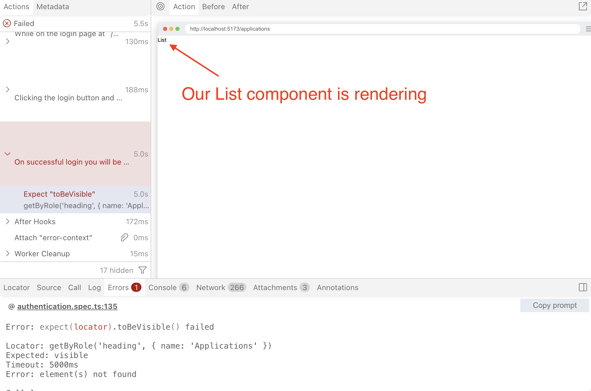

This is a pretty simple fix. We'll just add a `h1` to our List component.

```tsx title="src/app/pages/applications/List.tsx"
  return (
    <div>
      <h1>Applications</h1>
    </div>
  )
```

The test is passing. Now let's write some new failing tests.

## Seeding Test Applications data

In order to test that we can get data from our database, we first need to add some data to the database.

We'll be seeding the DB with some test data.

### The Models

If you go to `src/db/db.ts`, we'll see our lovely `Applications` model we created earlier. If you mouse over it, it should display the fields for our model, which should look something like this:

**Application Model**
```ts
type Application = {
    id: string;
    userId: string;
    statusId: number;
    companyId: number;
    salaryMin: string;
    salaryMax: string;
    dateApplied: number;
    jobTitle: string;
    jobDescription: string;
    postingUrl: string;
    createdAt: string;
    updatedAt: string;
    archived: number;
}
```

We want to add some a new Application to the `Applications` Table. The Application model has 3 foreign keys we'll need to add to this data.

- **userId**: We'll need to add a User model
- **statusId**: Luckily our seed already contains this.
- **companyId**: We'll need to add a Company model

Let's look at our other models we'll need to add.

**Company Model**
```ts
type Company = {
    id: string;
    name: string;
    createdAt: string;
    updatedAt: string;
}
```

Luckily no foreign keys here.

**User Model**
```ts
type User = {
    id: string;
    username: string;
    createdAt: string;
    updatedAt: string;
}
```

Also, no foreign keys here either. However, in order to use this `User` model to login with, we'll also need to add new `Credentials` associated with this User or else we won't be able to access this data.

**Credential Model**
```ts
type Credential = {
    id: string;
    userId: string;
    createdAt: string;
    credentialId: string;
    publicKey: Uint8Array<ArrayBufferLike>;
    counter: number;
}
```

So we'll need to add data to these 4 tables in order to populate the DB so we can test.

### Adding Data to DB

Open `src/scripts/seed.ts` and we'll add some new data based off these 4 models.

#### Resetting Tables

```ts title="src/scripts/seed.ts" {5-8}
...
export default async () => {
  console.log("… Seeding Applywize DB")

  await db.deleteFrom("applications").execute()
  await db.deleteFrom("companies").execute()
  await db.deleteFrom("credentials").execute()
  await db.deleteFrom("users").execute()
  await db.deleteFrom("applicationStatuses").execute()

  await db
    .insertInto("applicationStatuses")
    .values([
      { id: 1, status: "New" },
      { id: 2, status: "Applied" },
      { id: 3, status: "Interview" },
      { id: 4, status: "Rejected" },
      { id: 5, status: "Offer" },
    ])
    .execute()

  console.log("✔ Finished seeding applywize DB 🌱")
}
```

<details>

First thing we'll need to do is clear the tables. And to avoid orphan data, we'll need to delete them in reverse order of how we want to insert them. So we clear the table that has dependencies on other tables.

In this case we delete `Applications` first, since it depends on `Companies` and `Users`.

Then we can clear `Companies` since it has no dependencies.

And `Credentials` needs to be deleted before we can delete `Users`.

</details>

#### Adding to Users and Credentials
`User` and `Credentials` are used also for login, and so are also tightly tied to Authentication using WebAuthn and Passkeys in the browser.

To give a very quick crash course on how WebAuthn works. The client's authenticator (which will be a web browser in our case) will generate a **private key**, and store this on the device. It then will give the backend api a **public key**.

Our app's backend will give the client a **challenge**, which will be a bunch of random numbers. The client will sign the challenge with the private key and return it to our backend. The backend will verify that the challenge was signed with the private key using the public key. Note that the private key contains the public key, and with the public key it's possible to verify the use of the private key, but it does not reveal the private key, only validates that it was used with the same private key that contains the public key.

So we need a way to generate a public key to store in the `Credentials` table and we'll need to give a private key to the browser Playwright will be running. Luckily, I created a little npm package to handle this. Run:

```sh
npx @test2doc/playwright-passkey-gen --output src/scripts/test-passkey.ts
```

If you look at the output it should look something like this:

```ts
export const TESTPASSKEY = {
  username: "testuser",
  userId: "550e8400-e29b-41d4-a716-446655440000",
  credentialId: "base64-encoded-credential-id",
  publicKey: [/* array of numbers */],
  privateKey: "base64-encoded-private-key",
  credentialDbId: "base64url-encoded-credential-id",
  signCount: 1
}
```

<details>
The values are fake for this, so don't copy and paste it.
</details>

Now let's add the User and Credential data to the seed file.

```ts title="src/scripts/seed.ts"
import { TESTPASSKEY } from "./test-passkey"

...

const timeAdded = '2025-11-29T18:47:11.742Z'

await db
  .insertInto("users")
  .values({
    id: TESTPASSKEY.userId,
    username: TESTPASSKEY.username,
    createdAt: timeAdded,
    updatedAt: timeAdded,
  })
  .execute()

await db
  .insertInto("credentials")
  .values({
    id: crypto.randomUUID(),
    userId: TESTPASSKEY.userId,
    credentialId: TESTPASSKEY.credentialDbId,
    publicKey: Uint8Array.from(TESTPASSKEY.publicKey),
    counter: 0,
    createdAt: timeAdded,
  })
  .execute()
```
<details>

- In order to make testing easier, rather than always getting the current time, we hard code the value.
  - We also changed the name from `now` to `timeAdded` just to help clarify that it does not represent the current time.
- We import our new `TESTPASSKEY` from our newly generated passkey data. We also create a variable to hold the current time. Then we insert our data in to the DB.
- You'll also see we're using [`crypto`](https://nodejs.org/api/crypto.html) library native to node to generate a random UUID for the credential data.
- We also need to convert the public key to `Uint8Array` array, which is how `@simplewebauthn` library we're using expects the public key to be.

</details>

We'll need to make sure to run our seed script:

<Tabs groupId="package-managers">
  <TabItem value="npm" label="npm" default>
```sh
npm run seed
```
  </TabItem>
  <TabItem value="yarn" label="yarn">
```sh
yarn seed
```
  </TabItem>
  <TabItem value="pnpm" label="pnpm">
```sh
pnpm seed
```
  </TabItem>
</Tabs>

Then we can verify if the rows were added to our DB using `SQLite Viewer` plugin we installed earlier and selecting the sqlite file from `.wrangler/state/v3/do/__change_me__-AppDurableObject/[some-random-hash].sqlite`. Assuming you see it in there, our seed script was a huge success.

Now that we have the user and the credentials populated, we should also be able to login with this user.

##### Testing the User Credentials

Not exactly best practice, but now that we have the test data, we should be able to create a very simple test for authentication.

To help with some of the boilerplate I created a package `@test2doc/playwright-passkey` to make testing authentication a bit easier.

<Tabs groupId="package-managers">
  <TabItem value="npm" label="npm" default>
```sh
npm install --save-dev @test2doc/playwright-passkey
```
  </TabItem>
  <TabItem value="yarn" label="yarn">
```sh
yarn add --dev @test2doc/playwright-passkey
```
  </TabItem>
  <TabItem value="pnpm" label="pnpm">
```sh
pnpm add --save-dev @test2doc/playwright-passkey
```
  </TabItem>
</Tabs>

Let's add a new test file designed to test the logged in experience.

```ts title="tests/loggedin.spec.ts"
import { test } from "@playwright/test"
import { TESTPASSKEY } from "../src/scripts/test-passkey.js"
import { selectors } from "./util"
import Database from "better-sqlite3"
import {enablePasskey, addPasskeyCredential, simulateSuccessfulPasskeyInput} from "@test2doc/playwright-passkey"

test("Can access protected page", async ({ page }) => {
  const authenticator = await enablePasskey(page)

  await addPasskeyCredential(authenticator, TESTPASSKEY)

  await page.goto("/auth/login")

  await simulateSuccessfulPasskeyInput(
    authenticator,
    async () => await page.getByRole(...selectors.buttonLogin).click(),
  )

  await test
    .expect(page.getByRole("heading", { name: "Applications" }))
    .toBeVisible()
})
```

If you run this, it should pass.

**BUT** if you run it again it should fail!

So, a clever design of passkeys is the signCount value, which is designed to increment every time you use the passkey. This helps avoid replay attacks, where a third party spying on your internet traffic is able to intercept your request and just sends the same request again.

So the problem is, we're adding the passkey to the virtual authenticator every time. The signed counter is always set to the value we get from our `TESTPASSKEY`.

There are 2 ways we can handle this.

1. We increment the `TESTPASSKEY`'s `signCounter` value on every run.
2. We reset the DB counter value back to `0`.

The problem with solution 1, is that if the tests ever get into an inconsistent state, say if a test fails, and the update function doesn't execute properly, now the `signCounter` is out of sync and this will require us to manually fix the `TESTPASSKEY` data. While, this might seem like an _ok_ trade-off, solution 2 will be less error prone.

I do not recommend updating the DB for tests _normally_. It violates test isolation, but sadly we don't have much choice in this case. So we'll attempt to make the smallest change possible to make this test pass consistently. (If you come up with a possible better solution, please let [me](https://bsky.app/profile/dethstrobe.bsky.social) know.)

Let's install `better-sqlite3` so that we will be able to update the DB in our test file:

<Tabs groupId="package-managers">
  <TabItem value="npm" label="npm" default>
```sh
npm install --save-dev better-sqlite3 @types/better-sqlite3
```
  </TabItem>
  <TabItem value="yarn" label="yarn">
```sh
yarn add --dev better-sqlite3 @types/better-sqlite3
```
  </TabItem>
  <TabItem value="pnpm" label="pnpm">
```sh
pnpm add --save-dev better-sqlite3 @types/better-sqlite3
pnpm approve-builds better-sqlite3
pnpm rebuild better-sqlite3
```
  </TabItem>
</Tabs>

<details>
If you use `pnpm` you'll need to add `better-sqlite3` to the approved builds, so that it can run its setup scripts.
</details>

Now we'll update the counter value in the DB before we use the passkey.

```ts {2-3,5-22,27-37} title="tests/loggedin.spec.ts"
...
import Database from "better-sqlite3"
import fs from "node:fs"

function getTestDbPath(): string {
    const doDir = path.join(
    ".wrangler",
    "state",
    "v3",
    "do",
    "__change_me__-AppDurableObject",
  )
  const files = fs.readdirSync(doDir)
  const sqliteFile = files.find((f) => f.endsWith(".sqlite"))

  if (!sqliteFile) {
    throw new Error(`No SQLite file found in ${doDir}`)
  }

  return path.join(doDir, sqliteFile)
}
...

test("Can access protected page", async ({ page }) => {
  const db = new Database(getTestDbPath())

  db.prepare(
    `
    UPDATE credentials
    SET counter = 0
    WHERE userId = ?
  `,
  ).run(TESTPASSKEY.userId)

  db.close()
  ...
```

Let's walk through the code a bit to explain what's happening.

---

```ts
function getTestDbPath(): string {
    const doDir = path.join(
    ".wrangler",
    "state",
    "v3",
    "do",
    "__change_me__-AppDurableObject",
  )
  const files = fs.readdirSync(doDir)
  const sqliteFile = files.find((f) => f.endsWith(".sqlite"))

  if (!sqliteFile) {
    throw new Error(`No SQLite file found in ${doDir}`)
  }

  return path.join(doDir, sqliteFile)
}
```

This function is going to grab the `.sqlite` file from the `.wrangler` directory. When we run this tests in our CI pipeline, the file's name will be randomly generated. So we need a dynamic way to get the file path.

Remember to change the `__change_me__` and/or `AppDurableObject` strings in the `doDir` variable to match the values in your `wrangler.jsonc` configuration.

---

```ts
const db = new Database(getTestDbPath())
```

This will connect to our DB and use our `getTestDbPath` function to locate the DB file.

---

```ts
db.prepare(
  `
  UPDATE credentials
  SET counter = 0
  WHERE userId = ?
`,
).run(TESTPASSKEY.userId)
```

This is a SQL command to update the `Credentials` Table's column to `0` where the row has an `userId` equal to `?`. `?` will be replaced by the value we pass into the `run` method, in this case it'll be the `userId` from our `TESTPASSKEY`.

---

```ts
db.close()
```

This closes our connection to the DB, since we're all done updating it.

---

Now with these changes in place, our test will pass consistently.

#### Adding Company data
Before we can add Applications, we do still need to add a Company to associate the Application with. Luckily, the Company model does not have any reliance on other tables, so we can just add it.

```ts title="src/scripts/seed.ts" {3,5-15}
...
const timeAdded = '2025-11-29T18:47:11.742Z'
const companyId = crypto.randomUUID()
...
await db
  .insertInto("companies")
  .values([
    {
      id: companyId,
      name: "Tech Corp Inc.",
      createdAt: timeAdded,
      updatedAt: timeAdded,
    },
  ])
  .execute()
...
```

<details>
We create a variable for the `companyId` because we'll be reusing that in the `Application` model.
</details>

#### Adding Application data
And finally, we can add our Application data.

```ts title="src/scripts/seed.ts"
...
await db
  .insertInto("applications")
  .values([
    {
      id: crypto.randomUUID(),
      userId: TESTPASSKEY.userId,
      statusId: 1,
      companyId,
      jobTitle: "Software Engineer",
      salaryMin: "80000",
      salaryMax: "120000",
      jobDescription: "Develop and maintain web applications.",
      postingUrl: "https://example.com/jobs/123",
      dateApplied: timeAdded,
      createdAt: timeAdded,
      updatedAt: timeAdded,
      archived: 0,
    },
  ])
  .execute()
...
```

#### Seed File
With that we have seed data that we can test against.

We can run the seed command again:

<Tabs groupId="package-managers">
  <TabItem value="npm" label="npm" default>
```sh
npm run seed
```
  </TabItem>
  <TabItem value="yarn" label="yarn">
```sh
yarn seed
```
  </TabItem>
  <TabItem value="pnpm" label="pnpm">
```sh
pnpm seed
```
  </TabItem>
</Tabs>

We should be able to confirm that our data has been added to the sqlite DB with `SQLite Viewer` plugin again.

<details>
<summary>Complete seed.ts file</summary>

```ts title="src/scripts/seed.ts"
import { db } from "@/db/db"
import { TESTPASSKEY } from "./test-passkey"

export default async () => {
  console.log("… Seeding Applywize DB")
  await db.deleteFrom("applications").execute()
  await db.deleteFrom("companies").execute()
  await db.deleteFrom("credentials").execute()
  await db.deleteFrom("users").execute()
  await db.deleteFrom("applicationStatuses").execute()

  await db
    .insertInto("applicationStatuses")
    .values([
      { id: 1, status: "New" },
      { id: 2, status: "Applied" },
      { id: 3, status: "Interview" },
      { id: 4, status: "Rejected" },
      { id: 5, status: "Offer" },
    ])
    .execute()

  const timeAdded = '2025-11-29T18:47:11.742Z'
  const companyId = crypto.randomUUID()

  await db
    .insertInto("users")
    .values({
      id: TESTPASSKEY.userId,
      username: TESTPASSKEY.username,
      createdAt: timeAdded,
      updatedAt: timeAdded,
    })
    .execute()

  await db
    .insertInto("credentials")
    .values({
      id: crypto.randomUUID(),
      userId: TESTPASSKEY.userId,
      credentialId: TESTPASSKEY.credentialDbId,
      publicKey: Uint8Array.from(TESTPASSKEY.publicKey),
      counter: 0,
      createdAt: timeAdded,
    })
    .execute()

  await db
    .insertInto("companies")
    .values([
      {
        id: companyId,
        name: "Tech Corp Inc.",
        createdAt: timeAdded,
        updatedAt: timeAdded,
      },
    ])
    .execute()

  await db
    .insertInto("applications")
    .values([
      {
        id: crypto.randomUUID(),
        userId: TESTPASSKEY.userId,
        statusId: 1,
        companyId,
        jobTitle: "Software Engineer",
        salaryMin: "80000",
        salaryMax: "120000",
        jobDescription: "Develop and maintain web applications.",
        postingUrl: "https://example.com/jobs/123",
        dateApplied: timeAdded,
        createdAt: timeAdded,
        updatedAt: timeAdded,
        archived: 0,
      },
    ])
    .execute()

  console.log("✔ Finished seeding applywize DB 🌱")
}
```

</details>

## Displaying the Job Application Data

Now that we have some data in the DB. Let's see about testing that we can get it out and display it on the page.

### Testing that data is displayed
```ts title="tests/loggedin.spec.ts" {6-10}
...
await expect(
  page.getByRole("heading", { name: "Applications" }),
).toBeVisible()

await expect(page.getByText("Software Engineer")).toBeVisible()
await expect(
  page.getByText("Develop and maintain web applications."),
).toBeVisible()
await expect(page.getByText("https://example.com/jobs/123")).toBeVisible()
...
```

We're going to currently take a naive approach and see if the test data we seeded even displays. Now, let's go get some data.

### Implementing fetching data

```ts title="src/app/pages/applications/List.tsx" {1,3,4,8}
import { db } from "@/db/db"

export const List = async () => {
  const applications = await db.selectFrom("applications").selectAll().execute()
  return (
    <div>
      <h1>Applications</h1>
      <pre>{JSON.stringify(applications, null, 2)}</pre>
    </div>
  )
}
```

<details>

- We import our `db`.
- We turn this functional component into an `async` functional component.
- We select all the rows from the `Application` table and `await` the response.
- We stringify the data payload into JSON to display.

</details>

And the tests are passing, and we are able to get data from the DB. Another job well done.

## Sharing logged in credentials between tests

Going through login flow for every test may not be ideal. Luckily, with Playwright, we can take care of this once, and then save the session credentials to reuse in subsequent tests.

First, we'll make 2 new directories to hold the tests that are scoped to require a logged in user or are publicly accessible.

- `test/loggedin/`
- `test/public`

Let's move the `authentication.spec.ts` file in to our new `public` directory. So the new path will be `tests/public/authentication.spec.ts`.

Let's also move our `loggedin.spec.ts` into this directory and rename it to `login.setup.ts`. So it will now be `test/loggedin/login.setup.ts`

We'll also make a setup file to run the login once and safe the credential to reuse in tests that require a logged-in session.

```ts title="test/loggedin/login.setup.ts" {30,59}
import { test, expect } from "@playwright/test"
import { TESTPASSKEY } from "../../src/scripts/test-passkey.js"
import { selectors } from "../util.js"
import Database from "better-sqlite3"
import {
  enableVirtualAuthenticator,
  addPasskeyCredential,
  simulateSuccessfulPasskeyInput,
} from "@test2doc/playwright-passkey"
import fs from "node:fs"

function getTestDbPath(): string {
    const doDir = path.join(
    ".wrangler",
    "state",
    "v3",
    "do",
    "__change_me__-AppDurableObject",
  )
  const files = fs.readdirSync(doDir)
  const sqliteFile = files.find((f) => f.endsWith(".sqlite"))

  if (!sqliteFile) {
    throw new Error(`No SQLite file found in ${doDir}`)
  }

  return path.join(doDir, sqliteFile)
}

test("Login setup", async ({ page }) => {
  const db = new Database(getTestDbPath())

  // Reset the test passkey counter
  db.prepare(
    `
      UPDATE credentials
      SET counter = 0
      WHERE userId = ?
    `,
  ).run(TESTPASSKEY.userId)

  db.close()

  const authenticator = await enableVirtualAuthenticator(page)

  await addPasskeyCredential(authenticator, TESTPASSKEY)

  await page.goto("/auth/login")

  await simulateSuccessfulPasskeyInput(
    authenticator,
    async () => await page.getByRole(...selectors.buttonLogin).click(),
  )

  await expect(
    page.getByRole("heading", { name: "Applications" }),
  ).toBeVisible()

  await page.context().storageState({ path: "playwright/.auth/user.json" })
})
```

<details>

- We renamed the test, just so we know this is for setup, not really for testing or documentation.
- Removed most our assertions.
- We run the `storageState` to save the local state of the browsers to a file to be used by future tests.

</details>

From here, we'll create a new Playwright project to run out setup file. Since we'll need to reuse this project configuration in `test2doc.config.ts` and `playwright-test2doc.config.ts` let's also turn the projects into a variable and allow it to be shared between these config files.

```ts title="test2doc.config.ts" {2-18,21}
...
export const projects = [
  { name: "loginSetup", testMatch: "tests/loggedin/login.setup.ts" },
  {
    name: "public",
    use: { ...devices["Desktop Chrome"] },
    testDir: "./tests/public",
  },
  {
    name: "logged-in",
    use: {
      ...devices["Desktop Chrome"],
      storageState: "playwright/.auth/user.json",
    },
    testDir: "./tests/loggedin",
    dependencies: ["loginSetup"],
  },
]
...
use: { ... },
projects,
webServer: { ... }
...
```

Let's explain the changes:

---
```ts
{ name: "login setup", testMatch: "tests/loggedin/login.setup.ts" },
```

This will run our setup file as a project.

---

```ts
{
  name: "logged-in tests",
  use: {
    ...devices["Desktop Chrome"],
    storageState: "playwright/.auth/user.json",
  },
  testDir: "./tests/loggedin",
  dependencies: ["login setup"],
},
```

This adds a new project that will run all our tests in `loggedin` directory. It will also load the credentials from `playwright/.auth/user.json` which is where we saved it during the setup file.

By adding `"login setup"` to the `dependencies`, it means that it will only run this after the `login setup` project runs. Which ensures that `playwright/.auth/user.json` will be populated.

---

```ts
{
  name: "public",
  use: { ...devices["Desktop Chrome"] },
  testDir: "./tests/public",
},
```

And this is a project that will run all our tests that don't require being logged in to begin with.

---

Lastly, we need to use these projects in `playwright-test2doc.config.ts`

```ts title="playwright-test2doc.config.ts" {2,6}
import { defineConfig } from "@playwright/test"
import { projects } from "./playwright.config.js"
import "@test2doc/playwright/types"
...
retries: 0,
projects,
webServer: {
...
```

## Testing the Applications Table

Now that we have the credentials saved we can start to write tests. Let's start by testing that we display the data in the table like in the [figma mocks](https://www.figma.com/design/nqBPIIfe0MO4W8zOfW4oae/RedwoodSDK---Applywize?node-id=1-13&t=xg3MkFV0IUzy4vpC-4).

Testing rows in tables is not exactly intuitive (and arguably might be slightly flawed), but we are able to get close enough using the `getByRole` method.

Let's start by testing for the table and table header in a new file and documenting what data will be displayed.

```ts title="tests/loggedin/applications.spec.ts"
import { test, expect } from "@playwright/test"
import { withDocMeta } from "@test2doc/playwright/DocMeta"

test.describe(
  withDocMeta("Applications Page", {
    description: "All the functionality for the Applications page.",
  }),
  () => {
    test("Applications Table", async ({ page }) => {
      await test.step("On the Applications page", async () => {
        await page.goto("/applications")
      })

      const table = page.getByRole("table", { name: "All Applications" })

      await test.step(`**Applications Table** displays the following data:
        - Status
        - Date Applied
        - Job Title
        - Company
        - Contact
        - Salary
        `, async () => {
        const tableHeaders = table.getByRole("columnheader")

        await expect(tableHeaders.nth(0)).toHaveText("Status")
        await expect(tableHeaders.nth(1)).toHaveText("Date Applied")
        await expect(tableHeaders.nth(2)).toHaveText("Job Title")
        await expect(tableHeaders.nth(3)).toHaveText("Company")
        await expect(tableHeaders.nth(4)).toHaveText("Contact")
        await expect(tableHeaders.nth(5)).toHaveText("Salary")
      })
    })
  },
)
```

Now if we run our tests with `pnpm test` you'll see our test fails to find the table.

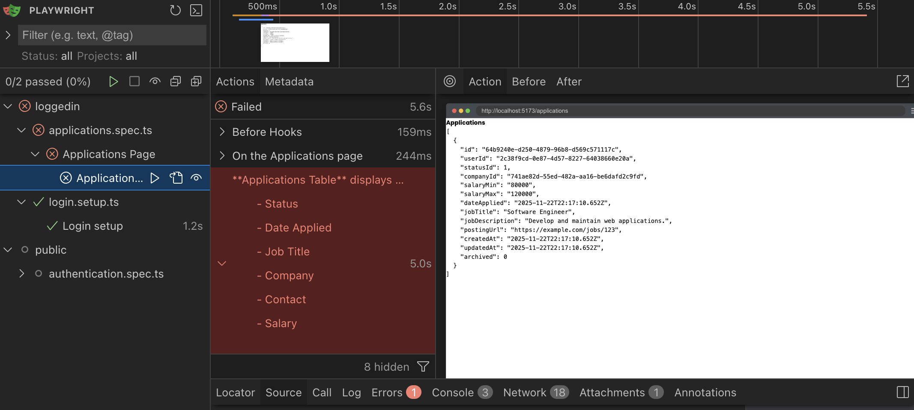

### Implementing Application Table header

Now that we have a perfectly functional test. Let's make it pass.

```tsx title="src/app/pages/applications/List.tsx" {2,4-16}
<div>
  <h1 id="all-applications">All Applications</h1>

  <table aria-labelledby="all-applications">
    <thead>
      <tr>
        <th scope="col">Status</th>
        <th scope="col">Date Applied</th>
        <th scope="col">Job Title</th>
        <th scope="col">Company</th>
        <th scope="col">Contact</th>
        <th scope="col">Salary</th>
        <th scope="col"></th>
      </tr>
    </thead>
  </table>
  <pre>{JSON.stringify(applications, null, 2)}</pre>
</div>
```

We want to add an id to the `h1` and change the text to `All Applications`. With the id we can target this `h1` to use as the label for the table by adding `aria-labelledby` to our `table` element. This allows screenreaders to announce the name of the table when it is selected.

**Why we care about accessibility:** Notice we're using `aria-labelledby`, `scope="col"`, and semantic HTML throughout. Playwright's `getByRole()` actually helps enforce this—if we can't select an element by its accessible role, screen reader users probably can't use it either. Accessibility isn't extra work when it's built in from the start.

You might think that changing the text of the `h1` would break some of our test, but `getByRole` while selecting by `name` does some fuzzy matching. So we don't necessarily need to change our assertions for the tests that are looking for the header of `Applications`.

But, we should update it. As many headings in this app will have the word "Applications." So we might as well take the time to quickly update the locator.

```ts title="tests/util.ts"
headingApplications: ["heading", { name: "All Applications" }],
```

Next we setup the normal table boilerplate. Setup the table head (`thead`) with table headers (`th`) and importantly for accessibility we'll need to add the `scope` attribute to the `th` elements. This indicates to the accessibility tree that this is the column of the header. Which allows us to use to get these elements by the role of `columnheader`.

Without the `scope` attribute, when a screenreader reads one of the cells in this column, it will simply read the content of the cell. But with the `scope="col"` to indicate the header, a screenreader will also announce the header of the column. It's good accessibility to add this scope because it reduces mental overhead of needing to constantly remember what each column is for or needing to refer back to the column header if you forget.

### Testing Application data in the table

Let's take the Application JSON data we're displaying and instead display it in our table.

Of course, to start us off. We'll extend our test to look for this data.

```ts title="tests/loggedin/applications.spec.ts"
await test.step("\nWhich will be displayed in the table", async () => {
  const tableCellsInTestRow = table
    .getByRole("row", {
      name: "Software Engineer Tech Corp Inc. 80000-120000",
    })
    .getByRole("cell")

  await expect(tableCellsInTestRow.nth(0)).toHaveText("New")
  await expect(tableCellsInTestRow.nth(1)).toHaveText("November 29, 2025")
  await expect(tableCellsInTestRow.nth(2)).toHaveText("Software Engineer")
  await expect(tableCellsInTestRow.nth(3)).toHaveText("Tech Corp Inc.")
  await expect(tableCellsInTestRow.nth(4)).toBeVisible()
  await expect(tableCellsInTestRow.nth(5)).toHaveText("80000-120000")
  await expect(tableCellsInTestRow.nth(6)).toBeVisible()
})
```

Let's walk through and explain the code a bit.

---

```ts
const tableCellsInTestRow = table
  .getByRole("row", {
    name: "Software Engineer Tech Corp Inc. 80000-120000",
  })
  .getByRole("cell")
```

We need a way to identify the row. Without an `aria-label` or other accessible name, if `getByRole` cannot find an accessible name from the accessibility tree, it falls back to combining all the text of that element.

We need to identify rows based on their text content. This approach works for testing as long as we ensure our seed data doesn't create duplicate rows with identical Job Title, Company, and Salary values.

**Why this limitation exists:** The `getByRole` method combines all text in a `row` to create its accessible name when no explicit `aria-label` is present. While real-world data might have duplicate combinations (same company, same role, same salary range), we can avoid this in our controlled test environment.

But do keep in mind, that if you're having a hard time distinguishing between elements when using `getByRole`, then so are screenreader users. So this is an accessibility red flag to be mindful of.

We also chain one more `getByRole` to select all the `td` in the row so we can assert that they have the correct values.

---

```ts
await expect(tableCellsInTestRow.nth(0)).toHaveText("New")
...
await expect(tableCellsInTestRow.nth(4)).toBeVisible()
```

Sometimes we're asserting a value exactly matches, and other times we're asserting the element just exists.

For the `Contact` and `View Details` columns, we'll implement those later, so this will be good to just test place holding for right now.

---

### Implementing displaying Application data in the Table

Now that we have a test with what we're expecting. We'll implement it to make the test pass.

```tsx title="src/app/pages/applications/List.tsx"
  ...
  </thead>
  <tbody>
    {applications.map((application) => (
      <tr key={application.id}>
        <td>{application.statusId}</td>
        <td>{new Date(application.dateApplied ?? 0).toLocaleDateString("en-US", {
            year: "numeric",
            month: "long",
            day: "numeric",
          })}
        </td>
        <td>{application.jobTitle}</td>
        <td>{application.companyId}</td>
        <td></td>
        <td>
          {application.salaryMin}-{application.salaryMax}
        </td>
        <td>
          <button>View</button>
        </td>
      </tr>
    ))}
  </tbody>
</table>
...
```

<details>

We map our `Application` data to the row of the table.

One of the things to note is to format the time using the [`toLocaleDateString`](https://developer.mozilla.org/en-US/docs/Web/JavaScript/Reference/Global_Objects/Date/toLocaleDateString) method. And we pass in an options object to format how we want to display the date.

</details>

However, if you take a look at the test, it is still failing.

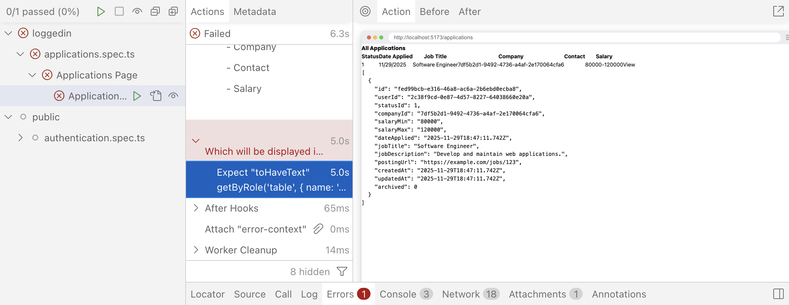

The reason for this is because we're expecting to display the Company name in the row, but currently the company id is being rendered. So we'll need to create a join table to get the company name data.

```tsx title="src/app/pages/applications/List.tsx" {2-15,18}
...
const applications = await db
  .selectFrom("applications")
  .innerJoin("companies", "applications.companyId", "companies.id")
  .select([
    "applications.id",
    "applications.statusId",
    "applications.dateApplied",
    "applications.jobTitle",
    "applications.salaryMin",
    "applications.salaryMax",
    "companies.name as companyName",
  ])
  .execute()
  ...
  <td>{application.jobTitle}</td>
  <td>{application.companyName}</td>
  <td></td>
  ...
```

With this change, we are able to select the row in the table. However, our test is still failing.

```sh
Error: expect(locator).toHaveText(expected) failed

Locator:  getByRole('table', { name: 'All Applications' }).getByRole('row', { name: 'Software Engineer Tech Corp Inc. 80000-120000' }).first()
Expected: "New"
Received: "111/29/2025Software EngineerTech Corp Inc.80000-120000View"
Timeout:  5000ms
```

You'll see we're expecting to find the text "New" but the entire row doesn't have that text at all. Again, we need to do yet another inner join to get the name of the status from the `ApplicationStatus` table.

```tsx title="src/app/pages/applications/List.tsx" {4-8,16}
const applications = await db
  .selectFrom("applications")
  .innerJoin("companies", "applications.companyId", "companies.id")
  .innerJoin(
    "applicationStatuses",
    "applications.statusId",
    "applicationStatuses.id",
  )
  .select([
    "applications.id",
    "applications.dateApplied",
    "applications.jobTitle",
    "applications.salaryMin",
    "applications.salaryMax",
    "companies.name as companyName",
    "applicationStatuses.status as status",
  ])
  .execute()
```

Now, all our tests should be passing. At this time, let's see if we can't refactor and improve this a bit more for later expansion.

### Refactor Application Table

Let's move our table into it's own component.

But before we can do that, we need to export the `Applications` type so we can pass that as a prop to our new component.

```tsx title="src/app/pages/applications/List.tsx" {3-19,21,24}
import { db } from "@/db/db"

const applicationsQuery = db
  .selectFrom("applications")
  .innerJoin("companies", "applications.companyId", "companies.id")
  .innerJoin(
    "applicationStatuses",
    "applications.statusId",
    "applicationStatuses.id",
  )
  .select([
    "applications.id",
    "applications.dateApplied",
    "applications.jobTitle",
    "applications.salaryMin",
    "applications.salaryMax",
    "companies.name as companyName",
    "applicationStatuses.status as status",
  ])

export type ApplicationsWithRelations = Awaited<ReturnType<typeof applicationsQuery.execute>>

export const List = async () => {
  const applications = await applicationsQuery.execute()
  ...
```

<details>

- We move the db query to outside of the `List` component.
- We also use a bit of Typescript magic to get the type of the applications query return object from the `execute` method using the `Awaited`, `ReturnType`, and `typeof` keywords.

</details>

Now that we have a type that we can pass to our new table component; let's make a new file at `src/app/components/ApplicationsTable.tsx` and copy and paste our table in to the new component and setup the props to pass.

```tsx title="src/app/components/ApplicationsTable.tsx" {1,3-5,7}
import { ApplicationsWithRelations } from "@/app/pages/applications/List"

interface Props {
  applications: ApplicationsWithRelations
}

export const ApplicationsTable = ({ applications }: Props) => {
  return (
    <table aria-labelledby="all-applications">
      <thead>
        <tr>
          <th scope="col">Status</th>
          <th scope="col">Date Applied</th>
          <th scope="col">Job Title</th>
          <th scope="col">Company</th>
          <th scope="col">Contact</th>
          <th scope="col">Salary</th>
          <th scope="col"></th>
        </tr>
      </thead>
      <tbody>
        {applications.map((application) => (
          <tr key={application.id}>
            <td>{application.status}</td>
            <td>
              {new Date(application.dateApplied ?? 0).toLocaleDateString(
                "en-US",
                {
                  year: "numeric",
                  month: "long",
                  day: "numeric",
                },
              )}
            </td>
            <td>{application.jobTitle}</td>
            <td>{application.companyName}</td>
            <td></td>
            <td>
              {application.salaryMin}-{application.salaryMax}
            </td>
            <td>
              <button>View</button>
            </td>
          </tr>
        ))}
      </tbody>
    </table>
  )
}
```

You can see we're using our new `ApplicationsWithRelations` as props for our new component. And a simple copy and paste of the current table works without needing to make any changes.

Now let's use our new `ApplicationsTable` and remove the old table and the old `JSON.stringify` to display the Application data.

```tsx title="src/app/pages/applications/List.tsx" {1,9}
import { ApplicationsTable } from "@/app/components/ApplicationsTable"
...
export const List = async () => {
  const applications = await applicationsQuery.execute()

  return (
    <div>
      <h1 id="all-applications">All Applications</h1>
      <ApplicationsTable applications={applications} />
    </div>
  )
}
```

If you check your tests, everything should still be passing. But let's do one last refactor. We'll swap out our html table with the shadcn/ui table.

```tsx title="src/app/components/ApplicationsTable.tsx" {2-9}
import { ApplicationsWithRelations } from "@/app/pages/applications/List"
import {
  Table,
  TableBody,
  TableCell,
  TableHead,
  TableHeader,
  TableRow,
} from "./ui/table"

interface Props {
  applications: ApplicationsWithRelations
}

export const ApplicationsTable = ({ applications }: Props) => {
  return (
    <Table aria-labelledby="all-applications">
      <TableHeader>
        <TableRow>
          <TableHead scope="col" className="w-[100px]">Status</TableHead>
          <TableHead scope="col">Date Applied</TableHead>
          <TableHead scope="col">Job Title</TableHead>
          <TableHead scope="col">Company</TableHead>
          <TableHead scope="col">Contact</TableHead>
          <TableHead scope="col">Salary</TableHead>
          <TableHead scope="col"></TableHead>
        </TableRow>
      </TableHeader>
      <TableBody>
        {applications.map((application) => (
          <TableRow key={application.id}>
            <TableCell>{application.status}</TableCell>
            <TableCell>
              {new Date(application.dateApplied ?? 0).toLocaleDateString(
                "en-US",
                {
                  year: "numeric",
                  month: "long",
                  day: "numeric",
                },
              )}
            </TableCell>
            <TableCell>{application.jobTitle}</TableCell>
            <TableCell>{application.companyName}</TableCell>
            <TableCell></TableCell>
            <TableCell>
              {application.salaryMin}-{application.salaryMax}
            </TableCell>
            <TableCell>
              <button>View</button>
            </TableCell>
          </TableRow>
        ))}
      </TableBody>
    </Table>
  )
}
```
<details>
We swap out the table elements with the shadcn/ui components

- `table` to `Table`
- `theader` to `TableHeader`
- `tbody` to `TableBody`
- `tr` to `TableRow`
- `th` to `TableHead`
- `td` to `TableCell`

And let's add the `w-[100px]` class to the `Status` column to give room for the badge, we'll add next.
</details>

Lastly, let's implement the status badge like in the [mocks](https://www.figma.com/design/nqBPIIfe0MO4W8zOfW4oae/RedwoodSDK---Applywize?node-id=5-467&t=ioQQZniX6F7sqe4J-4).

```tsx title="src/app/components/ApplicationsTable.tsx" {2,6}
...
import { Badge } from "./ui/badge"
...
  <TableRow key={application.id}>
    <TableCell>
      <Badge>{application.status}</Badge>
    </TableCell>
    <TableCell>
      {new Date(application.dateApplied ?? 0).toLocaleDateString(
      ...
```
<details>
- We add the Badge component around the `status`
</details>

#### Styling the badge

While we're at it, if you take a look inside the `Badge` component, you'll see that we can pass in a `variant` property to style the badge. Let's take the time to style the badge while we're at it.

:::info When to test

**Note:** Normally, if we implement some logic, I usually like to add tests, in order to prevent regressions. But styling logic is usually considered non-essential for the functioning of the app, so it normally will not be tested.

:::

```tsx title="src/app/components/ui/badge.tsx" {11-15}
variants: {
  variant: {
    default:
      "border-transparent bg-primary text-primary-foreground [a&]:hover:bg-primary/90",
    secondary:
      "border-transparent bg-secondary text-secondary-foreground [a&]:hover:bg-secondary/90",
    destructive:
      "border-transparent bg-destructive text-white [a&]:hover:bg-destructive/90 focus-visible:ring-destructive/20 dark:focus-visible:ring-destructive/40 dark:bg-destructive/60",
    outline:
      "text-foreground [a&]:hover:bg-accent [a&]:hover:text-accent-foreground",
    applied: "bg-tag-applied text-black",
    interview: "bg-tag-interview text-black",
    new: "bg-tag-new text-black",
    rejected: "bg-tag-rejected text-black",
    offer: "bg-tag-offer text-black",
  },
},
```

<details>
I added a custom variant for `applied`, `interview`, `new`, `rejected`, and `offer`. Now, we can use these variants to style our badges. For example: `<Badge variant="new">New</Badge>`
</details>

While, we're here, let's also add a few more classes to the default styling:

```tsx title="src/app/components/ui/badge.tsx"
...
const badgeVariants = cva(
  "font-bold inline-flex items-center justify-center rounded-full border px-2 py-0.5 text-xs w-fit whitespace-nowrap shrink-0 [&>svg]:size-3 gap-1 [&>svg]:pointer-events-none focus-visible:border-ring focus-visible:ring-ring/50 focus-visible:ring-[3px] aria-invalid:ring-destructive/20 dark:aria-invalid:ring-destructive/40 aria-invalid:border-destructive transition-[color,box-shadow] overflow-hidden",
  ...
```

<details>

- Add a font weight of `font-bold`. (Be sure to remove the `font-medium` class, otherwise the two classes will conflict.)
- Change the rounded corners from `rounded-md` to `rounded-full`

</details>

For our application status and our `Badge` component, we make the variant based off of the `ApplicationStatus`.

```tsx title="src/app/components/ApplicationsTable.tsx"
<Badge variant={application.status}>{application.status}</Badge>
```

Sadly, we'll starting to get an error within our code editor.

While normally I think casting (forcing Typescript to interpret the type of a variable) is a bad thing. But we don't have much choice as the status is saved as a string, but we need to have very specific strings. But we do know that we control the DB, and so we know what strings are used for the status.

```tsx title="src/app/components/ApplicationsTable.tsx" {2-3,6-10}
...
import { Badge, badgeVariants } from "./ui/badge"
import { VariantProps } from "class-variance-authority"
...
<Badge
  variant={
    application.status.toLowerCase() as VariantProps<
      typeof badgeVariants
    >["variant"]
  }
>
  {application.status}
</Badge>
```

<details>

- On the `application.status`, we can append `.toLowerCase()` to ensure the status is formatted correctly and always lowercase.
- `typeof badgeVariants` - Gets the type of our `badgeVariants` from the `badge.tsx` component.
- `VariantProps<...>` - This is a utility type from [class-variance-authority](https://cva.style/docs) library that extracts the prop types. It creates a type that includes all possible variants as properties.
- `['variant']` - We reference the `variant` object. In our case, it resolves to the union type: `"default" | "secondary" | "destructive" | "outline" | "applied" | "interview" | "new" | "rejected" | "offer" | null | undefined`

</details>

#### Refactor the test to make columns more explicit

Right now in our test, we're setting the columns to their index, but we can probably make this a bit more human readable if we use [enums](https://www.typescriptlang.org/docs/handbook/enums.html).

```ts title="tests/loggedin/applications.spec.ts"
import { test, expect } from "@playwright/test"
import { withDocMeta } from "@test2doc/playwright/DocMeta"

enum ColumnHeaders {
  Status,
  DateApplied,
  JobTitle,
  Company,
  Contact,
  Salary,
  ViewButton,
}
...
```
<details>

- At the top of the file, we declare our enum and give it the name of each of the columns.
- In Typescript, enums are objects with a simple key/value mapping. If a value is not provided, it treats the value of the keys as numbers starting from 0 and incrementing with every key.

</details>

Now we can swap out our index calls with our enum.

```ts title="tests/loggedin/applications.spec.ts"
...
await test.step(`**Applications Table** displays the following data:

  - Status
  - Date Applied
  - Job Title
  - Company
  - Contact
  - Salary
  `, async () => {
  const tableHeaders = table.getByRole("columnheader")

  await expect(tableHeaders.nth(ColumnHeaders.Status)).toHaveText(
    "Status",
  )
  await expect(tableHeaders.nth(ColumnHeaders.DateApplied)).toHaveText(
    "Date Applied",
  )
  await expect(tableHeaders.nth(ColumnHeaders.JobTitle)).toHaveText(
    "Job Title",
  )
  await expect(tableHeaders.nth(ColumnHeaders.Company)).toHaveText(
    "Company",
  )
  await expect(tableHeaders.nth(ColumnHeaders.Contact)).toHaveText(
    "Contact",
  )
  await expect(tableHeaders.nth(ColumnHeaders.Salary)).toHaveText(
    "Salary",
  )
})

await test.step("\nWhich will be displayed in the table", async () => {
  const tableCellsInTestRow = table
    .getByRole("row", {
      name: "Software Engineer Tech Corp Inc. 80000-120000",
    })
    .getByRole("cell")

  await expect(tableCellsInTestRow.nth(ColumnHeaders.Status)).toHaveText(
    "New",
  )
  await expect(
    tableCellsInTestRow.nth(ColumnHeaders.DateApplied),
  ).toHaveText("November 29, 2025")
  await expect(
    tableCellsInTestRow.nth(ColumnHeaders.JobTitle),
  ).toHaveText("Software Engineer")
  await expect(tableCellsInTestRow.nth(ColumnHeaders.Company)).toHaveText(
    "Tech Corp Inc.",
  )
  await expect(
    tableCellsInTestRow.nth(ColumnHeaders.Contact),
  ).toBeVisible()
  await expect(tableCellsInTestRow.nth(ColumnHeaders.Salary)).toHaveText(
    "80000-120000",
  )
  await expect(
    tableCellsInTestRow.nth(ColumnHeaders.ViewButton),
  ).toBeVisible()
})
...
```

<details>
`enums` are nice because it can often make a variable, the index of a column in our case, into a human readable value. This makes it easier to maintain and more intuitive for onboarding new developers.
</details>

### Adding contacts

Currently, we're not displaying contacts for our Application data, because we hadn't seeded the DB with any contacts.

Let's see about approaching this from testing first (as opposed to seeding the DB, then testing, then implementing). We'll try and do it in this order:

- Test that contacts exist **(Red)**
- Hard code contacts into the table **(Green)**
- Seed the DB and make the contacts dynamically populated from the DB **(Refactor)**

#### Testing Contacts

So we'll want to test that the Contact column has the test we're expecting, but we're also need to modify how we select our row too, since we'll be adding more text to the row.

```ts title="tests/loggedin/applications.spec.ts" {3,8}
const tableCellsInTestRow = table
  .getByRole("row", {
    name: "Software Engineer Tech Corp Inc. JD John Doe 80000-120000",
  })
  .getByRole("cell")
...
await expect(
  tableCellsInTestRow.nth(ColumnHeaders.Contact),
).toContainText("John Doe")
```

<details>
- We add our contact text, `"JD John Doe"` to the `getByRole` row locator.
- We'll just be testing that our contact, "John Doe" is being displayed.
</details>

#### Implementing hard coded Contact

We'll implement contacts using our shadcn/ui Avatar component.

```tsx title="src/app/components/ApplicationsTable.tsx"
import { Avatar, AvatarFallback } from './ui/avatar'
...
<TableCell className="flex items-center gap-2">
  <Avatar>
    <AvatarFallback>JD</AvatarFallback>
  </Avatar>
  John Doe
</TableCell>
```

<details>

- We import the `Avatar` component
- We import the `AvatarFallback` component
  - The idea is this will call back to display the initials of the contact
  - `AvatarImage` component that we want to use to display the contact's image. But we're going to gloss over this, because dealing with uploading images and managing that is going to be outside of the scope of the current tutorial.
- We add the class of `flex items-center gap-2` to our table cell to make it look nice and match the mocks.
- We also render the contact's first and last name.

</details>

#### Seed the DB with contacts

Now we want to seed our DB with the test Contact data.

```ts title="src/scripts/seed.ts" {3,11-23}
...
await db.deleteFrom("applications").execute()
await db.deleteFrom("contacts").execute()
await db.deleteFrom("companies").execute()
...
   await db
    .insertInto("companies")
    ...
    .execute()

  await db
    .insertInto("contacts")
    .values({
      id: crypto.randomUUID(),
      firstName: "John",
      lastName: "Doe",
      email: "john.doe@example.com",
      role: "Hiring Manager",
      companyId: companyId,
      createdAt: timeAdded,
      updatedAt: timeAdded,
    })
    .execute()

  await db
    .insertInto("applications")
    ...
```
<details>

- Just before we delete the `Companies` table, we also want to make sure we delete the `Contacts` table to avoid creating orphan `Contacts`.
- Just after the `Companies` table, we add the new data for the `Contacts` since we need a `Company` model to reference before we can insert our new `Contact`.

</details>

After we create our new seed, we need to run the seed command again to populate the DB with our new data.

<Tabs groupId="package-managers">
  <TabItem value="npm" label="npm" default>
```sh
npm run seed
```
  </TabItem>
  <TabItem value="yarn" label="yarn">
```sh
yarn seed
```
  </TabItem>
  <TabItem value="pnpm" label="pnpm">
```sh
pnpm seed
```
  </TabItem>
</Tabs>

<details>

After the seed script runs, you should see the rows added using SQLite Preview.

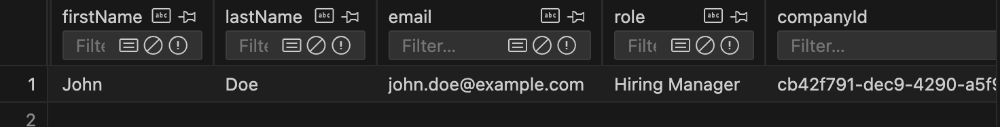

</details>

#### Refactor to use real data

Alright, now that we know we got the DB populated. Time to refactor the implementation to use the real data instead of our hard coded values.

```tsx title="src/app/pages/applications/List.tsx" {1,11,20-34}
import { sql } from "rwsdk/db"

const applicationsQuery = db
  .selectFrom("applications")
  .innerJoin("companies", "applications.companyId", "companies.id")
  .innerJoin(
    "applicationStatuses",
    "applications.statusId",
    "applicationStatuses.id",
  )
  .leftJoin("contacts", "companies.id", "contacts.companyId")
  .select([
    "applications.id",
    "applications.dateApplied",
    "applications.jobTitle",
    "applications.salaryMin",
    "applications.salaryMax",
    "companies.name as companyName",
    "applicationStatuses.status as status",
    sql<{ firstName: string; lastName: string; id: string }[]>`
      COALESCE(
        json_group_array(
          CASE 
            WHEN ${sql.ref("contacts.id")} IS NOT NULL 
            THEN json_object(
              'firstName', ${sql.ref("contacts.firstName")},
              'lastName', ${sql.ref("contacts.lastName")}, 
              'id', ${sql.ref("contacts.id")}
            )
          END
        ) FILTER (WHERE ${sql.ref("contacts.id")} IS NOT NULL),
        '[]'
      )
    `.as("contacts"),
  ])
  .groupBy([
    "applications.id",
    "applications.dateApplied",
    "applications.jobTitle",
    "applications.salaryMin",
    "applications.salaryMax",
    "companies.name",
    "applicationStatuses.status",
  ])
```

<details>

- We import `sql` from `rwsdk/db`, which uses the [Kysely's raw sql query](https://kysely-org.github.io/kysely-apidoc/interfaces/Sql.html).
- We want to add another join table but this time its a left join.
  - Left join tables mean that the data is optional.
  - Inner join tables mean in order to display the data at all, we need to find a matching data in that table.
- We are using a more advance SQL query to build the contacts.
  - We type the return value with `<{ firstName: string; lastName: string; id: string }[]>` so that typescript knows what the data will look like.
  - `COALESCE` is a sql function that returns the first non-null value
    - In our case, if `json_group_array` returns null, then we use `[]` which creates an empty array.
  - The `json_group_array` function will aggregate the rows into a JSON array.
  - The `CASE` statement is similar to an `if..else` statement in JS.
    - `WHEN` acts like our JS `if`, if this expression is true, then do this operation.
    - The `THEN` called the `json_object` to build our contact object.
  - The `FILTER` clause further ensures only non-null contact rows are included in the aggregation.
  - We check for null contacts in both the `CASE` statement and `FILTER` clause to ensure robustness—the `CASE` prevents creating objects with null values, while `FILTER` prevents empty objects from being added to the array.
- Lastly we add a `groupBy` since left joins can produce duplicate rows when there are multiple contacts per application. Grouping by the application fields ensures each application appears only once, with all its contacts aggregated into the array.

</details>

Now that we have the data from the DB added to our query, we need to display our data in the table.

```tsx title="src/app/components/ApplicationsTable.tsx" {1,4,5,8-9,12,13}
import { Fragment } from "react/jsx-runtime"
...
<TableCell className="flex items-center gap-2">
  {application.contacts.map((contact) => (
    <Fragment key={contact.id}>
      <Avatar>
        <AvatarFallback>
          {contact.firstName.charAt(0)}
          {contact.lastName.charAt(0)}
        </AvatarFallback>
      </Avatar>
      {contact.firstName} {contact.lastName}
    </Fragment>
  ))}
</TableCell>
...
```

<details>

- At the top, we'll be importing a [`Fragment`](https://react.dev/reference/react/Fragment) component.
  - You might be more familiar with the `<></>` empty JSX tag, which is another way to write a Fragment Component. But it does not take properties, like `key` which we'll need to allow React's virtual DOM to keep track of rendering the Fragments.
- Since we updated DB query in the `List` component we should automatically get access to the `contacts` on the `applications` object.
  - Since we aggregated the contacts in a `json_group_array`, it is automatically converted into a JS array for us.
  - We map over the `contacts` and turn each contact into the the Avatar format we used earlier.
  - We swap out the hard coded values for dynamic values from contacts.
  - For the fallback, we grab the initials of the contact.
  - We render the contact's name.

</details>

When the tests run, everything is still passing and we successfully refactored the contacts to be dynamic.

### View Details link

The last column we need to add is the View Details Button. In the [mocks](https://www.figma.com/design/nqBPIIfe0MO4W8zOfW4oae/RedwoodSDK---Applywize?node-id=5-715&t=Ocg3X6rV4DvTIGvm-4) we can see a little eye button in the last column that will link to a details page for each application.

#### Test for the link

Let's start us off with extending our current test:

```ts title="tests/loggedin/applications.spec.ts"
await expect(
  tableCellsInTestRow.nth(ColumnHeaders.ViewButton).getByRole("link"),
).toHaveAttribute("href", /\/applications\/.+/)
```

<details>

- We're grabbing the link in this column.
- We're going to assert that it links to `applications/[application-id]`
- We won't implement that details page yet. We're only asserting that we have a link for now.
  - It is arguable this is not best practice, since we are not testing this link works yet.
  - However, being a bit pragmatic, we do want to have a slightly more meaningful test then to just see if the link/button exists, so this is _ok_ for the time being.

</details>

#### Implement link

Now that we got a failing test, now we want to make it pass.

First let's add the route to our link function.

```ts title="src/app/shared/links.ts" {8}
import { defineLinks } from "rwsdk/router"

export const link = defineLinks([
  "/",
  "/auth/login",
  "/auth/signup",
  "/applications",
  "/applications/:id",
  "/legal/privacy",
  "/legal/terms",
])
```

<details>
- We just need to add `/applications/:id` to the list of routes.
</details>

Now we'll focus on making the test pass with a simple solution.

```tsx title="src/app/components/ApplicationsTable.tsx" {1, 4-9}
import { link } from "../shared/links"
...
<TableCell>
  <a
    href={link("/applications/:id", { id: application.id })}
    aria-label={`View details for ${application.companyName} ${application.jobTitle}`}
  >
    View
  </a>
</TableCell>
```

<details>

- We add an `href` and use our `link` function.
  - We can pass a param object as the second argument of the `link` function. This will replace the `:id` in the URI with the key of `id` from the params.
- We also add an `aria-label` to the link, so that screen readers will announce what the link is for.
- Currently we're just making the link use the text `View` and we'll replace that with an `Icon` component in a moment.

</details>

### Refactor to use Icons Sprites

Next, let's replace the "View" text with an SVG icon.

We have several icons we want to use throughout our application. You can export all the SVGs directly [from the Figma file](https://www.figma.com/design/nqBPIIfe0MO4W8zOfW4oae/RedwoodSDK---Applywize?node-id=403-957&t=Zzk0TlXBNIzih8ak-1), or you can [download all of them within this project's assets directory.](https://github.com/ahaywood/applywize/tree/main/assets)

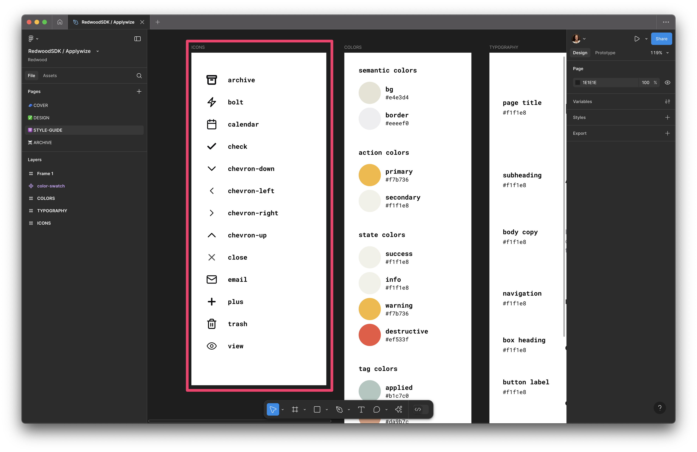

<details>
If you're exporting the icons from Figma, make sure you're grabbing the **frame** for the actual icon. All the icons are `24px` by `24px`.

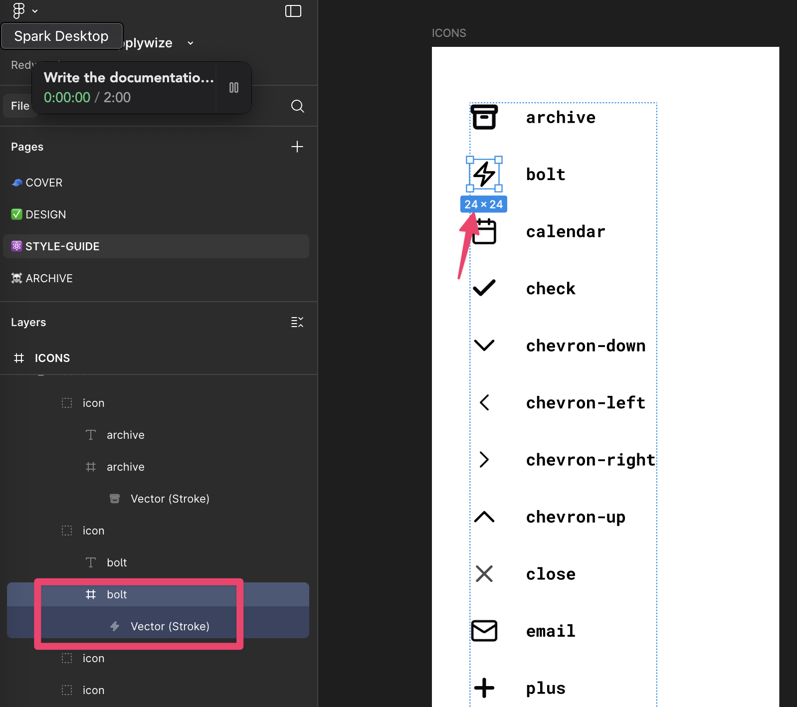
</details>

Now, let's create a new folder in the root of our project called `other` and then a sub directory inside that called `svg-icons` and place all of the icons inside the `svg-icons` directory.

`other/svg-icons/`

My favorite way to implement SVG icons is through an SVG sprite. This combines all our SVG files into a single `sprite.svg` file. We can control which icon is displayed by setting the `id` attribute on the `use` element.

You could set all of this up, manually, but let's reach for an npm package to do all the heavy lifting: [Lemon Lime SVGs](https://www.npmjs.com/package/lemon-lime-svgs).

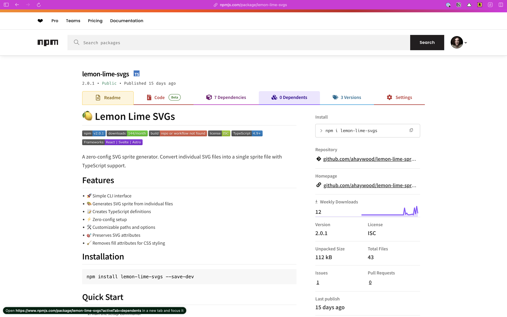

Within the Terminal run:

<Tabs groupId="package-managers">
  <TabItem value="npm" label="npm" default>
```sh
npm install --save-dev lemon-lime-svgs
```
  </TabItem>
  <TabItem value="yarn" label="yarn">
```sh
yarn add --dev lemon-lime-svgs
```
  </TabItem>
  <TabItem value="pnpm" label="pnpm">
```sh
pnpm add --save-dev lemon-lime-svgs
```
  </TabItem>
</Tabs>

Once installed, run the setup command:

```shell
npx lemon-lime-svgs setup
```

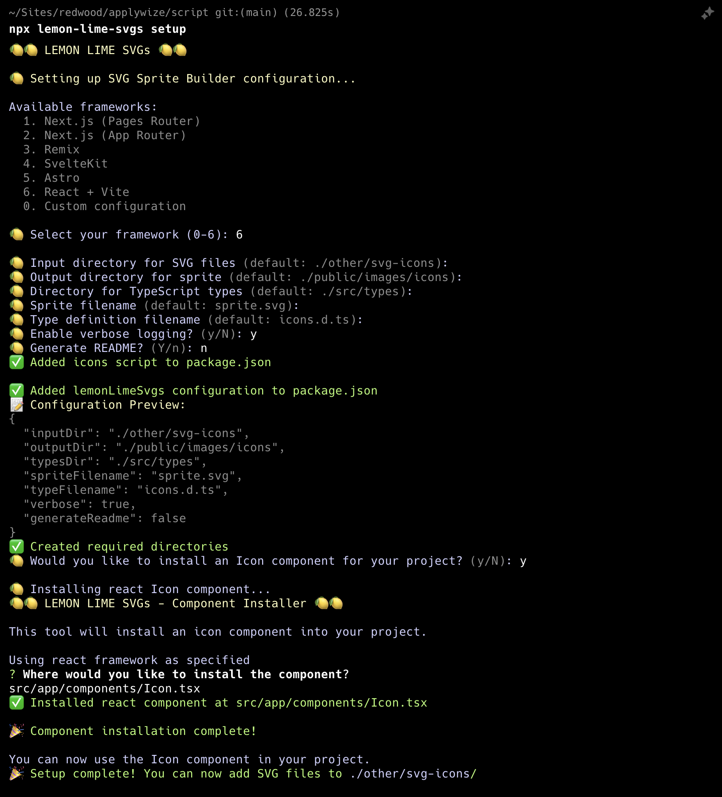

This will ask a series of questions:
- First, it will ask you what framework you're using. At its core RedwoodSDK is React and Vite = 6
- Next, it will ask you about file names and folder paths. It will make recommendations based on the framework you're using. Most of the defaults, work:
  - Input directory for SVG files: `./other/svg-icons` -- we've already set this directory up!
  - Output directory for sprite: `./public/images/icons`
  - Directory for TypeScript types: `./types` -- _this is different than the default_
  - Sprite file name: `sprite.svg`
  - Type definition file name: `icons.d.ts`
  - Enable verbose logging: The default is set to "no", but the extra feedback is helpful.
  - Set generate a README to no. The default is set to "yes". The README lives inside the same directory as your sprite and tells future developers that this file was created programmatically. It also provides a list of all the SVG icons available.
  - The last prompt asks us if we want to add an Icon component to our project. Say `y`.
  - Then, it will ask us where we want to save our component. We need to veer from the recommendation slightly: `src/app/components/Icon.tsx`
- These settings are saved inside your `package.json` file, in its own section called, `lemonLimeSvgs`:
  ```json title="package.json"
  "lemonLimeSvgs": {
    "inputDir": "./other/svg-icons",
    "outputDir": "./public/images/icons",
    "typesDir": "./types",
    "spriteFilename": "sprite.svg",
    "typeFilename": "icons.d.ts",
    "verbose": true,
    "generateReadme": false
  }
  ```
- This script will also create a new `script` command inside your `package.json` file, called `icons`.
  ```json title="package.json"
  "icons": "lemon-lime-svgs"
  ```
  Once we add the icons to our `svg-icons` folder, we can generate the sprite using this command: `pnpm run icons`.

Now, if you look inside your `src/app/components` directory, you'll see a new `Icon.tsx` file.

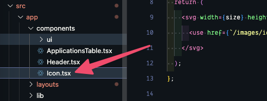

```tsx title="src/app/components/Icon.tsx"
interface Props {
  size?: number;
  id: string;
  className?: string;
}

const Icon = ({ className, size = 24, id }: Props) => {
  return (
    <svg width={size} height={size} className={className}>
      <use href={`/images/icons/sprite.svg#${id}`}></use>
    </svg>
  );
};

export default Icon;
```

<details>

This component takes
- a `className`, if you want to add additional styles to the component
- a `size` (the default is set to `24px`)
- the `id` of the icon you want to display. The `id` matches the file name of the original icon SVG file.

</details>

Before we move on, I'm going to change this to a named export to be consistent with the other components we've created:

```tsx title="src/app/components/Icon.tsx"
export const Icon = ({ className, size = 24, id }: Props) => {
```

Now, let's take all our icon SVGs and dump them inside our `other/svg-icons` directory.

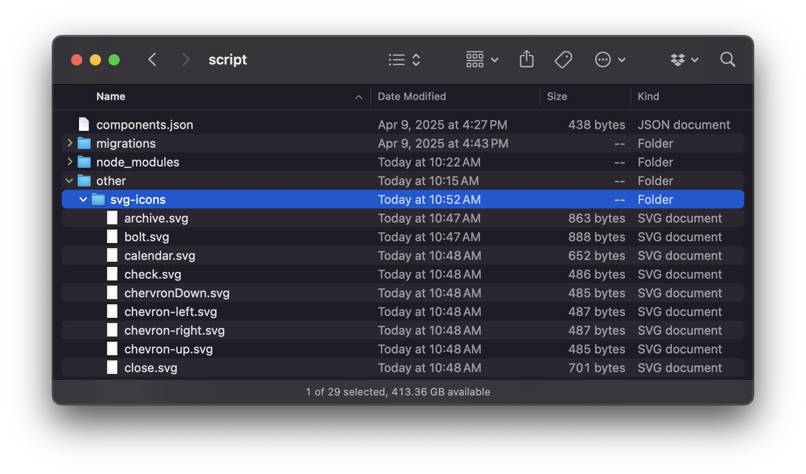

Inside the terminal, let's generate our sprite:

<Tabs groupId="package-managers">
  <TabItem value="npm" label="npm" default>
```sh
npm run icons
```
  </TabItem>
  <TabItem value="yarn" label="yarn">
```sh
yarn icons
```
  </TabItem>
  <TabItem value="pnpm" label="pnpm">
```sh
pnpm icons
```
  </TabItem>
</Tabs>

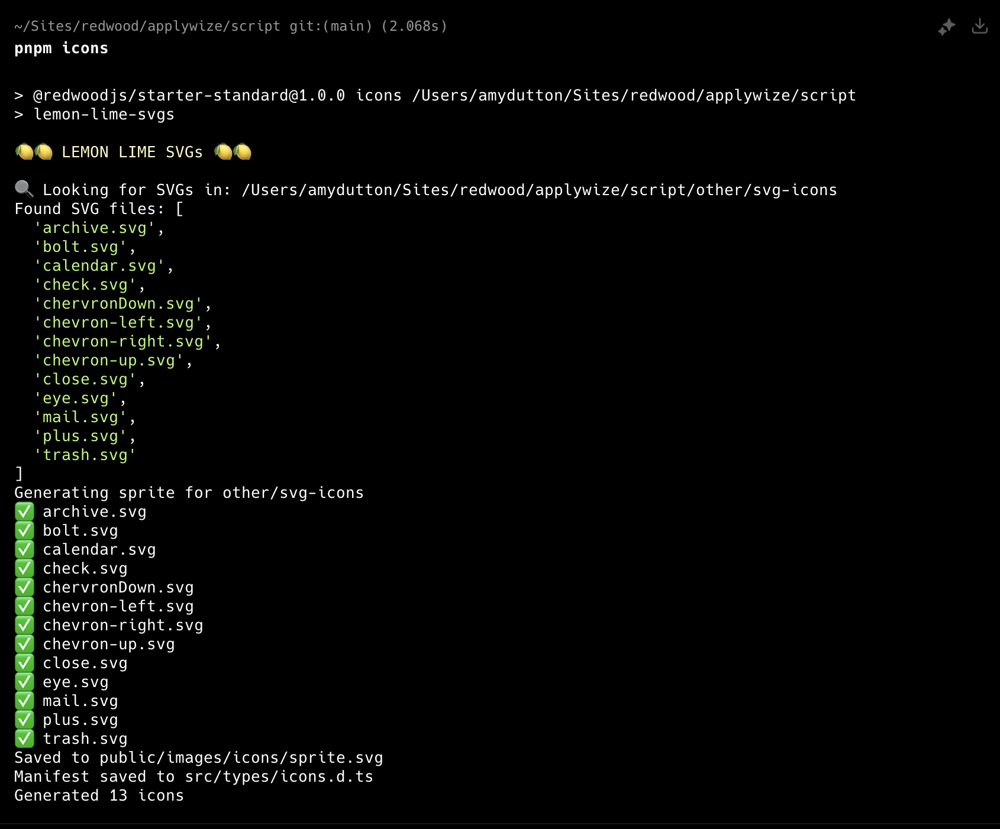

Sweet! Now we can use our `Icon` component.

Inside our `ApplicationsTable.tsx` file:

```diff title="src/app/components/ApplicationsTable.tsx"
+ import { Icon } from "./Icon"
...
  <TableCell>
    <a
      href={link("/applications/:id", { id: application.id })}
      aria-label={`View details for ${application.companyName} ${application.jobTitle}`}
    >
-      View
+      <Icon id="view" />
    </a>
  </TableCell>
```

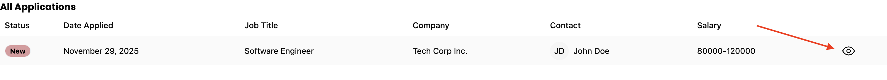

<details>
<summary>Caching</summary>

Sometimes due to caching, the icon doesn't update immediately. Try opening a browser window in incognito mode to see if that fixes the issue.
</details>

## Layout for Application Page

Similar to the auth pages, let's start by creating a layout that will wrap all of our interior pages.

### Creating an Interior Page Layout

Inside our `layouts` folder, let's create a new file called `InteriorLayout.tsx`.

`src/app/layouts/InteriorLayout.tsx`

Inside, we need to use some of the same styles that we used within our `AuthLayout.tsx` file. As a quick reminder, let's take a look at the `AuthLayout.tsx` file:

```tsx title="src/app/layouts/AuthLayout.tsx" {3-4}
const AuthLayout = ({ children }: { children: React.ReactNode }) => {
  return (
    <div className="bg-bg min-h-screen min-w-screen p-12">
      <div className="grid grid-cols-2 min-h-[calc(100vh-96px)] rounded-xl border-2 border-[#D6D5C5]">
      ...
```
<details>
- The wrapping `div` sets the background color, the minimum height and width of the page, and adds some padding.
- The child `div` sets up the grid, applies rounded corners, and adds a border.
</details>

We don't need to set up a grid, but we can abstract the styles and reuse them within our interior layout.

From the `AuthLayout.tsx` file, I'm going to copy the `bg-bg min-h-screen min-w-screen p-12` styles and create a class inside our `styles.css` file, inside the `@layer components` block:

```css title="src/styles.css" {5-7}
@layer components {
  .page-title {
    @apply text-3xl;
  }
  .page-wrapper {
    @apply bg-bg min-h-screen min-w-screen p-12;
  }
}
```

Let's head back to the `AuthLayout.tsx` file. Then, let's do something similar with the nested `div`. We don't need the `grid`, but we can grab everything else: `min-h-[calc(100vh-96px)] rounded-xl border-2 border-[#D6D5C5]`. Now, let's create new class, called `.page` right below the `.page-wrapper` class:

```css title="src/styles.css" {5-7}
...
.page-wrapper {
  @apply bg-bg min-h-screen min-w-screen p-12;
}
.page {
  @apply min-h-[calc(100vh-96px)] rounded-xl border-2 border-[#D6D5C5];
}
...
```

Now, we can update the classes within our `AuthLayout.tsx` file:

```tsx title="src/app/layouts/AuthLayout.tsx" {3-4}
const AuthLayout = ({ children }: { children: React.ReactNode }) => {
  return (
    <div className="page-wrapper">
      <div className="grid grid-cols-2 page">
      ...
```

Now, let's jump over to our `InteriorLayout.tsx` file and use these classes there as well:

```tsx title="src/app/layouts/InteriorLayout.tsx"
import { type LayoutProps } from "rwsdk/router"

export const InteriorLayout = ({ children }: LayoutProps) => {
  return (
    <div className="page-wrapper">
      <div className="page bg-white">{children}</div>
    </div>
  )
}
```

<details>
You'll notice I also added a background of white with `bg-white`
</details>

To see how this looks, let's wrap our `"/applications"` prefix within the `worker.tsx` file:

```tsx title="src/app/worker.tsx" {1,3}
layout(InteriorLayout, [
  prefix("/applications", [route("/", [isAuthenticated, List])]),
]),
```

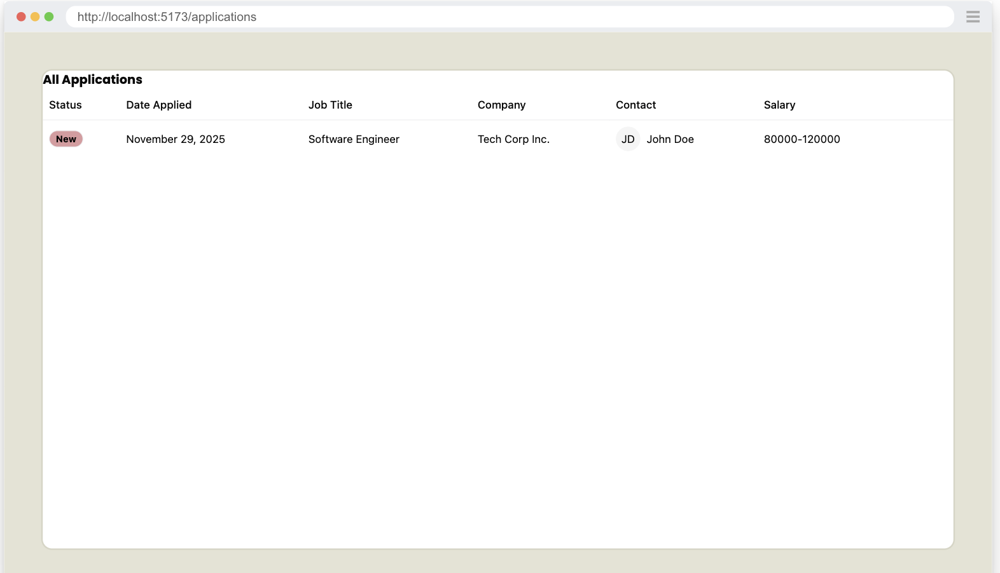

### Creating the Header

It's coming together! Across the top, let's add the logo and navigation. We may need to reuse this component in the future, so let's make it its own component. Inside the `components` folder, let's create a new file called `Header.tsx`.

```tsx title="src/app/components/Header.tsx"
export const Header = () => {
  return (
    <header>
      {/* left side */}
      <div></div>

      {/* right side */}
      <div></div>
    </header>
  )
}
```

<details>

Here are the basic building blocks we need.
- We'll use a semantic HTML element `header` to wrap everything.
- Then, we'll have a left and right side. On the left, we'll display the logo and the navigation. On the right, we'll display a link to the user's settings, the logout button, and  the user's avatar.

</details>

<figure>
  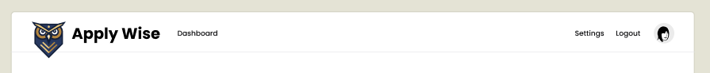
  <figcaption>Mockup from Figma</figcaption>
</figure>

#### Testing the Header's logo

The header does have some functionality, and since we want to make sure it doesn't break in the future, we'll create a test to prevent regressions and also document the functionality.

We'll also refactor our test slightly to improve the generated documentation grouping.

```ts title="tests/loggedin/applications.spec.ts" {1-2,5-10,14-21,27-31}
import { withDocCategory, withDocMeta } from "@test2doc/playwright/DocMeta"
import { screenshot } from "@test2doc/playwright/screenshots"
...
test.describe(
  withDocCategory("Applications Page", {
    label: "Applications Page",
    position: 2,
    link: {
      type: "generated-index",
      description: "The full documentation for the Applications Page.",
    },
  }),
  () => {
    test.describe(
      withDocMeta("Applications Table", {
        title: "Applications Table",
        description:
          "The Applications Table displays a list of job applications with relevant details.",
      }),
      () => {
        test("Data displayed", async ({ page }, testInfo) => {
          await test.step("On the Applications page", async () => {
            await page.goto("/applications")
          })
          ...
          await test.step("\nWhich will be displayed in the table", async () => {
            const row = table.getByRole("row", {
              name: "Software Engineer Tech Corp Inc. JD John Doe 80000-120000",
            })
            await screenshot(testInfo, row)
            const tableCellsInTestRow = row.getByRole("cell")
            ...
```

<details>

- On the root describe block, we swap out the `withDocMeta` for `withDocCategory`
  - We give it the label we want to use in the Docusaurus site, in this case it's just a repeat of **Applications Page**
  ```ts
  link: {
      type: "generated-index",
      description: "The full documentation for the Applications Page.",
    },
  ```
  - This link object tells Docusaurus to generate a page to aggregate and display summaries of all the pages inside this category.
- Wrap the old test with a describe block.
  - We give this describe block a `withDocMeta` to generate the frontmatter metadata for this page.
- We also rename the test title to **Data displayed** to help describe in the documentation what functionality we're specifically testing for.
  - We got in to the `Which will be displayed in the table` step and refactor the test to take a screenshot of the table row.

</details>

Let's add our first test for the header. We'll make a separate page for the documentation, so we'll put it in it's own describe block.

```ts title="tests/loggedin/applications.spec.ts"
test.describe(
  withDocMeta("The Internal Page Header", {
    description: "The Header that appears on logged in pages",
  }),
  () => {
    test("The Logo", async ({ page }, testInfo) => {
      await test.step("On a logged in page ", async () => {
        await page.goto("/applications")
      })

      const logo = page.getByRole(...selectors.applywizeLogo)

      await test.step("the logo is visible in the header.", async () => {
        await screenshot(testInfo, logo, {
          annotation: { text: "The ApplyWize Logo" },
        })
        await expect(logo).toBeVisible()
      })

      await test.step("Clicking the logo takes you to the Home page.", async () => {
        await logo.click()
        await expect(page.getByRole(...selectors.headingHome)).toBeVisible()
      })
    })
  },
)
```

<details>

The test is pretty simple.

- Go to a logged in page (Application Page is literally the only one we have implemented so far)

</details>

Also, let's add new selectors for our Home page header (which is the Redwood SDK placeholder page currently), and one for the logo.

```ts title="tests/util.ts"
headingHome: ["heading", { name: "Welcome to" }],
applywizeLogo: ["link", { name: "ApplyWize Logo" }],
```

<details>

- The home page selector is simply looking for a header with the test **Welcome to**. At some point in time, we'll probably want to remake this to be an Apply Wize landing page. But that'll be outside of the scope of this tutorial.
- `headerApplyWizeLogo` we know will be a `link` and we know it'll be an image too. So we'll need to give it the alt text or aria-label of **ApplyWize Logo**. (We'll be going with alt text)

</details>

#### Implementing Header's logo

Now that we have a failing test, let's add the link to the header.

```tsx title="src/app/components/Header.tsx"
{/* left side */}
<div>
  <a href={link("/")}>
    
    <span>Apply Wize</span>
  </a>
</div>
```

And you might have notice the test is still failing because our header isn't rendering. So let's add the `Header` component to the `InteriorLayout`.

```tsx title="src/app/layouts/InteriorLayout.tsx"
import { Header } from "@/app/components/Header"
...
<div className="page-wrapper">
  <div className="page bg-white">
    <Header />
    <div>{children}</div>
  </div>
</div>
```

<details>

- Add the `Header` to the page `div`.
- We also added a wrapper `div` around the children.

</details>

Now with the Header rendering, the test should be passing.

#### Testing the link to the Dashboard/Applications page

<figure>
  
  <figcaption>Mockup from Figma</figcaption>
</figure>

Looking at the next element in the header, we see a **Dashboard** link that points back to the Applications page we're currently building. This test won't be particularly meaningful since clicking the link keeps us on the same page. We'll rewrite it once we create additional logged-in pages, but for now we'll capture the current functionality.

First we'll add a selector for the Dashboard link.

```ts title="tests/util.ts"
linkDashboard: ["link", { name: "Dashboard" }],
```

Then a simple test.

```ts title="tests/loggedin/applications.spec.ts"
test("Dashboard link", async ({ page }, testInfo) => {
  await test.step("On a logged in page ", async () => {
    // TODO: change to another logged in page when available
    await page.goto("/applications")
  })

  const dashboardLink = page.getByRole(...selectors.linkDashboard)

  await test.step("the Dashboard link is visible in the header.", async () => {
    await screenshot(testInfo, dashboardLink, {
      annotation: { text: "The Dashboard Link" },
    })
    await expect(dashboardLink).toBeVisible()
  })

  await test.step("Clicking the Dashboard link takes you to the Dashboard page.", async () => {
    await dashboardLink.click()
    await expect(
      page.getByRole(...selectors.headingApplications),
    ).toBeVisible()
  })
})
```

<details>

- This test is almost exactly like our last test.
- And leave a `TODO` so we can take note to change this test page later.

</details>

#### Implement Dashboard link

So there is a possibility that we'll have more navigation links here later. But for now, we'll just be implementing the link to the **Dashboard**.

```tsx title="src/app/components/Header.tsx" {7-13}
{/* left side */}
<div>
  <a href={link("/")}>
    
    <span>Apply Wize</span>
  </a>
  <nav>
    <ul>
      <li>
        <a href={link("/applications")}>Dashboard</a>
      </li>
    </ul>
  </nav>
</div>
```

<details>

- We create a `nav` element, so that screen readers will know this section is intended for navigation.
- we use an unordered list `ul` to represents the links.

</details>

#### Test link to Settings and Account pages

<figure>
  
  <figcaption>Mockup from Figma</figcaption>
</figure>

The next section will be on the right side of the header. We'll add a **Settings** link and an avatar for the current logged in user that links to the **Account** page. Since we've established the pattern, let's implement tests for both.

```ts title="tests/util.ts"
headerSettings: ["link", { name: "Settings" }],
headingSettings: ["heading", { name: "Settings" }],
headerAccount: ["link", { name: "Account" }],
headingAccount: ["heading", { name: "Account" }],
```

```ts title="tests/public/authentication.spec.ts"
test("Settings link", async ({ page }, testInfo) => {
  await test.step("On a logged in page ", async () => {
    await page.goto("/applications")
  })

  const settingsLink = page.getByRole(...selectors.headerSettings)

  await test.step("the Settings link is visible in the header.", async () => {
    await screenshot(testInfo, settingsLink, {
      annotation: { text: "The Settings Link" },
    })
    await expect(settingsLink).toBeVisible()
  })

  await test.step("Clicking the Settings link takes you to the Settings page.", async () => {
    await settingsLink.click()
    await expect(
      page.getByRole(...selectors.headingSettings),
    ).toBeVisible()
  })
})

test("Account link", async ({ page }, testInfo) => {
  await test.step("On a logged in page ", async () => {
    await page.goto("/applications")
  })

  const accountLink = page.getByRole(...selectors.headerAccount)

  await test.step("the Account link is visible in the header.", async () => {
    await screenshot(testInfo, accountLink, {
      annotation: { text: "The Account Link" },
    })
    await expect(accountLink).toBeVisible()
  })

  await test.step("Clicking the Account link takes you to the Account page.", async () => {
    await accountLink.click()
    await expect(
      page.getByRole(...selectors.headingAccount),
    ).toBeVisible()
  })
})
```

<details>

- We add our selectors and add our tests.
- You might have noticed that our last few tests are very redundant.
  - Playwright supports standard [`forEach` loops](https://github.com/microsoft/playwright/issues/7036) to reduce duplication.
  - However, I recommend a [DAMP](https://youtube.com/shorts/HtOapu15a-4?si=eOx23jHeP2xFU0Qb) approach to testing: repeat yourself to improve readability.
    - It's easier to understand what each test does
    - Tests may diverge in the future, and separate tests are easier to extend
    - This is personal preference—using loops is also valid

</details>

#### Implementing links to Settings and Account pages

```tsx title="src/app/components/Header.tsx"
import { link } from "../shared/links"
import { Avatar, AvatarFallback } from "./ui/avatar"
...
{/* right side */}
<div>
  <nav>
    <ul>
      <li>
        <a href={link("/settings")}>Settings</a>
      </li>
      <li>
        <a href="">Logout</a>
      </li>
      <li>
        <a href={link("/account")} aria-label="Account">
          <Avatar>
            <AvatarFallback>R</AvatarFallback>
          </Avatar>
        </a>
      </li>
    </ul>
  </nav>
</div>
```

<details>

- We import the `link` function and the `Avatar` components again.
- We add a new `nav` element on the right column `div`
- We add the `li` for the anchor (`a`) tags for each link.
  - We also add a placeholder for the logout. We'll handle that in another test later.
  - Typescript will complain that the routes we are using do not exist, and they don't. So we'll add those next.
- For the Avatar we're just hardcoding it. To make this dynamic is currently out of scope of this tutorial.
  - To also target the avatar link, we need to add an aria-label, so we can target this element by role and so that screen readers will announce what this link is for.

</details>

The test is still not passing. First let's add the new routes to the `link` function.

```ts title="src/app/shared/links.ts" {3-4}
  ...
  "/legal/terms",
  "/settings",
  "/account",
])
```

Then we'll add mock routes for these pages.

```tsx title="src/worker.tsx" {3-4}
layout(InteriorLayout, [
  prefix("/applications", [route("/", [isAuthenticated, () => <List />])]),
  route("/settings", [isAuthenticated, () => <h1>Settings</h1>]),
  route("/account", [isAuthenticated, () => <h1>Account</h1>]),
]),
```

<details>

- We add the 2 new routes inside the `InteriorLayout` layout, since these will be part of the logged in experience.
- We add the 2 new routes and include the `isAuthenticated` interceptor.
- We also have the 2 routes return placeholder headers to know that the navigation worked.

</details>

Now the tests should be passing.

#### Testing logout

The last bit of functionality for the header is to add the logout. The problem with logging out, is that after we succeed in logging out it will invalidate our current logged in session.

Since tests can run in parallel, the logout test could invalidate credentials before other tests finish, causing them to fail. To prevent this, we'll create a separate project that depends on the logged-in project, ensuring logout tests only run after all authenticated tests complete.

```ts title="playwright.config.ts" {4-12}
    ...
    dependencies: ["loginSetup"],
  },
  {
    name: "logout",
    use: {
      ...devices["Desktop Chrome"],
      storageState: "playwright/.auth/user.json",
    },
    testMatch: "tests/logout.spec.ts",
    dependencies: ["logged-in"],
  },
]
```

Let's add the selector for the logout link before we write the new test suite.

```ts title="tests/util.ts"
headerLogout: ["link", { name: "Logout" }],
```

We'll make a new test suite.

```ts title="tests/logout.spec.ts"
import { test, expect } from "@playwright/test"
import { withDocCategory, withDocMeta } from "@test2doc/playwright/DocMeta"
import { screenshot } from "@test2doc/playwright/screenshots"
import { selectors } from "./util"

test.describe(
  withDocCategory("Applications Page", {
    label: "Applications Page",
    position: 2,
    link: {
      type: "generated-index",
      description: "The full documentation for the Applications Page.",
    },
  }),
  () => {
    test.describe(
      withDocMeta("How to logout", {
        description: "Steps to logout from the application",
      }),
      () => {
        test("Logout link", async ({ page }, testInfo) => {
          await test.step("On a logged in page ", async () => {
            await page.goto("/applications")
          })

          const logoutLink = page.getByRole(...selectors.headerLogout)

          await test.step("the Logout link is visible in the header.", async () => {
            await screenshot(testInfo, logoutLink, {
              annotation: { text: "The Logout Link" },
            })
            await expect(logoutLink).toBeVisible()
          })

          await test.step("Clicking the Logout link logs the user out and takes them to the login page. ", async () => {
            await logoutLink.click()
            await expect(
              page.getByRole(...selectors.headingLogin),
            ).toBeVisible()
          })

          await test.step("The user is now logged out ending their current session.", async () => {
            await page.goto("/applications")
            await expect(
              page.getByRole(...selectors.headingLogin),
            ).toBeVisible()
          })
        })
      },
    )
  },
)
```

<details>

- We use the same `withDocCategory` parameters used in the `applications.spec.ts` to group this test within the same Docusaurus Category.
- This test follows a very similar pattern to our other header link tests.
- The last step verifies that the session has ended: we try navigating to a protected route and expect the interceptor to redirect the user to the login page.

</details>

#### Implementing logout

Let's add a logout end point to our links.

```ts title="src/app/shared/links.ts" {2}
"/auth/signup",
"/auth/logout",
"/applications",
```

<details>
- This route will use our current authentication logic. So it seemed appropriate to group it with the other auth end points.
</details>

Let's update the `href` for the Logout link to use our new route.

```tsx title="src/app/components/Header.tsx"
<li>
  <a href={link("/auth/logout")}>Logout</a>
</li>
```

Let's add a logout function to invalidate the session.

```ts title="src/passkey/functions.ts"
export async function logout() {
  const { request, response } = requestInfo
  await sessions.remove(request, response.headers)
}
```

Now, we need to add a new route to call our logout function.

```ts title="src/passkey/routes.ts"
import { logout } from "./functions.js"
...
return [
  route("/login", [Login]),
  route("/signup", [Signup]),
  route("/logout", async () => {
    await logout()
    return new Response(null, {
      status: 302,
      headers: { Location: "/auth/login" },
    })
  }),
]
```

And now our new test is passing and we've finished all the functionality of the header and documented it.

#### Refactor to style the header

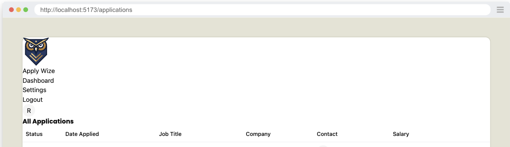

So our header does not look very attractive and does not match the mocks. So, now that we know we've completed the functionality, let's implement the styling.

```tsx title="src/app/layouts/Header.tsx"
<header className="py-5 px-10 h-20 flex justify-between items-center border-b-1 border-border mb-12">
```
<details>

- `py-5` adds `20px` of padding to the top and bottom.
- `px-10` adds `40px` of padding to the left and right.
- `h-20` sets the height to `80px`.
- `flex` and `justify-between` are used to align the items inside the header, putting as much space between each of the elements as possible.
- `items-center` centers the items vertically.
- `border-border` and `border-b-1` adds a border to the bottom of the header with a color of `border` (defined as a custom color in the `@theme` block of our `styles.css` file).
- `mb-12` adds `48px` of margin to the bottom of the header.
</details>

We set the left and right padding to `40px` with `px-10`. We'll use this throughout our entire application. In order to maintain consistency, let's define it as a custom utility. This will make it easy to reference (and change, if necessary).

```css title="src/styles.css" {8}
...
  --color-tag-applied: #b1c7c0;
  --color-tag-interview: #da9b7c;
  --color-tag-new: #db9a9f;
  --color-tag-rejected: #e4e3d4;
  --color-tag-offer: #aae198;

  --spacing-page-side: 40px;
}
```

Update the `header` element to use the new utility, replacing `px-10` with `px-page-side`:

```tsx title="src/app/layouts/Header.tsx"
<header className="py-5 px-page-side h-20 flex justify-between items-center border-b-1 border-border mb-12">
```

<details>

Inside the `@theme` block, below our color definitions, we'll add a new variable called `--spacing-page-side` and set it to `40px`. Now, we can use this variable with margin or padding: `mx-page-side` or `px-page-side` respectively.

</details>

On the left side `div`, we want the logo and the Dashboard link to align vertically:

```tsx title="src/app/layouts/Header.tsx" {2}
{/* left side */}
<div className="flex items-center gap-8">
```

<details>

- We're using `flex` and `items-center` to align the items vertically.
- `gap-8` adds `32px` of space between the logo and the Dashboard link.

</details>

On the home page link, we want the logo and the "Apply Wize" text to align vertically too:

```tsx title="src/app/components/Header.tsx" {3}
<a
  href={link("/")}
  className="flex items-center gap-3 font-display font-bold text-3xl"
>
```
<details>

- `flex`, `items-center`, and `gap-3` aligns the logo and text and puts `12px` of space between them.
- `font-display` and `font-bold` are used to style the text, applying the font Poppins and making the text bold.
- `text-3xl` sets the font size to `30px`

</details>

If you look at the logo, it overlaps with the bottom border of the header.

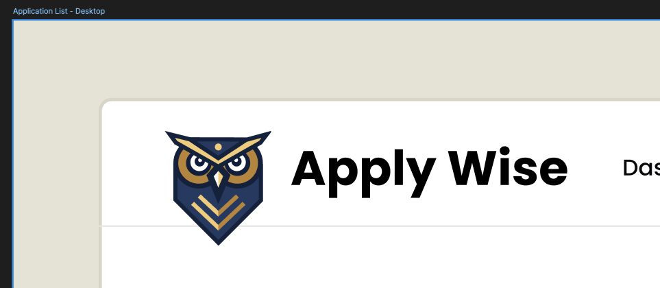

In order to achieve this, we also need to add some styles to the `img` tag:

```tsx title="src/app/components/Header.tsx"

```

<details>

- `pt-5` adds `20px` of padding to the top.
- `-mb-3` removes `12px` of margin from the bottom and will make the bottom of the header shift up.

</details>

For the right side `ul`, we need to add a few styles to position the links properly:

```tsx title="src/app/components/Header.tsx" {3}
{/* right side */}
<nav>
  <ul className="flex items-center gap-7">
  ...
```
<details>

- Similar to techniques we've used before, we're using `flex` and `items-center` to align the items vertically.
- `gap-7` adds `28px` of space between each of the links.
</details>

To style our nav links, I want these styles to apply to both the left and the right side. So, let's stick these inside the `styles.css` file, inside the `@layer base` block:

```css title="src/styles.css" {19-21}
@layer base {
  * {
    @apply border-border outline-ring/50;
  }
  body {
    @apply bg-background text-foreground;
  }

  h1,
  h2,
  h3 {
    @apply font-display font-bold;
  }

  input[type="text"] {
    @apply border-border border-1 rounded-md px-3 h-9 block w-full mb-2 text-base;
  }

  nav {
    @apply font-display font-medium text-sm;
  }
}
```

That should be it! (for the header at least)

<details>
<summary>Finished `Header.tsx` component</summary>

```tsx title="src/app/components/Header.tsx"
import { link } from "../shared/links"
import { Avatar, AvatarFallback } from "./ui/avatar"

export const Header = () => {
  return (
    <header className="py-5 px-page-side h-20 flex justify-between items-center border-b-1 border-border mb-12">
      {/* left side */}
      <div className="flex items-center gap-8">
        <a
          href={link("/")}
          className="flex items-center gap-3 font-display font-bold text-3xl"
        >
          
          <span>Apply Wize</span>
        </a>
        <nav>
          <ul className="flex items-center gap-7">
            <li>
              <a href={link("/applications")}>Dashboard</a>
            </li>
          </ul>
        </nav>
      </div>

      {/* right side */}
      <div>
        <nav>
          <ul className="flex items-center gap-7">
            <li>
              <a href={link("/settings")}>Settings</a>
            </li>
            <li>
              <a href={link("/auth/logout")}>Logout</a>
            </li>
            <li>
              <a href={link("/account")} aria-label="Account">
                <Avatar>
                  <AvatarFallback>R</AvatarFallback>
                </Avatar>
              </a>
            </li>
          </ul>
        </nav>
      </div>
    </header>
  )
}
```
</details>

### Page Heading

We have our placeholder `h1` but let's now implement a Heading for the page to match the mocks better.

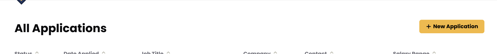

Taking a look at the [figma mocks](https://www.figma.com/design/nqBPIIfe0MO4W8zOfW4oae/RedwoodSDK---Applywize?node-id=1-13&t=cisck9AgepC9Sx7N-4), we see that the heading of the page, consists of a heading with the text **All Applications** (already implemented but not styled) and a button that will add a new Application.

Normally, I'd say we should test the **New Application** button, but we'll be adding the New Application page in a future tutorial, so we'll just add the button in as a placeholder for now and test it when we implement that page.

```tsx title="src/app/pages/applications/List.tsx"
import { Button } from "@/app/components/ui/button";
...
return (
  <div>
    <div>
      <h1 id="all-applications">All Applications</h1>
      <div>
        <Button asChild>
          <a href="#">New Application</a>
        </Button>
      </div>
    </div>
    <ApplicationsTable applications={applications} />
  </div>
)
```

<details>

- Above our application content, We wrap the `h1` heading for "All Applications" with a `div`.
- Then, we have another `div` that wraps a `<Button>` component. Inside, I have a link that points to the new application page. The `Button` component is coming from shadcn/ui. It should already be part of your project, but you'll need to import it at the top of your file.
- Since we're not triggering an event, we're _linking_ to another page, we have an `a` tag inside the `Button` component. Eventually, this will reference the `applications/new` route, but since we haven't set that up yet, in the meantime we can use a `#` placeholder instead.
  - Admittedly, it does look a little strange having an `a` tag inside a `Button` component.
  - In shadcn/ui, the ⁠Button component is designed to be flexible, allowing you to create buttons that can also act as links. This is a common pattern in modern web design where you want a consistent visual style for interactive elements.
  - `asChild` is a special prop in shadcn/ui that tells the Button component to render its child element as-is. It allows you to keep the Button's styling while using a different underlying HTML element (like an ⁠`<a>` tag).
  - [For reference: shadcn/ui Button Component Documentation](https://ui.shadcn.com/docs/components/button)

</details>

#### Styling the heading

Now, let's add some styling:

```tsx title="src/app/pages/applications/List.tsx"
<div className="px-page-side">
  <div className="flex justify-between items-center mb-5">
    <h1 className="page-title">All Applications</h1>
```

<details>

- On the wrapping `div`, use the custom `px-page-side` that adds `20px` of padding to the left and right for all the content on the page.
- Align the heading and the button with `flex`, `justify-between`, and `items-center`.
  - Also giving it `mb-5` to give a bit of room between the heading and the table.
- Use our `page-title` class to style the heading.

</details>

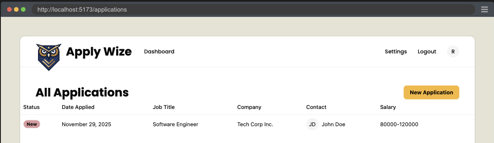

### Page Footer

Last thing we need to implement is the Footer. Taking a look at the [figma mocks](https://www.figma.com/design/nqBPIIfe0MO4W8zOfW4oae/RedwoodSDK---Applywize?node-id=1-13&t=cisck9AgepC9Sx7N-4) we do have one last bit of functionality left to implement. That being an **Archive** button.

<figure>
  
  <figcaption>Mockup from Figma</figcaption>
</figure>

#### Testing Archive Button

Let's add another Application that has been archived.

```ts title="src/scripts/seed.ts" {4-18}
    ...
    archived: 0,
  },
  {
    id: crypto.randomUUID(),
    userId: TESTPASSKEY.userId,
    statusId: 3,
    companyId,
    jobTitle: "Frontend Developer",
    salaryMin: "70000",
    salaryMax: "110000",
    jobDescription: "Create stunning user interfaces.",
    postingUrl: "https://example.com/jobs/456",
    dateApplied: timeAdded,
    createdAt: timeAdded,
    updatedAt: timeAdded,
    archived: 1,
  },
])
```

<details>

- We add a new `Application` to the `Applications` table.
  - We want different text, so we can assert that this Application is different.
  - Most notable difference is setting `archived` to `1`.

</details>

Don't forget to run the `seed` script and confirm that the new data has added to the DB.

Now let's make a test asserting that we can toggle between Applications that are archived.

First let's populate our selectors.

```ts title="tests/util.ts"
buttonArchiveApplication: ["link", { name: "Archive" }],
buttonActiveApplication: ["link", { name: "Active" }],
applicationRowActive: [
  "row",
  { name: "Software Engineer Tech Corp Inc. JD John Doe 80000-120000" },
],
applicationRowArchived: [
  "row",
  { name: "Frontend Developer Tech Corp Inc. JD John Doe 70000-110000" },
],
```

<details>

- We add the selector for the **Archive** button, which will be an anchor tag styled as a button.
- We also add a selector for the **Active** button which the Archive button will toggle between.
- We add selectors for both the active and archived application rows.
- We'll use these to assert the correct row displays while the other is hidden.

</details>

Then we write our test.

```ts title="tests/loggedin/applications.spec.ts"
test.describe("Filtering Applications", () => {
  test("Display Archived Applications", async ({ page }, testInfo) => {
    await test.step("On the Applications page ", async () => {
      await page.goto("/applications")
    })

    const archiveButton = page.getByRole(
      ...selectors.buttonArchiveApplication,
    )

    await test.step("the **Archive** button is visible. ", async () => {
      await screenshot(testInfo, archiveButton, {
        annotation: { text: "The Archive Application Button" },
      })
      await expect(archiveButton).toBeVisible()
    })

    await test.step("Clicking the button shows archived applications in the table.", async () => {
      const activeRow = page.getByRole(...selectors.applicationRowActive)
      await expect(
        activeRow
      ).toBeVisible()
      await archiveButton.click()
      const archivedRow = page.getByRole(
        ...selectors.applicationRowArchived,
      )
      await screenshot(testInfo, archivedRow, {
        annotation: { text: "An Archived Application Row" },
      })
      await expect(archivedRow).toBeVisible()
    })

    await test.step("To switch back to active applications, click the 'Active' button.", async () => {
      const activeButton = page.getByRole(
        ...selectors.buttonActiveApplication,
      )
      await screenshot(testInfo, activeButton, {
        annotation: { text: "Click to show active applications" },
      })
      await expect(activeButton).toBeVisible()
      await activeButton.click()

      await expect(
        page.getByRole(...selectors.applicationRowActive),
      ).toBeVisible()
    })
  })
})
```

<details>

- We add a new describe block to describe the functionality at a high level, which is a type of filtering.
- We then have our test describe the specific functionality we're documenting and testing for. In this case displaying archived applications.
- We create steps, documenting our functionality.
  - We need to be on the Applications Page
  - We expect there to be an Archive Button
  - When clicking the archive button, we expect to see applications that have been archived.
  - We also want to see how to undo this, so we'll make sure that the **Active** button is visible and test that it does display active applications when clicked.

</details>

#### Implementing Archive Button

```tsx title="src/app/pages/applications/List.tsx" {1-2,11,18-31}
import { Icon } from "@/app/components/Icon"
import { link } from "@/app/shared/links"
...
<div className="flex justify-between items-center mb-5">
  <h1 className="page-title" id="all-applications">
    All Applications
  </h1>
  <div>
    <Button asChild>
      <a href="#">
        <Icon id="plus" />
        New Application
      </a>
    </Button>
  </div>
</div>
<div className="mb-8">
  <ApplicationsTable applications={applications} />
</div>
<div className="flex justify-between items-center mb-10">
  <Button asChild variant="secondary">
    <a href={`${link("/applications")}?status=archived`}>
      <Icon id="archive" />
      Archive
    </a>
  </Button>
  <Button asChild>
    <a href="#">
      <Icon id="plus" />
      New Application
    </a>
  </Button>
</div>
...
```

<details>

- We import the `link` function and `Icon` component at the top.
- We are also taking the time to wrap the `ApplicationsTable` in a div with the class of `mb-8` to give a bit of breathing room between the table and footer.
- The classes `flex justify-between items-center mb-10` on the wrapping `div` position our buttons in the footer.
- On the **Archive** button, I've added a `variant="secondary"` which will make the button a light beige.
- I've also included the `archive` icon next to the archive text: `<Icon id="archive" />`
- The `link` function does not support adding url parameters, so we'll need to handle this ourselves with a string template.
- We add the "New Application" button as a place holder for later, add the `plus` icon: `<Icon id="plus" />`
  - Also, let's add this plus icon to the first "New Applications" button while we're at it.

</details>

Now our test should fail at the point where it cannot find the archived row element. To make this pass, we'll need to change how our DB query works.

```tsx title="src/app/pages/applications/List.tsx"
import { RequestInfo } from "rwsdk/worker"

export const List = async ({ request }: RequestInfo) => {
  const url = new URL(request.url)
  const status = url.searchParams.get("status")

  const applications = await applicationsQuery
    .where("applications.archived", "=", status === "archived" ? 1 : 0)
    .execute()
```

<details>

- We add Props to receive the current request (RedwoodSDK SSR components receive this automatically).
- We parse the URL to access query parameters.
- We add a `where` clause to filter by the archived column's value.

</details>

Now more of the test should pass. The last part we need to implement is swapping back to the active applications.

```tsx title="src/app/pages/applications/List.tsx"
<Button asChild variant="secondary">
  {status === "archived" ?
    <a href={link("/applications")}>
      <Icon id="archive" />
      Active
    </a>
  : <a href={`${link("/applications")}?status=archived`}>
      <Icon id="archive" />
      Archive
    </a>
  }
</Button>
```

<details>

- If the `status` is equal to `archived` then the link should go to `/applications` and the button label should be `Active`.
- Otherwise, display the `Archive` button, with the query parameter `?status=archived`

</details>

Now the test is passing. And we're done!

## Code on GitHub
You can find the final code for this step on [GitHub](https://github.com/dethstrobe/applywize2/tree/tutorial-5)

## Read more

- [Playwright: Basic: shared account in all tests](https://playwright.dev/docs/auth#basic-shared-account-in-all-tests)
- [Kysely: Nested array](https://kysely.dev/docs/examples/select/nested-array)

## What's Coming Next?

Now that we have the Applications Page displaying all the Applications.

Next Lesson we'll:

- Create a new Application Form
- Add a new Application to the DB