import Tabs from '@theme/Tabs';
import TabItem from '@theme/TabItem';

## Building the New Application experience

Now, that we have a way of displaying our applications, we need a way of adding new ones.

First, let's take a look at our final design in [Figma](https://www.figma.com/design/nqBPIIfe0MO4W8zOfW4oae/RedwoodSDK---Applywize?node-id=403-1167&t=pUogDpHV7TtRb8wL-4), and what we're building.

<figure>

  
  <figcaption>Mockup from Figma</figcaption>
</figure>

## New Applications Route

[In the last section](/docs/tutorial-5/), we set up the "New Applications" button, but we haven't created the page or made it link anywhere. So let's create a new test suite for our New Applications page.

### Testing that the New Application page can be navigated to

Let's add 2 new selectors we're going to use to assert on.

```ts title="tests/util.ts"
buttonNewApplication: ["link", { name: "New Application" }],
headerNewApplication: ["heading", { name: "Add an Application" }],
```

<details>

- **buttonNewApplication** - We will click this and see if we navigate to our new page. We call it a _button_ but it is actually a `link`.
- **New Application Header** - We'll use this to assert that we're on the "New Applications" page.

</details>

Next we'll add a new test file at `tests/loggedin/new-applications.spec.ts`

``` ts title="tests/loggedin/new-applications.spec.ts"
import { test, expect } from "@playwright/test"
import { withDocCategory, withDocMeta } from "@test2doc/playwright/DocMeta"
import { screenshot } from "@test2doc/playwright/screenshots"
import { selectors } from "../util"

test.describe(
  withDocCategory("New Applications Page", {
    label: "New Applications Page",
    position: 2,
    link: {
      type: "generated-index",
      description: "The documentation for the New Applications Page.",
    },
  }),
  () => {
    test.describe(
      withDocMeta("New Application", {
        description:
          "Guide to add a new job application using the New Application form.",
      }),
      () => {
        test("How to add a new Job Application", async ({ page }, testInfo) => {
          await test.step("When on the Applications page, ", async () => {
            await page.goto("/applications")
          })

          await test.step("click the New Application button.", async () => {
            const newAppButton = page.getByRole(
              ...selectors.buttonNewApplication,
            )
            await screenshot(testInfo, newAppButton, {
              annotation: { text: "New Application button" },
            })
            await newAppButton.click()
          })

          await test.step(" This will navigate to the New Application page.", async () => {
            await expect(
              page.getByRole(...selectors.headerNewApplication),
            ).toBeVisible()
          })
        })
      },
    )
  },
)
```

<details>

- We once again add the `withDocCategory` with the same meta data from `applications.spec.ts`. This way the new page will be grouped in the same Docusaurus Category.
- We use `withDocMeta` to create a new page for the documentation
- Our test case will walk users through how to create a new application.
  - We start on the applications page
  - We click the New Applications button
  - Now we're expecting to be on the New Applications page.
- This is a good minimal starting test case that we'll expand to add each part of the flow to add a new Job Application to our DB.

</details>

If we run our tests, they will obviously fail. But not for the reason we'd expect.

```sh
Error: locator.scrollIntoViewIfNeeded: Error: strict mode violation: getByRole('link', { name: 'New Application' }) resolved to 2 elements:
```

Turns out it's finding 2 link elements with the name of "New Application".

There are 2 ways we can resolve this:

- Just grab the first element. Both elements have the same functionality, so there is no accessibility concerns.
- Hide one of the links from the accessibility tree with `aria-hidden` and `tabIndex={-1}`.

Both approaches are valid. Since both links perform the same action, having duplicate accessible elements isn't an accessibility issue.

To create a more complete documentation, we're going to leave both links in the accessibility tree, also make an assertion that both links point to the correct url, and we'll also take a screenshot to highlight both elements and document that they both do the same thing.

So with that in mind, let's update the test we just wrote a bit.

```tsx title="tests/loggedin/new-applications.spec.ts"
await test.step("click one of the New Application buttons.", async () => {
  const newAppButton = await page
    .getByRole(...selectors.buttonNewApplication)
    .all()
  await screenshot(
    testInfo,
    newAppButton.map((btn) => ({ target: btn })),
    {
      annotation: {
        text: "New Application button",
        position: "left",
      },
    },
  )

  expect(newAppButton.length).toEqual(2)
  for (const btn of newAppButton) {
    await expect(btn).toHaveAttribute("href", "/applications/new")
  }
  await newAppButton.at(0)?.click()
})
```

<details>

- We use the `all` method on the Locator to get all matching elements (this returns a Promise, so we need to `await` it).
- The screenshot function can take an array of `MultiLocatorScreenshot` objects to highlight multiple elements. See [Highlight multiple elements](/docs/user-guide/screenshots/#highlight-multiple-elements) for details.
- We map our Locators to the format required by the screenshot function.
- We assert that we're expecting 2 buttons to be found.
- We loop over the buttons with a `for..of` loop and assert each has the correct `href`, ensuring they behave identically.
- Finally, we click the first button to continue the test flow.

</details>

Now the test is failing because the navigation is broken. Which is how we want this test to fail for now.

```sh
Error: expect(locator).toBeVisible() failed

Locator: getByRole('heading', { name: 'Add an Application' })
Expected: visible
Timeout: 5000ms
Error: element(s) not found
```

### Implementing the New Application Page

Let's add the new route to our `link` function.

```ts title="src/app/shared/links.ts" {2}
"/applications",
"/applications/new",
"/applications/:id",
```

<details>

To keep the application routes grouped together, I put the new route between `"/applications"` and `"/applications/:id"`.

</details>

Let's attempt to [DRY](https://en.wikipedia.org/wiki/Don%27t_repeat_yourself) up our code a bit, and move the New Applications button to it's own component. Since it will only be used in this component, we'll just put it at the bottom of this file.

```tsx title="src/app/pages/applications/List.tsx"
const NewApplicationButton = () => (
  <Button asChild>
    <a href={link("/applications/new")}>
      <Icon id="plus" />
      New Application
    </a>
  </Button>
)
```

<details>

Whether to move this component into its own file is debatable.

**Argument for separation:** One component per file follows the [single responsibility principle](https://en.wikipedia.org/wiki/Single-responsibility_principle).

**Argument against:** Since this component is only used here, it's not worth the boilerplate. It's arguably still part of the List component's responsibility since they're tightly coupled.

Refactoring into a separate file later would be trivial if needed, so we'll follow [YAGNI](https://en.wikipedia.org/wiki/You_aren%27t_gonna_need_it) for now.

</details>

Now we replace the old buttons with our new component.

```tsx title="src/app/pages/applications/List.tsx" {6,24}
<div className="px-page-side">
  <div className="flex justify-between items-center mb-5">
    <h1 className="page-title" id="all-applications">
      All Applications
    </h1>
    <NewApplicationButton />
  </div>
  <div className="mb-8">
    <ApplicationsTable applications={applications} />
  </div>
  <div className="flex justify-between items-center mb-10">
    <Button asChild variant="secondary">
      {status === "archived" ?
        <a href={link("/applications")}>
          <Icon id="archive" />
          Active
        </a>
      : <a href={`${link("/applications")}?status=archived`}>
          <Icon id="archive" />
          Archive
        </a>
      }
    </Button>
    <NewApplicationButton />
  </div>
</div>
```

<details>

- I removed the wrapper `div` around the first button, as it wasn't styled and thus wasn't doing anything.

</details>

Let's add a new placeholder component to render this page.

``` tsx title="src/app/pages/applications/New.tsx"
export const New = () => {
  return (
    <div>
      <h1>Add an Application</h1>
    </div>
  )
}
```

Lastly, we just need to add this component to the `worker.ts`.

```ts title="src/worker.tsx" {5}
import { New } from "./app/pages/applications/New"
...
prefix("/applications", [
  route("/", [isAuthenticated, List]),
  route("/new", [isAuthenticated, New]),
]),
```

With that, the test is passing.

## Adding Breadcrumbs

If we take a look at the mocks, we'll see that there are **breadcrumbs** under the ApplyWize logo.

<figure>

  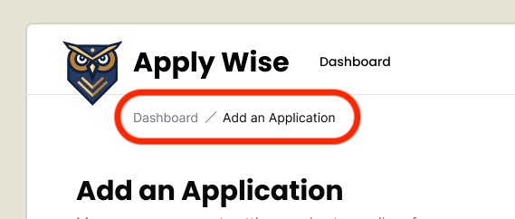
  <figcaption>Breadcrumb Mockup from Figma</figcaption>
</figure>

**Breadcrumbs** are a common navigation pattern to help give a visual indication of where a user is inside of an application.

### Testing the breadcrumbs

This bit of functionality is outside of the "How to add a new Job Application" test case. So we'll make a new test case to document this functionality.

We'll add a new selector to get the breadcrumb navigation.

```ts title="tests/util.ts"
navBreadcrumb: ["navigation", { name: "breadcrumb" }],
```

So this will select the breadcrumb element.

If you notice, there are now 2 links in the Figma mocks that have the text link, "Dashboard". One in the header and another in the breadcrumb. Like stated in the last test we wrote, it's ok if there are elements with the same text as long as they have the same behavior.

Now to distinguish between the two links, we can distinguish them by the nav element. Screen readers announce nav elements, so we can target the breadcrumb element first. Then target the "Dashboard" link within that element.

```ts title="tests/loggedin/new-applications.spec.ts"
test("Breadcrumb Navigation", async ({ page }, testInfo) => {
  await test.step("When on the New Application page, ", async () => {
    await page.goto("/applications/new")
  })

  await test.step("click the Breadcrumb link.", async () => {
    const breadcrumbs: Locator = page.getByRole(
      ...selectors.navBreadcrumb,
    )
    const backToApplicationsLink = breadcrumbs.getByRole(
      ...selectors.linkDashboard,
    )

    await screenshot(testInfo, [
      {
        target: breadcrumbs,
        options: {
          annotation: {
            text: "Breadcrumb Navigation",
            position: "below",
            highlightFillStyle: "rgba(0, 0, 0, 0)",
          },
        },
      },
      {
        target: backToApplicationsLink,
        options: { annotation: { text: "Back to Dashboard link" } },
      },
    ])
    await backToApplicationsLink.click()
  })

  await test.step(" This will navigate back to the Applications Dashboard page.", async () => {
    await expect(
      page.getByRole(...selectors.headingApplications),
    ).toBeVisible()
  })
})
```

<details>

- We navigate directly to `/applications/new` to test this specific feature in isolation.
- We use chained `getByRole` calls to distinguish between the two "Dashboard" links (one in header, one in breadcrumb).
- The screenshot highlights both the breadcrumb container and the specific link to document the navigation pattern.
  - In order to make the elements easier to see, we set the `highlightFillStyle` to `rgba(0, 0, 0, 0)` to make it transparent.

</details>

### Implementing the breadcrumbs

Now that we have a failing test. Let's implement our breadcrumb element.

Conveniently, shadcn/ui has a `Breadcrumb` component that we can use. We've already imported this component into our project, we just need to use it.

Just like the Applications Table, let's start by copying and pasting the implementation code directly from [shadcn/ui's documentation](https://ui.shadcn.com/docs/components/breadcrumb) into our component:

```tsx title="src/app/pages/applications/New.tsx" {1-8,13-27}
import {
  Breadcrumb,
  BreadcrumbList,
  BreadcrumbItem,
  BreadcrumbLink,
  BreadcrumbPage,
  BreadcrumbSeparator,
} from "@/app/components/ui/breadcrumb"

export const New = () => {
  return (
    <div>
      <Breadcrumb>
        <BreadcrumbList>
          <BreadcrumbItem>
            <BreadcrumbLink href="/">Home</BreadcrumbLink>
          </BreadcrumbItem>
          <BreadcrumbSeparator />
          <BreadcrumbItem>
            <BreadcrumbLink href="/components">Components</BreadcrumbLink>
          </BreadcrumbItem>
          <BreadcrumbSeparator />
          <BreadcrumbItem>
            <BreadcrumbPage>Breadcrumb</BreadcrumbPage>
          </BreadcrumbItem>
        </BreadcrumbList>
      </Breadcrumb>
      <h1>Add an Application</h1>
    </div>
  )
}
```

Now, let's start modifying the code to fit our needs.

```tsx title="src/app/pages/applications/New.tsx"
import { link } from "@/app/shared/links"
...
<div>
  <Breadcrumb>
    <BreadcrumbList>
      <BreadcrumbItem>
        <BreadcrumbLink href={link("/applications")}>
          Dashboard
        </BreadcrumbLink>
      </BreadcrumbItem>
      <BreadcrumbSeparator />
      <BreadcrumbItem>
        <BreadcrumbPage>Add an Application</BreadcrumbPage>
      </BreadcrumbItem>
    </BreadcrumbList>
  </Breadcrumb>
  <h1>Add an Application</h1>
</div>
```

<details>

- We import the `link` function at the top of the file.
- We adjusted the first `BreadcrumbLink` to point to the Applications dashboard page.
- We can get rid of the `<BreadcrumbSeparator />`
- We can get rid of the second `<BreadcrumbItem>`.
- For the third `<BreadcrumbItem>`, I've changed the label from `Breadcrumb` to `Add an Application`.

</details>

And with that, the test will be passing. The Breadcrumb component already creates a `nav` element with the aria-label "breadcrumb" for us.

### Refactor to style the breadcrumb elements a bit

While we're at it. Let's see about styling this to look a bit more like the Figma mocks.

```tsx title="src/app/pages/applications/New.tsx"
export const New = () => {
  return (
    <>
      <div className="mb-12 -mt-7 pl-20">
        <Breadcrumb>
          <BreadcrumbList>
            <BreadcrumbItem>
              <BreadcrumbLink href={link("/applications")}>
                Dashboard
              </BreadcrumbLink>
            </BreadcrumbItem>
            <BreadcrumbSeparator />
            <BreadcrumbItem>
              <BreadcrumbPage>Add an Application</BreadcrumbPage>
            </BreadcrumbItem>
          </BreadcrumbList>
        </Breadcrumb>
      </div>
      <h1>Add an Application</h1>
    </>
  )
}
```

<details>

- We add the classes of `mb-12 -mt-7 pl-20` to the wrapper `div`
  - `mb-12` added `48px` of margin on the bottom
  - `-mt-7` puts a negative margin of `28px` on the top to move the breadcrumbs up.
  - `pl-20` added `80px` of padding on the left.
- We also moved the `h1` outside of the breadcrumbs wrapper and gave the header its own wrapper.
- We wrap everything in a `fragment` component.

</details>

Next up, let's improve our page heading to match the [mocks](https://www.figma.com/design/nqBPIIfe0MO4W8zOfW4oae/RedwoodSDK---Applywize?node-id=403-1167&t=pUogDpHV7TtRb8wL-4):

```tsx title="src/app/pages/applications/New.tsx"
<div className="pb-6 mb-8 border-b-1 border-border">
  <h1 className="page-title">Add an Application</h1>
  <p className="page-description">Manage your account settings and set e-mail preferences.</p>
</div>
```

<details>

- On the `div`, we have a few classes that adjusts the spacing and adds a border to the bottom.
  - `pb-6` adds `24px` of padding on the bottom.
  - `mb-8` adds `32px` of margin on the bottom.
  - `border-b-1 border-border` adds a border to the bottom of the `div`.
- We a class called `page-title` to our `h1`
- Then, we have a `p` of text that says "Manage your account settings and set e-mail preferences." I went ahead and added a class of `page-description` so that we can use this on multiple pages.

</details>

We need to add a class definition for `page-description` to the `@layer components` section of our `styles.css` file.

```css title="src/app/styles.css" {6-8}
@layer components {
  .page-title {
    @apply text-3xl;
  }

  .page-description {
    @apply text-zinc-500;
  }
  ...
```

<details>
This sets the default color of our `page-description` to a light gray, using class provided by Tailwind.
</details>

Taking a look at the page it looks like we're missing a bit of padding.

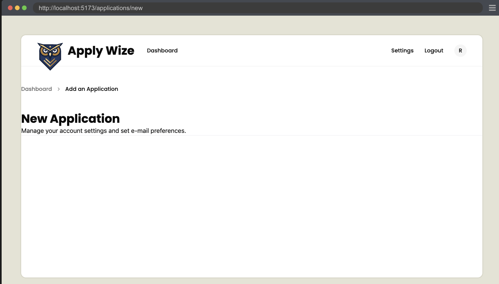

Since, both the Dashboard and New Applications, will need a bit of padding to give a bit of space for the content, let's move that to the `InteriorLayout` component.

```tsx title="src/app/layouts/InteriorLayout.tsx"
<div className="px-page-side">{children}</div>
```

This fixes the New Applications page.

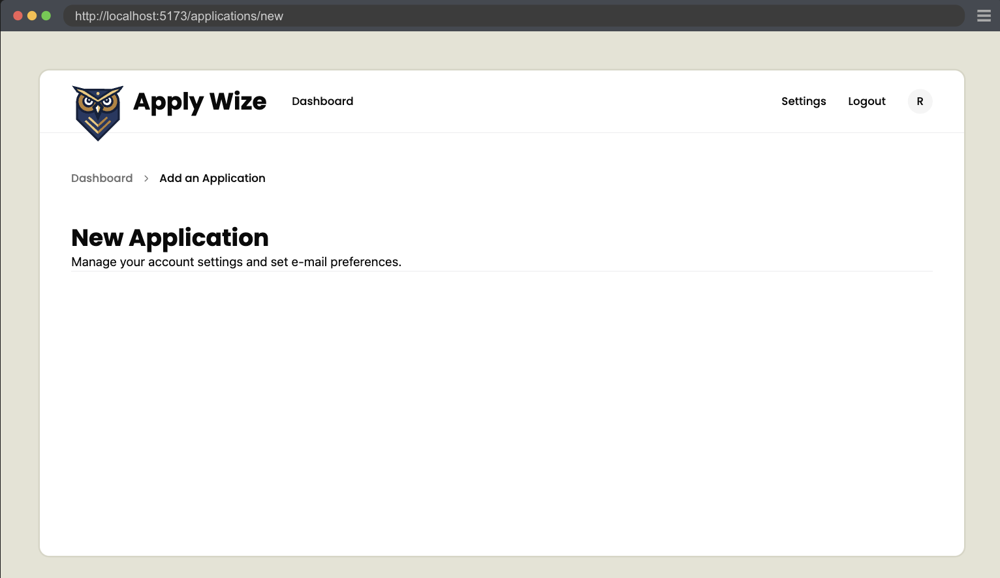

But we ended up applying the padding twice to the Dashboard.

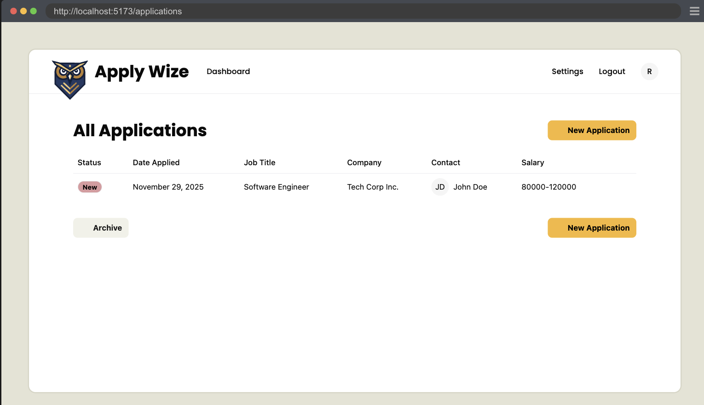

So let's refactor and remove the wrapper `div` and replace it with the `fragment` component.

```tsx title="src/app/pages/applications/List.tsx"
<>
  <div className="flex justify-between items-center mb-5">
    ...
  </div>
</>
```

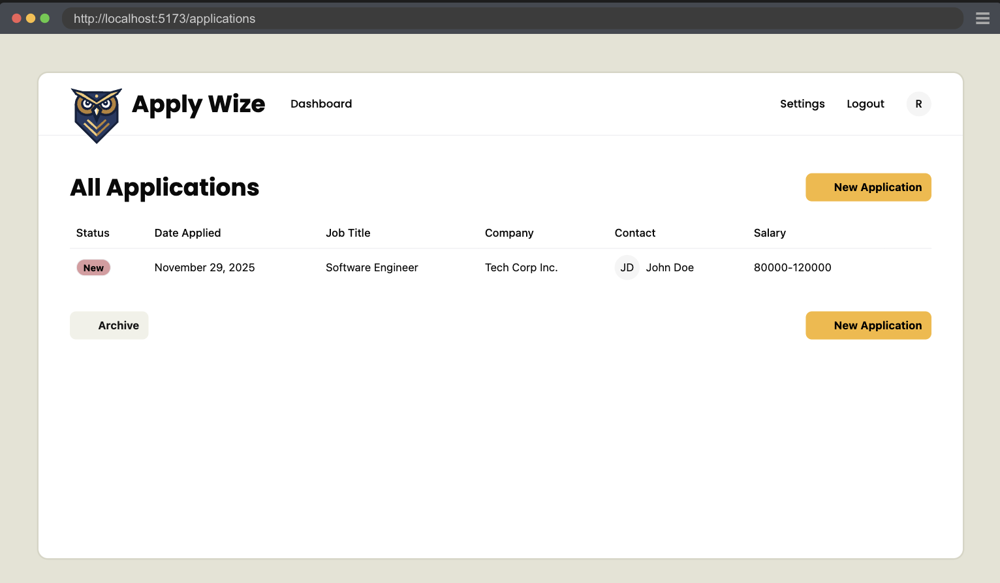

## Adding the New Application Form Left Side

Moving down the page, we have a two column form.

<figure>

  
  <figcaption>Mockup from Figma</figcaption>
</figure>

### Testing the Company Information

Going back to our "How to add a new Job Application" test case, let's extend it by testing the left column's inputs.

First we'll add selectors.

```ts title="tests/util.ts"
groupCompanyInfo: ["group", { name: "Company Information" }],
inputCompanyName: ["textbox", { name: "Company Name" }],
inputJobTitle: ["textbox", { name: "Job Title" }],
inputJobDescription: ["textbox", { name: "Job Description / Requirements" }],
inputSalaryMin: ["textbox", { name: "Min" }],
inputSalaryMax: ["textbox", { name: "Max" }],
inputApplicationUrl: ["textbox", { name: "Application URL" }],
```

Let's use our new selectors to test our inputs.

```ts title="tests/loggedin/new-applications.spec.ts"
await test.step(`### Fill out the New Application form.

On the left side we have:
- **Company Name**: The company you want to track.
- **Job Title**: The position you applied for.
- **Job Description / Requirements**: Key details about the job.
- **Salary Range**: The minimum and maximum salary for the position.
- **Application URL**: Link to the job posting or application page.
  `, async () => {
  const leftFormGroup = page.getByRole(...selectors.groupCompanyInfo)
  await screenshot(testInfo, leftFormGroup)
  const companyName = page.getByRole(...selectors.inputCompanyName)
  const jobTitle = page.getByRole(...selectors.inputJobTitle)
  const jobDescription = page.getByRole(
    ...selectors.inputJobDescription,
  )
  const salaryMin = page.getByRole(...selectors.inputSalaryMin)
  const salaryMax = page.getByRole(...selectors.inputSalaryMax)
  const applicationUrl = page.getByRole(
    ...selectors.inputApplicationUrl,
  )

  await companyName.fill("Big Tech Co.")
  await jobTitle.fill("Software Engineer")
  await jobDescription.fill(
    "Develop and maintain web applications. Collaborate with cross-functional teams to define, design, and ship new features.",
  )
  await salaryMin.fill("80000")
  await salaryMax.fill("120000")
  await applicationUrl.fill("https://techcorp.com/careers/12345")
})
```

<details>

- We use markdown to make the documentation more descriptive.
- We take a screenshot of the fieldset element to document the left column for the form.
- Since inputs are relatively simple, we'll test them all in one step. These inputs are self-explanatory.
  - **Note**: The right side is more complex and requires more steps to assert and document. We'll handle that in a future step.
- We could add more granular assertions, but Playwright's debugging will clearly indicate any issues with filling out the form.
  - The important assertions will come after we submit the form.

</details>

### Implementing the Company Information

Let's start by making a new ApplicationForm. Normally we'd follow _YAGNI_ and skip creating a separate component, but since we can see slightly into the future, we know we'll need a form to edit the Application data. Since we know this functionality is coming, it's not a very big lift to create the component now.

We'll first start with stubbing out the component.

```tsx title="src/app/components/ApplicationForm.tsx"
export const ApplicationForm = () => {
  return <div>Application Form Component</div>
}
```

Before we start building out our Application Form, let's add it to the `New.tsx` file.

```tsx title="src/app/pages/applications/New.tsx" {1,4}
import { link } from "@/app/shared/links"
...
  </div>
  <ApplicationForm />
</>
```

Let's start by setting up our 2 columns and form.

```tsx title="src/app/components/ApplicationForm.tsx"
export const ApplicationForm = () => {
  return (
    <form className="grid grid-cols-2 gap-x-50 mb-20">
      {/* left side */}
      <div></div>
      {/* right side */}
      <div></div>
      {/* footer with submission button */}
      <div className="col-span-2"></div>
    </form>
  )
}
```

<details>

- On our `form`, I added a class of `grid` and gave it two columns, `grid-cols-2`. I also put a `200px` gap between the two columns with `gap-x-50`.
- We added `80px` of margin on the bottom with `mb-20`.
- Inside the form we add 3 `div`s.
  - The first 2 will be the left and right columns.
  - We add one more `div` and tell it to be full width with `col-span-2`. This `div` will hold the button to submit the form.

</details>

Now let's build out the left side of our form.

```tsx
{/* left side */}
<fieldset>
  <legend id="company-info-heading">Company Information</legend>
  <div>
    <label htmlFor="company">Company Name</label>
    <input
      type="text"
      id="company"
      name="company"
      aria-describedby="company-hint"
    />
    <p id="company-hint">What company caught your eye?</p>
  </div>

  <div>
    <label htmlFor="jobTitle">Job Title</label>
    <input
      type="text"
      id="jobTitle"
      name="jobTitle"
      aria-describedby="jobTitle-hint"
    />
    <p id="jobTitle-hint">What&apos;s the job you&apos;re after?</p>
  </div>

  <div>
    <label htmlFor="jobDescription">Job Description / Requirements</label>
    <textarea
      id="jobDescription"
      name="jobDescription"
      aria-describedby="jobDescription-hint"
    />
    <p id="jobDescription-hint">What are they looking for?</p>
  </div>

  <div>
    <div id="salary-range">Salary Range</div>
    <div>
      <div>
        <label id="salary-min" htmlFor="salaryMin">Min</label>
        <input
          type="text"
          id="salaryMin"
          name="salaryMin"
          aria-labelledby="salary-min salary-range"
          aria-describedby="salary-hint"
        />
      </div>
      <div>
        <label id="salary-max" htmlFor="salaryMax">Max</label>
        <input
          type="text"
          id="salaryMax"
          name="salaryMax"
          aria-labelledby="salary-max salary-range"
          aria-describedby="salary-hint"
        />
      </div>
    </div>
    <p id="salary-hint">What does the pay look like?</p>
  </div>

  <div>
    <label htmlFor="url">Application URL</label>
    <input type="url" id="url" name="url" aria-describedby="url-hint" />
    <p id="url-hint">Where can we apply?</p>
  </div>
</fieldset>
```

<details>

- We replace the `div` for a `fieldset` element, which semantically groups related form inputs. [Read more on MDN](https://developer.mozilla.org/en-US/docs/Web/HTML/Reference/Elements/fieldset).
- The `legend` element acts as a caption for the `fieldset`, announcing to screen readers what this section contains.
- We follow a consistent pattern for each field:
  - A wrapper `div`
  - A `label` element using the `htmlFor` attribute to associate with the input
  - An `input` element (or `textarea` for long-form text)
    - Most inputs use `type="text"`
    - The description field uses a `textarea` for multi-line text
    - The Application URL uses `type="url"` for basic URL validation
    - Each input has an `id` for the `label` to reference
    - The `aria-describedby` attribute references a hint `<p>` below for additional context
  - A `<p>` tag with an `id` that provides helpful context
- The salary field requires two inputs (min/max) but follows a similar pattern
  - We use the `aria-labelledby` attribute to concat the fake label with the input label. This gives us an accessible label that combines the two elements making "Max Salary Range" and "Min Salary Range."
  - A multiple `aria-describedby` can be referenced by single element, like in our case.
- We changed some of the text from the Figma mocks, as the text in the mocks are just placeholder text.

</details>

Now the test is passing.

### Refactor the Company Information

So let's do a little refactor to add some styling.

```tsx title="src/app/components/ApplicationForm.tsx" {2,5,13,18,26,31,38,43-46,55,65,70,73}
<fieldset>
  <legend className="text-2xl font-bold" id="company-info-heading">
    Company Information
  </legend>
  <div className="field">
    <label htmlFor="company">Company Name</label>
    <input
      type="text"
      id="company"
      name="company"
      aria-describedby="company-hint"
    />
    <p className="input-description" id="company-hint">
      What company caught your eye?
    </p>
  </div>

  <div className="field">
    <label htmlFor="jobTitle">Job Title</label>
    <input
      type="text"
      id="jobTitle"
      name="jobTitle"
      aria-describedby="jobTitle-hint"
    />
    <p className="input-description" id="jobTitle-hint">
      What&apos;s the job you&apos;re after?
    </p>
  </div>

  <div className="field">
    <label htmlFor="jobDescription">Job Description / Requirements</label>
    <textarea
      id="jobDescription"
      name="jobDescription"
      aria-describedby="jobDescription-hint"
    />
    <p className="input-description" id="jobDescription-hint">
      What are they looking for?
    </p>
  </div>

  <div className="field">
    <div className="label" id="salary-range">Salary Range</div>
    <div>
      <div>
        <label id="salary-min" htmlFor="salaryMin">Min</label>
        <input
          type="text"
          id="salaryMin"
          name="salaryMin"
          aria-labelledby="salary-min salary-range"
          aria-describedby="salary-hint"
        />
      </div>
      <div>
        <label id="salary-max" htmlFor="salaryMax">Max</label>
        <input
          type="text"
          id="salaryMax"
          name="salaryMax"
          aria-labelledby="salary-max salary-range"
          aria-describedby="salary-hint"
        />
      </div>
    </div>
    <p id="salary-hint">What does the pay look like?</p>
  </div>

  <div className="field">
    <label htmlFor="url">Application URL</label>
    <input type="url" id="url" name="url" aria-describedby="url-hint" />
    <p className="input-description" id="url-hint">
      Where can we apply?
    </p>
  </div>
</fieldset>
```

<details>

- `text-2xl font-bold` makes our `<legend>` look like a `h2`.
- We give all our wrapper `<div>` elements the class of `field`
- The Salary Range section is a bit more complex and we'll handle that in a moment.
  - At least we added the class of `label` to the fake "Salary Range" label.

</details>

For our `.field` class, let's stick this inside the `@layer components`.

```css title="src/app/styles.css"
@layer components {
  .field {
    @apply pt-8;
  }
```

<details>

- `pt-8` adds `32px` of padding to the top.

</details>

For our `label` and `.label` classes, let's stick this inside `@layer base`:

```css title="src/app/styles.css"
label,
.label {
  @apply text-sm font-medium block;
}
```

<details>

- `text-sm` sets the font size to `14px`.
- `font-medium` sets the font weight to `medium`.
- `block` sets the display to `block`.

</details>

We already have an `input` definition within our `@layer base`, so we can just add to it. But, it specifically targets the `text` type, so let's generalize it to all input types, as well as, `textarea`.

```css title="src/app/styles.css" {1-4}
textarea,
input {
  @apply border-border border-1 rounded-md px-3 h-9 block w-full mb-2 text-base;
}
```

Let's add a styling for our `textarea`. These need to be listed below our `input` definition, so that we can override some of our `input` styles:

```css title="src/app/styles.css"
textarea {
  @apply h-20 py-3;
}
```

<details>

- `h-20` gives the textarea a height of `5rems` / `80px`.
- `py-3` adds `12px` of padding on the top and bottom.

</details>

#### Min and Max Salary Range

For the minimum and maximum salary fields, we need to add a few custom styles to get the "Min" and "Max" labels to appear inside the input.

<figure>

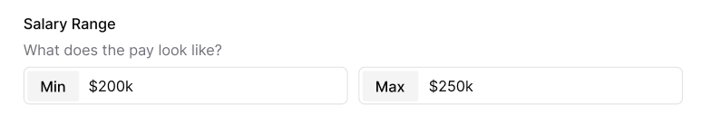
<figcaption>
  Salary min and max fields within Figma.
</figcaption>
</figure>

Let's revisit the JSX and see what our existing code looks like:

```tsx title="src/app/components/ApplicationForm.tsx"
<div className="field">
  <div className="label" id="salary-range">Salary Range</div>
  <div>
    <div>
      <label id="salary-min" htmlFor="salaryMin">Min</label>
      <input
        type="text"
        id="salaryMin"
        name="salaryMin"
        aria-labelledby="salary-min salary-range"
        aria-describedby="salary-hint"
      />
    </div>
    <div>
      <label id="salary-max" htmlFor="salaryMax">Max</label>
      <input
        type="text"
        id="salaryMax"
        name="salaryMax"
        aria-labelledby="salary-max salary-range"
        aria-describedby="salary-hint"
      />
    </div>
  </div>
  <p id="salary-hint">What does the pay look like?</p>
</div>
```

We can add a class of `flex gap-4` to the `<div>` wrapping our inputs to get the minimum and maximum inputs aligned side by side:

```tsx title="src/app/components/ApplicationForm.tsx" {1}
<div className="flex gap-4">
  <div>
    <label id="salary-min" htmlFor="salaryMin">Min</label>
    <input
      type="text"
      id="salaryMin"
      name="salaryMin"
      aria-labelledby="salary-min salary-range"
      aria-describedby="salary-hint"
    />
  </div>
  <div>
    <label id="salary-max" htmlFor="salaryMax">Max</label>
    <input
      type="text"
      id="salaryMax"
      name="salaryMax"
      aria-labelledby="salary-max salary-range"
      aria-describedby="salary-hint"
    />
  </div>
</div>
```

For the `div` wrapping the label and input, let's add a class of `flex-1 label-inside`. This will make the minimum and maximum inputs an equal width. Then, the `label-inside` is a custom class that we can target within our CSS.

```tsx title="src/app/components/ApplicationForm.tsx" {2,14}
<div className="flex gap-4">
  <div className="flex-1 label-inside">
    <label id="salary-min" htmlFor="salaryMin">
      Min
    </label>
    <input
      type="text"
      id="salaryMin"
      name="salaryMin"
      aria-labelledby="salary-min salary-range"
      aria-describedby="salary-hint"
    />
  </div>
  <div className="flex-1 label-inside">
    <label id="salary-max" htmlFor="salaryMax">
      Max
    </label>
    <input
      type="text"
      id="salaryMax"
      name="salaryMax"
      aria-labelledby="salary-max salary-range"
      aria-describedby="salary-hint"
    />
  </div>
</div>
```

In our `styles.css` file, inside the `@layer components` section, let's add the following:

```css title="src/app/styles.css" {6-8}
@layer components {
  .field {
    @apply pt-8;
  }

  .label-inside {
    @apply relative flex border border-border outline-1 outline-white rounded-md mb-2 h-9;
  }
```

<details>

- We can set the position to `relative` and the display to `flex`.
- `border border-border` will give the `div` a border that has a color of `border`, defined in the `@theme` section.
- `outline-1 outline-white` adds a white outline to the `div`. By using both the `border` and `outline` classes, we can create the appearance of a double border.
- `rounded-md` adds a border radius of `4px`.
- `mb-2` adds `8px` of margin on the bottom.
- `h-9` gives the `div` a height of `36px`.

</details>

We can use CSS nesting to target the `label` and `input` within the `label-inside` class.

```css title="src/app/styles.css" {4-10}
.label-inside {
  @apply relative flex border outline-1 outline-white border-border rounded-md mb-2 h-9;

  label {
    @apply text-sm font-medium px-3 bg-[#f4f4f5] rounded-sm center my-1 ml-1;
  }

  input[type="text"] {
    @apply border-none flex-1 relative top-1 outline-none focus:border-none focus:outline-none h-auto;
  }
}
```

<details>

- On the `label` tag:
  - We've made the text small (`14px`) with `text-sm` and a medium font weight (`font-medium`).
  - `bg-[#f4f4f5]` makes the background a light gray.
  - `rounded-sm` adds a border radius of `4px`.
  - `center` is our custom utility that centers the text inside the `label`.
  - `my-1` adds `4px` of margin on the top and bottom and `ml-1` adds `4px` of margin on the left.
- For the `input` tag:
  - `border-none` removes the border.
  - `flex-1` makes the input take the full width of the container.
  - `relative top-1` moves the input up `2px`, `relative` to its current position.
  - `outline-none focus:border-none focus:outline-none` removes the border and outline.

</details>

The border around the wrapping `div` makes it look like the label is inside the input. But, really, it's just a `div` wrapping a `label` and an `input`.

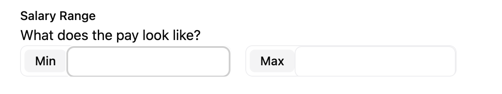

In order to maintain the illusion, we also have to remove the default border and outline from the `input`. We also need to change the border color on the `div` when the `input` inside is focused.

```css title="src/app/styles.css" {12-14}
.label-inside {
  @apply relative flex border border-border outline-1 outline-white rounded-md mb-2 h-9;

  label {
    @apply text-sm font-medium px-3 bg-[#f4f4f5] rounded-sm center my-1 ml-1;
  }

  input[type="text"] {
    @apply border-none flex-1 relative top-1 outline-none focus:border-none focus:outline-none h-auto;
  }

  &:has(input[type="text"]:focus) {
    @apply outline-2 outline-[#919191];
  }
}
```

<details>

- The `&` allows us to "attach" the `:has` pseudo-class to the `label-inside` class. This is the same as writing `.label-inside:has(input[type="text"]:focus)`.
- The `:has` pseudo-class says when the input inside is focused, apply an `outline` of `2px` and a color of `#919191`.

</details>

Now, let's style the `input-description`. We can add this to the `@layer components` section:

```css title="src/app/styles.css" {1-3}
.input-description {
  @apply text-sm text-zinc-500 mb-2;
}
```

<details>

- `text-sm` sets the font size to `14px`.
- `text-zinc-500` sets the color to gray. This is a Tailwind color class.
- `mb-2` adds `8px` of margin on the bottom.

</details>

Awesome, this completes the left side of our form.

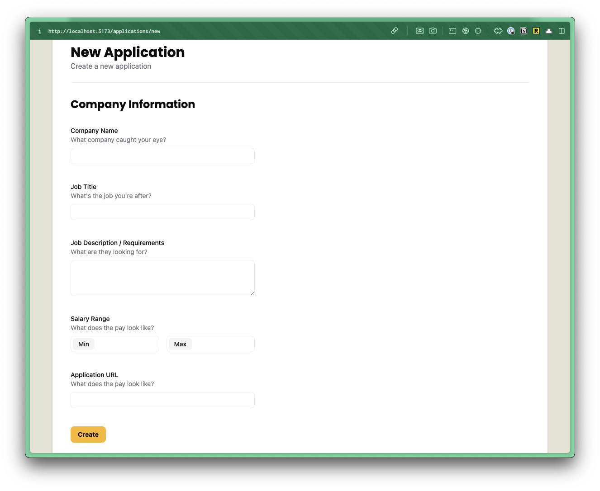

Now, let's write the code for the right side.

## Adding the New Application Form Right Side

Looking at the design in Figma, we have 3 boxes.
1. Application submission date, with a date picker
2. Application status, with a dropdown
3. Contacts list

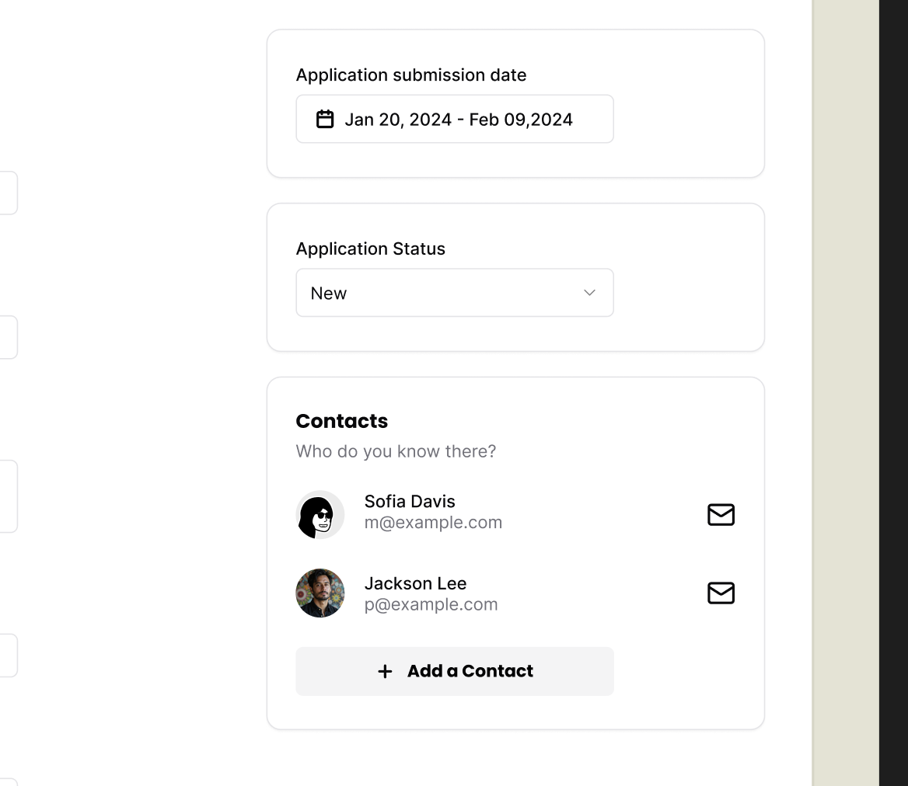

For most of these pieces, we can use existing shadcn/ui components.

### Application Date Picker

#### Testing the Date Picker dialog

We'll start by adding selectors for some of our elements.

```ts title="tests/util.ts"
buttonDatePicker: ["button", { name: "Pick a date" }],
dialog: ["dialog"],
```

<details>

- We add a selector for the the date picker button to open the calendar dialog.
- For the dialog selector, we use a generic `"dialog"` selector since only one dialog is typically open at a time, and shadcn/ui doesn't provide an accessible name for it anyway.

</details>

Next we'll extend our test to see if we can open the date picker.

```ts title="tests/loggedin/new-applications.spec.ts"
const dateButton = page.getByRole(...selectors.buttonDatePicker)
await test.step(`
  Right side of the form includes:

  - **Date Applied**: When you submitted your application.
  - **Status**: Current status of your application (e.g., Applied, Interviewing).
  - **Contacts**: People you are in touch with regarding the application.

  #### Date Applied
  `, async () => {
  await screenshot(testInfo, dateButton)
})

await test.step("Click the date button to open the date picker.", async () => {
  await dateButton.click()
  const datePicker = page.getByRole(...selectors.dialog)
  await expect(datePicker).toBeVisible()
  await screenshot(testInfo, datePicker)
})
```

<details>

- We document the right side's purpose in the first step.
- We get the date picker button outside the steps since it's used in two places:
  - One step documents the button with a screenshot.
  - Another step tests clicking it and verifying the dialog appears.

</details>

Alright, this should be enough to start to get us in trouble. Our test is failing.

#### Creating a Date Picker.

We also need the date picker component, but it wasn't available from shadcn/ui, probably due to dependencies.

Instead, we'll copy it from the [shadcn docs](https://ui.shadcn.com/docs/components/date-picker). We'll grab the demo example, the `DatePickerDemo`. It's built on top of the `<Popover />` and `<Calendar />` components -- and we've already installed those in [part 2](/docs/tutorial-2#shadcnui-ui-components).

Within the `src/app/components/ui` folder, create a new file called `datepicker.tsx`.

Even though, we're creating the `datepicker.tsx` file manually, the code still originates from shadcn/ui, so it will still live in the components/ui folder.

Add the following code to the datepicker.tsx file:

```tsx title="src/app/components/ui/datepicker.tsx"
"use client"

import * as React from "react"
import { format } from "date-fns"
import { Calendar as CalendarIcon } from "lucide-react"

import { Button } from "@/app/components/ui/button"
import { Calendar } from "@/app/components/ui/calendar"
import {
  Popover,
  PopoverContent,
  PopoverTrigger,
} from "@/app/components/ui/popover"

export function DatePicker() {
  const [date, setDate] = React.useState<Date>()

  return (
    <Popover>
      <PopoverTrigger asChild>
        <Button
          variant="outline"
          data-empty={!date}
          className="data-[empty=true]:text-muted-foreground w-[280px] justify-start text-left font-normal"
        >
          <CalendarIcon />
          {date ? format(date, "PPP") : <span>Pick a date</span>}
        </Button>
      </PopoverTrigger>
      <PopoverContent className="w-auto p-0">
        <Calendar mode="single" selected={date} onSelect={setDate} />
      </PopoverContent>
    </Popover>
  )
}
```

<details>

- I removed the `import { cn } from "@/lib/utils"` because we're not using the `cn` function currently.
- I already updated the import paths to point at our local shadcn directory at `@/app/component/ui`.
- We also renamed the component from `DatePickerDemo` to `DatePicker`.

</details>

Now that we have our date picker let's use it.

```tsx title="src/app/components/ApplicationForm.tsx" {1,5-8}
import { DatePicker } from "./ui/datepicker"
...
{/* right side */}
<div>
  <div>
    <label>Application submission date</label>
    <DatePicker />
  </div>
</div>
```

With that the test is now passing.

#### How to find how to select a button

Now to figure out how to select a day, we can open up Chrome and [inspect the element](https://youtu.be/Th-nv-SCj4Q?si=7Xsuv6c-2Jb20nJD&t=458) in the accessibility tree. But let's also take a look doing this in Playwright.

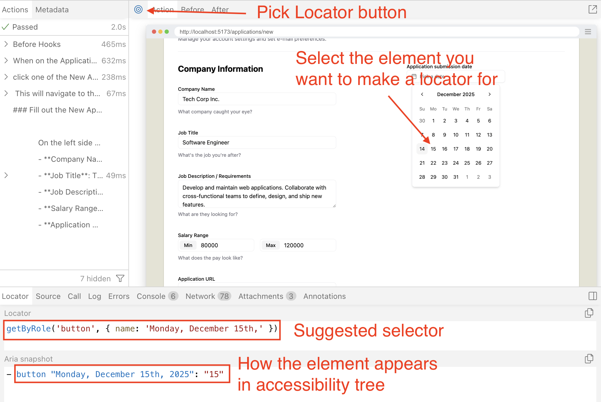

- Run the "How to add a new Job Application" test.
- Click the **Pick Locator** button at the top left.
- Select one of the days
- See the Locator that Playwright suggests to use
- Also note that Aria snapshot to help understand how the element renders in the accessibility tree.

#### How to deal with the slow march of time?

So you might notice that the date picker always opens and defaults to today selected. This is good UX, no problem with that, but in a world where we want consistent and predictable tests, always needing to deal with the forward march of time will make testing a bit unreliable.

There are 2 solutions to this problem.

1. Calculate the date inside of the test to select one of the calender buttons.
2. Set the time to a static value so that we can always be confident in our assertions.

Tests should be deterministic and the more programming and calculations we put inside of tests the greater the odds we may accidentally introduce bugs. And needing to debug a test defeats the purpose of testing our production code and reduces confident in testing.

So, we're going with option 2. And luckily Playwright has an API that allows us to control time, [the Clock API](https://playwright.dev/docs/clock).

#### Testing selecting a date from the picker

Let's set the time in our setup step for this test.

```ts title="tests/loggedin/new-applications.spec.ts" {2}
await test.step("When on the Applications page, ", async () => {
  await page.clock.setFixedTime(new Date("2025-12-14T10:00:00"))
  await page.goto("/applications")
})
```

<details>

- Feel free to set the day to anything you like. I've set it to the day I'm working on this tutorial.

</details>

Next let's add the selector for one of the date buttons.

```ts title="tests/util.ts"
buttonDate: ["button", { name: "Monday, December 15th," }],
```

<details>

- I set the day to what Playwright locator had suggested when we inspected it earlier.

</details>

```ts title="tests/loggedin/new-applications.spec.ts"
await test.step("Then click a date to select from the date picker.", async () => {
  const dateToSelect = page.getByRole(...selectors.buttonDate)
  await screenshot(testInfo, dateToSelect)
  await dateToSelect.click()
})

await test.step(`

  Then to dismiss the date picker:
  - Press **Escape** key.
  - Click outside the date picker.`, async () => {
  await page.keyboard.press("Escape")
  await expect(page.getByRole(...selectors.dialog)).toBeHidden()
})
```

<details>

- We test being able to select one of the dates.
- And then we test that we are able to dismiss the date picker.

</details>

Test is passing.

#### Refactor associate the label with the button

Let's do one small refactor. We'll add the `for` attribute to the label, and an `id` to the button.

We'll also move the label into the component since it's so tightly associated with the date picker. But to make sure it's not so tightly coupled to our New Application form, let's pass the text as a prop.

```diff title="src/app/components/ApplicationForm.tsx"
<div>
-  <label>Application submission date</label>
-  <DatePicker />
+  <DatePicker label="Application submission date"/>
</div>
```

Now we'll add our new props and associate our label to the button.

```tsx title="src/app/components/ui/datepicker.tsx" {1-3,5,9-12,16,29}
interface DatePickerProps {
  label: string
}

export function DatePicker({ label }: DatePickerProps) {
  const [date, setDate] = React.useState<Date>()

  return (
    <>
      <label htmlFor="date-picker">
        {label}
      </label>
      <Popover>
        <PopoverTrigger asChild>
          <Button
            id="date-picker"
            variant="outline"
            data-empty={!date}
            className="data-[empty=true]:text-muted-foreground w-[280px] justify-start text-left font-normal"
          >
            <CalendarIcon />
            {date ? format(date, "PPP") : <span>Pick a date</span>}
          </Button>
        </PopoverTrigger>
        <PopoverContent className="w-auto p-0">
          <Calendar mode="single" selected={date} onSelect={setDate} />
        </PopoverContent>
      </Popover>
    </>
  )
}
```

<details>

- We add an `interface` for our `props` to pass to this component.
- We add the `<label>` tag and give it an `htmlFor` attribute.
- We also add the `id` attribute to the `<button>` so we can target it from the `<label>`.
- We wrap everything in a fragment component since functions can't return multiple JSX elements.

</details>

This way, if the user clicks the label, it'll open the date picker.

And if you run the tests you'll see they are **failing**!

This is because we just changed the accessible name of the button. It now uses the label. This is actually an accessibility problem because we just removed screen readers ability to read the value of the date that is selected.

We technically do not need to associate the label with the button. But I think it's cool, so we're going to keep it and add the `aria-labelledby` attribute solve the new accessibility problem we just created.

```tsx title="src/app/components/ui/datepicker.tsx" {2,9,15-17}
<>
  <label id="date-picker-label" htmlFor="date-picker">
    {label}
  </label>
  <Popover>
    <PopoverTrigger asChild>
      <Button
        id="date-picker"
        aria-labelledby="date-picker-label date-picker-value"
        variant="outline"
        data-empty={!date}
        className="data-[empty=true]:text-muted-foreground w-[280px] justify-start text-left font-normal"
      >
        <CalendarIcon />
        <span id="date-picker-value">
          {date ? format(date, "PPP") : "Pick a date"}
        </span>
      </Button>
    </PopoverTrigger>
    <PopoverContent className="w-auto p-0">
      <Calendar mode="single" selected={date} onSelect={setDate} />
    </PopoverContent>
  </Popover>
</>
```

<details>

- We an `id` to our `<label>` tag.
- We add `aria-labelledby` on the `<Button>` to combine the label and button text for screen readers (e.g., "Application submission date Pick a date").
- We wrap the button content in a `<span>` with an `id` so `aria-labelledby` can reference it.

</details>

And now the tests are passing again.

We could add a test to verify clicking the label opens the date picker. However, since we've already tested that the button itself works, and label-for associations are a well-established HTML pattern, this feels like testing implementation details rather than user behavior. For now, I'd consider this a nice-to-have rather than a requirement. If this interaction becomes critical for your application, you can always add a test later to prevent regressions.

> **Note**: There is a gap with this component, but we'll discover that later when we can actually test for it.

### Application Status

Going down to the next section we have the Application Status.

#### Testing setting the Application Status

Like always we'll start with our selectors.

```ts title="tests/util.ts"
comboboxStatus: ["combobox", { name: "Application Status" }],
listboxStatusOptions: ["listbox", { name: "Application Status" }],
optionStatusNew: ["option", { name: "New" }],
```

<details>
<summary>How do you know what role these elements are?</summary>

I can hear you now, "But dethstrobe, how do you know what these elements roles are?"

Well, I'm glad you asked, hypothetical straw man. If we look inside our Select component at `src/app/components/ui/select.tsx` we'll see that shadcn/ui is importing their select from `@radix-ui/react-select` library. And if we go to the radix-ui docs we'll find [this sections about accessibility](https://www.radix-ui.com/primitives/docs/components/select#accessibility).

> Adheres to the [ListBox WAI-ARIA design pattern](https://www.w3.org/WAI/ARIA/apg/patterns/listbox).

> See the [W3C Select-Only Combobox](https://www.w3.org/TR/wai-aria-practices/examples/combobox/combobox-select-only.html) example for more information.

And if you follow those links, you'll see that to make an accessible select element you do need to follow the patterns of using **combobox** on the element to open the select and **listbox** to wrap the options. And the role of **option** for the selectable options.

Or, what most people will do is just skip to the implementation, and then backfill the test after inspecting the HTML in Chrome DevTools to see which roles are used. Both approaches are valid, especially when you're working with unfamiliar patterns or third-party libraries.

</details>


```ts title="tests/loggedin/new-applications.spec.ts"
await test.step("#### Select one of the Application Statuses", async () => {
  const statusSelect = page.getByRole(...selectors.comboboxStatus)
  await screenshot(testInfo, statusSelect)
  await statusSelect.click()
})

await test.step("Click the Application Statuses button to open the dropdown", async () => {
  const selectOptions = page.getByRole(
    ...selectors.listboxStatusOptions,
  )

  await screenshot(testInfo, selectOptions)
})

await test.step("Select one of the application statuses from the dropdown", async () => {
  const newOption = page.getByRole(...selectors.optionStatusNew)
  await screenshot(testInfo, newOption)
  await newOption.click()
})
```

<details>

- We create 3 steps.
  - Check to see if the select is there.
  - Open the options.
  - Select an option.

</details>

#### Implementing the Application Status

Now that we have our tests. Let's implement the functionality using the shadcn/ui Select options we installed earlier.

```tsx title="src/app/components/ApplicationForm.tsx" {15-25}
import {
  Select,
  SelectContent,
  SelectItem,
  SelectTrigger,
  SelectValue,
} from "./ui/select"
...
{/* right side */}
<div>
  <div>
    <DatePicker label="Application submission date" />
  </div>

  <div>
    <label id="application-status-label" htmlFor="application-status">Application Status</label>
    <Select name="status">
      <SelectTrigger id="application-status">
        <SelectValue placeholder="Select a Status" />
      </SelectTrigger>
      <SelectContent aria-labelledby="application-status-label">
        <SelectItem value="new">New</SelectItem>
      </SelectContent>
    </Select>
  </div>
</div>
```

<details>

- We import our Select components from the ui component directory.
- After the `<DatePicker>` we add a new block to add the `<Select>` component to.
- We give our label an `id` so we can use it to label the `<SelectContent>`, and we give it the attribute `htmlFor` so we can associate it with the `<SelectTrigger>`.
- We give the `<SelectTrigger>` the `id` attribute, so it be be referenced by the `<label>`.
- We give the `<SelectContent>` an `aria-labelledby` attribute so that screen readers will announce what this element is for.
- We add a single options, the **New** option.
  - Why only one option? Because we're not testing for anything more yet.

</details>

The test should be passing! But...shouldn't there be more options? Well, how about we make a failing test for that then.

#### Testing getting the status values from the DB

So if we take a look at our seed file, we'll be reminded of all the statuses that an Application can be in:

```ts title="src/scripts/seed.ts"
{ id: 1, status: "New" },
{ id: 2, status: "Applied" },
{ id: 3, status: "Interview" },
{ id: 4, status: "Rejected" },
{ id: 5, status: "Offer" },
```

Since the front end, back end, and tests all live together in the same code base, it would be technically easy to import and share the `ApplicationStatus` data across all three. However, I'd recommend against doing that.

Even though our code is co-located now, maintaining clear separation of concerns between these layers is a better pattern. In most real-world projects, these would be separate repositories or services, so tightly coupling them through shared seed data creates fragility. If the seed data changes (without needing to run the migration for the seed), it could break both our tests and our UI. Instead, each layer should define what it needs independently—the tests verify behavior, the UI renders what the API returns, and the seed data set up the database state.

This is also an argument of: should we test all these statuses individually? If we need to make a change, it will break the tests. Which arguably makes more brittle tests.

However, I don't think we're going to be changing these Statuses that often. And this is also core business logic, so it is worth testing. Also, there is currently only 5 options. It's trivial to write assertions for this.

Now if this was something like a country selector, and we were relying on a third party to provide us the list of countries that would be some 200+ options. That wouldn't make as much sense to test, because we are offloading the source of truth to someone else.

We're going to follow a similar pattern to selecting the columns in our Applications Table.

```ts title="tests/authenticated/applications-flow.spec.ts"
await test.step(`Select one of the application statuses from the dropdown:

  - New
  - Applied
  - Interview
  - Rejected
  - Offer
  `, async () => {
  enum StatusOption {
    New,
    Applied,
    Interview,
    Rejected,
    Offer,
  }

  const options = page.getByRole(...selectors.options)
  const newOption = options.nth(StatusOption.New)

  // Verify all options are present
  await expect(newOption).toHaveText("New")
  await expect(options.nth(StatusOption.Applied)).toHaveText(
    "Applied",
  )
  await expect(options.nth(StatusOption.Interview)).toHaveText(
    "Interview",
  )
  await expect(options.nth(StatusOption.Rejected)).toHaveText(
    "Rejected",
  )
  await expect(options.nth(StatusOption.Offer)).toHaveText("Offer")

  // Document selecting the "New" option
  await screenshot(testInfo, newOption)
  await newOption.click()
})
```

<details>

- We add a descriptive title for this step to document what options we'll expect to see.
- We add the `enum` in the step so that we make each option a bit more readable, and not set it higher in the scope of the file because we won't need to reuse it.
  - Try and keep things as close to where they are used, if possible.
  - It helps keep things self-contained (more modular) and makes it so other devs won't need to jump all over the file to understand the code.
- We set the New option to the variable `newOption` for readability and to avoid calling the `nth` method multiple times.
  - While `nth` is likely a simple lookup, storing frequently-used locators in variables makes the code clearer and potentially more performant.
- We make 5 assertions to make sure all 5 options are being shown.
- We take a screenshot of one of the options we plan on demoing.
- We trigger a click on the option we want.

</details>

#### Implementing the options

Now it's time to implement the select.

So from a purely technical standpoint, it's probably better to hardcode these values into the JSX. By doing so, we wouldn't need to make any DB calls to populate the options.

But we're going to make the DB query to get the statuses. The reasons for this are:

- **Consistency with other patterns** - We use this approach elsewhere in the application, so this reinforces the pattern.
- **Single source of truth** - The statuses stay in sync with the DB. If someone updates a status name or adds a new one through a migration, the UI automatically reflects those changes without code updates.
- **Real-world practice** - In production apps, dropdown options often come from the database to support configuration without deployments.
```tsx title="src/app/components/ApplicationForm.tsx"
"use server"
...
import { db } from "@/db/db"

export const ApplicationForm = async () => {
  const applicationStatusesQuery = await db
    .selectFrom("applicationStatuses")
    .selectAll()
    .execute()

    ...

    <SelectContent aria-labelledby="application-status-label">
      {applicationStatusesQuery.map((status) => (
        <SelectItem key={status.id} value={status.id.toString()}>
          {status.status}
        </SelectItem>
      ))}
    </SelectContent>
```

<details>

- We enforce that this component will be used on the server by adding the `"use server"` directive at the top. Client-side components cannot be asynchronous.
  - **Note:** All components used in our `worker.tsx` file are server components by default. We just don't explicitly give them the `"use server"` directive.
  - Since this component lives in a shared components directory, the directive prevents accidental usage in client contexts.
- We make the component `async` because we'll be making an async call to the DB.
- Then we get our Application Statuses from the DB.
  - Hypothetically, if we wanted to make this a client component, there would be two ways we could refactor this:
    1. Expose the DB call through an API endpoint and make an HTTP fetch request for this data from the client.
    2. Move the DB call to a higher-level server component and pass the application statuses down as props to this component.
- Lastly, we map over the data.
  - Whenever using a `map` function within React, you'll need to provide a `key` prop to allow React to track the rendering.
  - **Note** we did make the value of the select equal to the `id`.
  - The value only takes strings, so to make typescript happy we cast the number to a string using the `toString` method.

</details>

Now the test case is passing again. So we can move on to the last part.

### Contacts

We're just going to implement a placeholder for now. The next part of this tutorial will cover implementing this section.

```tsx title="/src/app/components/ApplicationForm.tsx"
<div>
  <h3>Contacts</h3>
  <p className="input-description">
    Invite your team members to collaborate.
  </p>
  <div>Contact Card</div>
</div>
```

<details>

- Similar to what we've done before, we have a wrapping `div`.
  - Inside, we have a `h3` heading for Contacts and an `p` tag with the class of `input-description` providing some additional information.
- Instead of displaying all our contacts, though, I'll just include some placeholder text: "Contact Card".
- We'll be skipping the test for now, since there is no functionality to test for.
  - Tests protect behavior, not markup or styling.
  - If a stakeholder says that the entire point is to display this static content then to prevent regressions we would add an assertion in that case.

</details>

## Styling the right column

Let's give our wrapper `div`s a class so we can target them with css.

```tsx title="src/app/components/ApplicationForm.tsx" {3,7,25}
{/* right side */}
<div>
  <div className="box">
    <DatePicker label="Application submission date" />
  </div>

  <div className="box">
    <label id="application-status-label" htmlFor="application-status">
      Application Status
    </label>
    <Select name="status">
      <SelectTrigger id="application-status">
        <SelectValue placeholder="Select a Status" />
      </SelectTrigger>
      <SelectContent aria-labelledby="application-status-label">
        {applicationStatusesQuery.map((status) => (
          <SelectItem key={status.id} value={status.id.toString()}>
            {status.status}
          </SelectItem>
        ))}
      </SelectContent>
    </Select>
  </div>

  <div className="box">
    <h3>Contacts</h3>
    <p className="input-description">
      Invite your team members to collaborate.
    </p>
    <div>Contact Card</div>
  </div>
</div>
```

Let's add the styles.

```css title="/src/app/styles.css"
@layer components {
  .box {
    @apply border border-border rounded-md p-6 mb-5;
  }
```

<details>

- We want a `border` with a color of `border`.
- Give it rounded corners with `rounded-md`.
- Put `24px` of padding on all sides with `p-6`.
- Put `20px` of margin on the bottom, with `mb-5`.

</details>

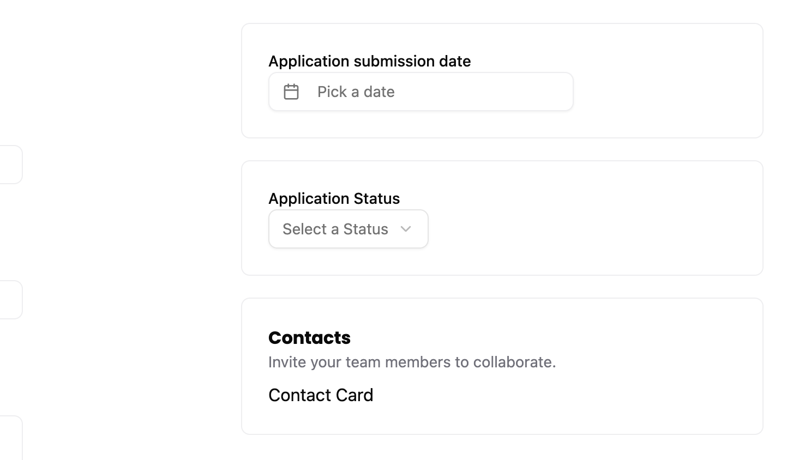

This looks pretty good, but I want to add some spacing between the form label and its input. 

```css title="/src/app/styles.css" {6-8}
label,
.label {
  @apply text-sm font-medium block;
  @apply mb-2;
}
```

<details>

- `mb-2` adds `8px` of margin on the bottom.

</details>

## Submitting the form

Now, that our form is in a good place, let's handle the form submission.

### Testing form submit

Let's add a selector for the submit button.

```ts title="tests/util.ts"
buttonCreate: ["button", { name: "Create" }],
```

Now we add our steps to test that we were successful in creating a new Application.

```ts title="tests/loggedin/new-applications.spec.ts"
await test.step("Lastly, submit the New Application form by clicking the **Create** button.", async () => {
  const submitButton = page.getByRole(...selectors.buttonCreate)
  await screenshot(testInfo, submitButton, {
    annotation: {
      text: "Click here to submit the New Application form",
      position: "right",
    },
  })
  await submitButton.click()
})

await test.step("This will navigate back to the Applications Dashboard page where we should find our new application listed.", async () => {
  await expect(
    page.getByRole(...selectors.headingApplications),
  ).toBeVisible()

  const newApplicationRow = page.getByRole("row", {
    name: "December 15, 2025 Software Engineer Big Tech Co. 80000-120000",
  })
  await expect(newApplicationRow).toBeVisible()
  await screenshot(testInfo, newApplicationRow)
})
```

<details>

- Our first new steps documents and clicks the submission button.
- Next step makes sure we're on the Dashboard page and that we added the new row.

</details>

#### Handling repeated runs.

Tests need to be **idempotent**, meaning it can run multiple times and produce the same result every time. Right now, our test is a 'one-hit wonder'.

The problem is that with every run we'll just add more and more Applications with the same data. So it will be harder for us to determine if our current run succeeded or if we're getting mixed up with the last run.

There are 2 solutions available.

1. We reset the DB between test runs.
2. We add a unique identifier to make our assertions on.

I think I like approach _2_ and would normally recommend it, but we're going to go with approach **1**. Here's why:

- **More realistic looking documentation** - We're going to be taking screenshots and displaying this to users. If they see a randomized string for a field value it may confuse them and then the user has to waste a bit of cognitive load trying to understand what that input means, when it was just done for testing.
- **We already have a dependency to update the DB** - Since we already added `better-sqlite3` we already have a dependency to update the DB for tests. In our current case, we'll be removing data.
- **Isolated update** - We're not going to be doing a full wipe, instead we're going to target the data we don't want and removing that. Other tests shouldn't rely on our data being in the DB anyway, because that means they'll have a hard dependency on our test, preventing them from running in parallel anyway.
- **Run cleanup before the test** - Normally, it's good practice to clean up test data after your tests run. Instead we're going to do it before. Having the data after the test runs shouldn't affect other test cases (and if they do, we have a real problem), and if the run ever fails or needs to be rerun, the clean up step before our test runs will ensure our test can add the data for this test.
  - **Debugging** - A small bonus is if the test does fail, we can get a dump of the DB and inspect the state of the DB to help debug what went wrong.

Since we'll be connecting to the DB, let's move the `getTestDbPath` from our `login.setup.ts` file to the `util.ts`.

```diff title="tests/loggedin/new-applications.spec.ts"
import { test, expect } from "@playwright/test"
import { TESTPASSKEY } from "../../src/scripts/test-passkey.js"
- import { getTestDbPath } from "../util.js"
+ import { getTestDbPath, selectors } from "../util.js"
import Database from "better-sqlite3"
import {
  enableVirtualAuthenticator,
  addPasskeyCredential,
  simulateSuccessfulPasskeyInput,
} from "@test2doc/playwright-passkey"
- import path from "path"
- import fs from "node:fs"
- 
- function getTestDbPath(): string {
-   const doDir = path.join(
-     ".wrangler",
-     "state",
-     "v3",
-     "do",
-     "__change_me__-AppDurableObject",
-   )
-   const files = fs.readdirSync(doDir)
-   const sqliteFile = files.find((f) => f.endsWith(".sqlite"))
- 
-   if (!sqliteFile) {
-     throw new Error(`No SQLite file found in ${doDir}`)
-   }
- 
-   return path.join(doDir, sqliteFile)
- }
```

```ts title="tests/util.ts"
import path from "path"
import fs from "node:fs"

export function getTestDbPath(): string {
  const doDir = path.join(
    ".wrangler",
    "state",
    "v3",
    "do",
    "__change_me__-AppDurableObject",
  )
  const files = fs.readdirSync(doDir)
  const sqliteFile = files.find((f) => f.endsWith(".sqlite"))

  if (!sqliteFile) {
    throw new Error(`No SQLite file found in ${doDir}`)
  }

  return path.join(doDir, sqliteFile)
}
```

Now we'll connect and clear out the test data in the initial step.

```ts title="tests/loggedin/new-applications.spec.ts" {1-2,5-7,11-28,32-35,42}
import { selectors, getTestDbPath } from "../util"
import Database from "better-sqlite3"
...
test("How to add a new Job Application", async ({ page }, testInfo) => {
  const newApplicationRow = page.getByRole("row", {
    name: "December 15, 2025 Software Engineer Big Tech Co. 80000-120000",
  })

  await test.step("When on the Applications page, ", async () => {
    // clear test data if exists
    const db = new Database(getTestDbPath())

    const companyId = db
      .prepare("SELECT id FROM companies WHERE name = ?")
      .pluck()
      .get("Big Tech Co.") as string | undefined

    if (companyId) {
      db.prepare("DELETE FROM applications WHERE companyId = ?").run(
        companyId,
      )
      db.prepare("DELETE FROM contacts WHERE companyId = ?").run(
        companyId,
      )
      db.prepare("DELETE FROM companies WHERE id = ?").run(companyId)
    }

    db.close()

    await page.clock.setFixedTime(new Date("2025-12-14T10:00:00"))
    await page.goto("/applications")
    await expect(
      page.getByRole(...selectors.headingApplications),
    ).toBeVisible()
    await expect(newApplicationRow).not.toBeVisible()
  })
  ...
  await test.step("This will navigate back to the Applications Dashboard page where we should find our new application listed.", async () => {
  await expect(
    page.getByRole(...selectors.headingApplications),
  ).toBeVisible()

  await expect(newApplicationRow).toBeVisible()
  await screenshot(testInfo, newApplicationRow)
})
```

<details>

- We import our newly moved `getTestDbPath` and `better-sqlite3` so we can connect to our DB.
- Since no other tests depend on this data, we perform the cleanup in our first `step` before running the test, as opposed to setting up a beforeEach or beforeAll lifecycle hook.
  - We connect to the DB.
  - We query to select the company with the test name we've already decided earlier. Since we only need the ID, we use the `pluck` method to directly grab the first column's value.
- We check to see if it found the companyId.
  - If it did, we run 3 queries to delete the related data (applications, contacts, and the company itself).
- Then we close our connection.

- To make sure we cleaned up the data successfully we assert that the row we will add does not currently display.
  - To ensure the page has fully loaded before checking for the row's absence, we first assert that we're on the Dashboard by checking the header, then assert that the row isn't visible.
  - **Note** that we've moved the `newApplicationRow` locator to the top of the test to reuse it in both assertions, so we remove its duplicate initialization from the last step.

</details>

Now we won't need to worry about our tests running multiple times and adding a bunch of data and cause our tests to fail.

### Implementing the form submit

Now that we have a failing test, now this is the final part to make it pass.

```tsx title="src/app/components/ApplicationForm.tsx"
import { Button } from "./ui/button"
...
{/* footer with submission button */}
<div className="col-span-2">
  <Button type="submit">Create</Button>
</div>
```

With this our test passes a bit more. However, you'll notice we're missing the part where we redirect to the dashboard.

In **React 19**, several new hooks were introduced for handling form submission, especially with client and server side components.

In a traditional React application, we'd have to create an API endpoint, and then use a fetch request to handle the form submission. With React 19, we have a lot more options.

For this form, we're going to use a simple [server function](https://react.dev/reference/rsc/server-functions). The nice thing about this particular approach is that the form will still submit even if JS is disabled on the client (or if it's just really slow to load).

Let's start by creating our server function. We'll put it with our route components in `src/app/pages/applications/functions.ts`

```ts title="src/app/pages/applications/functions.ts"
"use server"

import { link } from "@/app/shared/links"
import { requestInfo } from "rwsdk/worker"

export const createApplication = async (formData: FormData) => {
  const { request } = requestInfo
  const url = new URL(link("/applications"), request.url)
  return Response.redirect(url.href, 302)
}
```

<details>

- We add the `"use server"` directive at the top of the file.
  - This tells RWSDK that this is a server function and can be exposed to the client.
- We create a server function, we get the current URL from the requestInfo.
- We create a new `URL` object that will redirect us to the dashboard.
- We return a `Response` that will redirect the client.
- RWSDK will handle the client side redirect automatically.

</details>

Now we need to implement this function in our form.

```tsx title="src/app/components/ApplicationForm.tsx" {1,6}
import { createApplication } from "../pages/applications/functions"
...

return (
  <form
    action={createApplication}
    className="grid grid-cols-2 gap-x-50 mb-20"
  >
    {/* left side */}
```

<details>

**Note:** Currently (as of `@types/react` version `19.1.2`), you may see a TypeScript error about returning a `Response` from the server function. This is a type definition limitation—the pattern is [supported by RWSDK](https://docs.rwsdk.com/core/react-server-components/#returning-responses) and works correctly at runtime. The React types haven't caught up to this newer pattern yet. You can safely ignore this error.

</details>

Now our test should successfully redirect to the dashboard but still failing since we're not persisting any data to the DB yet.

```ts title="src/app/pages/applications/functions.ts"
"use server"

import { link } from "@/app/shared/links"
import { requestInfo } from "rwsdk/worker"
import { db } from "@/db/db"

export const createApplication = async (formData: FormData) => {
  const { request, ctx } = requestInfo

  const companyName = formData.get("company") as string
  const jobTitle = formData.get("jobTitle") as string
  const jobDescription = formData.get("jobDescription") as string
  const applicationStatusId = formData.get("status") as string
  const applicationDate = formData.get("applicationDate") as string
  const minSalary = formData.get("salaryMin") as string
  const maxSalary = formData.get("salaryMax") as string
  const applicationUrl = formData.get("url") as string

  const now = new Date().toISOString()

  if (!ctx.session?.userId) {
    throw new Error("User not found")
  }

  await db
    .insertInto("companies")
    .values({
      id: crypto.randomUUID(),
      name: companyName,
      createdAt: now,
      updatedAt: now,
    })
    .onConflict((oc) => oc.column("name").doNothing())
    .execute()

  const { id: companyId } = await db
    .selectFrom("companies")
    .select("id")
    .where("name", "=", companyName)
    .executeTakeFirstOrThrow()

  await db
    .insertInto("applications")
    .values({
      id: crypto.randomUUID(),
      companyId: companyId,
      jobTitle,
      jobDescription,
      statusId: parseInt(applicationStatusId),
      dateApplied: applicationDate,
      salaryMin: minSalary,
      salaryMax: maxSalary,
      postingUrl: applicationUrl,
      userId: ctx.session.userId,
      createdAt: now,
      updatedAt: now,
      archived: 0,
    })
    .execute()

  const url = new URL(link("/applications"), request.url)
  return Response.redirect(url.href, 302)
}
```

<details>

- We also grab the context (`ctx`) from `requestInfo`.
- We check to see if the `userId` is in the `session` in side of the context.
  - I normally dislike adding defensive code without a test to hit it, but typescript will complain if we try to use the `userId` if we're not user it exists. And this is honestly a pretty reasonable check.
- We get all the values from the `formData` and set it to variables so we can use when inserting into the DB.
- We're going to follow an **upsert** pattern. Kysely (our DB query library in RedwoodSDK) doesn't natively have it, so we'll need to handle it ourselves.
  - We first attempt to create a new company.
    - The `oc.column("name").doNothing()` is important to say if there is already a company with this name, do not create a new row.
      - We also should have set up the DB back in [Tutorial 3](/docs/tutorial-3). If it's not there, you can add the `.unique()` method call to the `name` field of the `companies` table and delete the `.wrangler` directory and start the server back up to run the migrations. (You'll also need to [reseed](/docs/tutorial-3#run-migrations-and-seeds) the DB too.)
  - We look up the `companyId` by the name of the company, either we just added or if it exists already.
    - **Note**: The reason we don't look up the company first then insert if we don't find it is to avoid a race condition that can occur in the split second between lookup and insert in case we have 2 parallel form submissions. This is why we follow the _upsert_ pattern.
- Now that we have the `companyId` we create the new **application**.

</details>

Now when we run our test we get this error:

```sh
Error: expect(locator).toBeVisible() failed

Locator: getByRole('row', { name: 'December 15, 2025 Software Engineer Big Tech Co. 80000-120000' })
Expected: visible
Timeout: 5000ms
Error: element(s) not found
```

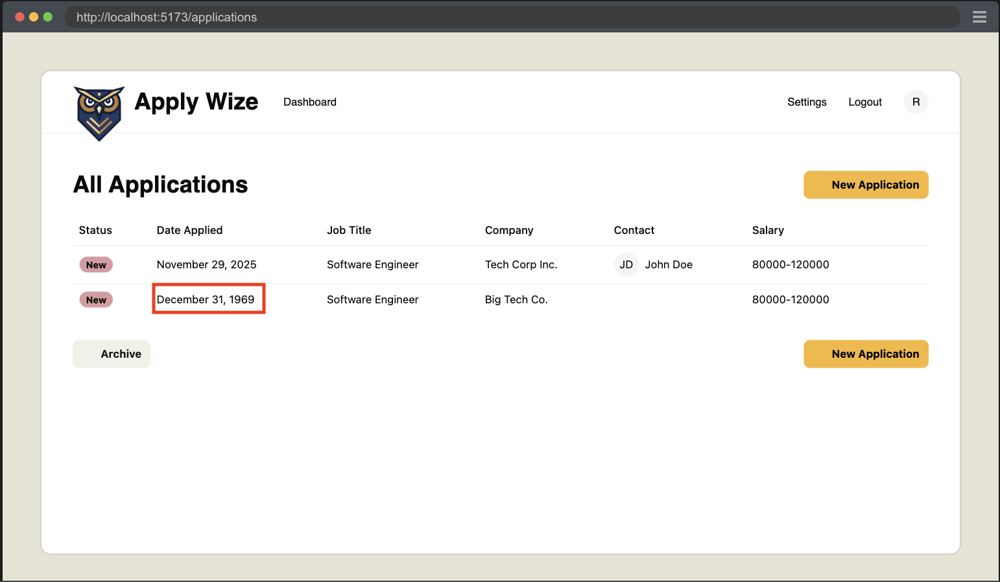

You might remember I noted that the date picker was missing something and we'd catch that later. Well, now is later and we just caught a gap in functionality with our test.

So to help avoid this problem, let's see if we can't implement a bit of validation handling. Validating `FormData` is not trivial, so we'll be using a library called **Zod**.

<Tabs groupId="package-managers">
  <TabItem value="npm" label="npm" default>
```sh
npm install zod
```
  </TabItem>
  <TabItem value="yarn" label="yarn">
```sh
yarn add zod
```
  </TabItem>
  <TabItem value="pnpm" label="pnpm">
```sh
pnpm add zod
```
  </TabItem>
</Tabs>

```ts title="src/app/pages/applications/functions.ts" {1,3-16,21-30,42,52,60-66}
import { z } from "zod"

const applicationFormSchema = z.object({
  companyName: z.string().min(1, "Company name is required"),
  jobTitle: z.string().min(1, "Job title is required"),
  jobDescription: z.string().optional().default(""),
  applicationStatusId: z.coerce
    .number()
    .min(1, "No Application Status selected")
    .max(5, "Invalid Application Status selected"),
  applicationDate: z.iso.datetime("Invalid date selected"),
  minSalary: z.string().optional().default(""),
  maxSalary: z.string().optional().default(""),
  applicationUrl: z.string().optional().default(""),
})

export const createApplication = async (formData: FormData) => {
  const { request, ctx } = requestInfo

  const data = applicationFormSchema.parse({
    companyName: formData.get("company"),
    jobTitle: formData.get("jobTitle"),
    jobDescription: formData.get("jobDescription"),
    applicationStatusId: formData.get("status"),
    applicationDate: formData.get("applicationDate"),
    minSalary: formData.get("minSalary"),
    maxSalary: formData.get("maxSalary"),
    applicationUrl: formData.get("url"),
  })

  const now = new Date().toISOString()

  if (!ctx.session?.userId) {
    throw new Error("User not found")
  }

  await db
    .insertInto("companies")
    .values({
      id: crypto.randomUUID(),
      name: data.companyName,
      createdAt: now,
      updatedAt: now,
    })
    .onConflict((oc) => oc.column("name").doNothing())
    .execute()

  const { id: companyId } = await db
    .selectFrom("companies")
    .select("id")
    .where("name", "=", data.companyName)
    .executeTakeFirstOrThrow()

  await db
    .insertInto("applications")
    .values({
      id: crypto.randomUUID(),
      companyId: companyId,
      jobTitle: data.jobTitle,
      jobDescription: data.jobDescription,
      statusId: data.applicationStatusId,
      dateApplied: data.applicationDate,
      salaryMin: data.minSalary,
      salaryMax: data.maxSalary,
      postingUrl: data.applicationUrl,
      userId: ctx.session.userId,
      createdAt: now,
      updatedAt: now,
      archived: 0,
    })
    .execute()
```

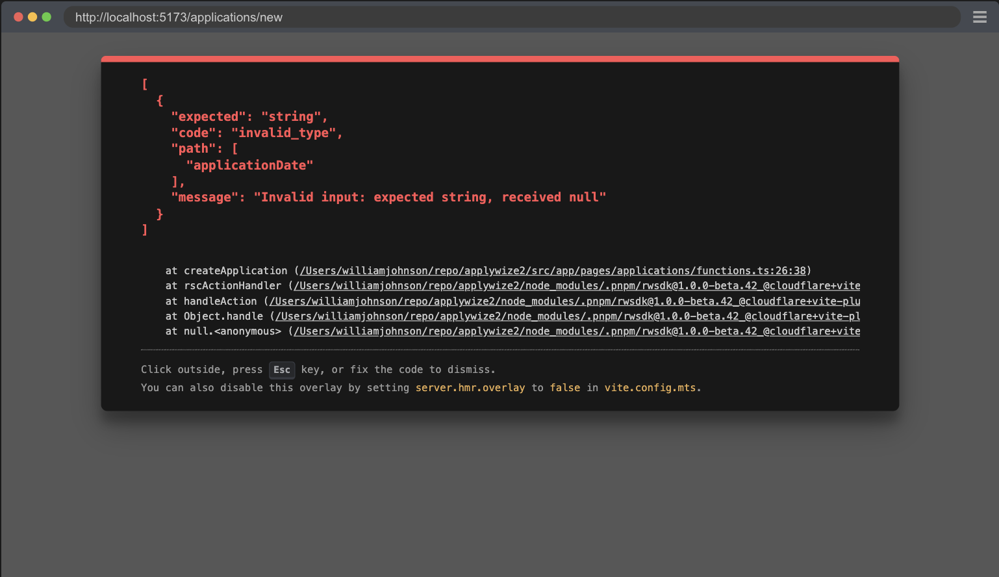

```json
[
  {
    "expected": "string",
    "code": "invalid_type",
    "path": [
      "applicationDate"
    ],
    "message": "Invalid input: expected string, received null"
  }
]
```

Now we get a new and more specific error to help identify what is going wrong. The problem is that our form isn't actually submitting the `applicationDate`.

The reason for this is that our DatePicker component doesn't have an input to map the selection back to the form. So let's fix that by adding an input element to the component.

```tsx title="src/app/components/ui/datepicker.tsx" {2}
  </Popover>
  <input type="hidden" name="applicationDate" value={date?.toISOString()} />
</>
```

<details>

- We add a hidden input.
- Give it the name that we're expecting, `applicationDate`.
- We set the value to the date that we're using for the picker.

</details>

Now everything is passing, and we have a detailed documentation on how to create a new application for our app.

Remember to run the `pnpm doc` script to generate the Docusaurus markdown.

## Code on GitHub
You can find the final code for this step on [GitHub](https://github.com/dethstrobe/applywize2/tree/tutorial-6)

## Read More

- [`<fieldset>`](https://developer.mozilla.org/en-US/docs/Web/HTML/Reference/Elements/fieldset)
- [Playwright's Clock API](https://playwright.dev/docs/clock)
- [React Server Functions](https://react.dev/reference/rsc/server-functions)
- [React form element](https://react.dev/reference/react-dom/components/form)
- [MDN: form action](https://developer.mozilla.org/en-US/docs/Web/HTML/Reference/Elements/form#action)
- [RedwoodSDK: Returning Responses](https://docs.rwsdk.com/core/react-server-components/#returning-responses)

## What's Coming Next?

Now we have the New Applications Page displaying the new job application form.

Next Lesson we'll:

- Create Contacts for the new Application
- Persist the contacts in the DB