Things are coming together nicely. But we still have hard-coded contacts into the Job Application form. Let's make this dynamic.

If we look at the Figma file, you'll notice that we have an "Add a Contact" button on our sidebar:

<figure>

  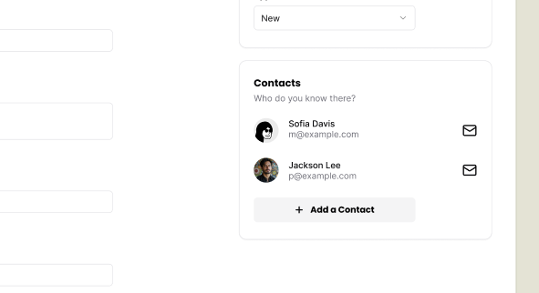
  <figcaption>Mockup from Figma contact section</figcaption>
</figure>

When the user clicks on this button, we want to open a side panel that contains the contact form:

<figure>

  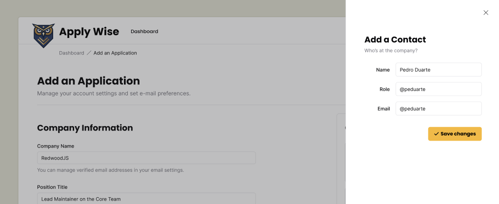
  <figcaption>Mockup from Figma of contact side drawer</figcaption>
</figure>

## Adding a Contact

Let's start with building the UI and then we will persist the data in the database.

### Adding a step to test for Contacts

Let's add the selectors we'll need.

```ts title="tests/util.ts"
buttonAddContact: ["button", { name: "Add a contact" }],
formContactForm: ["form", { name: "Add a Contact" }],
inputFirstName: ["textbox", { name: "First Name" }],
inputLastName: ["textbox", { name: "Last Name" }],
inputRole: ["textbox", { name: "Role" }],
inputEmail: ["textbox", { name: "Email" }],
buttonCreateContact: ["button", { name: "Create a Contact" }],
```

Let's add the steps to our "How to add a new Job Application" test case:

```ts title="tests/loggedin/new-applications.spec.ts"
await test.step(`#### Add a Contact for the Application
  Open the Add a Contact sheet by clicking the "Add a contact" button.`, async () => {
  const addContactButton = page.getByRole(
    ...selectors.buttonAddContact,
  )
  await screenshot(testInfo, addContactButton, {
    annotation: {
      text: "Click here to add a contact to this application",
    },
  })
  await addContactButton.click()
})

await test.step(`Enter the contact’s information:
  
  - First name
  - Last name
  - Role in the company
  - Email
  `, async () => {
  const firstNameInput = page.getByRole(...selectors.inputFirstName)
  const lastNameInput = page.getByRole(...selectors.inputLastName)
  const roleInput = page.getByRole(...selectors.inputRole)
  const emailInput = page.getByRole(...selectors.inputEmail)

  await screenshot(
    testInfo,
    page.getByRole(...selectors.formContactForm),
  )
  await firstNameInput.fill("John")
  await lastNameInput.fill("Doe")
  await roleInput.fill("HR Manager")
  await emailInput.fill("john.doe@example.com")
})
```

This is good enough to get started. We'll add the submission logic and assert that we added a contact once we have these two steps passing.

### Implementing the side drawer

Again, we'll use our shadcn/ui components.

This time, we're going to reach for the `Sheet` component.

You can copy the boilerplate code from the [shadcn/ui docs](https://ui.shadcn.com/docs/components/sheet) and paste it at the top of our `ApplicationForm` component:

```tsx title="src/app/components/ApplicationForm.tsx" {1-8,16-27}
import {
  Sheet,
  SheetContent,
  SheetDescription,
  SheetHeader,
  SheetTitle,
  SheetTrigger,
} from "./ui/sheet"
...
<div className="box">
  <h3>Contacts</h3>
  <p className="input-description">
    Invite your team members to collaborate.
  </p>
  <div>Contact Card</div>
  <Sheet>
    <SheetTrigger>Open</SheetTrigger>
    <SheetContent>
      <SheetHeader>
        <SheetTitle>Are you absolutely sure?</SheetTitle>
        <SheetDescription>
          This action cannot be undone. This will permanently delete
          your account and remove your data from our servers.
        </SheetDescription>
      </SheetHeader>
    </SheetContent>
  </Sheet>
</div>
```

If you take a look at this within the browser, you should see the "Open" trigger:

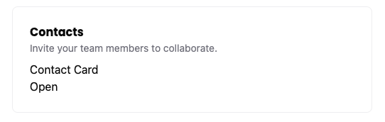

If you click on the trigger, the sheet should slide open:

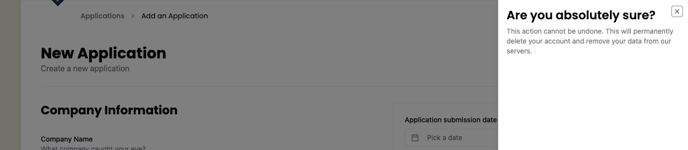

Now, let's replace the placeholder content with the real stuff.

You may have noticed that the Sheet code contains a trigger (`SheetTrigger`) and `SheetContent`. Inside the content, there's a `SheetHeader` with a `SheetTitle` and `SheetDescription`.

First, let's adjust the `SheetTrigger`:

```tsx title="src/app/components/ApplicationForm.tsx"
import { Icon } from "./Icon"
...
<SheetTrigger className="flex items-center gap-2 font-poppins text-sm font-bold bg-secondary py-3 px-6 rounded-md cursor-pointer">
  <Icon id="plus" size={16} />
  Add a Contact
</SheetTrigger>
```

<details>

- We added an `Icon` component and gave it an `id` of `plus` and a size of `16`.
- We changed the text to `Add a Contact`.
- We can add some styling to the `SheetTrigger` to make it look like a button.
  - `flex items-center gap-2` will align the icon and text next to each other, putting `8px` of space between them.
  - `font-poppins font-bold text-sm` will use the font-family `Poppins`, make it bold, and set the font size to `14px`.
  - `bg-secondary` will make the background a beige color (defined in our `@theme`)
  - `py-3 px-6` will add `12px` of padding to the top and bottom, and `24px` of padding to the left and right.
  - `rounded-md` will round the corners of the button.
  - `cursor-pointer` will change the cursor to a pointer when hovering over the button.

</details>

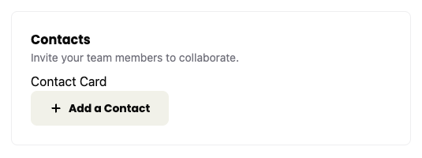

Much better! Now, for our `SheetContent`:

```tsx title="src/app/components/ApplicationForm.tsx" {1,3,5}
<SheetContent  className="pt-[100px] px-12">
  <SheetHeader>
    <SheetTitle>Add a Contact</SheetTitle>
    <SheetDescription>
      Add a Contact to this application.
    </SheetDescription>
  </SheetHeader>
</SheetContent>
```

<details>

- Change the `SheetTitle` to `Add a Contact`.
- Change the `SheetDescription` to `Add a Contact to this application.`
- We added some styling to the `SheetContent` to give our content some additional space. `100px` of padding to the top and `48px` of padding to the left and right.

</details>

Although I've been preaching about YAGNI, but `ApplicationForm` is doing a lot right now. We'll compartmentalize the contact creation into its own component. This way we're not mixing up the contact creation logic with the Application creation logic and making it a bit easier for the next developer to understand and maintain this.

So let's make a `ContactForm` form component at `src/app/components/ContactForm.tsx`.

```tsx title="src/app/components/ContactForm.tsx"
export const ContactForm = () => {
  return <div>ContactForm</div>;
}
```

Let's add this to our `ApplicationForm` to make sure we're setting everything up correctly.

```tsx title="src/app/components/ApplicationForm.tsx" {1,10}
import { ContactForm } from "./ContactForm"
...
<SheetContent className="pt-[100px] px-12">
  <SheetHeader>
    <SheetTitle>Add a Contact</SheetTitle>
    <SheetDescription>
      Add a Contact to this application.
    </SheetDescription>
  </SheetHeader>
  <ContactForm />
</SheetContent>
```

You should see something similar to this:

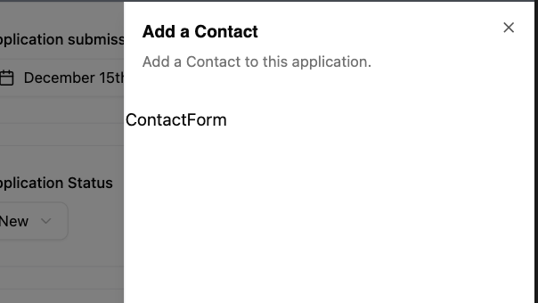

Now let's replace our `<div>` with our form. It should contain fields for:

- first name
- last name
- role
- email

```tsx title="src/app/components/ContactForm.tsx"
import { Icon } from "./Icon"
import { Button } from "./ui/button"

export const ContactForm = () => {
  return (
    <form
      aria-labelledby="add-contact-title"
      aria-describedby="add-contact-description"
    >
      <div className="field">
        <label htmlFor="firstName">First Name</label>
        <input type="text" id="firstName" name="firstName" required />
      </div>
      <div className="field">
        <label htmlFor="lastName">Last Name</label>
        <input type="text" id="lastName" name="lastName" required />
      </div>
      <div className="field">
        <label htmlFor="role">Role</label>
        <input type="text" id="role" name="role" required />
      </div>
      <div className="field">
        <label htmlFor="email">Email</label>
        <input type="email" id="email" name="email" required />
      </div>
      <div className="field">
        <Button>
          <Icon id="check" size={24} />
          Create a Contact
        </Button>
      </div>
    </form>
  )
}
```

<details>

- This form should be pretty straightforward. It's mostly vanilla HTML. I wrapped each `label` and `input` pairing with a `div` that has a class of `field`. Conveniently, we've already defined these styles within our `styles.css` file.
- At the bottom of the form, I'm using a shadcn/ui `Button` component, similar to what we've done before. I have a check `Icon` inside with the text "Create a Contact".
- I've also made every field required, using the HTML `required` attribute.
- We also gave the form two `aria-` attributes, `labelledby` and `describedby`.

</details>

We need to go back to the `ApplicationForm` to give the `SheetTitle` and `SheetDescription` `id` attributes so we can target them to make our form a bit more accessible.

```tsx title="src/app/components/ApplicationForm.tsx"
<SheetTitle id="add-contact-title">Add a Contact</SheetTitle>
<SheetDescription id="add-contact-description">
```

Now our new steps are passing, but the test is failing because we didn't submit the form and dismiss the side sheet.

### Testing form submission

So, let's see if we can submit the form and see if we get a new contact. First we'll add a few new selectors, one to test that we're displaying the list of contacts, and the other to test that the correct contact is being displayed.

```ts title="tests/util.ts"
listContacts: ["list", { name: "Contacts" }],
headingTestingContact: ["heading", { name: "John Doe" }],
```

```ts title="tests/loggedin/new-applications.spec.ts"
await test.step('Add the contact by clicking the "Create a Contact" button', async () => {
  const createButton = page.getByRole(
    ...selectors.buttonCreateContact,
  )
  await screenshot(testInfo, createButton, {
    annotation: {
      text: "Click here to create the contact",
      position: "left",
    },
  })
  await createButton.click()
})

await test.step("Your new contact appears in the Contacts section", async () => {
  const contactCards = page.getByRole(
    ...selectors.listContacts,
  )
  await expect(
    page.getByRole(...selectors.headingTestingContact),
  ).toBeVisible()
  await screenshot(testInfo, contactCards, {
    annotation: {
      text: "Your new contact appears here in the Contacts section",
      position: "left",
    },
  })
})
```

<details>

- We have 2 steps.
  - Click the submit button.
  - Assert that our new contact has been added.
    - We also want to take a screenshot to document that the location where the contacts render.

</details>

```sh
Error: expect(locator).toBeVisible() failed

Locator: getByRole('heading', { name: 'John Doe' })
Expected: visible
Timeout: 5000ms
Error: element(s) not found
```

And now our test is failing to find the new contact. So let's see about implementing that.

### Implementing form submission

So if you recall from the [last tutorial](/docs/tutorial-6#implementing-the-options) I mentioned some hypothetical alternative ways to get the ApplicationStatuses from the DB in case we needed to make the ApplicationForm a client component.

Turns out we're going to need to make some React state to hold the contacts until we're ready to submit. So, we're going to turn the ApplicationForm into a client component, as React state management is only available for client components.

First we'll move the DB call to the `New.tsx` component and add a prop to pass the `applicationStatusesQuery` to our form.

```diff title="src/app/components/ApplicationForm.tsx"
-"use server"
+"use client"
...
-import { db } from "@/db/db"
+interface ApplicationFormProps {
+  applicationStatusesQuery: {
+    id: number
+    status: string
+  }[]
+}

-export const ApplicationForm = async () => {
-  const applicationStatusesQuery = await db
-    .selectFrom("applicationStatuses")
-    .selectAll()
-    .execute()
+export const ApplicationForm = ({
+  applicationStatusesQuery,
+}: ApplicationFormProps) => {
```

Now let's add the database query here and pass the statuses to the form.

```tsx title="src/app/pages/applications/New.tsx" {1,4-7,11}
import { db } from "@/db/db"

export const New = async () => {
  const applicationStatusesQuery = await db
    .selectFrom("applicationStatuses")
    .selectAll()
    .execute()
  return (
    ...
          </div>
      <ApplicationForm applicationStatusesQuery={applicationStatusesQuery} />
    </>
  )
}
```

Now with this refactor, we're at feature parity and can start to add the state management to handle contacts.

```tsx title="src/app/components/ApplicationForm.tsx" {1-2,4-8,13,15,17-29,33,45}
import { useState } from "react"
import { Contact } from "@/db/db"
...
type ContactFormData = Omit<Contact, "createdAt" | "updatedAt" | "companyId"> & {
  createdAt?: string
  updatedAt?: string
  companyId?: string
}

export const ApplicationForm = ({
  applicationStatusesQuery,
}: ApplicationFormProps) => {
  const [contacts, setContacts] = useState<ContactFormData>([])

  const [isContactSheetOpen, setIsContactSheetOpen] = useState(false)

  const submitContactForm = (formData: FormData) => {
    setContacts((prevContacts) => [
      ...prevContacts,
      {
        id: crypto.randomUUID(),
        firstName: formData.get("firstName") as string,
        lastName: formData.get("lastName") as string,
        role: formData.get("role") as string,
        email: formData.get("email") as string,
      },
    ])
    setIsContactSheetOpen(false)
  }

  return (
    ...
    <Sheet open={isContactSheetOpen} onOpenChange={setIsContactSheetOpen}>
      <SheetTrigger className="flex items-center gap-2 font-poppins text-sm font-bold bg-secondary py-3 px-6 rounded-md cursor-pointer">
        <Icon id="plus" size={16} />
        Add a Contact
      </SheetTrigger>
      <SheetContent className="pt-[100px] px-12">
        <SheetHeader>
          <SheetTitle id="add-contact-title">Add a Contact</SheetTitle>
          <SheetDescription id="add-contact-description">
            Add a Contact to this application.
          </SheetDescription>
        </SheetHeader>
        <ContactForm submitContactForm={submitContactForm} />
      </SheetContent>
    </Sheet>
    ...
```

<details>

- We import `useState` from `"react"`.
- We're setting up 2 state variables to manage.
  - `contacts` is where we'll save our contacts.
    - You might notice we typed our `useState` with the `ContactFormData` which is based off of the `Contact` model from our DB.
      - The difference between the `ContactFormData` and `Contact` model is that we make "createdAt", "updatedAt", and "companyId" properties optional.
      - We make these optional because our `ContactForm` component won't be capturing those, but when we later populate contacts from the DB, we will be populating those fields.
  - `isContactSheetOpen` will be used so we can control when the sheet is opened from the form.
- We create a `submitContactForm` function so that when we submit our contact form we use this callback to update the state in our `ApplicationForm` component.
- The `Sheet` component has a few props for us to bind our `isContactSheetOpen` state to.
- And we need to pass our `submitContactForm` to our `ContactForm` component.

</details>

Now, with all our state management set up, let's pass the `submitContactForm` function to our form `action`.

```tsx title="src/app/components/ContactForm.tsx" {1-3,5,8}
interface ContactFormProps {
  submitContactForm: (formData: FormData) => void
}

export const ContactForm = ({ submitContactForm }: ContactFormProps) => {
  return (
    <form
      action={submitContactForm}
      aria-labelledby="add-contact-title"
      aria-describedby="add-contact-description"
    >
```

<details>

- We create an interface for our props for this component with `ContactFormProps`.
- We then take the `submitContactForm` prop and pass it to the form's `action` prop.

</details>

Now, we're saving state, but the test is still failing, because we need to actually render the added contacts.

```tsx title="src/app/components/ApplicationForm.tsx" {1,5-20}
<h3 id="contact-label">Contacts</h3>
<p className="input-description">
  Invite your team members to collaborate.
</p>
<ul aria-labelledby="contact-label">
  {contacts.map((contact) => (
    <li key={contact.id}>
      <Avatar>
        <AvatarFallback>
          {contact.firstName.charAt(0)}
          {contact.lastName.charAt(0)}
        </AvatarFallback>
      </Avatar>
      <h4>
        {contact.firstName} {contact.lastName}
      </h4>
      <p>{contact.email}</p>
    </li>
  ))}
</ul>
<Sheet open={isContactSheetOpen} onOpenChange={setIsContactSheetOpen}>
  <SheetTrigger className="flex items-center gap-2 font-poppins text-sm font-bold bg-secondary py-3 px-6 rounded-md cursor-pointer">
```

<details>

- We give the `<h3>` an `id` so we can target it later.
- We replaced the placeholder "Contact Card" `<div>` with an `<ul>` that we'll use to populate our contacts
  - We give our `<ul>` the `aria-labelledby` attribute and target our `<h3>`.
  - Our contact card will be a `<li>`.
    - We use the same `<Avatar>` component that we used in the `List.tsx`
    - We add a `<h4>` with the user name.
      - Using an `<h4>` makes it easier for screen readers to skim the cards
    - And we add a `<p>` tag with the email.

</details>

With that, the test is now passing.

### Refactor: style the contact card

Let's add styling to make the card look more like it does in the mocks.

```tsx title="src/app/components/ApplicationForm.tsx"
<li key={contact.id} className="flex items-center gap-4 mb-6">
  <Avatar className="size-10">
    <AvatarFallback>
      {contact.firstName.charAt(0)}
      {contact.lastName.charAt(0)}
    </AvatarFallback>
  </Avatar>
  <div className="flex-1">
    <h4>
      {contact.firstName} {contact.lastName}
    </h4>
    <p className="text-sm text-zinc-500">{contact.role}</p>
  </div>
  <a
    aria-label={`Email to ${contact.email}`}
  >
    <Icon id="mail" size={24} />
  </a>
</li>
```

<details>

- We added `flex items-center gap-4` to align the avatar, name, and email icon vertically with `16px` of space between elements and `24px` of margin on the bottom.
- A class of `size-10` makes the avatar `40px` wide and `40px` tall.
- The `flex-1` class ensures that the name and role take up as much horizontal space as possible.
- `text-sm font-medium` will make the name `14px` and have a font weight of medium.
- The text role will be `14px` with `text-sm` and gray with `text-zinc-500`.
  - We replaced the email here with the role, because it seemed a bit redundant since we'd be adding a dedicated email button.
- We add and style the email, but we haven't added the functionality yet.
  - It's very trivial to add the functionality, but we'll try and TDD this later.

</details>

### Testing persisting Contacts in DB

We just need to add the contact text to our row assertion.

```diff title="tests/loggedin/new-applications.spec.ts"
const newApplicationRow = page.getByRole("row", {
-  name: "December 15, 2025 Software Engineer Big Tech Co. 80000-120000",
+  name: "December 15, 2025 Software Engineer Big Tech Co. JD John Doe 80000-120000",
})
```

### Implementing persisting Contacts in DB

Now that we have some state management for contacts, now we'll want to create the contacts in the DB. We'll start by refactoring the `createApplication` function to take in `ContactFormData`.

We'll first move the `ContactFormData` into `functions.ts`.

```ts title="src/app/pages/applications/functions.ts" {1,4-11}
import { Contact, db } from "@/db/db"
import { z } from "zod"

export type ContactFormData = Omit<
  Contact,
  "createdAt" | "updatedAt" | "companyId"
> & {
  createdAt?: string
  updatedAt?: string
  companyId?: string
}
```

```diff title="src/app/components/ApplicationForm.tsx"
- import { createApplication } from "../pages/applications/functions"
+ import {
+   ContactFormData,
+   createApplication,
+ } from "../pages/applications/functions"
...
- import { Contact } from "@/db/db"
...
- type ContactFormData = Omit<
-   Contact,
-   "createdAt" | "updatedAt" | "companyId"
- > & {
-   createdAt?: string
-   updatedAt?: string
-   companyId?: string
- }
```

<details>

- We're moving `ContactFormData` to `functions.ts` to maintain a clean import hierarchy.
- This keeps our dependencies flowing in one direction: `db.ts` > `functions.ts` > `ApplicationForm.tsx`.
- _Alternative_: You could leave it in `ApplicationForm.tsx` and import it into `functions.ts`, but this creates a circular import relationship that's harder to maintain.

</details>

Let's validate our contactsData with Zod.

```ts title="src/app/pages/applications/functions.ts" {1-10,14,17}
const contactSchema = z.object({
  id: z.uuid(),
  firstName: z.string().min(1, "First name is required"),
  lastName: z.string().min(1, "Last name is required"),
  email: z.email({ message: "Invalid email address" }),
  role: z.string().min(1, "Role is required"),
  createdAt: z.string().optional(),
  updatedAt: z.string().optional(),
  companyId: z.string().optional(),
})

export const createApplication = async (
  formData: FormData,
  contactsData: ContactFormData[],
) => {
  ...
  const validatedContacts = z.array(contactSchema).parse(contactsData)
  ...
  if (validatedContacts.length > 0) {
    await db
      .insertInto("contacts")
      .values(
        validatedContacts.map((contact) => ({
          ...contact,
          companyId,
          createdAt: contact.createdAt ?? now,
          updatedAt: now,
        })),
      )
      .execute()
  }
  ...
```

<details>

- We detail our Zod schema for a contact.
  - Then to validate, we pass the schema into the `array` method and pass our `contactsData` into the `parse` to validate it.
- We pass the `contactsData` in as a second argument of the `createApplication`.
- After validating, if the `validatedContacts` contains at least a contact, then we add it to the DB.

</details>

Now we need to refactor our `ApplicationForm` action to pass the contacts to the `createApplication`.

```tsx title="src/app/components/ApplicationForm.tsx"
const submitApplicationForm = async (formData: FormData) => {
  await createApplication(formData, contacts)
}

return (
  <form
    action={submitApplicationForm}
```

And with this, the test is passing and we have our _happy_ path.

But we're not done. There's a bit more functionality we'll want to add.

## Contact card Features

So there are a few more things we'd like the contact card to handle: email (which we partially implemented earlier) and the ability to remove a contact.

### Testing Contact Email
Let's go back and make sure we document and test the email button.

First we'll add the selector for the button.

```ts title="tests/util.ts"
buttonContactEmail: ["link", { name: "Email to john.doe@example.com" }],
```

Now we'll add new describe and test case.

```ts title="tests/loggedin/new-applications.spec.ts"
test.describe(
  withDocMeta("Contact Card", {
    description: "Details of a contact associated with a job application.",
  }),
  () => {
    test("Contact Card Email button", async ({ page }, testInfo) => {
      await test.step("When on the New Application page, ", async () => {
        await page.goto("/applications/new")
      })

      await test.step("after you added a contact. The contact card displays.", async () => {
        const addContactButton = page.getByRole(
          ...selectors.buttonAddContact,
        )
        await addContactButton.click()

        await page.getByRole(...selectors.inputFirstName).fill("John")
        await page.getByRole(...selectors.inputLastName).fill("Doe")
        await page.getByRole(...selectors.inputRole).fill("HR Manager")
        await page
          .getByRole(...selectors.inputEmail)
          .fill("john.doe@example.com")

        await page.getByRole(...selectors.buttonCreateContact).click()

        const contactCard = page.getByRole(
          ...selectors.headingTestingContact,
        )
        await expect(contactCard).toBeVisible()
      })

      await test.step("Clicking the Email button on the contact card should open your email client.", async () => {
        const contactEmailButton = page.getByRole(
          ...selectors.buttonContactEmail,
        )
        await screenshot(testInfo, contactEmailButton, {
          annotation: {
            text: "Click the Email button to contact this person",
            position: "left",
          },
        })
        await expect(contactEmailButton).toHaveAttribute(
          "href",
          "mailto:john.doe@example.com",
        )
      })
    })
  },
)
```

<details>

We add a new describe block which will generate a separate page. We'll focus on describing all the contact card features here.

Our first test case will be to validate the email.

</details>

### Implement Contact Email

Now to make it pass all we need to do is add the `href` to the link.

```tsx title="src/app/components/ApplicationForm.tsx" {3}
<a
  aria-label={`Email to ${contact.email}`}
  href={`mailto:${contact.email}`}
>
  <Icon id="mail" size={24} />
</a>
```

And now the test is passing!

### Testing removing a contact

So what if someone wants to remove a contact? Let's write a test that clicks a button to remove a contact.

So a few things:
- The Figma mocks don't show a remove contact button. So we'll want to hide it until hovering over the card.
- Hiding elements actually isn't good for accessibility. So we'll still want to expose it in a way that screen readers can access it while hiding it contextually from normal users.

Let's add a selector for our remove button.

```ts title="tests/util.ts"
buttonRemoveContact: ["button", { name: "Remove John Doe" }],
```

Now we'll create our test case that shows the button when hovering or focused.

```ts title="tests/loggedin/new-applications.spec.ts"
test("Remove a Contact", async ({ page }, testInfo) => {
  await test.step("When on the New Application page, ", async () => {
    await page.goto("/applications/new")
  })

  const contactCard = page.getByRole(...selectors.headingTestingContact)
  await test.step("after you added a contact. The contact card displays.", async () => {
    await page.getByRole(...selectors.buttonAddContact).click()

    await page.getByRole(...selectors.inputFirstName).fill("John")
    await page.getByRole(...selectors.inputLastName).fill("Doe")
    await page.getByRole(...selectors.inputRole).fill("HR Manager")
    await page
      .getByRole(...selectors.inputEmail)
      .fill("john.doe@example.com")
    await page.getByRole(...selectors.buttonCreateContact).click()

    await expect(contactCard).toBeVisible()
    await screenshot(
      testInfo,
      page.getByRole(...selectors.listContacts),
      {
        annotation: {
          text: "Contact card displayed in the Contacts section",
          position: "left",
        },
      },
    )
  })

  const removeButton = page.getByRole(...selectors.buttonRemoveContact)
  await test.step("Hover over the contact card to reveal the Remove button.", async () => {
    await expect(removeButton).toBeAttached()

    await expect(removeButton).toHaveScreenshot(
      "contact-remove-btn--initial.png",
    )
    await contactCard.hover()
    await expect(removeButton).toHaveScreenshot(
      "contact-remove-btn--hover-focus.png",
    )
    await screenshot(testInfo, removeButton, {
      annotation: {
        text: "Remove Contact button on hover of the contact card",
        position: "left",
        highlightFillStyle: "rgba(0, 0, 0, 0)",
      },
    })
    // reset hover state of contact card by moving mouse somewhere else
    await page.getByRole(...selectors.headerNewApplication).hover()
    await expect(removeButton).toHaveScreenshot(
      "contact-remove-btn--initial.png",
    )
  })

  await test.step("Alternatively, focus on the Remove button to reveal it too.", async () => {
    await expect(removeButton).toHaveScreenshot(
      "contact-remove-btn--initial.png",
    )
    await removeButton.focus()
    await expect(removeButton).toHaveScreenshot(
      "contact-remove-btn--hover-focus.png",
    )
    await screenshot(testInfo, removeButton, {
      annotation: {
        text: "Remove Contact button on focus",
        position: "left",
        highlightFillStyle: "rgba(0, 0, 0, 0)",
      },
    })
    await removeButton.blur()
    await expect(removeButton).toHaveScreenshot(
      "contact-remove-btn--initial.png",
    )
  })

  await test.step("Click the Remove button to delete the contact from the application form.", async () => {
    await removeButton.click()
    await expect(removeButton).toBeHidden()
    await expect(contactCard).toBeHidden()
  })
})
```

<details>

- We have 5 steps.
  - Go to the page.
  - Add a contact.
  - Assert the button appears on hover.
  - Assert that the button appears on focus.
  - Clicking the button should remove the contact.
- There are a few caveats to the steps.
  - If we hide or `display: none` the button, it removes it from the accessibility tree, which is what we do not want.
  - Because of this limitation we also can use asserts like `toBeHidden` or `toBeVisible`. So the only thing we can do is assert that the button is at least attached to the DOM.
  - We'll need to rely on the screenshots to capture if the Remove button is visible or not.
    - I strongly dislike using screenshots for assertions, because you can't TDD them. But since this is the only way we can be confident that we don't break this functionality in the future, I'm willing to use them to prevent regressions.
    - We also use the same file to assert that the initial state is the same between renders.
    - We use the same file for hover and focus as well, because we do want to make sure these render the same.

</details>

### Implementing removing a contact

First, we're going to implement a naive solution. We're only focused on making the test pass.

```tsx title="src/app/components/ApplicationForm.tsx" {3,5-14}
<li
  key={contact.id}
  className="relative flex items-center gap-4 mb-6"
>
  <button
    role="button"
    className="opacity-0 absolute top-2 -left-[37px] rounded-full bg-destructive p-1"
    aria-label={`Remove ${contact.firstName} ${contact.lastName}`}
    onClick={() => setContacts([])}
  >
    <Icon id="close" size={16} />
  </button>
  <Avatar className="size-10">
```

<details>

- We add the class of `relative` to the `<li>`.
  - We need to do this to position the button relative to its container.
- We add our `<button>` just before the `<Avatar>` component.
  - We use a normal `<button>` JSX element instead of our shadcn/ui button because we want to avoid the default styling.
  - We style the button with `opacity-0` to make the button not visible while also not removing it from the DOM.
  - We position the button with `absolute` to allow it to appear just off the side of the contact card.
    - The button default position is the corner of its parent, so we move it down from the top and back a bit to make it appear just off the side of the contact card with `top-2 -left-[37px]`
  - We make the button circular with `rounded-full`
  - `bg-destructive` will make the background red.
  - `p-1` gives just a bit of padding around the button.
  - In order to target the button and to help with accessibility we give the button an `aria-label` that is derived from the contact's information.
  - Lastly, we create a very naive solution to delete our contact with the onClick event.
    - We'll expand our test case in a moment to make sure that this particular solution won't pass our test.
  - When the button is visible, we show the user the close icon.

</details>

With that our test is passing.

But as you might notice, our remove button is currently too aggressive and will remove **all** contacts. So to prevent this from being a possible regression later, let's extend our test to be a bit more specific.

We also need to fix the styling more to make it visible on hover or focus. But we'll handle that in a refactor step.

### Remove one specific contact

To test this, let's add multiple contacts.

Let's add a few extra selectors.

```ts title="tests/util.ts" {2-3,5}
headingTestingContact: ["heading", { name: "John Doe" }],
headingTestingContact2: ["heading", { name: "Jane Smith" }],
headingTestingContact3: ["heading", { name: "Joe Public" }],
buttonContactEmail: ["link", { name: "Email to john.doe@example.com" }],
buttonRemoveContact: ["button", { name: "Remove Jane Smith" }],
```

<details>

- We add headings for 2 more contacts.
- We changed the remove button to Jane Smith.
  - Testing the middle contact will give us confidence that we are able to remove a contact from the array without displacing items at the beginning or end of the array.

</details>

```ts title="tests/loggedin/new-applications.spec.ts"
const contactCard1 = page.getByRole(
  ...selectors.headingTestingContact,
)
const contactCard2 = page.getByRole(
  ...selectors.headingTestingContact2,
)
const contactCard3 = page.getByRole(
  ...selectors.headingTestingContact3,
)
await test.step("after you added a contact. The contact card displays.", async () => {
  const addContactButton = page.getByRole(
    ...selectors.buttonAddContact,
  )
  const firstNameInput = page.getByRole(...selectors.inputFirstName)
  const lastNameInput = page.getByRole(...selectors.inputLastName)
  const roleInput = page.getByRole(...selectors.inputRole)
  const emailInput = page.getByRole(...selectors.inputEmail)

  await addContactButton.click()
  await firstNameInput.fill("John")
  await lastNameInput.fill("Doe")
  await roleInput.fill("HR Manager")
  await emailInput.fill("john.doe@example.com")

  await addContactButton.click()
  await firstNameInput.fill("Jane")
  await lastNameInput.fill("Smith")
  await roleInput.fill("CTO")
  await emailInput.fill("jane.smith@example.com")

  await addContactButton.click()
  await firstNameInput.fill("Joe")
  await lastNameInput.fill("Public")
  await roleInput.fill("Eng Manager")
  await emailInput.fill("joe.public@example.com")

  await expect(contactCard1).toBeVisible()
  await expect(contactCard2).toBeVisible()
  await expect(contactCard3).toBeVisible()
  await screenshot(
    testInfo,
    page.getByRole(...selectors.listContacts),
    {
      annotation: {
        text: "Contact card displayed in the Contacts section",
        position: "left",
      },
    },
  )
})
```

<details>

We add our two new contacts and assert that all three appear on the page.

</details>

If we run the test now, it passes. But that's only because clicking any Remove Contact button removes them all. So we'll need to update our assertion to capture our intended functionality.

```ts title="tests/loggedin/new-applications.spec.ts" {7,27-31}
await test.step("Hover over the contact card to reveal the Remove button.", async () => {
  await expect(removeButton).toBeAttached()

  await expect(removeButton).toHaveScreenshot(
    "contact-remove-btn--initial.png",
  )
  await contactCard2.hover()
  await expect(removeButton).toHaveScreenshot(
    "contact-remove-btn--hover-focus.png",
  )
  await screenshot(testInfo, removeButton, {
    annotation: {
      text: "Remove Contact button on hover of the contact card",
      position: "left",
      highlightFillStyle: "rgba(0, 0, 0, 0)",
    },
  })
  // reset hover state of contact card by moving mouse somewhere else
  await page.getByRole(...selectors.headerNewApplication).hover()
  await expect(removeButton).toHaveScreenshot(
    "contact-remove-btn--initial.png",
  )
})
...
await test.step("Click the Remove button to delete the contact from the application form.", async () => {
  await removeButton.click()
  await expect(removeButton).toBeHidden()
  await expect(contactCard2).toBeHidden()

  await expect(contactCard1).toBeVisible()
  await expect(contactCard3).toBeVisible()
})
```
<details>

- We hover over the second contact card (Jane Smith) to make its remove button visible.
- We verify that clicking the remove button removes only the second contact, leaving the first and third contacts still visible. Which confirms we're removing the correct item from the array.

</details>

Now our test is failing as expected.

### Implement removing one specific contact

Now let's refactor the `onClick` event for our Remove Contact button.

```ts title="src/app/components/ApplicationForm.tsx" {2,11-16}
<button
  role="button"
  className="opacity-0 absolute top-2 -left-[37px] rounded-full bg-destructive p-1"
  aria-label={`Remove ${contact.firstName} ${contact.lastName}`}
  onClick={() =>
    setContacts((contacts) =>
      contacts.filter(({ id }) => id !== contact.id),
    )
  }
>
```

<details>

We use the `filter` method on the contacts to remove any contacts that match the current element's `id`.

</details>

And with that, the test is passing, and we're confident that we can remove a specific contact.

### Refactor to actually show or hide the Remove Contact button

Let's add the tailwind classes to show the button on focus and when we hover over the contact card.

```tsx title="src/app/components/ApplicationForm.tsx" {3,7}
<li
  key={contact.id}
  className="relative group/card flex items-center gap-4 mb-6"
>
  <button
    role="button"
    className="opacity-0 group-hover/card:opacity-100 focus:opacity-100 absolute top-2 -left-[37px] rounded-full bg-destructive p-1"
    aria-label={`Remove ${contact.firstName} ${contact.lastName}`}
    onClick={() =>
      setContacts((contacts) =>
        contacts.filter(({ id }) => id !== contact.id),
      )
    }
  >
```

<details>

- We add the `group/card` class to the `<li>`.
  - This is a named group, which allows tailwind to generate more specific css to target this element and elements we want to style based off this element.
- We add 2 classes to our `<button>`.
  - `group-hover/card:opacity-100`: when we hover over a group with the name _card_, we set the opacity to 100.
  - `focus:opacity-100`: when the element gains the focus event, it also will set the opacity to 100.
    - This has the bonus of showing the element when tabbing through content, and for announcing it to screen readers when focuses.

</details>

With that our tests are now failing!

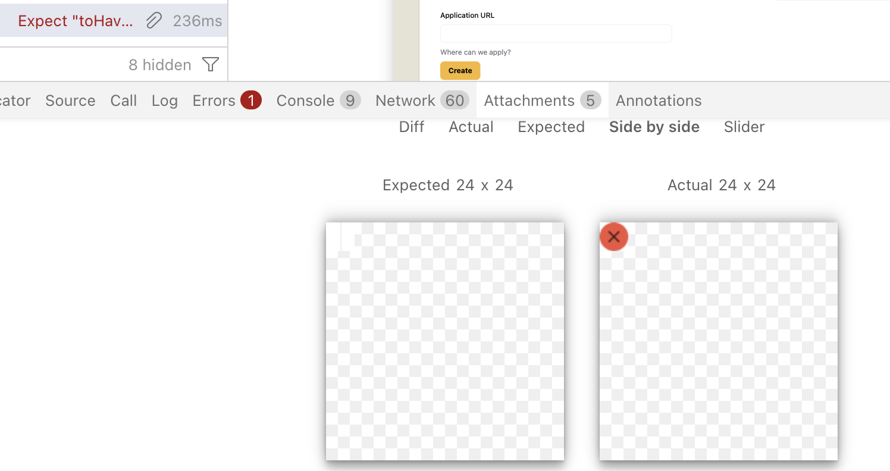

This is one of the main reasons I dislike screenshot testing. Because you can't TDD it, as you work on the problem, the test will fail even if it is now working correctly. It's retroactive testing. But, sadly, since this is a styling test, there isn't a much better way to test this without testing implementation details, which has a number of other problems.

Anyway, all we need to do is update the screenshots.

#### Updating screenshot assert

There are 2 ways to update the screenshots. CLI and UI.

To update from the CLI you can run a command like

```sh
npx playwright test --update-snapshots --update-source-method=overwrite
```

Or add a new script to the `package.json` with the `--update-snapshots` flag added on to it.

But, since we've been using the Playwright UI, let's just update it using that. On the left sidebar of the UI, there is a Testing Options panel where you can change when the screenshots are updated.

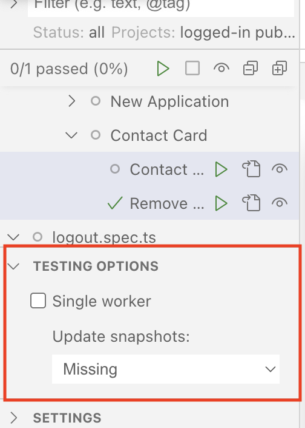

The UI by default only generated screenshots if they're missing. Change the dropdown to "Changed" and run the test again, and the screenshots will be updated.

Remember to swap it back to "Missing" so you don't accidentally overwrite the screenshots and make this assertions completely meaningless.

#### One last bug

There's a small problem if you test this out manually.

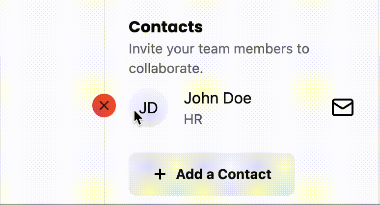

This is obviously not ideal. We'll fix this by adding a wrapper div and moving the positioning classes to that div and adding some padding so that the wrapper and the contact card have some space that over laps.

```tsx title="src/app/components/ApplicationForm.tsx" {1,4,14}
<div className="pr-5 absolute top-2 -left-[37px]">
  <button
    role="button"
    className="opacity-0 group-hover/card:opacity-100 focus:opacity-100 rounded-full bg-destructive p-1"
    aria-label={`Remove ${contact.firstName} ${contact.lastName}`}
    onClick={() =>
      setContacts((contacts) =>
        contacts.filter(({ id }) => id !== contact.id),
      )
    }
  >
    <Icon id="close" size={16} />
  </button>
</div>
```

<details>

- We move the `absolute top-2 -left-[37px]` classes on to the wrapper.
- We give the wrapper `pr-5` to give it `20px` of right padding so that the wrapper will overlap with the contact card.

</details>

One of the downsides of styling bugs is that they're almost always impossible to test-drive. There are technically ways to do so, like checking a class is on an element. But this starts to tie testing to implementation details, which makes refactoring harder to do later. Luckily, this style bug doesn't prevent people from using our button, so it's not strictly required to have an automated test validate it's behavior.

## The Sad Path

So, we've been TDDing the happy path. And it's been nice. We have a lot of confidence that when you enter all the input fields, that we create an application in the DB and display it to the user. But what happens if you forget one of the inputs? Or give an invalid input?

Currently, the app crashes and we get a vite error to display. Maybe not ideal behavior.

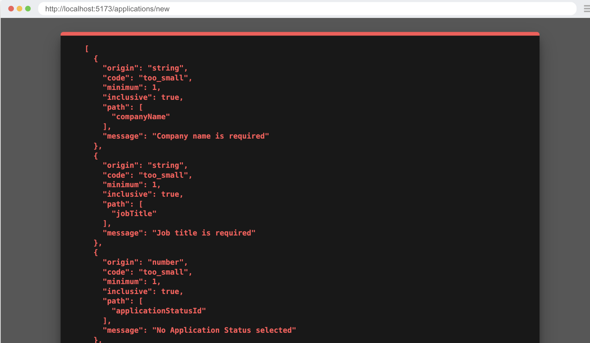

Let's implement better error validation.

So, what we'll do is implement a bit of error handling and make a toaster message appear. As the name kind of implies, a toaster is a simple notification that pops up (sometimes pops down or just appears) to display a notification to the user.

It has two parts—a `Toaster` and the `Toast`:

- The `Toaster` handles where the message is displayed. We can also cue up or show several messages at once. You can think of it like: the `Toaster` "holds" the `Toast`.
- The `Toaster` typically lives in a layout component.
- Then, child components can send `Toast` messages to the `Toaster`.

### How to test a toaster

So, before we write the test, it's probably worthwhile to learn how to test and assert on a toast message.

If we go to the shadcn/ui docs for the [sonner component](https://ui.shadcn.com/docs/components/sonner). We can test and play with how the toaster works a bit.

If we inspect the element we see:

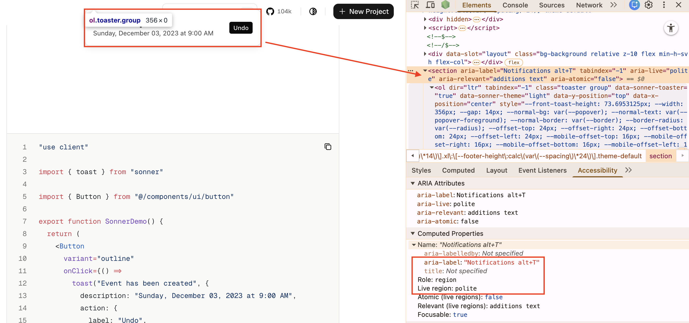

From the demo site, we can see that:

- We have a `<section>` element that is populated with an `<ol>`
  - The section has a `aria-label` which will allow us to target it for our tests.
  - The `role` is `region`.
  - The `aria-live` attribute is given, which makes this region *live*.
    - The `polite` value makes announcements wait for natural pauses in screen reader speech rather than interrupting immediately.

### Testing toast error messaging

Now that we have an understanding of what we're looking for, let's write our tests.

Let's start with our selectors.

```ts title="tests/util.ts"
regionToast: ["region", { name: "Notifications alt+T" }],
```

Now let's write a new test case with new describe block.

```ts title="tests/loggedin/new-applications.spec.ts"
test.describe(
  withDocMeta("Form Error Validation", {
    description:
      "Error messaging for validating for the New Application form.",
  }),
  () => {
    test("New Application Form Validation Errors", async ({
      page,
    }, testInfo) => {
      await test.step("When on the New Application page ", async () => {
        await page.goto("/applications/new")
      })

      await test.step("and submit the New Application form with empty fields ", async () => {
        const createButton = page.getByRole(...selectors.buttonCreate)
        await createButton.click()
      })

      await test.step("it will display a notification with error messages for fields that don't pass validation.", async () => {
        const toaster = page.getByRole(...selectors.regionToast)

        await expect(toaster).toContainText(
          "No Application Status selected",
        )
        await expect(toaster).toContainText("Invalid date selected")
        await expect(toaster).toContainText("Job title is required")
        await expect(toaster).toContainText("Company name is required")

        await screenshot(testInfo, toaster, {
          annotation: {
            text: "Notification displaying validation errors",
          },
        })
      })
    })
  },
)
```

<details>

- This could have been added to the "New Application" describe block, but that was getting long, so I gave it its own block/page instead.
- We're testing the 4 required fields in our Zod schema (from `functions.ts`) to ensure their error messages display correctly.
  - Some validation logic (like Application Status IDs above 5) can't be triggered through the UI—these would require API-level tests, which are outside this tutorial's scope.

</details>

### Implement toast error messaging

Within our `InteriorLayout` component, let's add the `Toaster` component:

```tsx title="src/app/layouts/InteriorLayout.tsx" {3,10}
import { type LayoutProps } from "rwsdk/router"
import { Header } from "@/app/components/Header"
import { Toaster } from "@/app/components/ui/sonner"

export const InteriorLayout = ({ children }: LayoutProps) => {
  return (
    <div className="page-wrapper">
      <div className="page bg-white">
        <Header />
        <div className="px-page-side">{children}</div>
        <Toaster position="top-right" richColors />
      </div>
    </div>
  )
}
```

<details>

- We've imported the Toaster component at the top of our file.
- Then, we added the `Toaster` component below the `{children}`
- I positioned the `Toaster` to the top right of the screen using the `position` prop and applied `richColors`

</details>

Now we'll need to send the error to the front end from our server function.

```tsx title="src/app/pages/applications/functions.ts" {7,14-19}
export const createApplication = async (
  formData: FormData,
  contactsData: ContactFormData[],
) => {
  const { request, ctx } = requestInfo

  try {
    const data = applicationFormSchema.parse({
      ...
    })
    ...
    const url = new URL(link("/applications"), request.url)
    return Response.redirect(url.href, 302)
  } catch (error) {
    if (error instanceof z.ZodError) {
      return { error: error.issues }
    }
    return { error: [{ message: String(error) }] }
  }
}
```

<details>

- We wrap the code in a try block, and catch the errors to send to the front end.
  - Apparently, we can't just throw an error without it causing problems in the front-end code. That's why we're building an error object to return.
- In the catch block, we check if this is a Zod error, and if it is, we pass the issues to the front end.
- We also add fallback error object in case something else goes wrong.
  - Ideally, we'd avoid adding defensive code that we don't know how to test or trigger reliably. Code that can't be easily tested provides less confidence in its correctness, which makes it harder to maintain over time. That said, we do need a fallback error handler here to catch any unexpected failures that don't fit our known error patterns, ensuring the user at least gets a meaningful error message instead of a crash.

</details>

Next we'll rewrite the form action handler to use the new return error object.

```tsx title="src/app/components/ApplicationForm.tsx" {1,6-8}
import { toast } from "sonner"
...
const submitApplicationForm = async (formData: FormData) => {
  const res = await createApplication(formData, contacts)

  if ("error" in res) {
    res.error.forEach(({ message }) => toast.error(message))
  }
}
```

<details>

- We import our toast message function at the top of the file.
- We get our response from the server function.
  - We then check to see if the response has the key of `error`.
  - If it does have the key of `error` we loop over each element and pass the `message` property to the `toast.error` method.

</details>

Now running our tests. It passes and we see a toast message appear.

### Refactor to make the toaster nicer

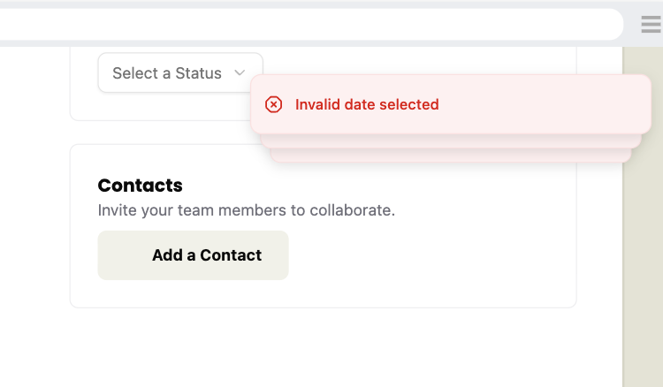

It's working, but there are a few problems.

- The toast messages overlap so you can only see the last one. (They expand on hover, but I think it'll be nice to see them all at once.)
- There are only three messages appearing, despite all the messages being in the DOM.
There is no clear way to dismiss them other than waiting.

So let's customize our toaster just a bit by looking at [the docs](https://sonner.emilkowal.ski/toaster#api-reference).

- To avoid the overlap we can add the `expand` prop.
- To increase the messages shown we can set `visibleToasts` to `4`.
- To have a close button we can add the `closeButton` prop.

```tsx title="src/app/layouts/InteriorLayout.tsx" {4-6}
<Toaster
  position="top-right"
  richColors
  expand
  visibleToasts={4}
  closeButton
/>
```

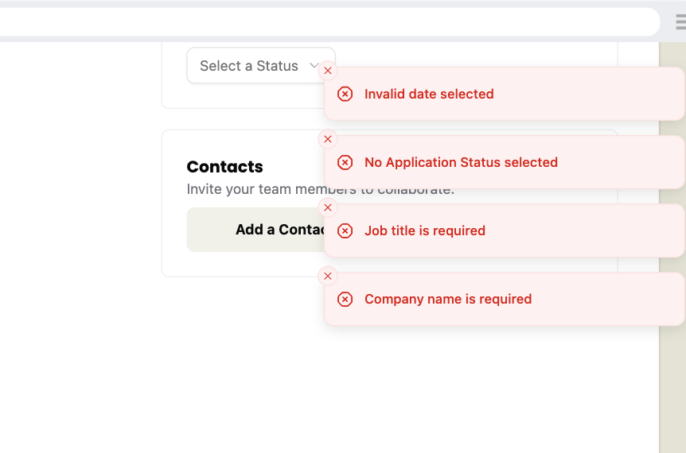

We don't need to actually make these changes as the default behavior is still accessible. But I just think this is nicer.

### How to wait for animation

If you run the doc generation script, you might notice one oddity, depending on how fast your computer is.

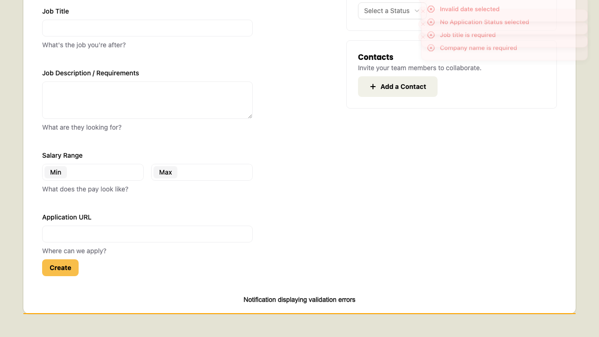

The problem is that the notifications fade in and animate, and Playwright/test2doc doesn't know to wait for the elements to stop animating. Additionally, the annotation for this screenshot doesn't render.

Sadly, I don't have a great solution for this. So here is a pragmatic solution that's not ideal but _works_.

```ts title="tests/loggedin/new-applications.spec.ts" {11-17}
await test.step("it will display a notification with error messages for fields that don't pass validation.", async () => {
  const toaster = page.getByRole(...selectors.regionToast)

  await expect(toaster).toContainText(
    "No Application Status selected",
  )
  await expect(toaster).toContainText("Invalid date selected")
  await expect(toaster).toContainText("Job title is required")
  await expect(toaster).toContainText("Company name is required")

  const lastNotification = toaster.getByRole("listitem").nth(-1)
  await lastNotification.hover()
  await screenshot(testInfo, lastNotification, {
    annotation: {
      text: "Notification displaying validation errors",
    },
  })
})
```

<details>

- Honestly, this feels a bit like testing implementation details.
  - Arbitrarily targeting a child element because the parent element can't be captured feels a bit dirty.
- Since the "listitem" is scoped to the toaster, and is tightly coupled with the toaster, I don't think this selector needs to be in our `util.ts` file.
- We grab the last element in the results with a `-1` to the `nth` method.
- Triggering the `hover` event will force playwright to wait for the element to become [stable](https://playwright.dev/docs/actionability).

</details>

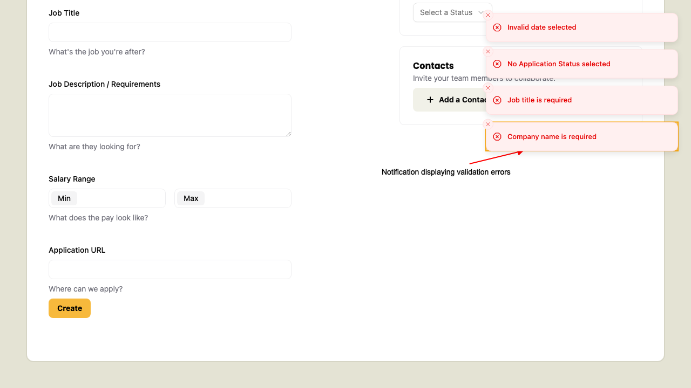

This is not ideal, but it at least works. If you know a better solution [please let me know](https://bsky.app/profile/dethstrobe.bsky.social).

With that we have our contacts added and form validating without crashing.

## Code on GitHub
You can find the final code for this step on [GitHub](https://github.com/dethstrobe/applywize2/tree/tutorial-7)

## Read More

- [React: useState Hook](https://react.dev/reference/react/useState)
- [React: Client Components](https://react.dev/reference/rsc/use-client)
- [MDN: aria-live](https://developer.mozilla.org/en-US/docs/Web/Accessibility/ARIA/Attributes/aria-live)
- [Shadcn/ui: Sheet](https://ui.shadcn.com/docs/components/sheet)
- [Shadcn/ui: Sonner (Toast)](https://ui.shadcn.com/docs/components/sonner)
- [MDN: mailto links](https://developer.mozilla.org/en-US/docs/Web/HTML/Reference/Elements/a#linking_to_email_addresses)
- [Playwright: Visual Comparisons](https://playwright.dev/docs/test-snapshots)
- [Playwright: Auto-waiting](https://playwright.dev/docs/actionability)
- [Tailwind CSS: Group Hover](https://tailwindcss.com/docs/hover-focus-and-other-states#styling-based-on-parent-state)

## What's Coming Next?

Now that we've finished up the New Application page, we'll be moving on to viewing details on existing applications and updating their content.

Next lesson we'll:

- How to view details on existing Applications
- How to reuse the Application Form to edit an existing Application
- How to update applications in the DB
