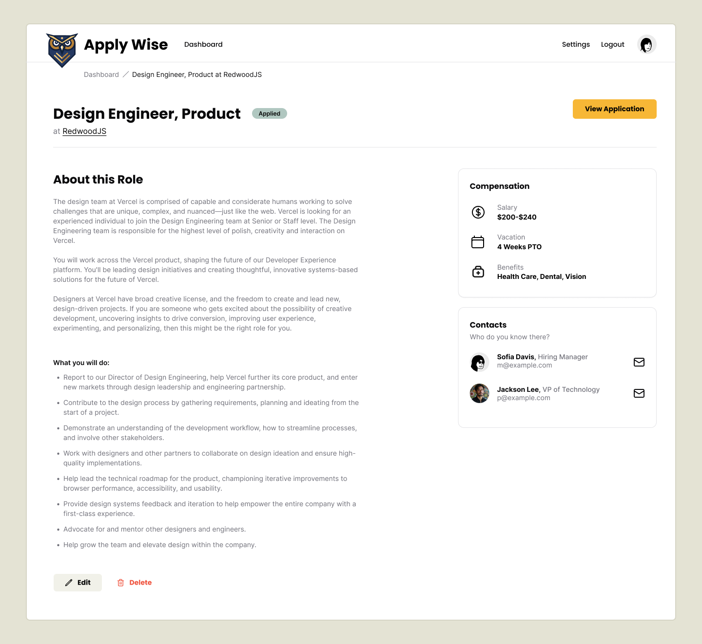
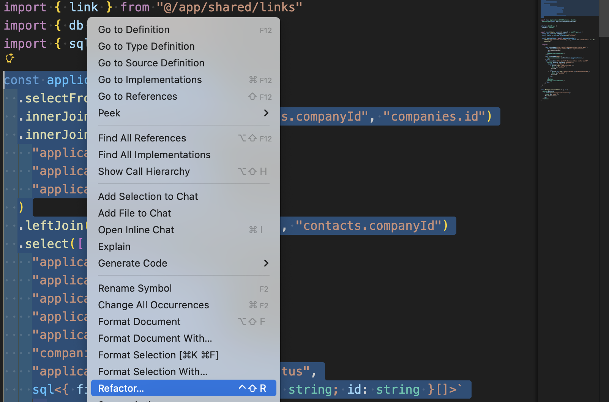
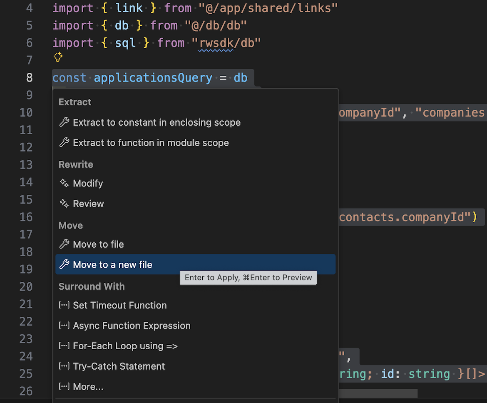
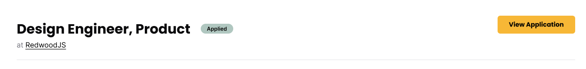
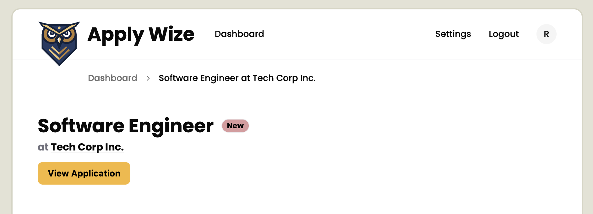
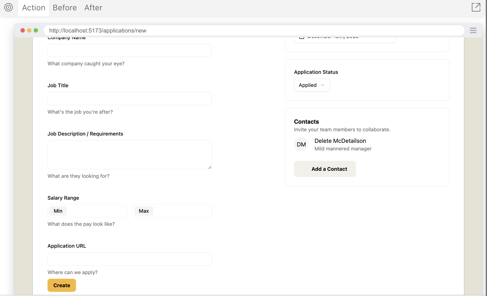
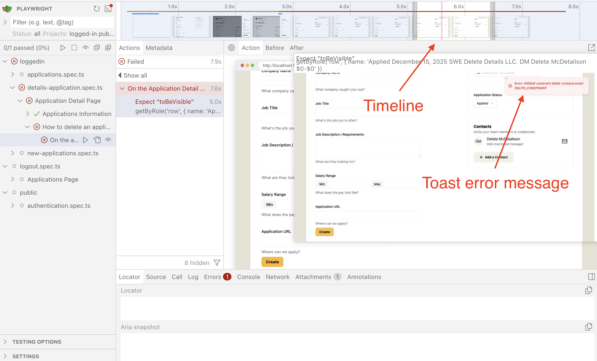
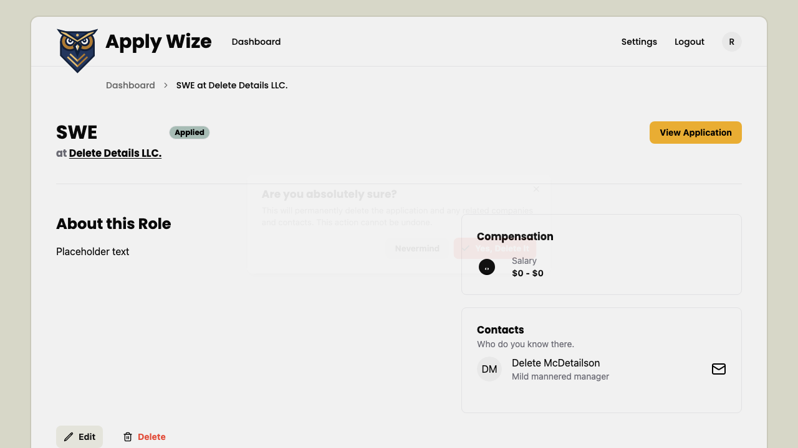
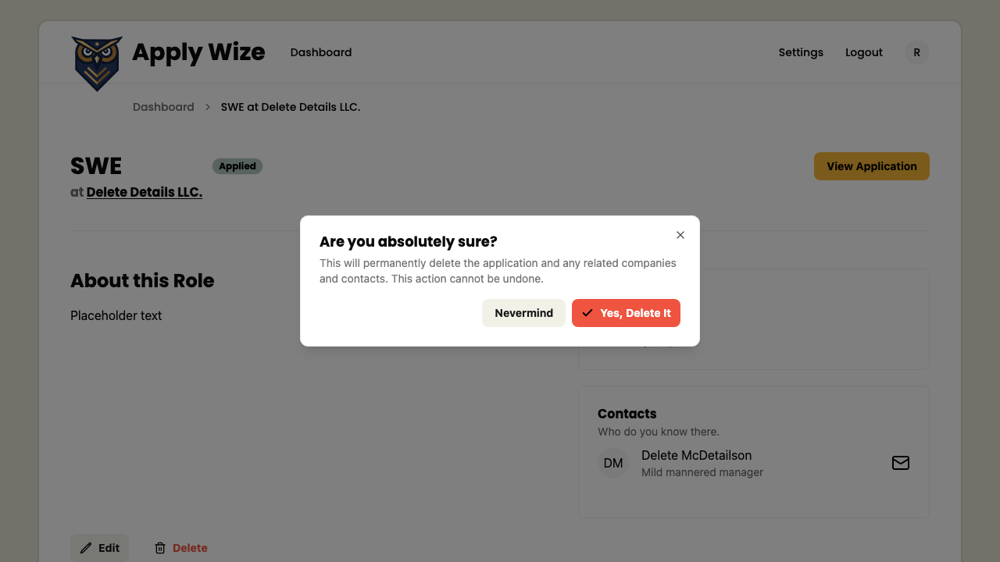

import Tabs from '@theme/Tabs';
import TabItem from '@theme/TabItem';

Can you believe it?! This is the last piece we need before deploying our application.

First, let's take a look at [what we're building in Figma](https://www.figma.com/design/nqBPIIfe0MO4W8zOfW4oae/RedwoodSDK---Applywize?node-id=12-327&t=OsDs4uB62Y6faUen-1).

<figure>

  
  <figcaption>Mockup from Figma detail page</figcaption>
</figure>

Pretty simple, right?

## Adding the Jobs Details Page route

Let's start with a simple naive test to see if we can navigate to the details page.

### Testing navigation

Looking at our mock, it appears the heading will be populated with the job title. So let's assert that our heading is populated with our seed application's job title.

And if we look back at our `ApplicationTable` component, we already implemented the link in [tutorial 5](/docs/tutorial-5#implement-link), but it doesn't actually go anywhere.

```tsx title="src/app/components/ApplicationsTable.tsx"
<a
  href={link("/applications/:id", { id: application.id })}
  aria-label={`View details for ${application.companyName} ${application.jobTitle}`}
>
  <Icon id="view" />
</a>
```

I admit, not very TDD to implement the link before we write the test, but to be fair, the functionality wouldn't work until now.

To start our testing, we'll add a selector, so we can click the details link.

```ts title="tests/util.ts"
linkDetails: [
  "link",
  { name: "View details for Tech Corp Inc. Software Engineer" },
],
headingDetails: ["heading", { name: "Software Engineer" }],
```

Now we'll make a new test file, `details-application.spec.ts`, and a test case to validate that we've implemented our navigation.

```ts title="tests/loggedin/details-application.spec.ts"
import { test, expect } from "@playwright/test"
import { withDocCategory, withDocMeta } from "@test2doc/playwright/DocMeta"
import { screenshot } from "@test2doc/playwright/screenshots"
import { selectors } from "../util"

test.describe(
  withDocCategory("Application Detail Page", {
    label: "Application Detail Page",
    position: 4,
    link: {
      type: "generated-index",
      description: "The full documentation for the Application Detail Page.",
    },
  }),
  () => {
    test.describe(
      withDocMeta("Applications Information", {
        description:
          "The Applications Information displayed on the Application Details Page.",
      }),
      () => {
        test("Displays application details", async ({ page }, testInfo) => {
          await test.step("On the Application page, ", async () => {
            await page.goto("/applications")
          })

          await test.step("to view a specific application's details; clicking the View Detail button (button with the eye icon).", async () => {
            const detailButton = page.getByRole(...selectors.linkDetails)
            await screenshot(testInfo, detailButton, {
              annotation: { text: "View Details Button" },
            })
            await detailButton.click()
          })

          await test.step("This will navigate to the Application Detail page.", async () => {
            const headingDetails = page.getByRole(...selectors.headingDetails)
            await expect(headingDetails).toBeVisible()
            await screenshot(testInfo, page)
          })
        })
      },
    )
  },
)
```

<details>

- It's a pretty simple test.
- Go to the dashboard.
- Click the application detail button.
- Assert that we see the detail header with the job title.

</details>

If we run the test now, we see it fails because it can't find the page. Perfect.

### Implementing the Application Detail page

We luckily took care of some of this already. The link already links to the correct URL. So we'll create a placeholder component and add it to our routes.

```tsx title="src/app/pages/applications/Details.tsx"
export const Details = () => {
  return <h1>Software Engineer</h1>
}
```

We'll just hard code the header for now. We'll worry about making this dynamic later.

Now we add our new component to the `worker.tsx`.

```tsx title="src/worker.tsx" {1,6}
import { Details } from "./app/pages/applications/Details"
...
prefix("/applications", [
  route("/", [isAuthenticated, List]),
  route("/new", [isAuthenticated, New]),
  route("/:id", [isAuthenticated, Details]),
]),
```

<details>

- We import our new component at the top of the file.
- We add a new route
  - To make this a dynamic route, set the path to `:id` which will turn whatever is given to be used as a URL parameter in our page.
  - **Note**: Order is important. `:id` acts as a wildcard matching any path, but if we want to have something specific happen at `/new` then that route needs to be defined before the dynamic route.

</details>

### Refactor routes

Just to show a slightly different way to handle route authentication, let's revisit our protected route test and do a small refactor.

```ts title="tests/public/authentication.spec.ts"
test.describe(withDocMeta("Protected Routes", {}), () => {
  test("Unauthenticated users are redirected to login page when accessing protected routes", async ({
    page,
  }) => {
    await test.step("- `/applications`", async () => {
      await page.goto("/applications")
      await expect(page).toHaveURL("/auth/login")
    })

    await test.step("- `/applications/new`", async () => {
      await page.goto("/applications/new")
      await expect(page).toHaveURL("/auth/login")
    })

    await test.step("- `/applications/:id`", async () => {
      await page.goto("/applications/test-id")
      await expect(page).toHaveURL("/auth/login")
    })

    await test.step("- `/settings`", async () => {
      await page.goto("/settings")
      await expect(page).toHaveURL("/auth/login")
    })

    await test.step("- `/account`", async () => {
      await page.goto("/account")
      await expect(page).toHaveURL("/auth/login")
    })

    await test.step("- `/`", async () => {
      await page.goto("/")
      await expect(page).toHaveURL("/auth/login")
    })
  })
})
```

Tests should be passing. Since we already implemented all this stuff from before.

Now let's make a small refactor to our route.

```tsx title="src/worker.tsx"
prefix("/applications", [
  isAuthenticated,
  route("/", List),
  route("/new", New),
  route("/:id", Details),
]),
```

We moved the `isAuthenticated` interceptor into the root of the `/applications` prefix so that it will protect all the routes under `/applications`.

To confirm that this actually works, you can comment out `isAuthenticated` and see the tests fail. (Don't forget to put `isAuthenticated` back after you're done to make the tests pass again.)

## The Jobs Details Page Header

### Testing displaying the breadcrumbs

Now that we have our navigation working, let's test that we display the different parts of the Details page.

Normally, I don't like to assert on copy (aka text). The important things to test are normally the actual functionality of the web app. However, much of the text for this page is dynamic and being populated from the DB.

So since most of this page is dynamic content that we are loading from the DB, and we do control the seed data and it's not likely to change arbitrarily (and if it did, we'd want to know); we'll be writing assertions to make sure that we are populating this page correctly.

We'll start with the breadcrumbs. We already tested this before, so we should be able to use the same selectors.

```ts title="tests/loggedin/details-application.spec.ts"
await test.step(`

  ### The Application Detail page

  This page shows the details for a single job application, including its status, metadata, and related actions.

  You can:
  - Navigate back using breadcrumbs
  `, async () => {
  await expect(
    page.getByRole(...selectors.navBreadcrumb),
  ).toContainText("Software Engineer at Tech Corp Inc.")
})
```

<details>

- We add some line breaks so that we have some space between this bulleted list section and the last section that documented how to get here.
- We just need to assert that the breadcrumbs are displaying the Job Title and the Company for the application for now.

</details>

### Implementing the breadcrumbs

We used shadcn/ui's breadcrumbs in the New Application page, and since we're using it here it might be worthwhile to turn the breadcrumb into a reusable component and it follows the principle of [_Don't Repeat Yourself_](https://en.wikipedia.org/wiki/Don%27t_repeat_yourself). Which is normally a good rule of thumb, but I'd recommend we follow [_Rule of Three_](https://en.wikipedia.org/wiki/Rule_of_three_(computer_programming)) instead.

To avoid bad abstractions we should wait until we have a third use case before we attempt to create a reusable component.

So, with that said, let's copy and paste our breadcrumb from `New.tsx`.

```tsx title="src/app/pages/applications/Details.tsx"
import {
  Breadcrumb,
  BreadcrumbItem,
  BreadcrumbLink,
  BreadcrumbList,
  BreadcrumbPage,
  BreadcrumbSeparator,
} from "@/app/components/ui/breadcrumb"
import { link } from "@/app/shared/links"

export const Details = () => {
  return (
    <>
      <div className="mb-12 -mt-7 pl-20">
        <Breadcrumb>
          <BreadcrumbList>
            <BreadcrumbItem>
              <BreadcrumbLink href={link("/applications")}>
                Dashboard
              </BreadcrumbLink>
            </BreadcrumbItem>
            <BreadcrumbSeparator />
            <BreadcrumbItem>
              <BreadcrumbPage>
                Software Engineer at Tech Corp Inc.
              </BreadcrumbPage>
            </BreadcrumbItem>
          </BreadcrumbList>
        </Breadcrumb>
      </div>
      <h1>Software Engineer</h1>
    </>
  )
}
```

<details>

- We import the `Breadcrumb` components and `link` function.
- The structure is exactly the same as in `New.tsx`
- The only difference is we swapped "Add an Application" for "Software Engineer at Tech Corp Inc."
- We wrap the return values in the `fragment` (`<>`) component.

</details>

### Refactor to make text dynamic

This hard coded solution makes the test pass, obviously. But what we really want is to populate this content from the DB. So let's start to wire up the DB calls to load the content based on the URL parameter we set up earlier in the routing logic.

We need the exact same join table logic we used in `List.tsx`. So let's move that query into its own file and reuse it.

> **Note**: I know I just advocated against DRYing up repeated code with the Breadcrumb component, but the difference between the Kysely query builder and the Breadcrumb component is that the query builder is quite complicated because of join tables and it's also much easier to extend because of the way it chains methods to modify the query. React Components are not easy to extend without modifying the rendered JSX.

Ignoring the Rule of Three will probably not come back to bite us later...

#### Easy refactor with VSCode

In case you didn't know, refactoring variables into their own component is an extremely common thing developers do. So common, in fact, that VSCode has built this functionality into the editor.

Open `List.tsx` and highlight our `applicationQuery` we built in [tutorial 5](/docs/tutorial-5).

Right-click and select "Refactor..." or press `Ctrl+Shift+R`.



This will open another contextual menu for Refactoring. And we want to select "Move to a new file".



After that it'll generate a new file for us, `src/app/pages/applications/applicationsQuery.tsx`

I personally removed the `x` from the extension turning it into `applicationsQuery.ts`.

<details>
<summary>The generated `applicationsQuery.ts` file.</summary>

```ts title="src/app/pages/applications/applicationsQuery.ts"
import { db } from "@/db/db"
import { sql } from "rwsdk/db"

export const applicationsQuery = db
  .selectFrom("applications")
  .innerJoin("companies", "applications.companyId", "companies.id")
  .innerJoin(
    "applicationStatuses",
    "applications.statusId",
    "applicationStatuses.id",
  )
  .leftJoin("contacts", "companies.id", "contacts.companyId")
  .select([
    "applications.id",
    "applications.dateApplied",
    "applications.jobTitle",
    "applications.salaryMin",
    "applications.salaryMax",
    "companies.name as companyName",
    "applicationStatuses.status as status",
    sql<{ firstName: string; lastName: string; id: string }[]>`
      COALESCE(
        json_group_array(
          CASE
            WHEN ${sql.ref("contacts.id")} IS NOT NULL
            THEN json_object(
              'firstName', ${sql.ref("contacts.firstName")},
              'lastName', ${sql.ref("contacts.lastName")},
              'id', ${sql.ref("contacts.id")}
            )
          END
        ) FILTER (WHERE ${sql.ref("contacts.id")} IS NOT NULL),
        '[]'
      )
    `.as("contacts"),
  ])
  .groupBy([
    "applications.id",
    "applications.dateApplied",
    "applications.jobTitle",
    "applications.salaryMin",
    "applications.salaryMax",
    "companies.name",
    "applicationStatuses.status",
  ])
```
</details>

Let's use our new `applicationQuery` builder in our `Details.tsx` file.

```tsx title="src/app/pages/applications/Details.tsx"
...
import { RequestInfo } from "rwsdk/worker"
import { applicationsQuery } from "./applicationsQuery"

export const Details = async ({ params }: RequestInfo<{ id: string }>) => {
  const details = await applicationsQuery
    .where("applications.id", "=", params.id)
    .executeTakeFirst()

  if (!details) {
    return <div>Application not found</div>
  }

  return (
    <>
      <div className="mb-12 -mt-7 pl-20">
        <Breadcrumb>
          <BreadcrumbList>
            <BreadcrumbItem>
              <BreadcrumbLink href={link("/applications")}>
                Dashboard
              </BreadcrumbLink>
            </BreadcrumbItem>
            <BreadcrumbSeparator />
            <BreadcrumbItem>
              <BreadcrumbPage>
                {details.jobTitle} at {details.companyName}
              </BreadcrumbPage>
            </BreadcrumbItem>
          </BreadcrumbList>
        </Breadcrumb>
      </div>
      <h1>{details.jobTitle}</h1>
    </>
  )
}
```

<details>

- We import `RequestInfo` as this is the props for the Detail component.
  - We pass `{ id: string }` to type the params.
- We needed to make our component `async` to fetch data from the DB.
- We import `applicationsQuery` from our newly created `applicationsQuery.ts` file.
  - In our component we add a `WHERE` clause to the query builder to filter for the application with the same `id` we get from our URL param.
  - Since it will only return a single item, we use `executeTakeFirst` method to return the first item it finds.
- To avoid TypeScript complaining we do a check to make sure `details` is defined, and if it's not we display an error message saying we can't find that application.
  - It will be worth testing for this later. But for now, we implement it to make TypeScript not complain.

</details>

Now the test is still passing and we can safely move to extend the test for more use cases.

### Testing the heading

Technically, we're already testing the heading. Let's talk for a moment about accessibility and visual hierarchy as it relates to the page header.

#### Accessibility trap
<figure>

  
  <figcaption>Mockup of detail page header</figcaption>
</figure>

This is not intuitive, but the text on the left side should all be read together. You see it, and you see a lot of visual hierarchy. So your gut instinct might be to make the Job Title an `<h1>` (which we already did), and the company name an `<h2>`. And the Application Status some other role, maybe a `status` or `alert`.

However, I’m going to suggest that this is wrong. The visual hierarchy is irrelevant for screen readers. All of these elements belong together and need each other to give context.

Hearing a screen reader say something like:

- "Heading level 1, Design Engineer, Product"
- "Status, Applied"
- "Heading level 2, at RedwoodJS"

This adds extra cognitive overhead to piece together what is going on.

What makes more sense is having the screen reader announce the entire thing together in one unified announcement.

So what we want is more like, "Heading level 1, Design Engineer, Product at RedwoodJS, Applied"

In one shot, the user knows exactly where they are and what the status is. We are using the `<h1>` not just as a "big text" container, but as a semantic summary of the entire page.

Also, if it's not obvious what role or semantic HTML element to use for an element on the page, don't overthink it. You can really hurt accessibility by adding unnecessary roles or aria attributes. A lot of times it is better to let the text on the page speak for itself.

#### The test step

Let's get started by asserting that the heading has the information we're expecting.

```ts title="tests/loggedin/details-application.spec.ts"
await test.step(`- See the job title, company, and application status
  `, async () => {
  await expect(
    page.getByRole(...selectors.headingDetails),
  ).toHaveText("Software Engineer at Tech Corp Inc. New")
})
```

We might have been able to make this more granular with the assertions, but I think treating it like a screen reader would read it is the expected behavior we want.

### Implementing the heading

Now, that we have an idea of what we want to test and a failing test case. We'll first just make the test pass.

```tsx title="src/app/pages/applications/Details.tsx"
<h1>
  {details.jobTitle} at {details.companyName} {details.status}
</h1>
```

Just that simple. The test is passing.

### Refactor the heading

Now, let's refactor the component to make it render how we want it to.

Let's copy the badge from the `ApplicationTable.tsx`

```tsx title="src/app/pages/applications/Details.tsx"
import {
  Breadcrumb,
  BreadcrumbItem,
  BreadcrumbLink,
  BreadcrumbList,
  BreadcrumbPage,
  BreadcrumbSeparator,
} from "@/app/components/ui/breadcrumb"
import { VariantProps } from "class-variance-authority"
...
<h1 className="grid grid-cols-[auto_1fr] grid-rows-2 gap-x-3 gap-y-1">
  <span className="page-title">{details.jobTitle}</span>{" "}
  <span className="row-start-2 col-start-1">
    <span className="text-zinc-500">at</span>{" "}
    <span className="underline underline-offset-2 decoration-1">
      {details.companyName}
    </span>
  </span>{" "}
  <Badge
    className="col-start-2 row-start-1 self-center"
    variant={
      details.status.toLowerCase() as VariantProps<
        typeof badgeVariants
      >["variant"]
    }
  >
    {details.status}
  </Badge>
</h1>
```

<details>

- We wrap our text with `<span>` elements and copy and paste our `<Badge>` element from the `ApplicationsTable.tsx` with the imports we need.
- In order to position the spans and badge, we set the `<h1>` to use CSS Grid by giving it the `grid`
  - `grid-cols-[auto_1fr]` tells the grid to set the first column of the grid to be any size, and the second column to fill as much of the row as possible.
  - `grid-rows-2` tells the grid to have 2 rows.
  - `gap-x-3` tells the gap on the x-axis to be `0.75rem` or `12px`.
  - `gap-y-1` tells the gap on the y-axis to be `0.25rem` or `4px`.
- To style the Job Title `<span>` like an `<h1>` we use our helper class we defined earlier, `page-title`.
- We give the `<span>` with the Company Name a few classes.
  - `row-start-2 col-start-1` tells the wrapper to start this element on the second row in the first column.
  - `text-zinc-500` to the span with the word "at".
  - `underline underline-offset-2 decoration-1` to the Company Name `<span>` to help make it look like the mocks without looking like a link. (It also might be worth talking with design about how necessary this underline _really_ is, but that is outside of the scope of this tutorial 😜)
- We give the Badge a few classes.
  - `col-start-2 row-start-1`, similar to the Company Name, this tells the browser to render this element at the second column on the first row.
  - `self-center` aligns the badge to the center of the row.

</details>

> **Note**: If it's not rendering correctly in Playwright, double check in your browser, as the CSS Grid and markup are correct, and it's probably just a caching issue in Playwright.

### Testing the link to the original job application

The next element we want to add is a button to the original application.

Let's add our selector next.

```ts title="tests/util.ts"
buttonViewApplication: ["link", { name: "View Application" }],
```

Now we add a simple assertion to find it and assert it's href.

```ts title="tests/loggedin/details-application.spec.ts"
await test.step(`- Button linking to the original job posting
  `, async () => {
  const jobLink = page.getByRole(...selectors.buttonViewApplication)
  await expect(jobLink).toHaveAttribute(
    "href",
    "https://example.com/jobs/123",
  )
})
```

<details>

A lot of times when we test links, we actually assert that the navigation works. In this case, we're just asserting that it has the `href` we're expecting because this is an external link to a third-party site. We can't reliably navigate to and test external sites. They could be slow, down, or their content could change arbitrarily. Instead, we just verify the link points to the correct URL.

Also, this is just dummy data anyway, and doesn't go anywhere. We're just making sure that the URL matches what's in the seed data.

</details>

### Implementing the link to the original job application

Now with our failing test, let's make it pass.

```tsx title="src/app/pages/applications/Details.tsx" {1,4,8-12}
import { Button } from "@/app/components/ui/button"
...
const details = await applicationsQuery
  .select("applications.postingUrl")
  .where("applications.id", "=", params.id)
  .executeTakeFirst()
...
<Button asChild>
  <a href={details.postingUrl ?? "#"} target="_blank" rel="noreferrer">
    View Application
  </a>
</Button>
```

<details>

- We import our shadcn/ui button. To make our link look like a button.
- We add a new `SELECT` to our `applicationsQuery` as we didn't need `postingUrl` field on the dashboard, but we do need it now.
- We add our Button and give it the prop `asChild` to use the link and style it to look like a button.
  - Since the `postingUrl` field can be null, we use the [nullish coalescing operator](https://developer.mozilla.org/en-US/docs/Web/JavaScript/Reference/Operators/Nullish_coalescing) (`??`) to add a fallback in the event that it is null. In our case, using `#` should just redirect back to the same page.
  - `target="_blank"` will open the link in a new tab/window.
  - `rel="noreferrer"` is only added because of an [outdated bug](https://mathiasbynens.github.io/rel-noopener/). This workaround is no longer needed and you can safely ignore it (assuming your users use modern web browsers that are post 2021).
    - If you want, you can disable the eslint rule that warns you about this.

</details>

### Refactor the link to the original job application

So currently, the button renders under the `<h1>` because heading elements are block elements and are usually full-width. So let's fix that.



So to fix this, we'll want to wrap the heading and link together and we'll use flexbox to position them.

```tsx title="src/app/pages/applications/Details.tsx" {1,26}
<header className="flex justify-between border-b-1 border-border pb-6 mb-12">
  <h1 className="grid grid-cols-[auto_1fr] grid-rows-2 gap-x-3 gap-y-1">
    <span className="page-title">{details.jobTitle}</span>{" "}
    <span className="row-start-2 col-start-1">
      <span className="text-zinc-500">at</span>{" "}
      <span className="underline underline-offset-2 decoration-1">
        {details.companyName}
      </span>
    </span>{" "}
    <Badge
      className="col-start-2 row-start-1 self-center"
      variant={
        details.status.toLowerCase() as VariantProps<
          typeof badgeVariants
        >["variant"]
      }
    >
      {details.status}
    </Badge>
  </h1>
  <Button asChild>
    <a href={details.postingUrl ?? "#"} target="_blank" rel="noreferrer">
      View Application
    </a>
  </Button>
</header>
```

<details>

- We add a `<header>` to wrap the `<h1>` and button.
  - We use a `<header>` in the `Header.tsx` which is used in the `InteriorLayout.tsx`.
  - `<header>` elements are landmarks. They're not meant to be unique. The one we use in the `InteriorLayout.tsx` is used for the Application, while the one we just added is used for the page.
  - Not all pages need `<header>` elements either. We're just using it here to mark that this is what this page is about.
  - We can position the items on the left and right side with `flex justify-between`.
  - Then, we can add a `1px` border to the bottom with `border-b-1` and give it a light gray color with `border-border`.
  - We also add some padding (`24px` on the bottom with `pb-6` and `48px` of margin on the bottom with `mb-12`).

</details>

At this point, our page header is done, styled, and displaying the expected data.

## The Main Content Area

Looking back at our Figma mocks, we can see we have a 2 column layout.

<figure>

  
  <figcaption>Mockup from Figma detail page</figcaption>
</figure>

Left side is the Job Details.

Right is Compensation and Contacts.

Lastly, there is a footer with Edit and Delete button.

### Testing the Job Details

We'll start with testing the left column's content.

Let's add a selector for this content.

```ts title="tests/util.ts"
mainDetails: ["main", { name: "About this Role" }],
```

<details>

So technically speaking, `<main>` elements do not need an accessible name, because you should only have one `<main>` element on a page.

With that said, we're going to add the accessible name so that we have confidence that we're on the Detail page. RedwoodSDK uses client side navigation, so does not do a complete rerender of the page. So adding a label for the `<main>` will help with orienting users to what page they're on.

</details>

Now to add our test step.

```ts title="tests/loggedin/details-application.spec.ts"
await test.step(`- Main section describing the role
  `, async () => {
  await expect(
    page.getByRole(...selectors.mainDetails),
  ).toContainText("Develop and maintain web applications.")
})
```

### Implementing Job Details

Now with our failing test, let's make it pass. Since we'll be using a similar two column layout, let's steal some of the classes from our `ApplicationForm.tsx`.

```tsx title="src/app/pages/applications/Details.tsx" {2,7,12}
const details = await applicationsQuery
  .select(["applications.postingUrl", "applications.jobDescription"])
  .where("applications.id", "=", params.id)
  .executeTakeFirst()
...
  </header>
  <div className="grid grid-cols-2 gap-x-50 mb-20">
    <main aria-labelledby="about-this-role">
      <h2 id="about-this-role" className="text-2xl mb-4">
        About this Role
      </h2>
      <p className="whitespace-pre-wrap">{details.jobDescription}</p>
    </main>
    <aside>Side bar</aside>
  </div>
</>
```

<details>

- Since we didn't need the `jobDescription` in the dashboard, we'll need to also add that to our query builder here.
- I reused the exact same classes from `ApplicationForm.tsx` to create the two column layout.
- We use the `<h2>` as the label for the `<main>` section.
- We give the `<h2>` the classes of `text-2xl mb-4` to make it look like a header that is just one level from our `page-title` class.
- We add `whitespace-pre-wrap` to the `<p>` element to allow it to render line breaks and white spacing how it was saved in the DB.
- We also added a placeholder for the sidebar content that we'll be replacing in just a moment.

</details>

### Refactor Content Area

While we're here, let's do one small refactor, and turn the 2 column layout classes into our `@layer components` section of our css.

```css title="src/app/styles.css"
@layer components {
  .two-column-grid {
    @apply grid grid-cols-2 gap-x-50 mb-20;
  }
  ...
```

Then we'll update the JSX in the `Details.tsx` and `ApplicationForm.tsx`

```tsx title="src/app/components/ApplicationForm.tsx"
<form action={submitApplicationForm} className="two-column-grid">
```

```tsx title="src/app/pages/applications/Details.tsx"
</header>
<div className="two-column-grid">
  <main aria-labelledby="about-this-role">
```

There we go, that'll make it easier when we need to apply more 2 column layouts for other internal application pages.

## The Sidebar Content Area

### Testing the Compensation

We're going to set up another accessible landmark area for compensation section.

We've actually been working with landmarks a bit already. Landmarks are areas of the page that the accessibility tree designates with special meaning and assistive tools can jump to, like bookmarks on a page.

The `<main>` and `<nav>` elements are landmarks, for example.

So, let's add a selector for our new Compensation landmark.

```ts title="tests/util.ts"
regionCompensation: ["region", { name: "Compensation" }],
```

And now we'll test it.

I should also point out, that the Figma mocks are displaying data that we currently do not capture in the new Application form. So we'll be ignoring testing or implementing things like PTO and benefits.

```ts title="tests/loggedin/details-application.spec.ts"
await test.step(`- Compensation showing the salary range
  `, async () => {
  await expect(
    page.getByRole(...selectors.regionCompensation),
  ).toContainText("80000 - 120000")
})
```

### Implement Compensation

```tsx title="src/app/pages/applications/Details.tsx"
import { Icon } from "@/app/components/Icon"
...
<aside>
  <section aria-labelledby="compensation-label" className="box">
    <h3 id="compensation-label" className="mb-4">
      Compensation
    </h3>
    <div className="flex items-center gap-6">
      <Icon id="salary" size={32} />
      <div className="text-sm">
        <h4 className="text-zinc-500">Salary</h4>
        <p className="font-bold">
          {details.salaryMin} - {details.salaryMax}
        </p>
      </div>
    </div>
  </section>
</aside>
```

<details>

- We import our `Icon` component at the top.
- Using the `<section>` element with a `aria-label`, tells screen readers to use this element as a landmark.
  - We use the `aria-labelledby` attribute to target an HTML element (in this case the `<h3>`) as our label.
  - We reuse the `box` class we designed earlier for the `ApplicationForm.tsx`
- To target the `<h3>` to use as a label, we need to give it an `id`.
  - We also give it the class of `mb-4` to add `16px` of bottom margin.
- We create a wrapper element to hold our salary content.
  - `flex items-center gap-6` is used to position the children elements inside our wrapper. Using the power of flexbox.
- Inside that wrapper is where we use our `<Icon>` component and set it to use the `Salary` icon.
- We wrap the text content and use the class of `text-sm` to make the text smaller than normal (`0.875rem` to be exact)
- We use an `<h4>` to help screen readers have context they're about to read Salary information.
  - We give the `<h4>` the class of `text-zinc-500` to mute the color of this heading like in the Figma mocks.
- We put the salary range in a `<p>` element and give it the `font-bold` class to match the Figma mocks.

</details>

Now the test is passing and we are also closely matching our Figma mocks.

### Testing Contacts

This looks similar to the Contacts section from the New Application form, so we can actually reuse some of our selectors from there.

But we didn't make that one a landmark, so we'll still want to add a selector for the Contacts section.

```ts title="tests/util.ts"
regionContacts: ["region", { name: "Contacts" }],
```

```ts title="tests/loggedin/details-application.spec.ts"
await test.step(`- Contacts section for related contacts
  `, async () => {
  await expect(
    page.getByRole(...selectors.regionContacts),
  ).toContainText("John Doe")
  await expect(
    page.getByRole(...selectors.buttonContactEmail),
  ).toHaveAttribute("href", "mailto:john.doe@example.com")
})
```

<details>

- Testing that we have John Doe in the Contacts section makes sense.
  - We could have also reused the `headingTestingContact`, but I wanted to explicitly test for the landmark.
  -  We could have also chained the landmark selector with the header selector, something like `page.getByRole(...selectors.regionContacts).getByRole(...selectors.headingTestingContact)` But I thought that might be a bit much. Feel free to do something like that if you want though.
- Since there is only one bit of real functionality on the contact section, the **email** button, we should test for it.

</details>

### Implement Contacts

Since we already built the Contacts section for the `ApplicationForm.tsx`, let's copy the JSX into our `Details.tsx`.

> **Note**: We could technically also abstract the Contact section into its own component. But let's try and follow the Rule of Three still, and only doing that once we have enough use cases to make a safe abstraction.

```tsx title="src/app/pages/applications/Details.tsx"
<section className="box" aria-labelledby="contact-label">
  <h3 id="contact-label">Contacts</h3>
  <p className="input-description">Who do you know there.</p>
  <ul aria-labelledby="contact-label">
    {details.contacts.map((contact) => (
      <li
        key={contact.id}
        className="relative group/card flex items-center gap-4 mb-6"
      >
        <Avatar className="size-10">
          <AvatarFallback>
            {contact.firstName.charAt(0)}
            {contact.lastName.charAt(0)}
          </AvatarFallback>
        </Avatar>
        <div className="flex-1">
          <h4>
            {contact.firstName} {contact.lastName}
          </h4>
          <p className="text-sm text-zinc-500">{contact.role}</p>
        </div>
        <a
          aria-label={`Email to ${contact.email}`}
          href={`mailto:${contact.email}`}
        >
          <Icon id="mail" size={24} />
        </a>
      </li>
    ))}
  </ul>
</section>
```

<details>
<summary>Wait, should we go back and add regions to the Form?</summary>

You might be thinking:

> But why didn't we make the `.box` elements into regions in the `ApplicationForm.tsx`?

Well, I'm glad you asked, hypothetical reader. The difference is the context.

On a form, the user is usually following a linear path—filling out one field after another. The inputs themselves provide the structure. But on a details page, the user is "scanning." They might want to jump straight to the Contacts to find an email address. By adding landmarks here, we're acknowledging that the intent of this page is different.

It can be argued that we should go back and make the UX more consistent, but for now, we're prioritizing the specific needs of the person consuming this data over the person entering it. And since the contexts are different, it makes sense that these two experiences should be slightly different.

</details>

#### Oh, that's why we follow the Rule of Three

If you'll notice, TypeScript is complaining that `role` and `email` don't exist on our `contact` property.

Do you remember when I foolishly said that the `applicationsQuery` is different from abstracting a component, and we can ignore the Rule of Three. It turns out I lied to you. We did actually abstract the query builder too early.

I thought I was being reasonable when I extracted this logic. But it turns out I've just proven why we follow the Rule of Three, even for query builders.

So, we have 3 possible solutions here:

1. **Build a better abstraction**: Like a function that builds our query builder.
2. **De-abstract**: Break these query builders into their own parts in their own files.
3. **Only take out the logic that's not repeated**: Move the join logic to their specific implementations in their own files.

If we go with **1**, a bold move to think we know what a better abstraction looks like when we literally just proved that predicting the future is hard.

Option **3** is not as terrible, as there is obviously some duplicate logic going on here.

But we're going with option **2**. It's just safer. We can always abstract later. There is also the benefit of keeping all the code co-located into their respective files.

#### De-abstract the query builder

You can use git to undo the changes we made to `List.tsx`

```sh
git restore src/app/pages/applications/List.tsx
```

This only works if you haven't staged your changes yet.

<details>
<summary>A copy of `List.tsx` in case you can't `git restore` the file</summary>

```tsx title="src/app/pages/applications/List.tsx"
import { ApplicationsTable } from "@/app/components/ApplicationsTable"
import { Icon } from "@/app/components/Icon"
import { Button } from "@/app/components/ui/button"
import { link } from "@/app/shared/links"
import { db } from "@/db/db"
import { sql } from "rwsdk/db"
import { RequestInfo } from "rwsdk/worker"

const applicationsQuery = db
  .selectFrom("applications")
  .innerJoin("companies", "applications.companyId", "companies.id")
  .innerJoin(
    "applicationStatuses",
    "applications.statusId",
    "applicationStatuses.id",
  )
  .leftJoin("contacts", "companies.id", "contacts.companyId")
  .select([
    "applications.id",
    "applications.dateApplied",
    "applications.jobTitle",
    "applications.salaryMin",
    "applications.salaryMax",
    "companies.name as companyName",
    "applicationStatuses.status as status",
    sql<{ firstName: string; lastName: string; id: string }[]>`
      COALESCE(
        json_group_array(
          CASE
            WHEN ${sql.ref("contacts.id")} IS NOT NULL
            THEN json_object(
              'firstName', ${sql.ref("contacts.firstName")},
              'lastName', ${sql.ref("contacts.lastName")},
              'id', ${sql.ref("contacts.id")}
            )
          END
        ) FILTER (WHERE ${sql.ref("contacts.id")} IS NOT NULL),
        '[]'
      )
    `.as("contacts"),
  ])
  .groupBy([
    "applications.id",
    "applications.dateApplied",
    "applications.jobTitle",
    "applications.salaryMin",
    "applications.salaryMax",
    "companies.name",
    "applicationStatuses.status",
  ])

export type ApplicationsWithRelations = Awaited<
  ReturnType<typeof applicationsQuery.execute>
>

export const List = async ({ request }: RequestInfo) => {
  const url = new URL(request.url)
  const status = url.searchParams.get("status")

  const applications = await applicationsQuery
    .where("applications.archived", "=", status === "archived" ? 1 : 0)
    .execute()

  return (
    <>
      <div className="flex justify-between items-center mb-5">
        <h1 className="page-title" id="all-applications">
          All Applications
        </h1>
        <NewApplicationButton />
      </div>
      <div className="mb-8">
        <ApplicationsTable applications={applications} />
      </div>
      <div className="flex justify-between items-center mb-10">
        <Button asChild variant="secondary">
          {status === "archived" ?
            <a href={link("/applications")}>
              <Icon id="archive" />
              Active
            </a>
          : <a href={`${link("/applications")}?status=archived`}>
              <Icon id="archive" />
              Archive
            </a>
          }
        </Button>
        <NewApplicationButton />
      </div>
    </>
  )
}

const NewApplicationButton = () => (
  <Button asChild>
    <a href={link("/applications/new")}>
      <Icon id="plus" />
      New Application
    </a>
  </Button>
)
```
</details>

You can delete `src/app/pages/applications/applicationsQuery.ts`

Now to add the query builder to `Details.tsx`

```tsx title="src/app/pages/applications/Details.tsx"
const details = await db
  .selectFrom("applications")
  .where("applications.id", "=", params.id)
  .innerJoin("companies", "applications.companyId", "companies.id")
  .innerJoin(
    "applicationStatuses",
    "applications.statusId",
    "applicationStatuses.id",
  )
  .leftJoin("contacts", "companies.id", "contacts.companyId")
  .select([
    "applications.id",
    "applications.dateApplied",
    "applications.jobTitle",
    "applications.salaryMin",
    "applications.salaryMax",
    "applications.postingUrl",
    "applications.jobDescription",
    "companies.name as companyName",
    "applicationStatuses.status as status",
    sql<
      {
        firstName: string
        lastName: string
        id: string
        role: string
        email: string
      }[]
    >`
      COALESCE(
        json_group_array(
          CASE
            WHEN ${sql.ref("contacts.id")} IS NOT NULL
            THEN json_object(
              'firstName', ${sql.ref("contacts.firstName")},
              'lastName', ${sql.ref("contacts.lastName")},
              'id', ${sql.ref("contacts.id")},
              'role', ${sql.ref("contacts.role")},
              'email', ${sql.ref("contacts.email")}
            )
          END
        ) FILTER (WHERE ${sql.ref("contacts.id")} IS NOT NULL),
        '[]'
      )
    `.as("contacts"),
  ])
  .groupBy([
    "applications.id",
    "applications.dateApplied",
    "applications.jobTitle",
    "applications.salaryMin",
    "applications.salaryMax",
    "companies.name",
    "applicationStatuses.status",
  ])
  .executeTakeFirst()
```

And with that, our test is now passing.

## The footer

### Testing the Edit and Delete buttons

The last thing left to implement is the footer with the **Edit** and **Delete** buttons. We'll keep this simple and just assert their existence for now. We'll be implementing their actual functionality in a dedicated test case.

Let's add some selectors for our new buttons.

```ts title="tests/util.ts"
buttonDetailsEdit: ["link", { name: "Edit" }],
buttonDetailsDelete: ["button", { name: "Delete" }],
```

<details>

- The Edit button is actually a link.
- The Delete button is really a button.

</details>

Now for the tests.

```ts title="tests/loggedin/details-application.spec.ts"
await test.step(`- Edit to update the application details
  `, async () => {
  const editButton = page.getByRole(...selectors.buttonDetailsEdit)
  await expect(editButton).toBeVisible()
})
await test.step(`- Delete to remove the application
  `, async () => {
  const deleteButton = page.getByRole(
    ...selectors.buttonDetailsDelete,
  )
  await expect(deleteButton).toBeVisible()
})
```

### Implementing the Edit and Delete buttons

```tsx title="src/app/pages/applications/Details.tsx" {3-12}
      </section>
    </aside>
    <footer className="flex items-center gap-5 col-span-full">
      <Button asChild variant="secondary">
        <a href="#">
          <Icon id="edit" size={16} /> Edit
        </a>
      </Button>
      <Button variant="link" className="text-destructive">
        <Icon id="trash" size={16} /> Delete
      </Button>
    </footer>
  </div>
</>
```

<details>

- We add a `<footer>`, which is another landmark.
  - `<footer>` is a good choice here because it's not just the end of the page, but also because it encapsulates metadata about the page or page level actions. In our case, **actions**.
  - `flex items-center gap-5` is used to position the buttons within the footer
  - `col-span-full` is for making sure this row is full width in the parent's CSS Grid.
- For the **Edit** button, we are using our `<Button>` shadcn/ui component again.
  - We set the variant to `secondary`. Following the styling from our Figma mocks.
  - We give use the `asChild` so that we inherit the child element and only style it.
  - We want to make this link to an edit page later, for now we just give it a placeholder URL.
  - We use our `<Icon>` component with the `edit` icon.
- For the **Delete** button, we're doing something similar.
  - We *don't* use `asChild`, because this component will be opening a dialog to confirm deletion. We'll be implementing that in a bit.
  - Ironically, we using the `link` variant, even though this is not a link. It's just a stylistic choice made by design to show this is a tertiary action, it doesn't hurt usability and we get the style we want.
  - We use the `text-destructive` class to make the button red, to act as a warning to the user this is a destructive act (and we'll also prompt the use to confirm they want to perform this action later.)
  - For the icon, we'll be using the `trash` icon.

</details>

Having done that, we've fully tested and documented what appears on this page. But we're not done just yet.

## How to delete an application

How about we make that **Delete** button work. We want to click the Delete button and open a confirmation modal to make sure the user wants to delete the application.

But, there is a problem. If we want our tests to remain idempotent, we do not wish to delete the seed data, because that would make the details page test we just created fail.

So we're going to need to add a new application data just for testing the delete (and later edit).

### How to add test data

We've done something similar before. For the creation of an application. We used `better-sqlite3` to delete the records in the DB. This is not ideal, but it is an acceptable tradeoff.

There are two philosophies for testing applications. **White box** and **black box** testing.

**White box** testing exposes some of the implementation details, in our case we can edit the DB directly. This does couple implementation details to testing somewhat. This does mean that tests do have a dependency on the underlying technology, and thus making refactoring the app and the tests more difficult.

**Black box** testing on the other hand, the application logic is a complete mystery to the tests suite. Tests can only interact with the exposed surface, which does produce confidence that the application works how a user would use the app. It also allows for safe refactoring, as if we wanted to swap SQLite with Postgres, for example, we can and the user and tests would never know the difference.

The problem is that black box testing is slower because we'll need to interact with the app through it's exposed interfaces (in our case a web app). It also means that adding a record can potentially be broken by changes to the exposed interface.

For example, if we add a new required field to the application form, and we rely on that to add our test data to edit and delete, we'll end up breaking our edit and delete flows, even though technically, there is nothing wrong with them. It does sometimes make diagnosing why a test broke much harder.

For our purposes, I'll be showing you both approaches. We're going to use white box testing first for the Delete flow, and then we'll refactor it to use a application fixture for adding the test data to get black box testing.

### White box: Setting up database fixtures

```ts title="tests/loggedin/details-application.spec.ts"
import Database from "better-sqlite3"
import { TESTPASSKEY } from "@/scripts/test-passkey"
...
test.describe("How to delete an application", () => {
  test("On the application detail page", async ({ page }, testInfo) => {
    await test.step("On the Application Detail page, ", async () => {
      const db = new Database(getTestDbPath())
      const appId = "00000000-0000-0000-0000-000000000000"
      const companyId = "00000000-0000-0000-0000-000000000001"
      const contactId = "00000000-0000-0000-0000-000000000002"
      const timeAdded = "2025-11-29T18:47:11.742Z"
      db.prepare(
        `INSERT OR REPLACE INTO companies (id, name, createdAt, updatedAt) VALUES ('${companyId}', 'Delete Details LLC.', '${timeAdded}', '${timeAdded}');`,
      ).run()
      db.prepare(
        `INSERT OR REPLACE INTO contacts (id, firstName, lastName, email, role, companyId, createdAt, updatedAt) VALUES ('${contactId}', 'Delete', 'McDetailson', 'umacdetailson@deletedetailsllc.com', 'Mild mannered manager', '${companyId}', '${timeAdded}', '${timeAdded}');`,
      ).run()
      db.prepare(
        `INSERT OR REPLACE INTO applications (id, userId, statusId, companyId, jobTitle, jobDescription, salaryMin, salaryMax, postingUrl, dateApplied, createdAt, updatedAt, archived) VALUES ('${appId}', '${TESTPASSKEY.userId}', 1, '${companyId}', 'SWE', 'Placeholder text', '$0', '$0', 'https://example.com/career/12345', '${timeAdded}', '${timeAdded}', '${timeAdded}', 0);`,
      ).run()

      await page.goto(`/applications/${appId}`)
    })
  })
})
```

<details>

- We import our `better-sqlite3` package and the `TESTPASSKEY` we generated back in [tutorial 5](/docs/tutorial-5#adding-to-users-and-credentials).
- We follow a similar pattern as in our `seed.ts` file, just doing it in a `better-sqlite3` way.
  - Similar to the `seed.ts` file, we generate the `company` data, then the `contact` data, and lastly the `application` data. In order of which models have dependencies on other models.
  - Since our `seed.ts` file already handles user generation, we don't need to worry about that again.
  - We hardcode the UUIDs to make sure these rows are consistently generated.
- Lastly, we navigate to our details page for our newly inserted Application.

</details>

### Testing the delete dialog

So we'll be using our shadcn/ui dialog to act as a confirmation modal to just make sure that the user confirms they want to delete the application.

So let's add a selector to confirm that the dialog opens.

```ts title="tests/util.ts"
headingDetailsDeleteDialog: ["heading", { name: "Are you absolutely sure?" }],
```

Now we'll implement a test to click and assert our dialog opened.

```ts title="tests/loggedin/details-application.spec.ts"
await test.step("click the Delete button to open a confirmation dialog.", async () => {
  const deleteButton = page.getByRole(...selectors.buttonDetailsDelete)
  await screenshot(testInfo, deleteButton, {
    annotation: { text: "Click the Delete button" },
  })

  await deleteButton.click()

  await expect(
    page.getByRole(...selectors.headingDetailsDeleteDialog),
  ).toBeVisible()
})
```

<details>

A pretty simple test. We just take a screenshot of the button, click the button, and assert that our header confirmation modal appears.

</details>

### Implementing the delete dialog

We already installed the shadcn/ui dialog, so we'll first start by copying the implementation from [shadcn/ui the docs](https://ui.shadcn.com/docs/components/dialog#usage).

```tsx title="src/app/pages/applications/Details.tsx" {1-8,19-30}
import {
  Dialog,
  DialogContent,
  DialogDescription,
  DialogHeader,
  DialogTitle,
  DialogTrigger,
} from "@/app/components/ui/dialog"
...
<footer className="flex items-center gap-5 col-span-full">
  <Button asChild variant="secondary">
    <a href="#">
      <Icon id="edit" size={16} /> Edit
    </a>
  </Button>
  <Button variant="link" className="text-destructive">
    <Icon id="trash" size={16} /> Delete
  </Button>
  <Dialog>
    <DialogTrigger>Open</DialogTrigger>
    <DialogContent>
      <DialogHeader>
        <DialogTitle>Are you absolutely sure?</DialogTitle>
        <DialogDescription>
          This action cannot be undone. This will permanently delete
          your account and remove your data from our servers.
        </DialogDescription>
      </DialogHeader>
    </DialogContent>
  </Dialog>
</footer>
```

<details>

- We import the dialog components from our component directory.
- We copy and paste the example from the shadcn/ui in to our footer.

</details>

This is a good start. Now, let's get our test passing by moving our button into the `<DialogTrigger>`.

```diff title="src/app/pages/applications/Details.tsx"
- <Button asChild variant="secondary">
-   <a href="#">
-     <Icon id="edit" size={16} /> Edit
-   </a>
- </Button>
 <Dialog>
-   <DialogTrigger>Open</DialogTrigger>
+   <DialogTrigger asChild>
+     <Button variant="link" className="text-destructive">
+       <Icon id="trash" size={16} /> Delete
+     </Button>
+   </DialogTrigger>
   <DialogContent>
     <DialogHeader>
       <DialogTitle>Are you absolutely sure?</DialogTitle>
       <DialogDescription>
-         This action cannot be undone. This will permanently delete
-         your account and remove your data from our servers.
+         This will permanently delete the application and any related
+         companies and contacts. This action cannot be undone.
       </DialogDescription>
     </DialogHeader>
   </DialogContent>
 </Dialog>
```

<details>

- We add the Delete button inside the `<DialogTrigger>`
- We give the `<DialogTrigger>` the `asChild` prop to use our Button instead of the default button.
- We also update the `<DialogDescription>` copy to something more relevant for our use case.

</details>

With that our test is now passing. Let's extend the test to add a bit more functionality.

### Testing the Delete dialog buttons

Now we need our dialog to actually do something, we'll add and document that the action buttons exist, and later we'll test their functionality.

We'll start by adding some selectors.

```ts title="tests/util.ts"
buttonDetailsCancel: ["button", { name: "Nevermind" }],
buttonDetailsConfirm: ["button", { name: "Yes, Delete It" }],
```

Now to take a screenshot to document dialog.

```ts title="tests/loggedin/details-application.spec.ts"
await test.step("In the dialog, you can either cancel or confirm the deletion.", async () => {
  const cancelButton = page.getByRole(...selectors.buttonDetailsCancel)
  const confirmButton = page.getByRole(
    ...selectors.buttonDetailsConfirm,
  )

  await expect(cancelButton).toBeVisible()
  await expect(confirmButton).toBeVisible()

  await screenshot(testInfo, page)
})
```

### Implement Delete dialog buttons

```tsx title="src/app/pages/applications/Details.tsx" {5,19-25}
import {
  Dialog,
  DialogContent,
  DialogDescription,
  DialogFooter,
  DialogHeader,
  DialogTitle,
  DialogTrigger,
} from "@/app/components/ui/dialog"
...
<DialogContent>
  <DialogHeader>
    <DialogTitle>Are you absolutely sure?</DialogTitle>
    <DialogDescription>
      This will permanently delete the application and any related
      companies and contacts. This action cannot be undone.
    </DialogDescription>
  </DialogHeader>
  <DialogFooter>
    <Button variant="secondary">Nevermind</Button>
    <Button variant="destructive">
      <Icon id="check" />
      Yes, Delete It
    </Button>
  </DialogFooter>
</DialogContent>
```

<details>

- We import the `DialogFooter` component.
- We implement the `<DialogFooter>` just below the `<DialogHeader>`
  - We add out 2 buttons inside the `<DialogFooter>`

</details>

Test is now passing. Let's extend to test their functionality next.

### Testing the Cancel button's functionality

For the most part the cancel button is pretty self-explanatory, but we still want to document the functionality in the test to prevent regressions.

```ts title="tests/loggedin/details-application.spec.ts"
await test.step("Clicking 'Nevermind' will close the dialog without deleting the application.", async () => {
  const cancelButton = page.getByRole(...selectors.buttonDetailsCancel)
  await cancelButton.click()

  await expect(
    page.getByRole(...selectors.headingDetailsDeleteDialog),
  ).toBeHidden()

  // Open the dialog again for the next step
  await page.getByRole(...selectors.buttonDetailsDelete).click()
})
```

<details>

- We can technically refactor the `cancelButton` since it is reused in multiple steps. But I figured we'd define it again within this step.
- We just need to make sure the header doesn't appear.
- We click the **Delete** button again to open the modal again.

</details>

### Implement the Cancel button's functionality

```tsx title="src/app/pages/applications/Details.tsx" {3,13,15}
import {
  Dialog,
  DialogClose,
  DialogContent,
  DialogDescription,
  DialogFooter,
  DialogHeader,
  DialogTitle,
  DialogTrigger,
} from "@/app/components/ui/dialog"
...
<DialogFooter>
  <DialogClose asChild>
    <Button variant="secondary">Nevermind</Button>
  </DialogClose>
  <Button variant="destructive">
    <Icon id="check" />
    Yes, Delete It
  </Button>
</DialogFooter>
```

<details>

Since we're using a [React Server component](https://react.dev/reference/rsc/server-components) we don't actually have access to `useState`. Luckily, shadcn/ui does give us access to a button wrapper that can control the dialog with the `<DialogClose>`

If hypothetically, we did want to control the open and close state ourselves, we'd need to refactor this into a client component.

</details>

### Testing the Delete functionality

Now on to the real meat and potatoes of this modal. We need to test that we are able to delete this application entry from the DB.

But before we can delete the application, we should take the time to confirm that the application we want to delete is actually in the dashboard. So when we navigate back after we initiate the delete action, we can see it gone.

```ts title="tests/util.ts"
applicationRowToDelete: [
  "row",
  { name: "SWE Delete Details LLC. DM Delete McDetailson $0-$0" },
],
```

Now we'll need to also add an assertion when we are first on the dashboard, so we can assert that it is removed from the dashboard later.

```ts title="tests/loggedin/details-application.spec.ts" {2-5}
  ...
  await page.goto(`/applications`)
  await expect(
    page.getByRole(...selectors.applicationRowToDelete),
  ).toBeVisible()
  await page.goto(`/applications/${appId}`)
})
```

<details>

We can also add a click on the details link instead of just navigating to the details page. But I thought adding a selector to test functionality we've already covered in another test seemed unnecessary.

</details>

Now that we know that the application we generated appears on the dashboard, we can be confident that we can remove it.

```ts title="tests/loggedin/details-application.spec.ts"
await test.step("Clicking 'Yes, Delete It' will remove the application and redirect you to the dashboard.", async () => {
  const confirmButton = page.getByRole(
    ...selectors.buttonDetailsConfirm,
  )
  await confirmButton.click()

  // Verify that we are redirected back to the applications list
  await expect(
    page.getByRole(...selectors.headingApplications),
  ).toBeVisible()
  await expect(
    page.getByRole(...selectors.applicationRowToDelete),
  ).toBeHidden()
})
```

### Implement the Delete functionality

Now, with our failing test case, let's start by creating a server function to delete the application.

```ts title="src/app/pages/applications/functions.ts"
export const deleteApplication = async (applicationId: string) => {
  const { request } = requestInfo

  await db.deleteFrom("applications").where("id", "=", applicationId).execute()

  const url = new URL(link("/applications"), request.url)
  return Response.redirect(url.href, 302)
}
```

<details>

- We'll need to pass in the `applicationId`, which we know we'll have access to in the URL params we read from our `Details.tsx` file.
- Then we use our Kysely query builder to build a query to delete the application based on the `applicationId`.
  - We also might want to later restrict the delete command to the person that created the application. But currently that's not a requirement.
- Lastly we build a redirect to the dashboard if the deletion is successful.

</details>

Now we just need to implement this into our `Details.tsx`. But we have some limitations because the `Details.tsx` is a RSC.

One of the problems is that the server function (like the `deleteApplication` we just implemented) need to have an argument passed to it.

The `createApplication` server function we made earlier is meant for a form action. And we can technically make our delete button into a submit button and wrap it in a form. But, I'm going to recommend we go with a slightly different solution.

We're going to abstract our delete button into its own client component. One of the problems is the way that RSC serialize server functions make it so we need to pass the function as is to the client component because RSC cannot serialize [closures](https://developer.mozilla.org/en-US/docs/Web/JavaScript/Guide/Closures). Meaning we can't wrap the server function in another function, something like `() => deleteApplication(id)` won't work. Only certain values can be serialized and cross the RSC to client component boundary, and closures are not one of those values.

So to get around this, if we create a closure inside a client component, there won't be any need to serialize and pass values between the RSC and client component. So we'll be doing that.

Let's create a new component that encapsulates the delete button.

```tsx title="src/app/components/DeleteApplicationButton.tsx"
"use client"

import { deleteApplication } from "../pages/applications/functions"
import { Icon } from "./Icon"
import { Button } from "./ui/button"

interface props {
  applicationId: string
}

export const DeleteApplicationButton = ({ applicationId }: props) => (
  <Button
    variant="destructive"
    onClick={() => void deleteApplication(applicationId)}
  >
    <Icon id="check" />
    Yes, Delete It
  </Button>
)
```

<details>

- To make sure this is a client component we use the `"use client"` directive at the top of the file.
- We need to import our `deleteApplication` from our `functions.ts` file.
- There is only one prop for this component, the `applicationId`.
- The only difference between this and our previous delete button is adding the `onClick` prop.
  - React TypeScript is particular about that a click handler function must return undefined.
  - Also we have an eslint rule that insists that we `await` all promises.
  - to avoid both the TS error and eslint error, we use the `void` keyword to satisfy both of these conditions to tell them to ignore the returned type of our server function.

</details>

At this point, we now have the deletion test working.

### Black box refactor

Now that we have a white box implementation, I'll show you how to make this test into a black box.

We're essentially going to be recreating our creation test, just without any of the test documentation.

```ts title="tests/fixtures.ts"
import { expect, Page } from "@playwright/test"
import { selectors } from "./util"

interface ApplicationFixture {
  companyName: string
  jobTitle: string
  jobDescription: string
  salaryMin: string
  salaryMax: string
  applicationUrl: string
  contactFirstName: string
  contactLastName: string
  contactEmail: string
  contactRole: string
}

export const createApplicationFixture = async (
  page: Page,
  application: ApplicationFixture,
) => {
  await page.goto("/applications")
  const testDateRow = page.getByRole("row", {
    name: `Applied December 15, 2025 ${application.jobTitle} ${application.companyName} ${application.contactFirstName.charAt(0)}${application.contactLastName.charAt(0)} ${application.contactFirstName} ${application.contactLastName} ${application.salaryMin}-${application.salaryMax}`,
  })
  if ((await testDateRow.all()).length > 0) {
    return
  }

  await page.clock.setFixedTime(new Date("2025-12-14T10:00:00"))
  await page.goto("/applications/new")

  // Fill out the application form
  await page
    .getByRole(...selectors.inputCompanyName)
    .fill(application.companyName)
  await page.getByRole(...selectors.inputJobTitle).fill(application.jobTitle)
  await page
    .getByRole(...selectors.inputJobDescription)
    .fill(application.jobDescription)
  await page.getByRole(...selectors.inputSalaryMin).fill(application.salaryMin)
  await page.getByRole(...selectors.inputSalaryMax).fill(application.salaryMax)
  await page
    .getByRole(...selectors.inputApplicationUrl)
    .fill(application.applicationUrl)

  // Set the date applied to today
  await page.getByRole(...selectors.buttonDatePicker).click()
  await page.getByRole(...selectors.buttonDate).click()
  await page.keyboard.press("Escape")

  // Set application status to "Applied"
  await page.getByRole(...selectors.comboboxStatus).click()
  await page
    .getByRole(...selectors.options)
    .nth(1)
    .click()

  // Add contact
  await page.getByRole(...selectors.buttonAddContact).click()
  await page
    .getByRole(...selectors.inputFirstName)
    .fill(application.contactFirstName)
  await page
    .getByRole(...selectors.inputLastName)
    .fill(application.contactLastName)
  await page.getByRole(...selectors.inputRole).fill(application.contactRole)
  await page.getByRole(...selectors.inputEmail).fill(application.contactEmail)
  await page.getByRole(...selectors.buttonCreateContact).click()
  await expect(
    page.getByRole("heading", {
      name: application.contactFirstName + " " + application.contactLastName,
    }),
  ).toBeVisible()

  await page.getByRole(...selectors.buttonCreate).click()
  await expect(testDateRow).toBeVisible()
}
```

<details>

- This is basically doing the same thing as the "How to add a new Job Application" test case from `new-applications.spec.ts`.
- Since we are dynamically creating the content, some selectors we'll have to generate, like the selecting the row or asserting that the contact has been added.
- To also attempt to keep creation idempotent, we see if the data has already been added to the dashboard. This way if the test failed to use this data, we don't add more identical data on a rerun.

</details>

Since we can no longer rely on the UUID, we'll need to implement a selector to click on the view details button.

```ts title="tests/util.ts"
buttonViewDetailsForDeleteApplication: [
  "link",
  { name: "View details for Delete Details LLC. SWE" },
],
```

Next let's implement this new fixture and selector into our deletion test.

```ts title="tests/loggedin/details-application.spec.ts"
await test.step("On the Application Detail page, ", async () => {
  await createApplicationFixture(page, {
    companyName: "Delete Details LLC.",
    jobTitle: "SWE",
    jobDescription: "Placeholder text",
    salaryMin: "$0",
    salaryMax: "$0",
    applicationUrl: "https://example.com/career/12345",
    contactFirstName: "Delete",
    contactLastName: "McDetailson",
    contactEmail: "umacdetailson@deletedetailsllc.com",
    contactRole: "Mild mannered manager",
  })

  await expect(
    page.getByRole(...selectors.applicationRowToDelete),
  ).toBeVisible()
  await page
    .getByRole(...selectors.buttonViewDetailsForDeleteApplication)
    .click()
})
```

<details>

- We remove our database queries with `better-sqlite3`.
- We need to click the view details button to navigate to the details page now.

</details>

And now, the test passes!

But...if you run it again...it fails...

So what's going on here?

If you look at Playwright's debugger, it's not very helpful.

```sh
Error: expect(locator).toBeVisible() failed

Locator: getByRole('row', { name: 'Applied December 15, 2025 SWE Delete Details LLC. DM Delete McDetailson $0-$0' })
Expected: visible
Timeout: 5000ms
Error: element(s) not found

Call log:
  - Expect "toBeVisible" with timeout 5000ms
  - waiting for getByRole('row', { name: 'Applied December 15, 2025 SWE Delete Details LLC. DM Delete McDetailson $0-$0' })
```

The only thing we can tell is that it didn't find the row.

If we look at a screenshot, it shows it failed to navigate to the dashboard. Which makes sense why it couldn't find our row.



The only thing this screenshot tells us is that it appears that the form has been cleared after the submission failed.

But if you take a look, there is also a timeline in Playwright, and we can see how the UI looked after submitting when our toast message shows errors.



Looks like we hit a SQL error. We tried to add a contact with the same email, because we don't clean up contacts.

I'd like to hope we'd have found this error eventually and create a specific regression test to prevent it from happening. But since we found this while implementing our black box fixture, we'll need to address it now. Which is honestly a good thing and even shows the value of using black box testing over white box testing.

So, we have a few options to fix this:
1. Delete the contacts associated with the application.
2. We can put in some logic to handle the use case when we add a contact that uses the same email.
3. We can remove the unique constraint on the contact email column.

<details>

There is actually one more option, which is to generate a unique email every run. But as discussed in [tutorial 6](/docs/tutorial-6#handling-repeated-runs), this is a perfectly valid strategy, but we're going to try and avoid it. This way documentation doesn't contain seemingly random strings that readers of the docs have to attempt to understand it's purpose, when it's just there for testing.

</details>

Option 1, might solve it for this test case, but doesn't actually solve it if someone attempts to add the same contact with the same email. So I don't think this is an ideal solution.

Option 3, is a bad idea and almost defeats the point of using a relational database, as it'll end up creating duplicate contacts, which we want to avoid.

So option 2 it is. We actually had to solve this for inserting companies in our [application creation submission](/docs/tutorial-6#implementing-the-form-submit). All we need to do is something similar.

```ts title="src/app/pages/applications/functions.ts" {12}
if (validatedContacts.length > 0) {
  await db
    .insertInto("contacts")
    .values(
      validatedContacts.map((contact) => ({
        ...contact,
        companyId,
        createdAt: contact.createdAt ?? now,
        updatedAt: now,
      })),
    )
    .onConflict((oc) => oc.column("email").doNothing())
    .execute()
}
```

With that the details test is passing!

But! The new application test is failing... Turns out we reused `john.doe@example.com` for the seed data and for the new application creation.

This is actually a good thing, because this is a bug because the test data was wrong. This is a great example of why it's important for test isolation and to not reusing test data between test cases. We also, probably don't want to accidentally associate or switch contacts between companies either.

The `new-applications.spec.ts` uses `john.doe@example.com` in quite a few places. While the seed data is only used for the details page test which only asserts of the email once. For ease of refactoring, and we're already making changes to the `details-application.spec.ts` for this section of the tutorial anyway, I'm going to recommend we change the seed data and change the assertions in our detail test cases.

```ts title="src/scripts/seed.ts"
await db
  .insertInto("contacts")
  .values({
    id: crypto.randomUUID(),
    firstName: "John",
    lastName: "Doe",
    email: "john.doe@techcorp.com",
    role: "Hiring Manager",
    companyId: companyId,
    createdAt: timeAdded,
    updatedAt: timeAdded,
  })
  .execute()
```

We'll need to add a new selector to select this email link.

```ts title="tests/util.ts"
buttonDetailsContactEmail: ["link", { name: "Email to john.doe@techcorp.com" }],
```

Lastly, update the test case for the email link.

```ts title="tests/loggedin/details-application.spec.ts" {7-8}
await test.step(`- Contacts section for related contacts
  `, async () => {
  await expect(
    page.getByRole(...selectors.regionContacts),
  ).toContainText("John Doe")
  await expect(
    page.getByRole(...selectors.buttonDetailsContactEmail),
  ).toHaveAttribute("href", "mailto:john.doe@techcorp.com")
})
```

Then, make sure you reseed the DB before running the tests again.

<Tabs groupId="package-managers">
  <TabItem value="npm" label="npm" default>
```sh
npm run seed
```
  </TabItem>
  <TabItem value="yarn" label="yarn">
```sh
yarn seed
```
  </TabItem>
  <TabItem value="pnpm" label="pnpm">
```sh
pnpm seed
```
  </TabItem>
</Tabs>

Now, tests should be passing consistently.

## How to edit an application

The last thing we need to implement to get all our basic [CRUD operations](https://en.wikipedia.org/wiki/Create,_read,_update_and_delete) is update. So in order to update an application we'll implement an edit page. To get us started, let's test the navigation.

### Testing navigating to the edit page

We'll first need our selectors. We'll implement selectors for test data, and a selector for the heading for the edit page.

```ts title="tests/util.ts"
applicationRowToEdit: [
  "row",
    {
      name: "DevOps Engineer Edit Details Co. EM Edit McEditson $0-$0",
    },
  ],
buttonViewDetailsForEditApplication: [
  "link",
  { name: "View details for Edit Details Co. DevOps Engineer" },
],
headingEditApplication: ["heading", { name: "Edit DevOps Engineer" }],
```

Now, we reuse our `createApplicationFixture` to generate an application for us to edit and test clicking the edit button to navigate to the edit page.

```ts title="tests/loggedin/details-application.spec.ts"
test.describe("How to edit an application", () => {
  test("On the application detail page", async ({ page }, testInfo) => {
    await test.step("On the Application Detail page, ", async () => {
      await createApplicationFixture(page, {
        companyName: "Edit Details Co.",
        jobTitle: "DevOps Engineer",
        jobDescription: "Placeholder text",
        salaryMin: "$0",
        salaryMax: "$0",
        applicationUrl: "https://example.com/career/12345",
        contactFirstName: "Edit",
        contactLastName: "McEditson",
        contactEmail: "umceditson@editdetailsco.com",
        contactRole: "Editorial Manager",
      })

      await expect(
        page.getByRole(...selectors.applicationRowToEdit),
      ).toBeVisible()
      await page
        .getByRole(...selectors.buttonViewDetailsForEditApplication)
        .click()
    })

    await test.step("click the Edit link to navigate to the edit application page.", async () => {
      const editButton = page.getByRole(...selectors.buttonDetailsEdit)
      await screenshot(testInfo, editButton, {
        annotation: { text: "Edit Application Button" },
      })

      await editButton.click()

      await expect(
        page.getByRole(...selectors.headerEditApplication),
      ).toBeVisible()
    })
  })
})
```

Now our test is failing...but for the wrong reasons...

```sh
Error: locator.scrollIntoViewIfNeeded: Error: strict mode violation: getByRole('link', { name: 'Edit' }) resolved to 3 elements:
    1) <span role="link" aria-current="page" aria-disabled="true" data-slot="breadcrumb-page" class="text-foreground font-normal">…</span> aka getByRole('link', { name: 'DevOps Engineer at Edit' })
    2) <a href="mailto:umceditson@editdetailsco.com" aria-label="Email to umceditson@editdetailsco.com">…</a> aka getByRole('link', { name: 'Email to umceditson@' })
    3) <a href="#" data-slot="button" class="font-bold inline-flex items-center justify-center gap-2 whitespace-nowrap rounded-md text-sm transition-all disabled:pointer-events-none disabled:opacity-50 [&_svg]:pointer-events-none [&_svg:not([class*='size-'])]:size-4 shrink-0 [&_svg]:shrink-0 outline-none focus-visible:border-ring focus-visible:ring-ring/50 focus-visible:ring-[3px] aria-invalid:ring-destructive/20 dark:aria-invalid:ring-destructive/40 aria-invalid:border-destructive bg-secondary text-sec…>…</a> aka getByRole('link', { name: 'Edit', exact: true })

Call log:
  - waiting for getByRole('link', { name: 'Edit' })
```

Turns out Playwright's fuzzy matching for the accessible name is a bit too aggressive when we add the word _Edit_ into our test data. So we can either remove the word edit, or we can just be more explicit with our selecting of the Edit button. We're going to go with being more explicit.

```ts title="tests/util.ts"
buttonDetailsEdit: ["link", { name: "Edit", exact: true }],
```

Now, the test is failing for the right reasons. That it can't find our edit page header.

### Implementing navigating to the edit page

We've added new pages before, so this should be pretty easy.

We add the route to the link function.

```ts title="src/app/shared/links.ts" {9}
export const link = defineLinks([
  "/",
  "/auth/login",
  "/auth/signup",
  "/auth/logout",
  "/applications",
  "/applications/new",
  "/applications/:id",
  "/applications/:id/edit",
  "/legal/privacy",
  "/legal/terms",
  "/settings",
  "/account",
])
```

We update the link in the `Details.tsx`.

```tsx title="src/app/pages/applications/Details.tsx" {2}
<Button asChild variant="secondary">
  <a href={link("/applications/:id/edit", { id: details.id })}>
    <Icon id="edit" size={16} /> Edit
  </a>
</Button>
```

<details>

Note that the URL param is passed in as the second argument to the `link` function.

</details>

Now we just create a placeholder component.

```ts title="src/app/pages/applications/Edit.tsx"
export const Edit = () => {
  return <h1>Edit DevOps Engineer</h1>
}
```

And add that placeholder component to the `worker.tsx`.

```ts title="src/worker.tsx" {1,8}
import { Edit } from "./app/pages/applications/Edit"
...
prefix("/applications", [
  isAuthenticated,
  route("/", List),
  route("/new", New),
  route("/:id", Details),
  route("/:id/edit", Edit),
]),
```

Now the test is passing.

### Testing for breadcrumbs

Our old friend breadcrumbs are on this page. So let's see about a quick test to validate them.

This is going to follow a similar pattern as before. However, there is one small difference, and that is there will be 2 links in the breadcrumbs this time, one back to the dashboard, and one back to the details page.

We already have a selector for the link to the dashboard, so we'll need to add another selector for the link back to the details page.

```ts title="tests/util.ts"
linkEditApplicationDetails: [
  "link",
  { name: "DevOps Engineer at Edit Details Co." },
],
```

Now we'll add our test step to document this behavior.

```ts title="tests/loggedin/details-application.spec.ts"
await test.step("\n\nOn the top of the Edit Application page, is a breadcrumb navigation to navigate back to previous pages.", async () => {
  const breadcrumb = page.getByRole(...selectors.navBreadcrumb)
  await expect(
    breadcrumb.getByRole(...selectors.linkDashboard),
  ).toHaveAttribute("href", "/applications")
  await expect(
    breadcrumb.getByRole(...selectors.linkEditApplicationDetails),
  ).toHaveAttribute("href", /^\/applications\/([^/]{36})$/)
  await expect(breadcrumb).toContainText("Edit Application")
})
```

<details>

I'd like to take the time to point out that our regex is extremely naive; we're basically checking to ensure that the url contains `/applications/` + 36 other characters (the number of characters in our UUID).

It's not strictly accurate, but it is close enough for our purposes. Feel free to replace it with a more accurate regex if you like.

</details>

### Implementing breadcrumbs

We can copy most of the JSX from the `New.tsx`.

```tsx title="src/app/pages/applications/Edit.tsx"
import {
  Breadcrumb,
  BreadcrumbItem,
  BreadcrumbLink,
  BreadcrumbList,
  BreadcrumbPage,
  BreadcrumbSeparator,
} from "@/app/components/ui/breadcrumb"
import { link } from "@/app/shared/links"
import { RequestInfo } from "rwsdk/worker"

export const Edit = ({ params }: RequestInfo<{ id: string }>) => {
  return (
    <>
      <div className="mb-12 -mt-7 pl-20">
        <Breadcrumb>
          <BreadcrumbList>
            <BreadcrumbItem>
              <BreadcrumbLink href={link("/applications")}>
                Dashboard
              </BreadcrumbLink>
            </BreadcrumbItem>
            <BreadcrumbSeparator />
            <BreadcrumbItem>
              <BreadcrumbLink
                href={link("/applications/:id", { id: params.id })}
              >
                DevOps Engineer at Edit Details Co.
              </BreadcrumbLink>
            </BreadcrumbItem>
            <BreadcrumbSeparator />
            <BreadcrumbItem>
              <BreadcrumbPage>Edit Application</BreadcrumbPage>
            </BreadcrumbItem>
          </BreadcrumbList>
        </Breadcrumb>
      </div>
      <div className="pb-6 mb-8 border-b-1 border-border">
        <h1 className="page-title">Edit DevOps Engineer</h1>
        <p className="page-description">
          Edit the details of this job application.
        </p>
      </div>
    </>
  )
}
```

<details>

- We import our breadcrumb components, `link` function, and `RequestInfo`.
- We add `RequestInfo` to the props of this component, since we'll need the URL param for the link back to the detail page.
- The breadcrumbs are almost the same structure as the `New.tsx` and `Details.tsx` with extra `BreadcrumbLink` added in the middle to link back to the Application detail page.
- The `<h1>` and `<p>` tag and the wrapper for these elements are the same as in the `New.tsx` file, just with the copy changed to match this page.

</details>

Now the test is passing. Now, let's make this a bit more dynamic.

### Refactor to get the application details from the DB

Remember that time when we tried to abstract out the query builder from the `List.tsx` and then we found that the implementation diverged quite a bit from what we needed... This time is different, because we need the **exact** same data as the `Details.tsx`. So that is actually safe to abstract out!

But...how about we pay that price later (tech debt, _hooray_) and for now, we just copy and paste the query builder from `Details.tsx`. We can DRY this up later, when we're 100% confident that the implementation won't change.

```tsx title="src/app/pages/applications/Edit.tsx"
import {
  Breadcrumb,
  BreadcrumbItem,
  BreadcrumbLink,
  BreadcrumbList,
  BreadcrumbPage,
  BreadcrumbSeparator,
} from "@/app/components/ui/breadcrumb"
import { link } from "@/app/shared/links"
import { db } from "@/db/db"
import { sql } from "rwsdk/db"
import { RequestInfo } from "rwsdk/worker"

export const Edit = async ({ params }: RequestInfo<{ id: string }>) => {
  const details = await db
    .selectFrom("applications")
    .where("applications.id", "=", params.id)
    .innerJoin("companies", "applications.companyId", "companies.id")
    .innerJoin(
      "applicationStatuses",
      "applications.statusId",
      "applicationStatuses.id",
    )
    .leftJoin("contacts", "companies.id", "contacts.companyId")
    .select([
      "applications.id",
      "applications.dateApplied",
      "applications.jobTitle",
      "applications.salaryMin",
      "applications.salaryMax",
      "applications.postingUrl",
      "applications.jobDescription",
      "companies.name as companyName",
      "applicationStatuses.status as status",
      sql<
        {
          firstName: string
          lastName: string
          id: string
          role: string
          email: string
        }[]
      >`
          COALESCE(
            json_group_array(
              CASE
                WHEN ${sql.ref("contacts.id")} IS NOT NULL
                THEN json_object(
                  'firstName', ${sql.ref("contacts.firstName")},
                  'lastName', ${sql.ref("contacts.lastName")},
                  'id', ${sql.ref("contacts.id")},
                  'role', ${sql.ref("contacts.role")},
                  'email', ${sql.ref("contacts.email")}
                )
              END
            ) FILTER (WHERE ${sql.ref("contacts.id")} IS NOT NULL),
            '[]'
          )
        `.as("contacts"),
    ])
    .groupBy([
      "applications.id",
      "applications.dateApplied",
      "applications.jobTitle",
      "applications.salaryMin",
      "applications.salaryMax",
      "companies.name",
      "applicationStatuses.status",
    ])
    .executeTakeFirst()

  if (!details) {
    return <div>Application not found</div>
  }

  return (
    <>
      <div className="mb-12 -mt-7 pl-20">
        <Breadcrumb>
          <BreadcrumbList>
            <BreadcrumbItem>
              <BreadcrumbLink href={link("/applications")}>
                Dashboard
              </BreadcrumbLink>
            </BreadcrumbItem>
            <BreadcrumbSeparator />
            <BreadcrumbItem>
              <BreadcrumbLink
                href={link("/applications/:id", { id: params.id })}
              >
                {details.jobTitle} at {details.companyName}
              </BreadcrumbLink>
            </BreadcrumbItem>
            <BreadcrumbSeparator />
            <BreadcrumbItem>
              <BreadcrumbPage>Edit Application</BreadcrumbPage>
            </BreadcrumbItem>
          </BreadcrumbList>
        </Breadcrumb>
      </div>
      <div className="pb-6 mb-8 border-b-1 border-border">
        <h1 className="page-title">Edit {details.jobTitle}</h1>
        <p className="page-description">
          Edit the details of this job application.
        </p>
      </div>
    </>
  )
}
```

<details>

- We copy the exact implementation of the query builder from `Details.tsx`
- We also replaced the details page link in the breadcrumb to make the job title and company name dynamic from the DB.
- And we also made the `<h1>`'s text dynamic from the DB as well.

</details>

### Refactor the Application Form

We need to test for two things;

1. Can we populate the form with the data from the DB.
2. Can we change the form inputs

There is also a third thing, can we persist that data in the DB, but we'll be handling that at the end. For now, we just want to tackle those first 2 use cases in our next tests.

#### Testing the Company Name

Since testing will be a bit more involved compared to the new application flow, we'll break each field test into its own step, but when it documents it, since the inputs are pretty self explanatory, we'll just make the doc page generate a bulleted list.

```ts title="tests/loggedin/details-application.spec.ts"
await test.step(`### Fields you can edit on the application

  You can modify the following fields:
  - Company Name
  `, async () => {
  const companyNameInput = page.getByRole(...selectors.inputCompanyName)

  await expect(companyNameInput).toHaveValue("Edit Details Co.")

  await companyNameInput.clear()
  await companyNameInput.fill("Edited Details Company")
})
```

#### Implement Company Name

Alright, I don't really want to reimplement the `ApplicationForm.tsx` for the edit page, so we're going to do some refactoring to make it work for the edit page.

First thing we're going to do it abstract our shared queries into another file.

I know I warned about premature abstraction and why we should follow the rule of three, but I'm pretty confident that these queries will not diverge because their use cases are exactly the same between the pages.

We're going to move the `applicationStatusesQuery` out of the `New.tsx` (because we'll need this same query for `Edit.tsx`) and the details query we build for the `Details.tsx` and `Edit.tsx` in to another file.

<details>

You can move the queries outside of the components and then use the  **Refactor...** command to move these variables into a new file. Like how we did [earlier](#easy-refactor-with-vscode). But for simplicity and to not make this tutorial insanely long, I'll just give you the files to copy and paste.

But learning how to refactor and knowing how to use your IDE is important to speed up development, so I'd recommend practicing. But I'm not the code police, so do what you feel comfortable with.

</details>

```ts title="src/app/pages/applications/queries.ts"
import { db } from "@/db/db"
import { sql } from "rwsdk/db"

export const applicationStatusesQuery = db
  .selectFrom("applicationStatuses")
  .selectAll()

export const detailsQuery = db
  .selectFrom("applications")
  .innerJoin("companies", "applications.companyId", "companies.id")
  .innerJoin(
    "applicationStatuses",
    "applications.statusId",
    "applicationStatuses.id",
  )
  .leftJoin("contacts", "companies.id", "contacts.companyId")
  .select([
    "applications.id",
    "applications.dateApplied",
    "applications.jobTitle",
    "applications.salaryMin",
    "applications.salaryMax",
    "applications.postingUrl",
    "applications.jobDescription",
    "companies.name as companyName",
    "applicationStatuses.status as status",
    sql<
      {
        firstName: string
        lastName: string
        id: string
        role: string
        email: string
      }[]
    >`
          COALESCE(
            json_group_array(
              CASE
                WHEN ${sql.ref("contacts.id")} IS NOT NULL
                THEN json_object(
                  'firstName', ${sql.ref("contacts.firstName")},
                  'lastName', ${sql.ref("contacts.lastName")},
                  'id', ${sql.ref("contacts.id")},
                  'role', ${sql.ref("contacts.role")},
                  'email', ${sql.ref("contacts.email")}
                )
              END
            ) FILTER (WHERE ${sql.ref("contacts.id")} IS NOT NULL),
            '[]'
          )
        `.as("contacts"),
  ])
  .groupBy([
    "applications.id",
    "applications.dateApplied",
    "applications.jobTitle",
    "applications.salaryMin",
    "applications.salaryMax",
    "companies.name",
    "applicationStatuses.status",
  ])
```

```tsx title="src/app/pages/applications/New.tsx" {1,4,9}
import { applicationStatusesQuery } from "./queries"

export const New = async () => {
  const applicationStatuses = await applicationStatusesQuery.execute()
  return (
    <>
      <div className="mb-12 -mt-7 pl-20">
      ...
      <ApplicationForm applicationStatusesQuery={applicationStatuses} />
    </>
  )
}
```

```tsx title="src/app/pages/applications/Details.tsx" {1,4-5}
import { detailsQuery } from "./queries"

export const Details = async ({ params }: RequestInfo<{ id: string }>) => {
  const details = await detailsQuery
    .where("applications.id", "=", params.id)
    .executeTakeFirst()
```

```tsx title="src/app/pages/applications/Edit.tsx" {1,4-5,12,19}
import { applicationStatusesQuery, detailsQuery } from "./queries"

export const Edit = async ({ params }: RequestInfo<{ id: string }>) => {
  const details = await detailsQuery
    .where("applications.id", "=", params.id)
    .executeTakeFirst()

  if (!details) {
    return <div>Application not found</div>
  }

  const applicationStatuses = await applicationStatusesQuery.execute()

  return (
    <>
      <div className="mb-12 -mt-7 pl-20">
      ...
      </div>
      <ApplicationForm applicationStatusesQuery={applicationStatuses} />
    </>
  )
}
```

And with this refactor, we currently still have parity with before, and running the edit, only the edit test should be failing. Now we'll refactor the `ApplicationForm.tsx` to take in default values.

```tsx title="src/app/components/ApplicationForm.tsx" {1,8,13,21}
import { detailsQuery } from "@/app/pages/applications/queries"

interface ApplicationFormProps {
  applicationStatusesQuery: {
    id: number
    status: string
  }[]
  defaultValues?: Awaited<ReturnType<typeof detailsQuery.execute>>[number]
}

export const ApplicationForm = ({
  applicationStatusesQuery,
  defaultValues,
}: ApplicationFormProps) => {
  ...
   <input
      type="text"
      id="company"
      name="company"
      aria-describedby="company-hint"
      defaultValue={defaultValues?.companyName}
    />
```

<details>

- We're importing our `detailQuery` to use this for type checking, similar to what we did in `List.tsx` back in [tutorial 5](/docs/tutorial-5#refactor-application-table).
- We add a new prop, `defaultValues` which uses the `detailQuery` type that is generated from the `execute` method.
  - Also, to not break backwards compatibility with our use case in `New.tsx` we make this `defaultValues` prop optional.
- We lastly just need to set the `defaultValue` prop on the company `<input>` element to the `defaultValues.companyName`.
  - We're also using the [optional chaining operator](https://developer.mozilla.org/en-US/docs/Web/JavaScript/Reference/Operators/Optional_chaining) to make sure we don't run into a run time error if `defaultValues` is `undefined`. (Accessing a method on a `undefined` value will throw an error and stop all execution of JS on your page).

</details>

Now we just need to set the `defaultValue` in our `Edit.tsx`

```tsx title="src/app/pages/applications/Edit.tsx"
<ApplicationForm
  applicationStatusesQuery={applicationStatuses}
  defaultValues={details}
/>
```

And with that, the current test case is passing.

#### Testing the rest of the input fields

Now that we got that pattern down, let's take care of the test of the input fields on the left column.

```ts title="tests/loggedin/details-application.spec.ts"
await test.step(`- Job Title
  `, async () => {
  const jobTitleInput = page.getByRole(...selectors.inputJobTitle)

  await expect(jobTitleInput).toHaveValue("DevOps Engineer")

  await jobTitleInput.clear()
  await jobTitleInput.fill("Edited Developer Operations Engineer")
})

await test.step(`- Job Description / Requirements
  `, async () => {
  const jobDescriptionInput = page.getByRole(
    ...selectors.inputJobDescription,
  )

  await expect(jobDescriptionInput).toHaveValue("Placeholder text")

  await jobDescriptionInput.clear()
  await jobDescriptionInput.fill(
    "Edited description for the developer operations engineer role.",
  )
})

await test.step(`- Salary Range
  `, async () => {
  const salaryMinInput = page.getByRole(...selectors.inputSalaryMin)
  const salaryMaxInput = page.getByRole(...selectors.inputSalaryMax)

  await expect(salaryMinInput).toHaveValue("$0")
  await expect(salaryMaxInput).toHaveValue("$0")

  await salaryMinInput.fill("120000")
  await salaryMaxInput.fill("160000")
})

await test.step(`- Application URL
  `, async () => {
  const applicationUrlInput = page.getByRole(
    ...selectors.inputApplicationUrl,
  )

  await expect(applicationUrlInput).toHaveValue(
    "https://example.com/career/12345",
  )

  await applicationUrlInput.fill(
    "https://example.com/careers/edited-12345",
  )
})
```

#### Implementing the rest of the input fields

Now let's set the default values of the rest of the inputs.

```tsx title="src/app/components/ApplicationForm.tsx" {8,21,43,56,72}
<div className="field">
  <label htmlFor="jobTitle">Job Title</label>
  <input
    type="text"
    id="jobTitle"
    name="jobTitle"
    aria-describedby="jobTitle-hint"
    defaultValue={defaultValues?.jobTitle ?? ""}
  />
  <p className="input-description" id="jobTitle-hint">
    What&apos;s the job you&apos;re after?
  </p>
</div>

<div className="field">
  <label htmlFor="jobDescription">Job Description / Requirements</label>
  <textarea
    id="jobDescription"
    name="jobDescription"
    aria-describedby="jobDescription-hint"
    defaultValue={defaultValues?.jobDescription ?? ""}
  />
  <p className="input-description" id="jobDescription-hint">
    What are they looking for?
  </p>
</div>

<div className="field">
  <div id="salary-range" className="label">
    Salary Range
  </div>
  <div className="flex gap-4">
    <div className="flex-1 label-inside">
      <label id="salary-min" htmlFor="salaryMin">
        Min
      </label>
      <input
        type="text"
        id="salaryMin"
        name="salaryMin"
        aria-labelledby="salary-min salary-range"
        aria-describedby="salary-hint"
        defaultValue={defaultValues?.salaryMin ?? ""}
      />
    </div>
    <div className="flex-1 label-inside">
      <label id="salary-max" htmlFor="salaryMax">
        Max
      </label>
      <input
        type="text"
        id="salaryMax"
        name="salaryMax"
        aria-labelledby="salary-max salary-range"
        aria-describedby="salary-hint"
        defaultValue={defaultValues?.salaryMax ?? ""}
      />
    </div>
  </div>
  <p className="input-description" id="salary-hint">
    What does the pay look like?
  </p>
</div>

<div className="field">
  <label htmlFor="url">Application URL</label>
  <input
    type="url"
    id="url"
    name="url"
    aria-describedby="url-hint"
    defaultValue={defaultValues?.postingUrl ?? ""}
  />
  <p className="input-description" id="url-hint">
    Where can we apply?
  </p>
</div>
```

<details>

- You'll notice that we used the [nullish coalescing operator](https://developer.mozilla.org/en-US/docs/Web/JavaScript/Reference/Operators/Nullish_coalescing) again since these fields can be `null`.
  - Fun fact [Douglas Crockford thinks we should stop using null](https://www.youtube.com/watch?v=PSGEjv3Tqo0&feature=youtu.be&t=9m21s). But sadly, we don't have much choice, since null is returned by our DB, and we need to use the nullish coalescing to protect against the fact that default inputs do not handle `null` values.

</details>

The test is passing! Now for the hard inputs.

#### Testing application submission date

To test the date picker, we'll need to add a new selector for another date. We also need to use the label to select the date picker button, we used to use the placeholder text, which won't work now that we'll be setting that text based off the selected date.

```ts title="tests/util.ts" {1,4}
buttonDatePicker: ["button", { name: "Application submission date" }],
dialog: ["dialog"],
buttonDate: ["button", { name: "Monday, December 15th," }],
buttonEditDate: ["button", { name: "Tuesday, December 16th," }],
```

<details>

Also, a good idea to do a sanity check, and run the `new-applications.spec.ts` test to make sure our refactor to use the label for the date picker button didn't break any test.

It didn't, but always good practice to double check they we don't accidentally break functionality when we do a refactor before we make more changes.

</details>

Because we'll be testing the date picker again, we'll set our time for this test to a static value.

```ts title="tests/loggedin/details-application.spec.ts" {2}
test("On the application detail page", async ({ page }, testInfo) => {
  await page.clock.setFixedTime(new Date("2025-12-14T10:00:00"))
  await test.step("On the Application Detail page, ", async () => {
```

<details>

I actually thought, since the fixture runs `page.clock.setFixedTime` too, that we won't need to declare it inside the test. But nope...doesn't work that way. We need to be explicit about it. Which is honestly very nice, as having side effects from fixtures on the test case is not ideal.

</details>

Now we can use that new selector as apart of our edit test.

```ts title="tests/loggedin/details-application.spec.ts"
await test.step(`- Application submission date
  `, async () => {
  const datePickerButton = page.getByRole(...selectors.buttonDatePicker)
  await expect(datePickerButton).toHaveText("December 15th, 2025")

  await datePickerButton.click()
  const datePickerDialog = page.getByRole(...selectors.dialog)
  await expect(datePickerDialog).toBeVisible()
  await page.getByRole(...selectors.buttonDate).click()
  await page.keyboard.press("Escape")
  await expect(datePickerDialog).toBeHidden()
})
```

<details>

- This follows the same steps as our `new-applications.spec.ts` for testing the date picker. Just all condensed in to one step.
- One of the most important changes to make note of is that we're asserting before we change the date, that it shows the current application submission date.

</details>

#### Implementing application submission date

We need to make a few small changes to our `datepicker.tsx` file.

```tsx title="src/app/components/ui/datepicker.tsx" {3,6-9}
interface DatePickerProps {
  label: string
  defaultValue?: string
}

export function DatePicker({ label, defaultValue }: DatePickerProps) {
  const [date, setDate] = React.useState<Date | undefined>(
    defaultValue ? new Date(defaultValue) : undefined,
  )
```

<details>

- We add a `defaultValue` prop value to the component.
- If `defaultValue` is a truthy value, then we'll create a new Date object that date is set to the given value, else we'll fallback to `undefined` (which is what it used to be by default).

</details>

Now we just need to pass out `defaultValue` from our `ApplicationForm.tsx`.

```tsx title="src/app/components/ApplicationForm.tsx" {4}
<div className="box">
  <DatePicker
    label="Application submission date"
    defaultValue={defaultValues?.dateApplied ?? undefined}
  />
</div>
```

<details>

We could have used an empty string (`""`) as a fallback instead of `undefined`. But I thought undefined was a bit more semantic in this case.

</details>

#### Testing the Application Status

It's time for more refactoring. I do feel a bit guilty about DRYing this up, when I was really harping on the rule of three, but this use case is not going to change (because we're almost done with the tutorial). So I think this is a safe and logical refactor.

```ts title="tests/util.ts"
export enum StatusOption {
  New,
  Applied,
  Interview,
  Rejected,
  Offer,
}
```

```diff title="tests/loggedin/new-applications.spec.ts"
- import { selectors, getTestDbPath } from "../util"
+ import { selectors, getTestDbPath, StatusOption } from "../util"
...
 await test.step(`Select one of the application statuses from the dropdown:

    - New
    - Applied
    - Interview
    - Rejected
    - Offer
    `, async () => {
-    enum StatusOption {
-      New,
-      Applied,
-      Interview,
-      Rejected,
-      Offer,
-    }
-
    const options = page.getByRole(...selectors.options)
```

```ts title="tests/loggedin/details-application.spec.ts"
import { selectors, StatusOption } from "../util"
...
await test.step(`- Application Status
  `, async () => {
  const statusCombobox = page.getByRole(...selectors.comboboxStatus)
  await expect(statusCombobox).toHaveText("Applied")

  await statusCombobox.click()
  await page
    .getByRole(...selectors.options)
    .nth(StatusOption.Interview)
    .click()
})
```

#### Implement the Application Status

So, our current query builder for the details gets the application status by joining the applications table with the applicationStatuses table. However the shadcn/ui select component uses that `statusId`.

So our query has diverged a bit since we don't have direct access to the `statusId`.

Now, we have a few solutions:

1. We can modify the query only for the `Edit.tsx`.
2. We can modify the query in `query.ts`.
3. We can use an enum to map the `status` to it's `id`.
  - Ironically, we cannot use the enum of `StatusOption`, because it starts at index `0`. Also, we don't want to mix testing logic with application logic.

We're going to go with option 2. Since we're already querying the applications table, and we're even using the `statusId` to join, we already needed to get this data, so there isn't any overhead adding it (even if there was a bit of overhead, it's very trivial).

```tsx title="src/app/pages/applications/queries.ts" {9}
.select([
    "applications.id",
    "applications.dateApplied",
    "applications.jobTitle",
    "applications.salaryMin",
    "applications.salaryMax",
    "applications.postingUrl",
    "applications.jobDescription",
    "applications.statusId",
    "companies.name as companyName",
    "applicationStatuses.status as status",
    sql<
```

Now we can use our new statusId as the defaultValue for the `<Select>` component.

```tsx title="src/app/components/ApplicationForm.tsx" {3}
<Select
  name="status"
  defaultValue={defaultValues?.statusId.toString()}
>
```

<details>

One thing, we need to cast the `statusId` to a string with the `toString` method.

</details>

And now the test is passing!

#### Testing displaying contacts

Since we already implemented the contact management, this should be pretty easy.

Let's start with adding a selector to assert we are populating the contacts we get from the current application.

```ts title="tests/util.ts"
headingEditingContact: ["heading", { name: "Edit McEditson" }],
```

Now we test that we can display it.

```ts title="tests/loggedin/details-application.spec.ts"
await test.step(`- Contacts
  `, async () => {
  const initialContact = page.getByRole(
    ...selectors.headingEditContact,
  )
  await expect(initialContact).toBeVisible()
})
```

This is a good start, and we'll be making it more complicated once we get it passing.

#### Implementing displaying contacts

```tsx title="src/app/components/ApplicationForm.tsx" {2}
const [contacts, setContacts] = useState<ContactFormData[]>(
  defaultValues?.contacts ?? [],
)
```

Boom! Just that easy.

#### Testing adding and removing contacts

We'll need to add a new selector for the new contact we'll add and a selector to remove our current contact.

```ts title="tests/util.ts"
buttonRemoveEditContact: ["button", { name: "Remove Edit McEditson" }],
headingEditContact2: ["heading", { name: "Eddy Editsberg" }],
```

Then we'll add the new contact to the step and remove our old contact.

```ts title="tests/loggedin/details-application.spec.ts" {7-23}
await test.step(`- Contacts
  `, async () => {
  const initialContact = page.getByRole(...selectors.headingEditContact)
  await expect(initialContact).toBeVisible()

  // Add contact
  await page.getByRole(...selectors.buttonAddContact).click()
  await page.getByRole(...selectors.inputFirstName).fill("Eddy")
  await page.getByRole(...selectors.inputLastName).fill("Editsberg")
  await page.getByRole(...selectors.inputRole).fill("Editor")
  await page
    .getByRole(...selectors.inputEmail)
    .fill("e.editsberg@example.com")
  await page.getByRole(...selectors.buttonCreateContact).click()

  await expect(
    page.getByRole(...selectors.headingEditContact2),
  ).toBeVisible()

  // Remove initial contact
  await page.getByRole(...selectors.buttonRemoveEditContact).click()
  await expect(initialContact).toBeHidden()
})
```

Because we already built contact management, visually this will pass. However, the problem enters with persistence, but we'll cover that in just a moment.

### The Edit page footer

So, we want to add two actions in the footer. A cancel button, and a submit button.

Cancel button will be the easier button to implement, so we'll start with testing that.

#### Testing the cancel button

Let's add a selector for the cancel button.

```ts title="tests/util.ts"
buttonCancelEdit: ["link", { name: "Cancel" }],
```

And then add a test.

```ts title="tests/loggedin/details-application.spec.ts"
await test.step(`### Edit Application page actions

  In the footer of the Edit Application form, there are two main actions you can take:
  - **Cancel**: Clicking this will discard any changes you've made and return you to the Application Detail page.
  `, async () => {
  await expect(
    page.getByRole(...selectors.buttonCancelEdit),
  ).toHaveAttribute("href", /^\/applications\/([^/]{36})$/)
})
```

<details>
This regex might look familiar. Because it's the same we used to test the breadcrumb. I decided to actually follow the rule of three and not DRY this code up. But if you'd like to, it's a valid and safe use case to do so here, since both links will point to the same URL.

We also might want to refactor later to a better regex pattern in the future to match the UUID. So it would be easier if we DRY it up.
</details>

#### Implementing the cancel button

So if you take a look at our current Application Form, you might notice, there is a create button but no secondary action button.

Let's refactor the form to take in footer actions without breaking backwards compatibility so we don't need to make changes to the `New.tsx`.

```ts title="src/app/components/ApplicationForm.tsx" {7,13,18}
interface ApplicationFormProps {
  applicationStatusesQuery: {
    id: number
    status: string
  }[]
  defaultValues?: Awaited<ReturnType<typeof detailsQuery.execute>>[number]
  footerActions?: React.ReactNode
}

export const ApplicationForm = ({
  applicationStatusesQuery,
  defaultValues,
  footerActions,
}: ApplicationFormProps) => {
  ...
  {/* footer with submission button */}
  <div className="col-span-2">
    {footerActions ?? <Button type="submit">Create</Button>}
  </div>
```

Now we can update the usage in `Edit.tsx`.

```tsx title="src/app/pages/applications/Edit.tsx"
import { Button } from "@/app/components/ui/button"
...
<ApplicationForm
  applicationStatusesQuery={applicationStatuses}
  defaultValues={details}
  footerActions={
    <>
      <Button asChild>
        <a href={link("/applications/:id", { id: params.id })}>Cancel</a>
      </Button>
    </>
  }
/>
```

And our test is passing and we can test the submit button.

#### Testing submit button

We're going to add a few new selectors for the Update button and the heading on the details page, so we can assert that the change was applied after we submit.

```ts title="tests/util.ts"
buttonUpdateEdit: ["button", { name: "Update" }],
headingEditedDetails: [
  "heading",
  { name: "Edited Developer Operations Engineer" },
],
```

```ts title="tests/loggedin/details-application.spec.ts"
await test.step(`- **Update**: Clicking this will save all the modifications you've made to the application and redirect you back to the Application Detail page, where you can see the updated information.
`, async () => {
  const saveChangesButton = page.getByRole(
    ...selectors.buttonUpdateEdit,
  )

  await saveChangesButton.click()

  await expect(
    page.getByRole(...selectors.headingEditedDetails),
  ).toHaveText(
    "Edited Developer Operations Engineer at Edited Details Company Applied",
  )
  await expect(
    page.getByRole(...selectors.buttonViewApplication),
  ).toHaveAttribute("href", "https://example.com/careers/edited-12345")
  await expect(page.getByRole(...selectors.mainDetails)).toContainText(
    "Edited description for the developer operations engineer role.",
  )
  await expect(
    page.getByRole(...selectors.regionCompensation),
  ).toContainText("120000 - 160000")
  await expect(
    page.getByRole(...selectors.regionContacts),
  ).toContainText("Eddy Editsberg")
  })
})
```

If we run this currently, we'll fail. Currently because that we don't have an update button. But even after we add the update button, we will run into the problem of the form action only being able to create. So we'll also need to handle that before we add the submit button.

#### Implementing the submit button

Let's start by implementing the server function for our form action.

##### Update application server function

```ts title="src/app/pages/applications/functions.ts"
export const updateApplication = async (
  formData: FormData,
  contactsData: ContactFormData[],
  applicationId: string,
  companyId: string,
) => {
  const { request, ctx } = requestInfo

  try {
    const data = applicationFormSchema.parse({
      companyName: formData.get("company"),
      jobTitle: formData.get("jobTitle"),
      jobDescription: formData.get("jobDescription"),
      applicationStatusId: formData.get("status"),
      applicationDate: formData.get("applicationDate"),
      minSalary: formData.get("salaryMin"),
      maxSalary: formData.get("salaryMax"),
      applicationUrl: formData.get("url"),
    })

    const validatedContacts = z.array(contactSchema).parse(contactsData)

    const now = new Date().toISOString()

    if (!ctx.session?.userId) {
      throw new Error("User not found")
    }

    // Find or use existing company by name
    const targetCompany = await db
      .selectFrom("companies")
      .select("id")
      .where("name", "=", data.companyName)
      .executeTakeFirst()

    const finalCompanyId =
      targetCompany ?
        targetCompany.id
      : (
          await db
            .updateTable("companies")
            .set({ name: data.companyName, updatedAt: now })
            .where("id", "=", companyId)
            .returning("id")
            .executeTakeFirstOrThrow()
        ).id

    // Update application
    await db
      .updateTable("applications")
      .set({
        companyId: finalCompanyId,
        jobTitle: data.jobTitle,
        jobDescription: data.jobDescription,
        statusId: data.applicationStatusId,
        dateApplied: data.applicationDate,
        salaryMin: data.minSalary,
        salaryMax: data.maxSalary,
        postingUrl: data.applicationUrl,
        updatedAt: now,
      })
      .where("id", "=", applicationId)
      .execute()

    // Update contacts, to preserve createdAt timestamps
    const existingContacts = await db
      .selectFrom("contacts")
      .select(["id", "createdAt"])
      .where("companyId", "=", companyId)
      .execute()
    const contactTimestamps = new Map(
      existingContacts.map((c) => [c.id, c.createdAt]),
    )
    // remove all existing contacts for the company
    await db.deleteFrom("contacts").where("companyId", "=", companyId).execute()

    // add or re-add contacts
    if (validatedContacts.length > 0) {
      await db
        .insertInto("contacts")
        .values(
          validatedContacts.map((contact) => ({
            ...contact,
            companyId: finalCompanyId,
            createdAt: contactTimestamps.get(contact.id) ?? now,
            updatedAt: now,
          })),
        )
        .onConflict((oc) => oc.column("email").doNothing())
        .execute()
    }

    const url = new URL(
      link("/applications/:id", { id: applicationId }),
      request.url,
    )
    return Response.redirect(url.href, 302)
  } catch (error) {
    if (error instanceof z.ZodError) {
      return { error: error.issues }
    }
    return { error: [{ message: String(error) }] }
  }
}
```

Let's walk through this implementation.

```ts
export const updateApplication = async (
  formData: FormData,
  contactsData: ContactFormData[],
) => {
  const { request, ctx } = requestInfo

  try {
    const data = applicationFormSchema.parse({
      companyName: formData.get("company"),
      jobTitle: formData.get("jobTitle"),
      jobDescription: formData.get("jobDescription"),
      applicationStatusId: formData.get("status"),
      applicationDate: formData.get("applicationDate"),
      minSalary: formData.get("salaryMin"),
      maxSalary: formData.get("salaryMax"),
      applicationUrl: formData.get("url"),
    })

    const validatedContacts = z.array(contactSchema).parse(contactsData)

    const now = new Date().toISOString()

    if (!ctx.session?.userId) {
      throw new Error("User not found")
    }
```

This is pretty basic boilerplate and similar to what we did for the `createApplication` function.

```ts
const { applicationId, companyId } = z
  .object({
    applicationId: z.uuid(),
    companyId: z.uuid(),
  })
  .parse({
    applicationId: formData.get("applicationId"),
    companyId: formData.get("companyId"),
  })
```

We also need the `applicationId` and `companyId` to be passed in and we'll do that by adding a few hidden inputs to our application so that we can match the signature of our `createApplication` function. We inline the zod validation, but we could also follow the same pattern of creating a schema, but I thought this would be an interesting way to show a different way of doing it. Feel free to follow the pattern we did for the other zod schemas if you like it more.

```ts
// Find or use existing company by name
const targetCompany = await db
  .selectFrom("companies")
  .select("id")
  .where("name", "=", data.companyName)
  .executeTakeFirst()

const finalCompanyId =
  targetCompany ?
    targetCompany.id
  : (
      await db
        .updateTable("companies")
        .set({ name: data.companyName, updatedAt: now })
        .where("id", "=", companyId)
        .returning("id")
        .executeTakeFirstOrThrow()
    ).id
```

First we're going to see if there is a company with the name we're changing to. If there is not, we're going to change the current company to the new name.

I should point out, this is potentially not intended behavior, but it is currently the best solution given our current UX. If hypothetically it does end up not being intended behavior, we can always change it later. _Software is made of softness_, so it is easy to change.

```ts
// Update application
await db
  .updateTable("applications")
  .set({
    companyId: finalCompanyId,
    jobTitle: data.jobTitle,
    jobDescription: data.jobDescription,
    statusId: data.applicationStatusId,
    dateApplied: data.applicationDate,
    salaryMin: data.minSalary,
    salaryMax: data.maxSalary,
    postingUrl: data.applicationUrl,
    updatedAt: now,
  })
  .where("id", "=", applicationId)
  .execute()
```

Here we updated the fields for the applications to what was provided by the edit form.

```ts
// Update contacts, to preserve createdAt timestamps
const existingContacts = await db
  .selectFrom("contacts")
  .select(["id", "createdAt"])
  .where("companyId", "=", companyId)
  .execute()
const contactTimestamps = new Map(
  existingContacts.map((c) => [c.id, c.createdAt]),
)
// remove all existing contacts for the company
await db.deleteFrom("contacts").where("companyId", "=", companyId).execute()

// add or re-add contacts
if (validatedContacts.length > 0) {
  await db
    .insertInto("contacts")
    .values(
      validatedContacts.map((contact) => ({
        ...contact,
        companyId: finalCompanyId,
        createdAt: contactTimestamps.get(contact.id) ?? now,
        updatedAt: now,
      })),
    )
    .onConflict((oc) => oc.column("email").doNothing())
    .execute()
}
```

For updating the contacts. To preserve the `createdAt` field, we grab all the previous contacts for the company associated with the application and we create a map so we can reference the `createdAt` of the original items in the table.

To simplify contact removal, we remove all the contacts. Otherwise we need to track which contacts need to be removed, and that becomes a non-trivial solution for the front end, this solution seems similar, though arguably less intentful and more complex for the backend.

Lastly, we add the `validatedContacts` we parsed earlier, similar to the `createApplication` with the exception that we look up the `createdAt` we saved earlier in the `contactTimestamps` map else fallback to the current time.

```ts
    const url = new URL(
      link("/applications/:id", { id: applicationId }),
      request.url,
    )
    return Response.redirect(url.href, 302)
  } catch (error) {
    if (error instanceof z.ZodError) {
      return { error: error.issues }
    }
    return { error: [{ message: String(error) }] }
  }
}
```

This is the same as what we did in the `createApplication`.

##### Update application form action

```tsx title="src/app/components/ApplicationForm.tsx" {8-11,18,22,30}
interface ApplicationFormProps {
  applicationStatusesQuery: {
    id: number
    status: string
  }[]
  defaultValues?: Awaited<ReturnType<typeof detailsQuery.execute>>[number]
  footerActions: React.ReactNode
  formAction: (
    formData: FormData,
    contacts: ContactFormData[],
  ) => Promise<Response | { error: { message: string }[] }>
}

export const ApplicationForm = ({
  applicationStatusesQuery,
  defaultValues,
  footerActions,
  formAction,
}: ApplicationFormProps) => {
  ...
  const submitApplicationForm = async (formData: FormData) => {
    const res = await formAction(formData, contacts)

    if ("error" in res) {
      res.error.forEach(({ message }) => toast.error(message))
    }
  }
  ...
  {/* footer with submission button */}
  <div className="col-span-2 field flex items-center gap-4">{footerActions}</div>
```

<details>

We're going to refactor the `ApplicationForm` to a bit more _dumb_ but more flexible.

We're going to follow some [SOLID principles](https://en.wikipedia.org/wiki/SOLID) with our refactor to make our component more reuseable.

- **Single Responsibility** - This used to be responsible for application creation, but then we wanted to muddy the responsibility by adding in updating into the mix. So since both update and create require the same form, we now abstract out the business logic of the form action into a prop so that the parent can manage the action, while this form only worries about invoking the action when the form is submitting.
- **Dependency Inversion** - By abstracting the action out of the form, we're no longer concerned with the implementation of the action but instead now rely on the _interface/contract_ of the `formAction`.
- **Open/Closed** - The form is now open for extension (e.i. we could add draft saves, duplicate, templates) without needing to modify the form directly. Want a "Save as Draft" feature? Just pass a different formAction, no need to touch ApplicationForm.

We don't really touch on the **I** or **L** of SOLID. But this refactor makes the Application able to handle more use cases and make the component more maintainable.

For styling we added `field flex items-center gap-4` to the wrapper on the form footer to make the buttons spaced a bit nicer.

</details>

Unfortunately, this just broke the `New.tsx` implementation of the `ApplicationForm`. So let's take the time to fix that.

```tsx title="src/app/pages/applications/New.tsx"
import { Button } from "@/app/components/ui/button"
import { createApplication } from "./functions"
...
<ApplicationForm
  applicationStatusesQuery={applicationStatuses}
  footerActions={<Button type="submit">Create</Button>}
  formAction={createApplication}
/>
```

With that, let's go and now update our `Edit.tsx`.

```tsx title="src/app/pages/applications/Edit.tsx" {1,8-9,16}
import { updateApplication } from "./functions"
...
<ApplicationForm
  applicationStatusesQuery={applicationStatuses}
  defaultValues={details}
  footerActions={
    <>
      <input type="hidden" name="applicationId" value={params.id} />
      <input type="hidden" name="companyId" value={details.companyId} />
      <Button role="submit">Update</Button>
      <Button asChild>
        <a href={link("/applications/:id", { id: params.id })}>Cancel</a>
      </Button>
    </>
  }
  formAction={updateApplication}
/>
```

<details>

- We add two hidden inputs to the form that is only used for the update application. Following our Open/Close principle from before, this allows us to easily extend the data needed to be passed to the form without modifying the component.
- We pass our `updateApplication` function to the `ApplicationForm` through the `formAction` prop. A great example of _Dependency Inversion_ and _Open/Close_ principles.

</details>

With that, the tests are passing! But if we run it again, we'll get duplicate entries. The test won't fail, but it does make it messy. So let's add a `deleteApplication` fixture.

### Delete application fixture

We're still doing black box testing, so we'll need to go through the UI to delete the application. Luckily, we already implemented this functionality.

```ts title="tests/fixtures.ts"
export const deleteApplicationFixture = async (
  page: Page,
  application: ApplicationFixture,
) => {
  await page.goto("/applications")
  const testDateRow = page.getByRole("row", {
    name: `${application.jobTitle} ${application.companyName} ${application.contactFirstName.charAt(0)}${application.contactLastName.charAt(0)} ${application.contactFirstName} ${application.contactLastName} ${application.salaryMin}-${application.salaryMax}`,
  })
  if ((await testDateRow.all()).length === 0) {
    return
  }

  await testDateRow
    .getByRole("link", {
      name: `View details for ${application.companyName} ${application.jobTitle}`,
    })
    .click()

  await page.getByRole(...selectors.buttonDetailsDelete).click()
  await page.getByRole(...selectors.buttonDetailsConfirm).click()
  await expect(page.getByRole(...selectors.headingApplications)).toBeVisible()
  await expect(testDateRow).toBeHidden()
}
```

This is similar to our create fixture and our delete test case. Now we need to implement this fixture before we run the test.

```ts title="tests/loggedin/details-application.spec.ts"
await test.step("On the Application Detail page, ", async () => {
  await deleteApplicationFixture(page, {
    companyName: "Edited Details Company",
    jobTitle: "Edited Developer Operations Engineer",
    jobDescription:
      "Edited description for the developer operations engineer role.",
    salaryMin: "120000",
    salaryMax: "160000",
    applicationUrl: "https://example.com/careers/edited-12345",
    contactFirstName: "Eddy",
    contactLastName: "Editsberg",
    contactEmail: "e.editsberg@example.com",
    contactRole: "Editor",
  })
  await createApplicationFixture(page, {
    companyName: "Edit Details Co.",
    jobTitle: "DevOps Engineer",
    jobDescription: "Placeholder text",
    salaryMin: "$0",
    salaryMax: "$0",
    applicationUrl: "https://example.com/career/12345",
    contactFirstName: "Edit",
    contactLastName: "McEditson",
    contactEmail: "umceditson@editdetailsco.com",
    contactRole: "Editorial Manager",
  })
```

You know what...not to be all premature optimization or anything...but I think we can refactor this and use these object we pass into the fixtures to make more reliable assertions and filling the forms for the test.

You can leave it like this, but I'm going to recommend we refactor taking the fixture objects out and using their values for assertions.

<details>
<summary>Using Fixture setup objects for test assertions</summary>

```ts title="tests/loggedin/details-application.spec.ts"
test.describe("How to edit an application", () => {
  test("On the application detail page", async ({ page }, testInfo) => {
    await page.clock.setFixedTime(new Date("2025-12-14T10:00:00"))
    const initialApplication = {
      companyName: "Edit Details Co.",
      jobTitle: "DevOps Engineer",
      jobDescription: "Placeholder text",
      salaryMin: "$0",
      salaryMax: "$0",
      applicationUrl: "https://example.com/career/12345",
      contactFirstName: "Edit",
      contactLastName: "McEditson",
      contactEmail: "umceditson@editdetailsco.com",
      contactRole: "Editorial Manager",
    }
    const expectedApplication = {
      companyName: "Edited Details Company",
      jobTitle: "Edited Developer Operations Engineer",
      jobDescription:
        "Edited description for the developer operations engineer role.",
      salaryMin: "120000",
      salaryMax: "160000",
      applicationUrl: "https://example.com/careers/edited-12345",
      contactFirstName: "Eddy",
      contactLastName: "Editsberg",
      contactEmail: "e.editsberg@example.com",
      contactRole: "Editor",
    }
    await test.step("On the Application Detail page, ", async () => {
      await deleteApplicationFixture(page, expectedApplication)
      await createApplicationFixture(page, initialApplication)

      await expect(
        page.getByRole(...selectors.applicationRowToEdit),
      ).toBeVisible()
      await page
        .getByRole(...selectors.buttonViewDetailsForEditApplication)
        .click()
    })

    await test.step("click the Edit link to navigate to the edit application page.", async () => {
      const editButton = page.getByRole(...selectors.buttonDetailsEdit)
      await screenshot(testInfo, editButton, {
        annotation: { text: "Edit Application Button" },
      })

      await editButton.click()

      await expect(
        page.getByRole(...selectors.headingEditApplication),
      ).toBeVisible()
    })

    await test.step("\n\nOn the top of the Edit Application page, is a breadcrumb navigation to navigate back to previous pages.", async () => {
      const breadcrumb = page.getByRole(...selectors.navBreadcrumb)
      await expect(
        breadcrumb.getByRole(...selectors.linkDashboard),
      ).toHaveAttribute("href", "/applications")
      await expect(
        breadcrumb.getByRole(...selectors.linkEditApplicationDetails),
      ).toHaveAttribute("href", /^\/applications\/([^/]{36})$/)
      await expect(breadcrumb).toContainText("Edit Application")
    })

    await test.step(`### Fields you can edit on the application

      You can modify the following fields:
      - Company Name
      `, async () => {
      const companyNameInput = page.getByRole(...selectors.inputCompanyName)

      await expect(companyNameInput).toHaveValue(
        initialApplication.companyName,
      )

      await companyNameInput.clear()
      await companyNameInput.fill(expectedApplication.companyName)
    })

    await test.step(`- Job Title
      `, async () => {
      const jobTitleInput = page.getByRole(...selectors.inputJobTitle)

      await expect(jobTitleInput).toHaveValue(initialApplication.jobTitle)

      await jobTitleInput.clear()
      await jobTitleInput.fill(expectedApplication.jobTitle)
    })

    await test.step(`- Job Description / Requirements
      `, async () => {
      const jobDescriptionInput = page.getByRole(
        ...selectors.inputJobDescription,
      )

      await expect(jobDescriptionInput).toHaveValue(
        initialApplication.jobDescription,
      )

      await jobDescriptionInput.clear()
      await jobDescriptionInput.fill(expectedApplication.jobDescription)
    })

    await test.step(`- Salary Range
      `, async () => {
      const salaryMinInput = page.getByRole(...selectors.inputSalaryMin)
      const salaryMaxInput = page.getByRole(...selectors.inputSalaryMax)

      await expect(salaryMinInput).toHaveValue(initialApplication.salaryMin)
      await expect(salaryMaxInput).toHaveValue(initialApplication.salaryMax)

      await salaryMinInput.fill(expectedApplication.salaryMin)
      await salaryMaxInput.fill(expectedApplication.salaryMax)
    })

    await test.step(`- Application URL
      `, async () => {
      const applicationUrlInput = page.getByRole(
        ...selectors.inputApplicationUrl,
      )

      await expect(applicationUrlInput).toHaveValue(
        initialApplication.applicationUrl,
      )

      await applicationUrlInput.fill(expectedApplication.applicationUrl)
    })

    await test.step(`- Application submission date
      `, async () => {
      const datePickerButton = page.getByRole(...selectors.buttonDatePicker)
      await expect(datePickerButton).toHaveText("December 15th, 2025")

      await datePickerButton.click()
      const datePickerDialog = page.getByRole(...selectors.dialog)
      await expect(datePickerDialog).toBeVisible()
      await page.getByRole(...selectors.buttonDate).click()
      await page.keyboard.press("Escape")
      await expect(datePickerDialog).toBeHidden()
    })

    await test.step(`- Application Status
      `, async () => {
      const statusCombobox = page.getByRole(...selectors.comboboxStatus)
      await expect(statusCombobox).toHaveText("Applied")

      await statusCombobox.click()
      await page
        .getByRole(...selectors.options)
        .nth(StatusOption.Interview)
        .click()
    })

    await test.step(`- Contacts
      `, async () => {
      const initialContact = page.getByRole("heading", {
        name:
          initialApplication.contactFirstName
          + " "
          + initialApplication.contactLastName,
      })
      await expect(initialContact).toBeVisible()

      // Add contact
      await page.getByRole(...selectors.buttonAddContact).click()
      await page
        .getByRole(...selectors.inputFirstName)
        .fill(expectedApplication.contactFirstName)
      await page
        .getByRole(...selectors.inputLastName)
        .fill(expectedApplication.contactLastName)
      await page
        .getByRole(...selectors.inputRole)
        .fill(expectedApplication.contactRole)
      await page
        .getByRole(...selectors.inputEmail)
        .fill(expectedApplication.contactEmail)
      await page.getByRole(...selectors.buttonCreateContact).click()

      await expect(
        page.getByRole("heading", {
          name:
            expectedApplication.contactFirstName
            + " "
            + expectedApplication.contactLastName,
        }),
      ).toBeVisible()

      // Remove initial contact
      await page.getByRole(...selectors.buttonRemoveEditContact).click()
      await expect(initialContact).toBeHidden()
    })

    await test.step(`### Edit Application page actions

      In the footer of the Edit Application form, there are two main actions you can take:
      - **Cancel**: Clicking this will discard any changes you've made and return you to the Application Detail page.
      `, async () => {
      await expect(
        page.getByRole(...selectors.buttonCancelEdit),
      ).toHaveAttribute("href", /^\/applications\/([^/]{36})$/)
    })

    await test.step(`- **Update**: Clicking this will save all the modifications you've made to the application and redirect you back to the Application Detail page, where you can see the updated information.
      `, async () => {
      const saveChangesButton = page.getByRole(
        ...selectors.buttonUpdateEdit,
      )

      await saveChangesButton.click()

      await expect(
        page.getByRole(...selectors.headingEditedDetails),
      ).toHaveText(
        `${expectedApplication.jobTitle} at ${expectedApplication.companyName} Interview`,
      )
      await expect(
        page.getByRole(...selectors.buttonViewApplication),
      ).toHaveAttribute("href", expectedApplication.applicationUrl)
      await expect(page.getByRole(...selectors.mainDetails)).toContainText(
        expectedApplication.jobDescription,
      )
      await expect(
        page.getByRole(...selectors.regionCompensation),
      ).toContainText(
        `${expectedApplication.salaryMin} - ${expectedApplication.salaryMax}`,
      )
      await expect(
        page.getByRole(...selectors.regionContacts),
      ).toContainText(
        `${expectedApplication.contactFirstName} ${expectedApplication.contactLastName}`,
      )
    })
  })
})
```

Then you can also remove `headingEditContact` and `headingEditContact2` from the `utils.ts` selector because we're dynamically generating those selectors now.

</details>

There all done...except...

## Doc screenshot error, again

If you run the command to generate the docs, and look over all the wonderful documentation we generate we might notice an oddity.

Remember when we tried to take a screenshot of the notification and it was taken just as it loaded so we got a weird transparent screenshot of the element...well...turns out the delete dialog does that too...



So we need to add a similar wait for the delete dialog.

```ts title="tests/loggedin/details-application.spec.ts" {8}
await test.step("In the dialog, you can either cancel or confirm the deletion.", async () => {
  const cancelButton = page.getByRole(...selectors.buttonDetailsCancel)
  const confirmButton = page.getByRole(
    ...selectors.buttonDetailsConfirm,
  )

  await expect(cancelButton).toBeVisible()
  await expect(confirmButton).toBeVisible()
  await confirmButton.hover()

  await screenshot(testInfo, page)
})
```

A bit hacky, but now the screenshot is correct.



Now with that we are in fact, done with all the functionality we'll cover in this tutorial. We covered all the basic CRUD operations, tested and documented all the functionality.

## Code on GitHub
You can find the final code for this step on [GitHub](https://github.com/dethstrobe/applywize2/tree/tutorial-8)

## Read More
- [Douglas Crockford talking about null being a mistake in JS](https://www.youtube.com/watch?v=PSGEjv3Tqo0&feature=youtu.be&t=9m21s)
- [WAI-ARIA: Dialog (Modal) Pattern](https://www.w3.org/WAI/ARIA/apg/patterns/dialog-modal/)
- [RedwoodJS: Router Parameters](https://redwoodjs.com/docs/router#route-parameters)

## What's Coming Next?

We finished the Details and Edit pages. Now applications can be updated.

Next lesson we'll:

- Deploying to Cloudflare.