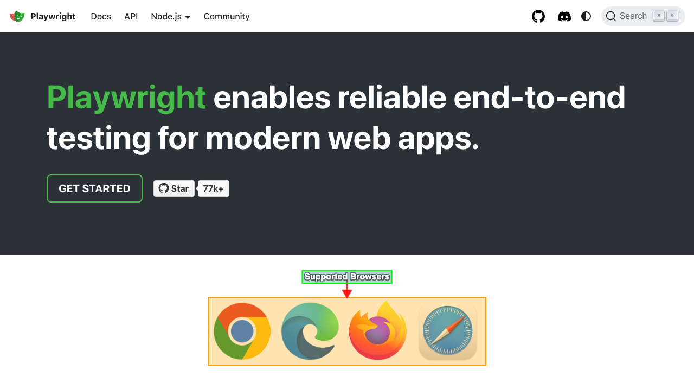

# Annotation
This option is passed in as the third argument for the [`screenshot`](./screenshots.md) function. It allows you to customize the highlighting of elements for a screenshot.

## When to use annotation options
- You want to change the color and/or outline of the highlighted element.
- You want to add a label to help explain the screenshot:
  - You want to customize where the label is placed
  - You want to customize the color of the label
  - You want to give the label a background
- You want to add an arrow to emphasize what is being highlighted

## Annotation Object Properties
To style the highlight and label we expose a few properties on the `annotation` object. They're named similar to the [Canvas 2D context](https://developer.mozilla.org/en-US/docs/Web/API/CanvasRenderingContext2D), which is used to render the highlight and label.

### Label Styling
The text that explains what is being highlighted.

- **`text`**:
  - **Type**: `string`
  - **Description**: The text to display for the label. This is the main content that will be rendered on the canvas.
  - **Default**: `""` (empty string)

- **`altText`**:
  - **Type**: `string`
  - **Description**: Adds alt text to screenshots.
  - **Default**: `"screenshot"`

- **`fillStyle`**:
  - **Type**: `string`
  - **Description**: The color of the label text. Accepts any valid CSS color value, including hex codes, RGB, RGBA, HSL, or HSLA.
  - **Default**: `rgba(0, 0, 0, 1)` (black)

- **`font`**:
  - **Type**: `string`
  - **Description**: Specifies the font size, font-weight, and family for the label text. Follows the CSS font property syntax (e.g., `"16px Arial"`).
  - **Default**: `"14px Arial"`

- **`strokeStyle`**:
  - **Type**: `string`
  - **Description**: The color of the outline around the label text. Accepts any valid CSS color value.
  - **Default**: `rgba(0, 0, 0, 0.1)` (light black)

- **`lineWidth`**:
  - **Type**: `number`
  - **Description**: The thickness of the outline around the label text.
  - **Default**: `2`

### Label Box Styling
A box that the label's text can appear it to make the text stand out more.

- **`labelBoxFillStyle`**:
  - **Type**: `string`
  - **Description**: The fill color of the label box surrounding the annotation text. Accepts any valid CSS color value, including hex codes, RGB, RGBA, HSL, or HSLA.
  - **Default**: `rgba(0, 0, 0, 0)` (transparent)

- **`labelBoxStrokeStyle`**:
  - **Type**: `string`
  - **Description**: The border color of the label box. Similar to `labelBoxFillStyle`, this property accepts any valid CSS color value.
  - **Default**: `rgba(0, 0, 0, 0)` (transparent)

- **`labelBoxLineWidth`**:
  - **Type**: `number`
  - **Description**: The width of the border for the label box. This property determines how thick the outline of the label box will be.
  - **Default**: `2`

### Highlight Box Styling
A box that is drawn around the element you wish to highlight.

- **`highlightFillStyle`**:
  - **Type**: `string`
  - **Description**: The fill color of the highlight box. Accepts any valid CSS color value. **Make sure to add some transparency (`rgba()`, `hsla()`, or 8-digit hex format like `#FF000080`) else it will block the element entirely.**
  - **Default**: `rgba(255, 165, 0, 0.3)` (orange with 30% transparency)

- **`highlightStrokeStyle`**:
  - **Type**: `string`
  - **Description**: The border color of the highlight box. Accepts any valid CSS color value.
  - **Default**: `rgba(255, 165, 0, 1)` (solid orange)

- **`highlightLineWidth`**:
  - **Type**: `number`
  - **Description**: The width of the border for the highlight box.
  - **Default**: `2`

### Positioning
The location of where the label is rendered.

- **`position`**:
  - **Type**: `"above" | "below" | "left" | "right" | number`
  - **Description**: Determines the position of the label text relative to the highlighted element. Uses clock convention where 0° = top, 90° = right, etc. If a number is provided, it positions the label at that degree angle. Defaults to automatically positioning towards the screen center.
  - **Default**: Automatically positions label towards the center of the screen.

### Arrow
Used to point from the label to the element being highlighted.

- **`showArrow`**:
  - **Type**: `boolean`
  - **Description**: Whether to display an arrow pointing from the label to the highlighted element. When enabled, creates a visual connection between the annotation text and the target element.
  - **Default**: `false`

- **`arrowStrokeStyle`**:
  - **Type**: `string`
  - **Description**: The color of the arrow line and arrowhead. Accepts any valid CSS color value, including hex codes, RGB, RGBA, HSL, or HSLA.
  - **Default**: `rgba(255, 0, 0, 1)` (red)

- **`arrowLineWidth`**:
  - **Type**: `number`
  - **Description**: The thickness of the arrow line. The arrowhead size automatically scales based on this value.
  - **Default**: `2`

### Example test
Here's a comprehensive example showing how to use multiple annotation properties together.

```ts
test.describe(withDocMeta("describe block"), async () => {
    test("test block", async ({ page }, testInfo) => {
      ...
      test.step("step block", async () => {
        await page.goto("http://localhost:5173/")
        await screenshot(
          testInfo,
          page.getByRole("img", { name: "Browsers (Chromium, Firefox, WebKit)" }),
          { annotation: {
            text: "Supported Browsers",
            fillStyle: "rgba(255, 255, 255, 1)",
            font: "bold 16px Helvetica",
            strokeStyle: "rgba(0, 0, 0, 0.5)",
            lineWidth: 4,
            labelBoxFillStyle: "rgba(0, 120, 120, 0.3)",
            labelBoxStrokeStyle: "rgba(0, 255, 0, 1)",
            labelBoxLineWidth: 2,
            highlightFillStyle: "rgba(255, 165, 0, 0.3)",
            highlightStrokeStyle: "#FFA500",
            highlightLineWidth: 2,
            position: "above",
            showArrow: true,
            arrowStrokeStyle: "rgba(255, 0, 0, 0.8)",
            arrowLineWidth: 3
          }}
        );
      })
    })
  })
```

### Example screenshot


### Example of `position` by number
If [`position`](#positioning) is set to a number, it will render is a clockwise rotation around the highlighted element.


## Configure Annotation Defaults
If you want to set default values for the annotation object you can do so in your `playwright-test2doc.config.ts`. Just set the `annotationDefaults` object in the `test2doc` playwright global options. These defaults will be applied to all screenshots, but can still be overridden on a per-screenshot basis.

```ts
import { defineConfig, ... } from "@playwright/test"
import "@test2doc/playwright/types"" // Add this import to add test2doc to the global options

export default defineConfig({
  ...
  use: {
    ...
    test2doc: {
      annotationDefaults: {
        fillStyle: "white",
        labelBoxFillStyle: "rgba(0, 123, 255, 0.6)",
        font: "bold 16px Helvetica, Arial, sans-serif",
        highlightStrokeStyle: "rgba(0, 123, 255, 1)",
        highlightFillStyle: "rgba(0, 0, 0, 0)",
        highlightLineWidth: 3,
        showArrow: true,
        arrowStrokeStyle: "rgba(0, 123, 255, 1)",
      },
    },
    ...
  },
  ...
})
```

## Best Practices
- Use transparency in `highlightFillStyle` to avoid obscuring elements
- Keep labels concise and descriptive
- Test annotations on different screen sizes to ensure readability
- Use consistent colors across your project for better branding

## Troubleshooting
- **Labels not appearing**: Check that `text` is not empty and `position` has sufficient space
- **Colors not applying**: Ensure valid CSS color values (e.g., hex, rgba)
- **Arrows misaligned**: Verify `position` and element visibility
