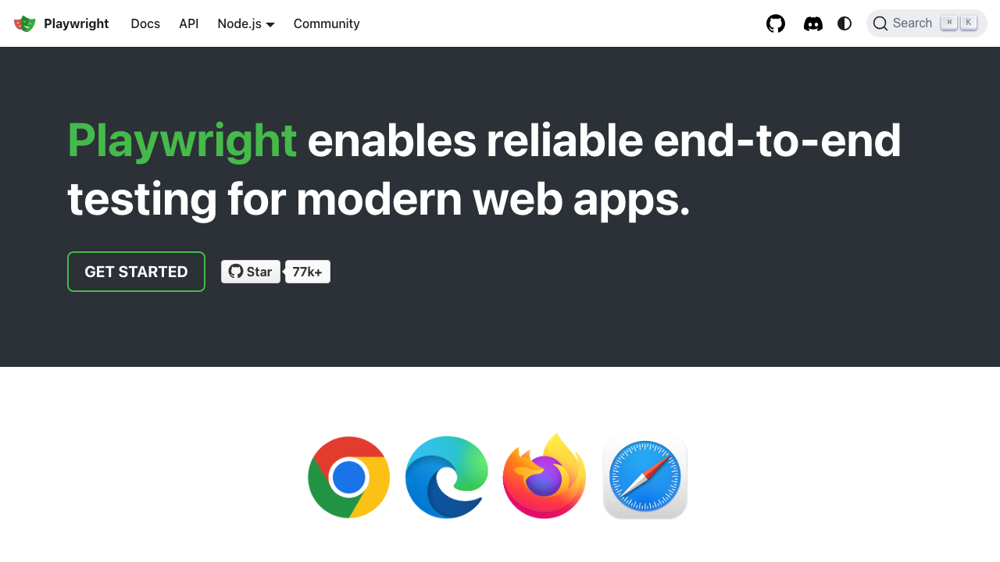
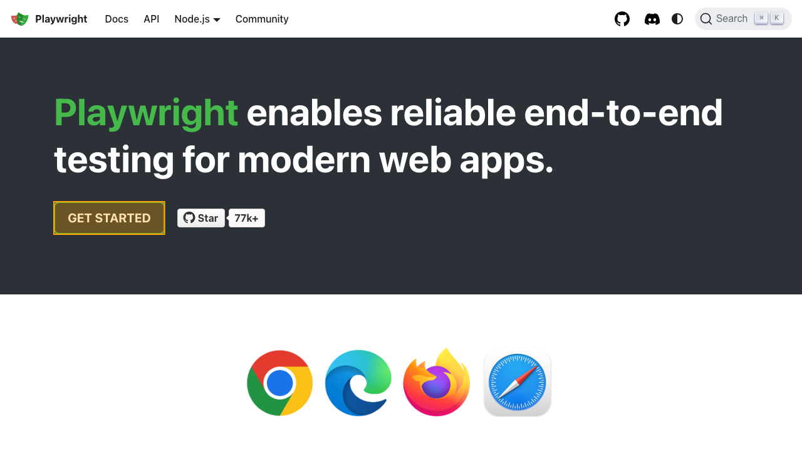
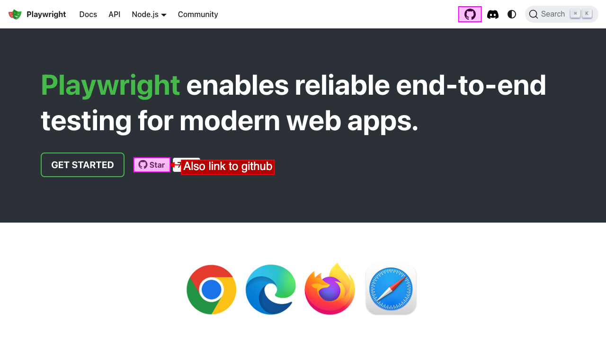

# Screenshots
Test2Doc has a helper function to take screenshots of the page or selectively highlight elements to point out what you are documenting.

Screenshots will be added to the markdown files after the [Step](https://playwright.dev/docs/api/class-test#test-step) block's title and in the order they're generated.

Screenshot names are prefixed with `test2doc-` and a 12 character hash based off of buffer image data. E.g. `test2doc-[hash].png`

Screenshots need to be associated with a `step`, so be sure to nest the screenshot function call inside of a `step` block.

See the [Test Steps](../test-steps.md) guide for more details on using steps with Test2Doc.

## Imports
To add screenshots you'll need to import it in your test file:

```ts
import { screenshot } from "@test2doc/playwright/screenshots";
```

## When to use the screenshot function
- **Page screenshots**: Pass the `page` object for full-page captures
- **Element highlighting**: Pass a `locator` to highlight specific elements  
- **Custom options**: Include [Playwright screenshot options](https://playwright.dev/docs/api/class-page#page-screenshot) for clip, format, etc.
- **Annotations**: Add [`annotation`](./annotation.md) options to customize highlighting
- **Multiple elements**: Pass an array of [`MultiLocatorScreenshot`](#highlight-multiple-elements) objects

## Adding Screenshot of the page
The screenshot function requires `testInfo` (in order to pass the screenshot to the reporter).

To take a screenshot of the current view of the page, you can pass the `page` object to the `screenshot` function.

### Example test
```ts
import { screenshot } from "@test2doc/playwright/screenshots"
...

test.describe(withDocMeta("describe block"), async () => {
  test("test block", async ({ page }, testInfo) => {
    ...
    await test.step("step block", async () => {
      await page.goto("https://playwright.dev/")
      await screenshot(testInfo, page)
    })
  })
})
```

### Example markdown
```md
# describe block

## test block
step block


```

### Example screenshot



## Highlight an element in screenshot
It's possible to highlight an element by passing in a `locator` of an element instead of the `page` object.

The element selected to be highlighted will be attempted to scroll in to view before taking the screenshot.

### Example test
```ts
import { screenshot } from "@test2doc/playwright/screenshots"
...

test.describe(withDocMeta("describe block"), async () => {
  test("test block", async ({ page }, testInfo) => {
    ...
    await test.step("step block", async () => {
      await page.goto("https://playwright.dev/")
      await screenshot(testInfo, page.getByRole("link", { name: "Get started" }))
    })
  })
})
```

### Example markdown
```md
# describe block

## test block
step block


```

### Example screenshot


> **Note:** You can customize the highlighting of elements by passing the `annotation` options in the `screenshot` options. Explained more in the [annotation section](./annotation.md).

## Adding captions with figure and figcaption

For screenshots that need additional context or explanation, it is possible to generate images using the `<figure>` tags with a `<figcaption>`. This is useful for providing descriptive text alongside images in your documentation.

To enable figure/figcaption formatting, pass `figure: true` and optionally `caption` in the screenshot options:

### Example test with caption
```ts
import { screenshot } from "@test2doc/playwright/screenshots"

test.describe(withDocMeta("describe block"), async () => {
  test("test block", async ({ page }, testInfo) => {
    await test.step("Login screen", async () => {
      await page.goto("https://example.com/login")
      await screenshot(testInfo, page, {
        figure: true,
        caption: "The main login screen showing email and password fields"
      })
    })
  })
})
```

### Example markdown with caption
```md
# describe block

## test block
Login screen
<figure>


<figcaption>The main login screen showing email and password fields</figcaption>
</figure>

```

### Example test without caption
If you want a figure wrapper without a caption, simply set `figure: true`:

```ts
await screenshot(testInfo, page, {
  figure: true
})
```

This generates:

```md
<figure>


</figure>
```

### When to use figure/figcaption

Use figure and figcaption when:
- **Detailed context needed**: Screenshots require explanation beyond the step title
- **Accessibility**: Captions help screen readers understand image context
- **Professional documentation**: Formal docs benefit from properly captioned figures
- **Complex visuals**: Diagrams or multi-part screenshots need clarification

## Highlight multiple elements
In the event that you need to highlight multiple elements, you can pass in an array with `MultiLocatorScreenshot` objects.

The `MultiLocatorScreenshot` has 2 keys, `target`, a Playwright Locator, and options, which is a combination of `PageScreenshotOptions` and `annotation` options.

**Note:** Only the first item in the array will be attempted to scroll into view.

### Example test
```ts
test.describe(withDocMeta("describe block"), async () => {
  test("test block", async ({ page }, testInfo) => {
    ...
    await test.step("links to github", async () => {
      await page.goto("https://playwright.dev/")

      await screenshot(
        testInfo,
        [
          page.getByRole("link", { name: "Star microsoft/playwright on GitHub", position: "right" }),
          page.getByRole("link", { name: "GitHub repository" })
        ],
      )
    })
  })
})
```

### Example markdown
```md
# describe block

## test block
links to github


```

### Example screenshot


## Troubleshooting
- **Screenshots not appearing**: Ensure the `screenshot` call is inside a `test.step` block
- **Elements not highlighted**: Verify the locator is correct and the element is visible
- **Elements not in view**: The first element will auto-scroll into view, but ensure it's actually visible
- **Screenshots appears out of order** Make sure to `await` the `test.step` and the `screenshot` function
- **Test2Doc screenshots are not assertions** - To assert that elements are rendering consistently use [Playwright's visual comparison](https://playwright.dev/docs/test-snapshots)
