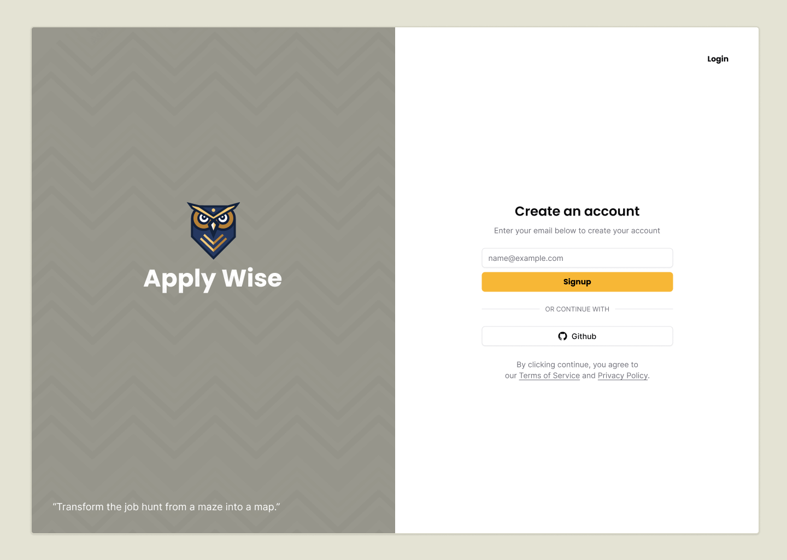
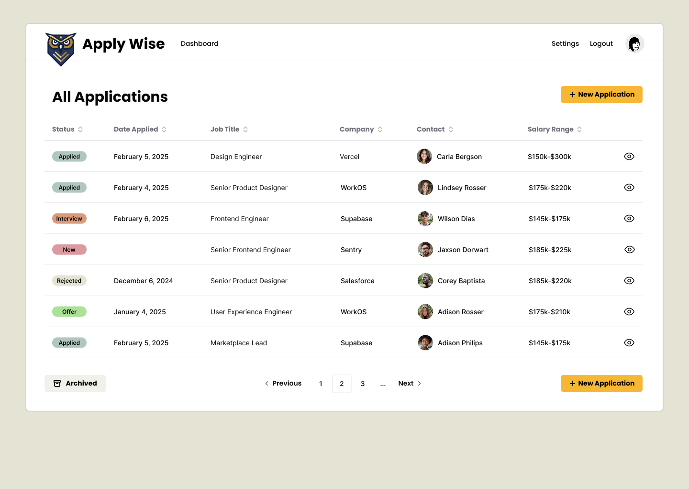
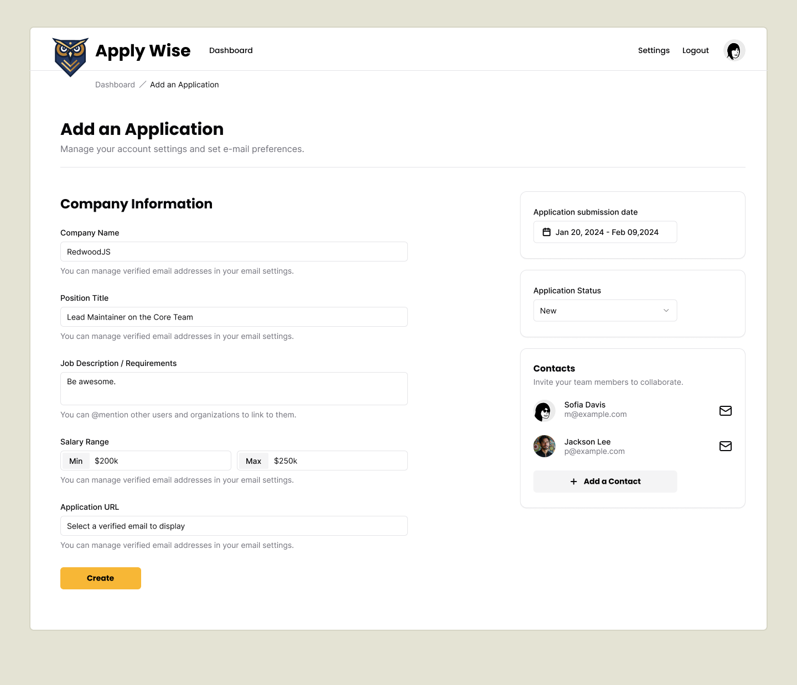
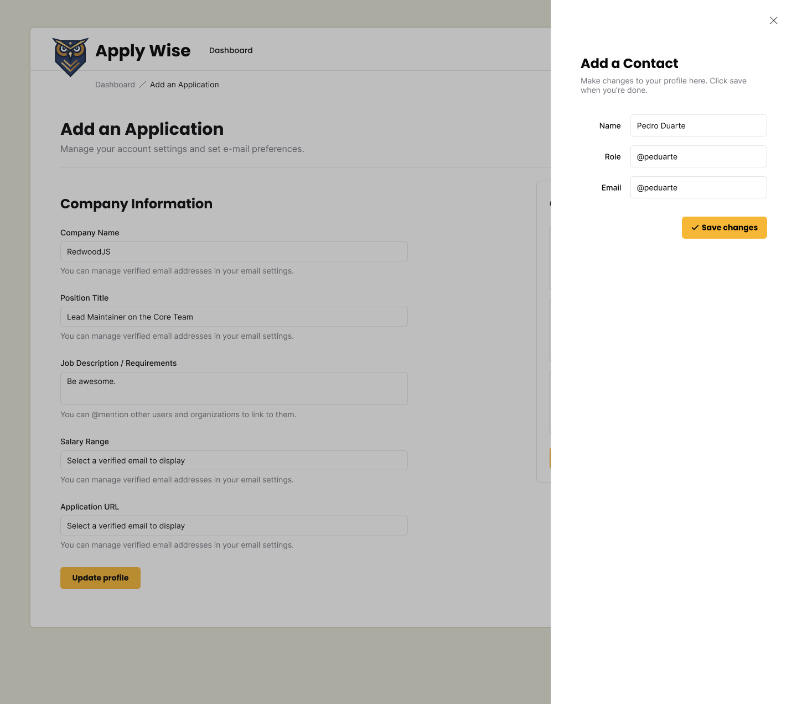

## Intro
This is a tutorial to teach how to use [Redwood SDK](https://rwsdk.com/) and test2doc while showing how to use test driven development to build a non-trivial web application.

This tutorial is based off of Redwood SDK's [Applywize tutorial](https://github.com/redwoodjs/sdk/tree/d7f2a6c10e55778dbc3c64af7be8202fdf9eb81d/docs/src/content/docs/tutorial/full-stack-app). While it was removed from [rwsdk.com](https://rwsdk.com/), I found it to be a really good example of a non-trivial implementation of a CRUD web application. So I'm writing this tutorial to:

1. Teach you how to use Redwood SDK.
2. How to follow Test Driven Development.
3. How to generate docs using Test2Doc.

The original RWSDK project for this project can be found on [Applywize repo](https://github.com/redwoodjs/applywize?tab=readme-ov-file).

In this tutorial, we'll walk through building Applywize from the ground up, covering everything from database design to user authentication to deployment. While experience with React and JavaScript is helpful, we'll explain core concepts along the way to ensure you can follow along successfully.

## What we're building?
We'll be building Applywize, a web app designed to help manage job applications. Here are the flows and features we'll be building out for the app.

### Login Page / User Management

- Sign up and create an account
- Log in securely
- Manage your profile
- Private data access

### Job Application Listing

- View all your job applications in a table.
- Filter to see archived applications.

### Add a Job Application

Add new job applications with key details:
- Company name
- Position title
- Job description/requirements
- Salary range (if available)
- Application URL
- Date applied
- Manage the Application Status (New, Applied, Interviewing, Offer, Rejected)
- Related contacts

- View application details
- Edit application details
- Delete applications you no longer want to track

### Contact Management

- Add contacts for each application
- View contact details
- Edit contact information
- Remove contacts

### Design
All UI designs for Applywize are available in Figma. There, you can view the complete design system, component library, and page layouts. This will help you understand how the final application should look and function before we start building. [Access the Figma design online](https://www.figma.com/design/nqBPIIfe0MO4W8zOfW4oae/Redwood-Reloaded-Tutorial?node-id=1-3&t=9gzbWUrBb2G3qdoa-1) or [download the Figma file](https://github.com/ahaywood/applywize/tree/main/figma).

You can also find all the images from the Figma file packaged them together [here](https://github.com/redwoodjs/applywize/tree/main/assets).

## Technical Prerequisites

Before we start, you'll need:
- [Cloudflare account](https://www.cloudflare.com/plans/). They have a generous free tier that should include everything you need to follow along.
- [Node.js](https://nodejs.org/en/download/) version 22 or later installed on your machine.
- A Code Editor. [VSCode](https://code.visualstudio.com/) or [Cursor](https://www.cursor.com/) should do the job.
- A Terminal. A lot of text editors have a terminal built-in (both VSCode and Cursor, for example). Or if you want a standalone, we like [Warp](https://warp.dev/) and [atuin.sh](https://atuin.sh/).
- Basic knowledge of:
  - JavaScript, TypeScript, and React
  - HTML and CSS
  - Using the command line
  - How databases work (but don't worry, we'll guide you)

### VS Code / Cursor / Windsurf Extensions

- [SQLite Viewer](https://marketplace.visualstudio.com/items?itemName=qwtel.sqlite-viewer)
- [Figma for VS Code](https://marketplace.visualstudio.com/items?itemName=figma.figma-vscode-extension)
- [Prisma](https://marketplace.visualstudio.com/items?itemName=Prisma.prisma)
- [Tailwind CSS IntelliSense](https://marketplace.visualstudio.com/items?itemName=bradlc.vscode-tailwindcss)
- [Playwright Test for VSCode](https://marketplace.visualstudio.com/items?itemName=ms-playwright.playwright)
- [ESLint](https://marketplace.visualstudio.com/items?itemName=dbaeumer.vscode-eslint)
- [Prettier - Code formatter](https://marketplace.visualstudio.com/items?itemName=esbenp.prettier-vscode)

## Code on GitHub
You can find the final code on [GitHub](https://github.com/dethstrobe/applywize).

## Further Reading

- [Using nvm to install Node.js](https://github.com/nvm-sh/nvm?tab=readme-ov-file#installing-and-updating)

## What You've Accomplished
Now, that we know what we're building, let's get started!

In the next lesson, we'll start the actual development work. You'll learn how to:

- Create your first RedwoodSDK application from scratch.
- Understand the project structure and key files.
- Set up styling tools like TailwindCSS and shadcn/ui.
- Get your development server running and see your first working page.
- Have e2e testing with playwright
- Document functionality of the web app for Docusaurus