Our authentication has three main parts:
1. Sessions (remembers you're logged in)
2. Protected routes (pages that need login/authentication)
3. Login / Sign up forms (how you sign in)

## What is Passkey Authentication?
Passkey authentication is a passwordless authentication method that uses a biometric or device authentication to verify the user's identity.

**How it Works**:
1. A user creates a passkey during the registration process.
2. A unique public-private key pair is generated.
3. The private key remains securely stored on the user's device or [in a password manager](https://developer.apple.com/passkeys/).
4. The public key is shared with the service.
5. When the user logs in, they have to "prove" they have access to the private key.
6. The service verifies the user's identity using the public key.

Think of it like a mailbox system: You give the website a special mailbox (the public key), that only your unique key can open. When you want to log in, the website puts a secret message in your mailbox. Only you have the key to open it and read the message, which proves you're the real account owner.

### Why Passkey Authentication?
Passkey authentication offers several key advantages:

- **Enhanced Security**: Passkeys are unique, resistant to guessing, and eliminate vulnerabilities associated with traditional passwords. They use biometric authentication like fingerprints, making them much harder to compromise.
- **User-Friendly**: Users can log in quickly using biometric data or device authentication, removing the need to remember complex passwords. This creates a frictionless access experience across different platforms.
- **Phishing Resistance**: Passkeys are tied to specific websites, making them immune to phishing attacks that typically trick users into entering credentials on fake sites.

## Setup the Passkey
Since we're using RedwoodSDK it has a Passkey Addon to help with authentication.

So the Redwood team created this interesting package that is designed to give instructions to a coding agent. So if you're using VSCode, you can use [Co-pilot's](https://marketplace.visualstudio.com/items?itemName=GitHub.copilot-chat) or [Cursor's](https://cursor.com/docs/agent/modes#agent) Agent mode to handle the installation of the Passkey addon.

All you need to do is tell it to execute `npx rwsdk addon passkey` and follow the `INSTRUCTIONS.md` that's downloaded. Or you can also just run the command and do it yourself.
```sh
npx rwsdk addon passkey
```

### Replace the Passkey DB
We've already made a DB with `users` and `credentials` tables. So we'll delete the migration file at `src/passkey/db/migrations.ts` and update the `src/passkey/db/db.ts` file to use our current db.

```ts title="src/passkey/db/db.ts" {1,7,11-12}
import { db, type User, type Credential } from "@/db/db"
import debug from "rwsdk/debug"

const log = debug("passkey:db")

export async function createUser(username: string): Promise<User> {
  const now = new Date().toISOString()
  const user: User = {
    id: crypto.randomUUID(),
    username,
    createdAt: now,
    updatedAt: now,
  }
  await db.insertInto("users").values(user).execute()
  return user
}
...
```

All we need to do is import the db and types we're using. Because our `User` model also contains an `updateAt` field, we'll need to add this too.

### Clean up the Passkey Durable Object
We can now also remove the durable object that the passkey addon generated.

```diff title="src/worker.tsx"
...
export { AppDurableObject } from "@/db/durableObject"
export { SessionDurableObject } from "@/session/durableObject"
- export { PasskeyDurableObject } from "@/passkey/durableObject"
...
```

```diff title="wrangler.jsonc"
  ...
  "durable_objects": {
    "bindings": [
      {
        "name": "APP_DURABLE_OBJECT",
        "class_name": "AppDurableObject",
      },
      {
        "name": "SESSION_DURABLE_OBJECT",
        "class_name": "SessionDurableObject",
      },
-      {
-        "name": "PASSKEY_DURABLE_OBJECT",
-        "class_name": "PasskeyDurableObject",
-      },
    ],
  },
  "migrations": [
    {
      "tag": "v1",
-      "new_sqlite_classes": ["AppDurableObject", "PasskeyDurableObject"],
+      "new_sqlite_classes": ["AppDurableObject"],
    },
  ],
}
```

Also delete `src/passkey/durableObject.ts`.

### Style Login
If you start up the dev server with `pnpm dev` it should redirect you to `http://localhost:5173/auth/login`.

It should look unstyled and appear like:
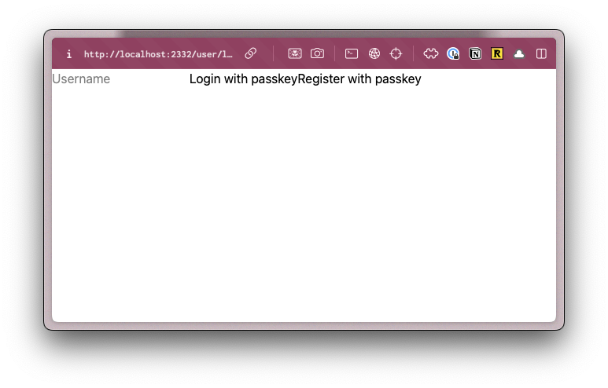

We're going to quickly style the login and use our shadcn buttons.

```ts title="src/passkey/components/Login.tsx"
...
import { Button } from "@/app/components/ui/button"
...
  return (
    <main className="bg-bg">
      <h1 className="text-4xl font-bold text-red-500">YOLO</h1>
      <input
        type="text"
        value={username}
        onChange={handleUsernameChange}
        placeholder="Username"
      />
      <Button onClick={handlePerformPasskeyLogin} disabled={isPending}>
        {isPending ?
          <>...</>
        : "Login with passkey"}
      </Button>
      <Button onClick={handlePerformPasskeyRegister} disabled={isPending}>
        {isPending ?
          <>...</>
        : "Register with passkey"}
      </Button>
      {result && <div>{result}</div>}
    </main>
  )
```

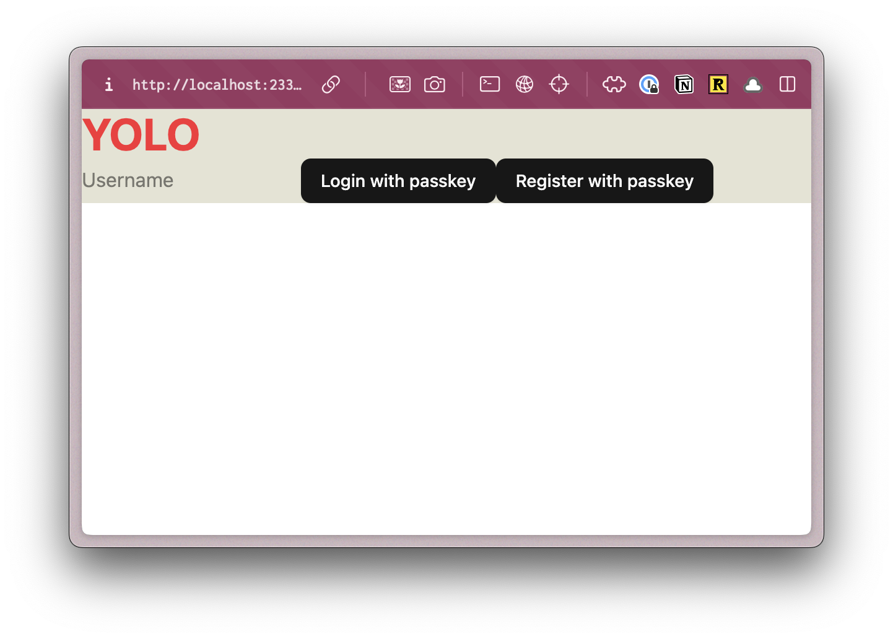

It might not be pretty. But at least we know TailwindCSS is working. You should be able to register and login and see a little notification on success message as well.

## Test Drive the Registration
Now we can start to implement our own logic, we'll be following Test Driven Development (TDD) principles and writing tests before we create the implementation.

We're going to follow a practice called **Red, Green, Refactor**. We first write a test that fails (the red), then we'll write the implementation to make the test pass (the green), then we'll take a bit of time to see if we can improve the implementation (the refactor). Then we repeat the process until we're done.

Some benefits of the TDD approach are:
- We think about how people use our app, leading to better UX.
- It will document how your app works with tests.
- It will reduce bugs when implementing new features, as tests validate that we do not break previous functionality.
- We can prevent regressions if we create tests for future bugs or edge cases.
- It creates greater confidence in code quality allowing for continuous integration and continuous deployment (CI/CD).
- It improves accessibility, as we'll be using accessibility handlers to test our app.

### Setting up tests
If you take a look in the `test` directory at the root of your project you'll find `example.spec.ts`.

If you just want to make sure Playwright is configured correctly run `pnpm test` and you should see the Playwright UI open.

There are two buttons we'll want to take note of in the UI, the **run** button, which will run the tests. And the **watch** button, which will rerun the tests when we make changes.

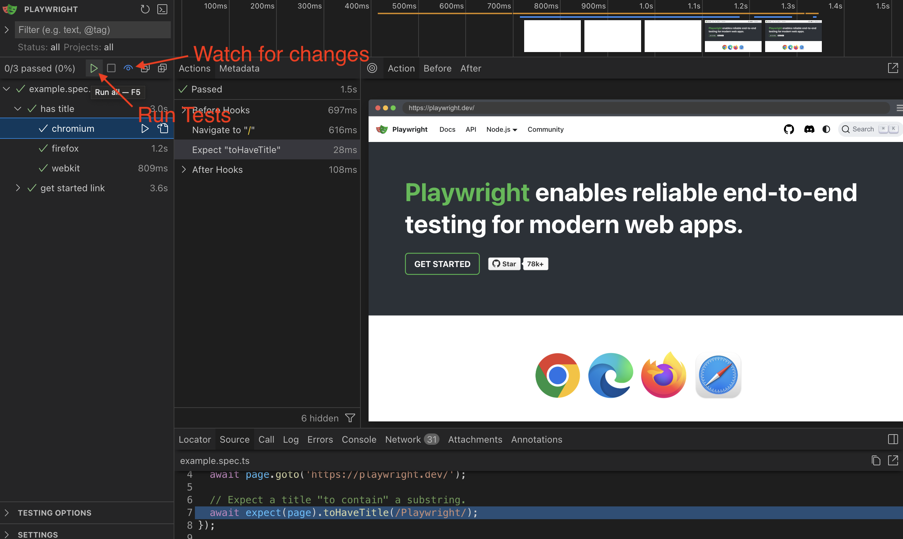

Delete the `example.spec.ts`. We won't be needing it.

We'll also want to make a change to the `playwright.config.ts` to startup and point to our local development host.

```diff title="playwright.config.ts"
  ...
  use: {
    /* Base URL to use in actions like `await page.goto('')`. */
-    // baseURL: 'http://localhost:3000',
+    baseURL: "http://localhost:5173",

    /* Collect trace when retrying the failed test. See https://playwright.dev/docs/trace-viewer */
    trace: "on-first-retry",
  },

  ...

  /* Run your local dev server before starting the tests */
-  // webServer: {
-  //   command: 'npm run start',
-  //   url: 'http://localhost:3000',
-  //   reuseExistingServer: !process.env.CI,
-  // },
+  webServer: {
+    command: "pnpm dev",
+    url: "http://localhost:5173",
+    reuseExistingServer: !process.env.CI,
+  },
})
```

Take note that we changed the port for localhost to `5173`, which is the port RedwoodSDK uses by default.

### TDD Sign up page
Looking through out designs we see we want a [Registration page](https://www.figma.com/design/nqBPIIfe0MO4W8zOfW4oae/RedwoodSDK---Applywize?node-id=1-4&t=DREvbLB8j6qnAU82-4) and a [Login Page](https://www.figma.com/design/nqBPIIfe0MO4W8zOfW4oae/RedwoodSDK---Applywize?node-id=239-604&t=3oxTIWZn5ymerzQq-4). Currently, they're combined in the Login page.

We're going to get started by just testing that we can even see a **Sign up** page.

#### Testing the Sign up page
We're going to start with the simplest possible test first.

```ts title="test/authentication.spec.ts"
import { test, expect } from "@playwright/test"

test.describe("Authentication Flow", () => {
  test("sign up page loads", async ({ page }) => {
    await page.goto("auth/signup")

    await expect(
      page.getByRole("heading", { name: "Sign up" }),
    ).toBeVisible()
  })
})
```

Now if we run `pnpm test`, running the tests we should see the test fail as it could not find the header.

#### Implement Sign up page.
To make this test pass we need to set up a route at `auth/signup`.

##### What's a Worker?
Let's start by taking a look at the `worker.tsx` file. This file sets up our Cloudflare worker, but it also handles all the routing, middleware, and interrupters.

Before we look at the code, let's understand what a Cloudflare Worker is. Think of it as a mini-server that runs your application code.
In traditional web development, you might have a separate server running somewhere (like on AWS or your own computer) that handles requests when someone visits your website. A Cloudflare Worker does the same job, but it runs on Cloudflare's global network instead. The key benefits for our tutorial:

**No server management**: You don't need to set up, configure, or maintain a separate server
**Automatic scaling**: Cloudflare handles traffic spikes for you
**Global performance**: Your code runs close to your users worldwide
**Built-in features**: Things like databases and file storage are integrated

In our RedwoodSDK application, the worker.tsx file is where we define how our application responds to different requests - like when someone visits /login or /signup. It's essentially the "brain" that decides what to show users based on what page they're trying to access.

```ts title="src/worker.tsx"
import { render, route, index, prefix } from "rwsdk/router"
import { defineApp } from "rwsdk/worker"

import { Document } from "@/app/Document"
import { setCommonHeaders } from "@/app/headers"
import { Home } from "@/app/pages/Home"
import { authRoutes } from "@/passkey/routes"
import { setupPasskeyAuth } from "@/passkey/setup"
import { Session } from "@/session/durableObject"

export { AppDurableObject } from "@/db/durableObject"
export { SessionDurableObject } from "@/session/durableObject"

export type AppContext = {
  session: Session | null
}

export default defineApp([
  setCommonHeaders(),
  setupPasskeyAuth(),
  render(Document, [
    index([
      ({ ctx }) => {
        if (!ctx.session?.userId) {
          return new Response(null, {
            status: 302,
            headers: { Location: "/auth/login" },
          })
        }
      },
      Home,
    ]),
    prefix("/auth", authRoutes()),
  ]),
])
```

This is a large chunk of code, so let's break it down, chunk by chunk:

```tsx title="src/worker.tsx"
export type AppContext = {
  session: Session | null
}
```
- On **lines 14-16**, we're setting up the types for our application's context object. Specifically, we're defining the `session` property.
  - The `Session` type is defined in `@/session/durableObject.ts`. (Imported on line 9.) It contains a `userId`, `challenge`, and `createdAt`.

```tsx title="src/worker.tsx"
setCommonHeaders(),
```
- On **line 19** we're setting up our common headers. This is a function inside of `app/src/headers.ts`. (Imported on line 5.) It creates the Security Policies, Transport Policy, Referrer Policy, and Permissions Policy. [You can find additional documentation here.](https://docs.rwsdk.com/core/security/#-security-headers)


```tsx title="src/worker.tsx"
setupPasskeyAuth(),
```
- On **line 20**, the auth addon setting up our middleware for us. This will run between every request and response cycle.
  - The middle were checks if there is a current session.
  - If there is not a current session it redirects to the login page.

```tsx title="src/worker.tsx"
render(Document, [
```
- On **line 21**, we're setting up our document. This document is referencing our `src/app/Document.tsx` file. It contains our `html`, `head`, and `body` tags and wraps _all_ of our pages.
  - One of the powerful yet simple features of RedwoodSDK is that it supports per-route documents. Read more about this [on the Redwood blog](https://rwsdk.com/blog/redwoodsdk-multiple-documents).

```tsx title="src/worker.tsx"
index([
  ({ ctx }) => {
    if (!ctx.session?.userId) {
      return new Response(null, {
        status: 302,
        headers: { Location: "/auth/login" },
      })
    }
  },
  Home,
]),
```

- On **lines 22-32** this defines out first route. The `index` function is a convenience function for the `route` function to set the at `"/"` route. You can read more about the `route` function on the [RedwoodSDK docs](https://docs.rwsdk.com/core/routing/#matching-patterns).
- The `index` function takes in an array of functions. They execute in the order of the items in the array.
  - The first function is our **interrupter** that checks to see if there is a `User` object on the `Session`, and if not redirect to the login page.
  - The second function is a React component, that renders our Home page. This will only execute if the **interrupter** doesn't return a response.

**Middleware**

Middleware is a function that runs _in the middle_, between your request to the server and its response.

It allows you to:

- Modify or inspect requests before they reach the main application logic
- Perform operations like authentication, logging, error handling
- Transform or validate data
- Add headers or perform other preprocessing tasks

**Interrupters**

Interrupters will _interrupt_ the flow. Before, the server returns a response, the interrupter runs.

**These sound similar, what's the difference?**

- Middleware will run before _every single route_.
- Interrupters will only run _on specific routes._

In our code, we're using middleware to attach the user session to our context object *on every request*. But, we're only checking to see if the user is logged in *on the home page*.


```tsx title="src/worker.tsx"
prefix("/auth", authRoutes()),
```
- On **line 33**, we're prefixing all of our auth routes with `/auth`. Meaning, our `login` route will be `/auth/login`. Which means we'll expect out `signup` page to be at `auth/signup`.
  - `login` is defined within the `authRoutes` function which is defined in `src/passkey/routes.ts`, imported on line 7. One of the cool things about the RedwoodSDK router is that the response parameter can be an array. This means we can define our route information in a separate file and then import it into our `worker.tsx` file.

The auth addon co-located the file that defines our auth routes with our auth pages.

Let's take a look at `authRoutes`. This is coming from `src/passkey/routes.ts`.

```tsx title="src/passkey/routes.ts"
import debug from "rwsdk/debug";
import { route } from "rwsdk/router";
import { Login } from "./components/Login.js";

const log = debug("passkey:routes");

export function authRoutes() {
  log("Setting up authentication routes");
  return [route("/login", [Login])];
}
```

We can see a logging function set up to inform us that the auth routers are being set.

We also have our `/login` defined here using the `route` function.

This is where we'll want to make our change to get our first test to pass.

##### Creating a sign up route
We'll be adding the bare minimum to make this test pass, then we'll extend it to add more functionality. We'll keep _ping ponging_ like this between broken tests, making tests pass, and taking time to look at the implantation to make refactors to make the code cleaner and more reuseable.

Let's add a new route for `auth/signup` and return a response with a h1.

```ts title="src/passkey/routes.ts" {5-10}
export function authRoutes() {
  log("Setting up authentication routes")
  return [
    route("/login", [Login]),
    route("/signup", [
      () =>
        new Response("<h1>Sign up</h1>", {
          headers: { "Content-Type": "text/html" },
        }),
    ]),
  ]
}
```

If you see your tests should be passing. Mission accomplished. Time to wrap it up and go home boys. Job well done.

#### Refactor Sign up page.
Oh right, I guess we can probably make it better.

Since we're using RedwoodSDK, let's make this page a react component. They'll be much easier to extend later. Let's make a new react component that'll be a sibling to the `login` page.

```tsx title="src/passkey/components/Signup.tsx"
export function Signup() {
  return <h1>Sign up</h1>
}
```

It's a very simple component. But it'll do the job to make the test pass and give us room to add more functionality later.

Now we go back and update our route with our new component.

```ts title="src/passkey/routes.ts" {4,10}
import debug from "rwsdk/debug"
import { route } from "rwsdk/router"
import { Login } from "./components/Login.js"
import { Signup } from "./components/Signup.js"

const log = debug("passkey:routes")

export function authRoutes() {
  log("Setting up authentication routes")
  return [route("/login", [Login]), route("/signup", [Signup])]
}
```

With using out new React component, the test should still pass. Meaning our refactor was successful.

**Note:** Prettier decided to make the routes fit on one line. And I'm not going to fight the code formatter. As the whole point of it is to **not** need to think too hard about formatting and worry about more important things.

### TDD Registration
Now that we have a sign up page, let's expect it to register a new passkey.

#### Adding a sign up form test

We're going to document each step of the test, this will help later when we run it through test2doc to generate documentation for our application.

```ts title="tests/authentication.spec.ts" {4,6,10,12-14}
import { test, expect } from "@playwright/test"

test.describe("Authentication Flow", () => {
  const username = `testuser-${Date.now()}`
  test("Register a new user", async ({ page }) => {
    await test.step("On the sign up page at `/auth/signup`.", async () => {
      await page.goto("auth/signup")

      await expect(page.getByRole("heading", { name: "Sign up" })).toBeVisible()
    })

    await test.step("Filling out the registration form.", async () => {
      await page.getByRole("textbox", { name: "Username" }).fill(username)
    })
  })
})
```

You'll see we're creating a variable called `username` which is a string with a timestamp. Because we'll be running this tests over and over again, we can't register the same user name (we set up a unique constraints in our DB earlier on usernames), so we'll need a way to insure we won't get any name collisions.

Naturally, you might think random number would be a sufficient solution for generating unique names, but because of the [birthday paradox](https://en.wikipedia.org/wiki/Birthday_problem), the odds of having a name collision increases quadratically, meaning we'll run into collisions extremely quickly when using purely random numbers the more time we run tests and register new users. Because of that, time is a better way to create unique names, as it is impossible for time to repeat itself.

#### Implement sign up form
Now we just need to make the form in our page. Let's copy it from the `login` page.

We'll want to make a few small changes, like renaming the exported component to `Signup`, removing the login specific functionality, and we'll need to change the header to "Sign up".

```tsx title="src/passkey/routes.ts"
"use client"

import { startRegistration } from "@simplewebauthn/browser"
import { useState, useTransition } from "react"
import {
  finishPasskeyRegistration,
  startPasskeyRegistration,
} from "../functions"
import { Button } from "@/app/components/ui/button"

export function Signup() {
  const [username, setUsername] = useState("")
  const [result, setResult] = useState("")
  const [isPending, startTransition] = useTransition()

  const passkeyRegister = async () => {
    if (!username.trim()) {
      setResult("Please enter a username")
      return
    }

    try {
      // 1. Get a challenge from the worker
      const options = await startPasskeyRegistration(username)
      // 2. Ask the browser to sign the challenge
      const registration = await startRegistration({ optionsJSON: options })

      // 3. Give the signed challenge to the worker to finish the registration process
      const success = await finishPasskeyRegistration(username, registration)

      if (!success) {
        setResult("Registration failed")
      } else {
        setResult("Registration successful!")
      }
    } catch (error: unknown) {
      setResult(
        `Registration error: ${
          error instanceof Error ? error.message : "Unknown error"
        }`,
      )
    }
  }

  const handlePerformPasskeyRegister = () => {
    startTransition(() => void passkeyRegister())
  }

  const handleUsernameChange = (e: React.ChangeEvent<HTMLInputElement>) => {
    const newUsername = e.currentTarget.value
    setUsername(newUsername)
  }

  return (
    <main className="bg-bg">
      <h1 className="text-4xl font-bold text-red-500">Sign up</h1>
      <input
        type="text"
        value={username}
        onChange={handleUsernameChange}
        placeholder="Username"
      />
      <Button onClick={handlePerformPasskeyRegister} disabled={isPending}>
        {isPending ?
          <>...</>
        : "Register with passkey"}
      </Button>
      {result && <div>{result}</div>}
    </main>
  )
}
```

#### Register a new user
Now that we can enter a username to register all we need to do is click the button and expect to see a side effect showing we were successful.

```ts title="tests/authentication.spec.ts"
    ...
    await test.step("Submitting the registration form.", async () => {
      await page.getByRole("button", { name: "Register with passkey" }).click()
    })

    await test.step("Verifying successful registration.", async () => {
      await expect(page.getByText("Registration successful!")).toBeVisible()
    })
  })
})
```

If you run the test now, you might expect it to pass, since we copied the functionality of the `login` page. And conceptually, you'd be correct.

But you'll probably see this error in the test.
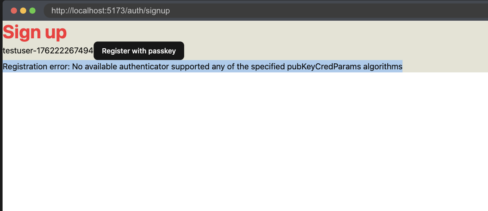

You'll see the error is "Registration error: No available authenticator supported any of the specified pubKeyCredParams algorithms". The problem is that Playwright doesn't have access to generate passkeys on its own. So we'll need to enable WebAuthn virtual authenticator.

**Mocking WebAuthn**

Often times relying on dependencies makes testing hard, so many times the easiest solution is to simply mock out the WebAuthn API. Which is not a _bad_ solution. However, to have more confidence in our tests and implementation, we should attempt to avoid mocks if possible.

**Helper Utility**
There are a few challenges for using Passkeys in Playwright. The first one is we need to prompt the WebAuthn when a Passkey is requested. Luckily [Corbado has already figured out](https://www.corbado.com/blog/passkeys-e2e-playwright-testing-webauthn-virtual-authenticator#612-approach-2-manual-simulation-with-automaticpresencesimulation-set-to-false) a way to do so. So we'll copy their code.

```ts title="tests/util.ts"
import type { CDPSession } from "@playwright/test"

export async function simulateSuccessfulPasskeyInput(
  client: CDPSession,
  authenticatorId: string,
  operationTrigger: () => Promise<void>,
) {
  // initialize event listeners to wait for a successful passkey input event
  const operationCompleted = new Promise<void>((resolve) => {
    client.on("WebAuthn.credentialAdded", () => resolve())
    client.on("WebAuthn.credentialAsserted", () => resolve())
  })

  // set isUserVerified option to true
  // (so that subsequent passkey operations will be successful)
  await client.send("WebAuthn.setUserVerified", {
    authenticatorId: authenticatorId,
    isUserVerified: true,
  })

  // set automaticPresenceSimulation option to true
  // (so that the virtual authenticator will respond to the next passkey prompt)
  await client.send("WebAuthn.setAutomaticPresenceSimulation", {
    authenticatorId: authenticatorId,
    enabled: true,
  })

  // perform a user action that triggers passkey prompt
  await operationTrigger()

  // wait to receive the event that the passkey was successfully registered or verified
  await operationCompleted

  // set automaticPresenceSimulation option back to false
  await client.send("WebAuthn.setAutomaticPresenceSimulation", {
    authenticatorId,
    enabled: false,
  })
}
```

**Enable WebAuthn virtual authenticator**
Next we'll need to enable the `WebAuthn` in our test.
```ts title="tests/authentication.spec.ts"
import { test, expect, CDPSession } from "@playwright/test"
import { simulateSuccessfulPasskeyInput } from "./util"

test.describe("Authentication Flow", () => {
  const username = `testuser-${Date.now()}`
  test("Register a new user", async ({ page }) => {
    let client: CDPSession
    let authenticatorId: string
    await test.step("Set up WebAuthn virtual authenticator.", async () => {
      client = await page.context().newCDPSession(page)
      await client.send("WebAuthn.enable")

      const result = await client.send("WebAuthn.addVirtualAuthenticator", {
        options: {
          protocol: "ctap2",
          transport: "internal",
          hasResidentKey: true,
          hasUserVerification: true,
          isUserVerified: true,
          automaticPresenceSimulation: true,
        },
      })

      authenticatorId = result.authenticatorId
    })

    await test.step("On the sign up page at `/auth/signup`.", async () => {
      await page.goto("auth/signup")

      await expect(page.getByRole("heading", { name: "Sign up" })).toBeVisible()

      const result = await client.send("WebAuthn.getCredentials", {
        authenticatorId,
      })
      expect(result.credentials).toHaveLength(0)
    })

    await test.step("Filling out the registration form.", async () => {
      await page.getByRole("textbox", { name: "Username" }).fill(username)
    })

    await test.step("Submitting the registration form.", async () => {
      await simulateSuccessfulPasskeyInput(
        client,
        authenticatorId,
        async () =>
          await page
            .getByRole("button", { name: "Register with passkey" })
            .click(),
      )
    })

    await test.step("Verifying successful registration.", async () => {
      await expect(page.getByText("Registration successful!")).toBeVisible()

      const result = await client.send("WebAuthn.getCredentials", {
        authenticatorId,
      })
      expect(result.credentials).toHaveLength(1)
    })
  })
})
```

After this, your test should pass! In Chrome...only...

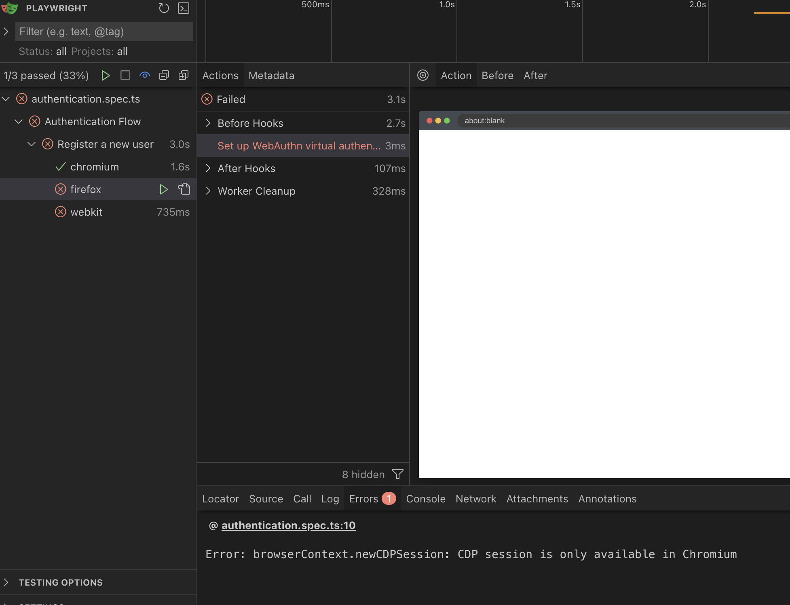

Currently (as of writing in 2025) there is no way to turn on WebAuthn for Firefox or Safari in Playwright. Those browsers support it for users, just not for automation.

So, since we currently cannot test in Firefox and Safari, we're just going to disable them for right now. But we should still have very high confidence that our site will work across browsers. JS support is very strong and consistent between the browsers, just not the cutting edge like WebAuthn. Sometimes when you're on the cutting edge, you bleed a bit.

```diff title="playwright.config.ts"
projects: [
    {
      name: "chromium",
      use: { ...devices["Desktop Chrome"] },
    },
-
-     {
-       name: "firefox",
-       use: { ...devices["Desktop Firefox"] },
-     },
-
-     {
-       name: "webkit",
-       use: { ...devices["Desktop Safari"] },
-     },
```

#### Refactor Registration
If you start Playwright fresh, you might notice that the first test hangs sometimes, but it should pass in subsequent runs.

What might cause this? The dreaded _race condition_. If you take a look at when it times out and fails, you'll notice that the username `input` is empty.

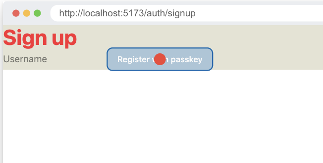

Turns out Playwright will run faster then the server can send the JS and the browser will load it in to working memory.

There are a few ways to solve this. We can do some state tracking and figure out when the JS loads, or can tell Playwright to wait for the network to stop having inflight requests, but I'm going to opt for a lower JS solution and we're instead of needing to have JS manage the input field, we're going to let browser handle it and we're only going to refer to the input by reference in our component.

```ts {4,14,17,24,30,56}
"use client"

import { startRegistration } from "@simplewebauthn/browser"
import { useRef, useState, useTransition } from "react"
import {
  finishPasskeyRegistration,
  startPasskeyRegistration,
} from "../functions"
import { Button } from "@/app/components/ui/button"

export function Signup() {
  const [result, setResult] = useState("")
  const [isPending, startTransition] = useTransition()
  const username = useRef<HTMLInputElement>(null)

  const passkeyRegister = async () => {
    if (username.current === null || !username.current.value.trim()) {
      setResult("Please enter a username")
      return
    }

    try {
      // 1. Get a challenge from the worker
      const options = await startPasskeyRegistration(username.current.value)
      // 2. Ask the browser to sign the challenge
      const registration = await startRegistration({ optionsJSON: options })

      // 3. Give the signed challenge to the worker to finish the registration process
      const success = await finishPasskeyRegistration(
        username.current.value,
        registration,
      )

      if (!success) {
        setResult("Registration failed")
      } else {
        setResult("Registration successful!")
      }
    } catch (error: unknown) {
      setResult(
        `Registration error: ${
          error instanceof Error ? error.message : "Unknown error"
        }`,
      )
    }
  }

  const handlePerformPasskeyRegister = () => {
    console.log("Register button clicked")
    startTransition(() => void passkeyRegister())
  }

  return (
    <main className="bg-bg">
      <h1 className="text-4xl font-bold text-red-500">Sign up</h1>
      <input type="text" placeholder="Username" ref={username} />
      <Button onClick={handlePerformPasskeyRegister} disabled={isPending}>
        {isPending ?
          <>...</>
        : "Register with passkey"}
      </Button>
      {result && <div>{result}</div>}
    </main>
  )
}
```

I have a saying, "_less code, more better_". We can actually remove the `useState` to track the input, remove the callback that updates that state on the input. And we swap out the `useState` for a `useRef` and update the variable to use the ref.

Now, the test should pass even when starting the server fresh and we reduced code and made our app a bit more efficient. The power of testing.

#### Test redirect to login page
The last thing we'll need (for now), after we successfully register a new user, we want to redirect them to the login page.

```diff
-await test.step("Verifying successful registration.", async () => {
-  await expect(page.getByText("Registration successful!")).toBeVisible()
+await test.step("Verifying successful registration and redirect to login page", async () => {
+  await expect(page.getByRole("heading", { name: "YOLO" })).toBeVisible()

  const result = await client.send("WebAuthn.getCredentials", {
    authenticatorId,
  })
  expect(result.credentials).toHaveLength(1)
})
```

#### Implement redirect to login page
RedwoodSDK has a nice typesafe way to [generate links](https://docs.rwsdk.com/core/routing/#generating-links). It's already setup for us from when we initialized the app. We'll be using this for when we navigate.
```ts title="src/app/shared/links.ts"
import { defineLinks } from "rwsdk/router"

export const link = defineLinks(["/", "/auth/login", "/auth/signup"])
```

Now let's use this link in our `Signup` component to redirect to login on successful registration.

```diff title="src/passkey/components/Signup.tsx"
...
+import { link } from "@/app/shared/links"
...
      if (!success) {
        setResult("Registration failed")
      } else {
        setResult("Registration successful!")
+        window.location.href = link("/auth/login")
      }
```

### Test to Docs
One of the beautiful things about TDD is that tests act as living documentation. What we mean by _living_ is that it is continuously updated and integrated in to the process.

Tests are great if you're a developer, however not as great if you need to share with non-technical stakeholders. Which is why I created test2doc.

Before we can run the command that will run playwright with test2doc, we need to update the config to start the server and point default url to localhost.

```ts title="playwright-test2doc.config.ts" {13-15,25-29}
import { defineConfig, devices } from "@playwright/test"

export default defineConfig({
  testDir: "./tests",
  reporter: [
    [
      "@test2doc/playwright",
      {
        outputDir: "./doc/docs",
      },
    ],
  ],
  use: {
    baseURL: "http://localhost:5173",
  },
  fullyParallel: false,
  workers: 1,
  retries: 0,
  projects: [
    {
      name: "chromium",
      use: { ...devices["Desktop Chrome"] },
    },
  ],
  webServer: {
    command: "pnpm dev",
    url: "http://localhost:5173",
    reuseExistingServer: !process.env.CI,
  },
})
```

Now you should be ready to generate docs from the tests. Run `pnpm test`.

You should see the output in your terminal.
```sh
Starting documentation generation for 1 tests...
Found 1 documentation sections

[P] 1/1 (100%)

Cleaning up old screenshots...
Generating documentation files...
Documentation generation completed.
Output directory: ./doc/docs
Processed 0 screenshots
```

Let's start up the Docusaurus site and check out our docs.

```sh
cd doc && pnpm start
```

Go to http://localhost:3000/docs/test2doc-authentication-flow and you should see the very basic doc we generated from the test.

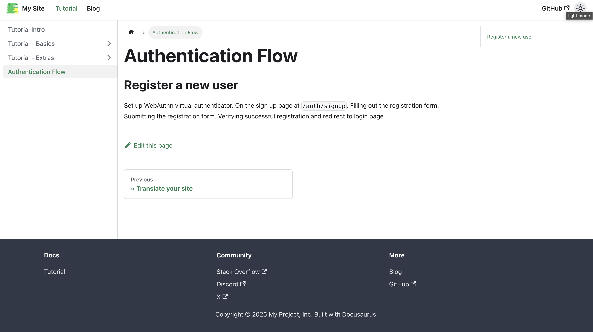

It's very basic. Has out describe block as an h1, and test title for h2. With a paragraph of our step blocks.

To make this a bit more helpful, we'll need to use a few helper methods from the `@test2doc/playwright` package and incorporate that into our tests.

#### Generate meaningful docs from tests
We'll add:
- Links for helpful extra information
- Screenshots
- Front matter metadata to render in the sidebar

```ts {6,9,15,40,54-72,86-88}
import { test, expect, CDPSession } from "@playwright/test"
import { simulateSuccessfulPasskeyInput } from "./util"
import { withDocMeta } from "@test2doc/playwright/DocMeta"
import { screenshot } from "@test2doc/playwright/screenshots"

const clip = { x: 0, y: 0, width: 550, height: 200 }

test.describe(
  withDocMeta("Authentication Flow", { sidebar_position: 1 }),
  () => {
    const username = `testuser-${Date.now()}`
    test("Register a new user", async ({ page }, testInfo) => {
      let client: CDPSession
      let authenticatorId: string
      await test.step("We support [Passkeys](https://docs.github.com/en/authentication/authenticating-with-a-passkey/about-passkeys) by [WebAuthn](https://en.wikipedia.org/wiki/WebAuthn).\n\n", async () => {
        client = await page.context().newCDPSession(page)
        await client.send("WebAuthn.enable")

        const result = await client.send("WebAuthn.addVirtualAuthenticator", {
          options: {
            protocol: "ctap2",
            transport: "internal",
            hasResidentKey: true,
            hasUserVerification: true,
            isUserVerified: true,
            automaticPresenceSimulation: true,
          },
        })

        authenticatorId = result.authenticatorId
      })

      await test.step("To get started with registration, goto the sign up page at `/auth/signup`.", async () => {
        await page.goto("auth/signup")

        await expect(
          page.getByRole("heading", { name: "Sign up" }),
        ).toBeVisible()

        await screenshot(testInfo, page, { clip })

        const result = await client.send("WebAuthn.getCredentials", {
          authenticatorId,
        })
        expect(result.credentials).toHaveLength(0)
      })

      await test.step("\n\nFilling out the registration form and ", async () => {
        const usernameInput = page.getByRole("textbox", { name: "Username" })
        await usernameInput.fill(username)
      })

      await test.step("submitting the registration form. Then follow the passkey registration prompt by your browser.\n\n", async () => {
        await screenshot(
          testInfo,
          [
            {
              target: page.getByRole("textbox", { name: "Username" }),
              options: { annotation: { text: "Input username here" } },
            },
            {
              target: page.getByRole("button", {
                name: "Register with passkey",
              }),
              options: { annotation: { text: "Click to register" } },
            },
          ],
          {
            annotation: { showArrow: true },
            clip,
          },
        )
        await simulateSuccessfulPasskeyInput(
          client,
          authenticatorId,
          async () =>
            await page
              .getByRole("button", { name: "Register with passkey" })
              .click(),
        )
      })

      await test.step("\n\nOn successful registration you will be redirect to login page.", async () => {
        await expect(page.getByRole("heading", { name: "YOLO" })).toBeVisible()

        await screenshot(testInfo, page, {
          clip,
        })

        const result = await client.send("WebAuthn.getCredentials", {
          authenticatorId,
        })
        expect(result.credentials).toHaveLength(1)
      })
    })
  },
)
```

Let's walk through a few of the notable changes we made to the test files to generate docs.

##### Applying Front matter to docs
```ts
withDocMeta("Authentication Flow", { sidebar_position: 1 }),
```
This is how we pass the Front matter metadata to Test2Doc to generate it in the markdown for Docusaurus. Front matter allows us to customize how Docusaurus renders our doc in the sidebar.

```ts
const clip = { x: 0, y: 0, width: 550, height: 200 }
...
await screenshot(testInfo, page, { clip })
```
The `screenshot` function takes screenshots of our app to embed it into the markdown of the doc.

The first argument is the `testInfo`, which is how we are able to pass data to the reporter.

The second argument is either a `Page` object or a `Locator` which can be used to either take a screenshot of the entire page, or to highlight a specific element on the page.

The third argument is options to customize how screenshots are taken. In this case, we're passing in a `clip` object, since our current page elements are pretty small.

```ts
await screenshot(
  testInfo,
  [
    {
      target: page.getByRole("textbox", { name: "Username" }),
      options: { annotation: { text: "Input username here" } },
    },
    {
      target: page.getByRole("button", {
        name: "Register with passkey",
      }),
      options: { annotation: { text: "Click to register" } },
    },
  ],
  {
    annotation: { showArrow: true },
    clip,
  },
)
```
One of the more advance features of `screenshot` function is to pass in an array of `Locator`s. You'll also notice that in the options, we're passing in `annotation: { showArrow: true }` this will apply to all the Locators we pass in. The `showArrow` argument will render a red arrow and point to the highlighted Locator element. Which can be helpful to emphasis what element we're talking about.

```ts
await test.step("We support [Passkeys](https://docs.github.com/en/authentication/authenticating-with-a-passkey/about-passkeys) by [WebAuthn](https://en.wikipedia.org/wiki/WebAuthn).\n\n", async () => {
...
await test.step("To get started with registration, goto the sign up page at `/auth/signup`.", async () => {
```

In the steps, we can use markdown to render links or create code blocks in our doc. Any valid markdown works.

You might also have noticed that we make pretty liberal use of `\n\n` to create linebreaks. Step titles are rendered inline, to allow titles to flow into each other by default. If you want to ensure the next title is on its own line, you'll need to be explicit about it by adding `\n\n` to our text.

A few titles also have `\n\n` at the start of the text in order to create line breaks after images that are inserted into the doc. Images are also rendered inline by default as well.

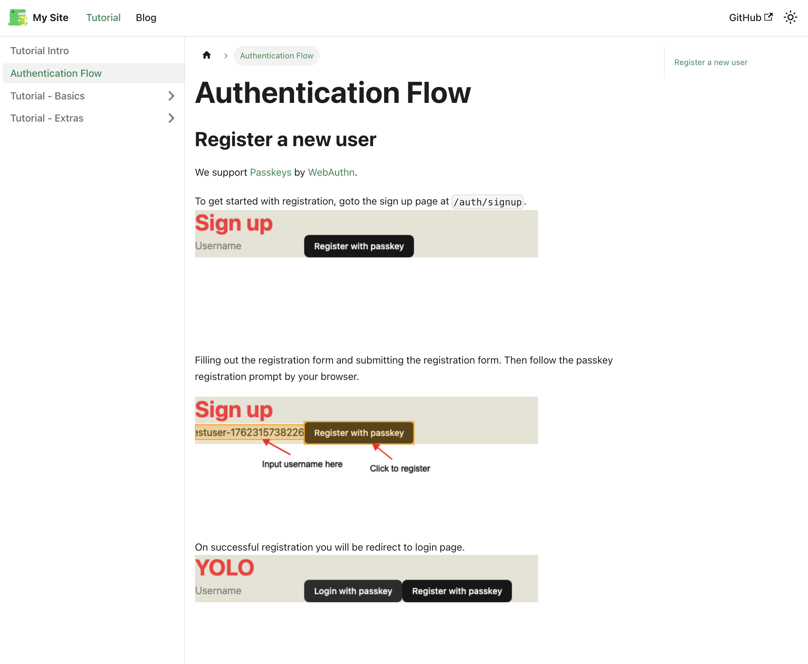

The doc does a pretty good job at communicating what and how to register a new user.

## Test Drive Login
Now that we have registration, the next thing we need to do is test that login works.

After we register a new user, we'll need to reuse the same passkey that we generated. We could technically extent that registration test with the login, but while a bit more challenging, I think it might be better if we separate login in to it's own test.

```ts title="tests/authentication.spec.ts"
test("Login with existing user", async ({ page }, testInfo) => {
  let client: CDPSession
  let authenticatorId: string
  await test.step("Setup WebAuthn virtual authenticator.\n\n", async () => {
    client = await page.context().newCDPSession(page)
    await client.send("WebAuthn.enable")

    const result = await client.send("WebAuthn.addVirtualAuthenticator", {
      options: {
        protocol: "ctap2",
        transport: "internal",
        hasResidentKey: true,
        hasUserVerification: true,
        isUserVerified: true,
        automaticPresenceSimulation: true,
      },
    })

    authenticatorId = result.authenticatorId
  })

  await test.step("While on the login page at `/auth/login`.\n\n", async () => {
    await page.goto("auth/login")

    await expect(page.getByRole("heading", { name: "YOLO" })).toBeVisible()

    await screenshot(testInfo, page, { clip })
  })

  await test.step("\n\nClicking the login button and following the passkey prompt by your browser.\n\n", async () => {
    await screenshot(
      testInfo,
      page.getByRole("button", { name: "Login with passkey" }),
      {
        annotation: { text: "Click to login", showArrow: true },
        clip,
      },
    )
    await simulateSuccessfulPasskeyInput(
      client,
      authenticatorId,
      async () =>
        await page
          .getByRole("button", { name: "Login with passkey" })
          .click(),
    )
  })

  await test.step("\n\nOn successful login you will see a success message.\n\n", async () => {
    await expect(page.getByText("Login successful!")).toBeVisible()

    await screenshot(testInfo, page, {
      clip,
    })
  })
})
```

Now, if you run the test, you'll notice it fails. Because each test runs in isolation we don't have access to the previous Passkey. We'll need to come up with a way to share the passkey between tests. We can do this by sharing the browser context between runs, and we'll need to make sure that the tests run in order.

```ts title="tests/authentication.spec.ts" {18-32,36,54,57,60,69,80,84,99,107,110,123,126,129,135,145,152,154}
import {
  test,
  expect,
  CDPSession,
  Page,
  BrowserContext,
} from "@playwright/test"
import { simulateSuccessfulPasskeyInput } from "./util"
import { withDocMeta } from "@test2doc/playwright/DocMeta"
import { screenshot } from "@test2doc/playwright/screenshots"

const clip = { x: 0, y: 0, width: 550, height: 200 }

test.describe.serial(
  withDocMeta("Authentication Flow", { sidebar_position: 1 }),
  () => {
    const username = `testuser-${Date.now()}`
    let client: CDPSession
    let authenticatorId: string
    let sharedContext: BrowserContext
    let sharedPage: Page

    test.beforeAll(async ({ browser }) => {
      // Create shared context for both tests
      sharedContext = await browser.newContext()
      sharedPage = await sharedContext.newPage()
    })

    test.afterAll(async () => {
      await client?.detach()
      await sharedContext?.close()
    })

    test("Register a new user", async ({}, testInfo) => {
      await test.step("We support [Passkeys](https://docs.github.com/en/authentication/authenticating-with-a-passkey/about-passkeys) by [WebAuthn](https://en.wikipedia.org/wiki/WebAuthn).\n\n", async () => {
        client = await sharedPage.context().newCDPSession(sharedPage)
        await client.send("WebAuthn.enable")

        const result = await client.send("WebAuthn.addVirtualAuthenticator", {
          options: {
            protocol: "ctap2",
            transport: "internal",
            hasResidentKey: true,
            hasUserVerification: true,
            isUserVerified: true,
            automaticPresenceSimulation: true,
          },
        })

        authenticatorId = result.authenticatorId
      })

      await test.step("To get started with registration, goto the sign up page at `/auth/signup`.", async () => {
        await sharedPage.goto("auth/signup")

        await expect(
          sharedPage.getByRole("heading", { name: "Sign up" }),
        ).toBeVisible()

        await screenshot(testInfo, sharedPage, { clip })

        const result = await client.send("WebAuthn.getCredentials", {
          authenticatorId,
        })
        expect(result.credentials).toHaveLength(0)
      })

      await test.step("\n\nFilling out the registration form and ", async () => {
        const usernameInput = sharedPage.getByRole("textbox", {
          name: "Username",
        })
        await usernameInput.fill(username)
      })

      await test.step("submitting the registration form. Then follow the passkey registration prompt by your browser.\n\n", async () => {
        await screenshot(
          testInfo,
          [
            {
              target: sharedPage.getByRole("textbox", { name: "Username" }),
              options: { annotation: { text: "Input username here" } },
            },
            {
              target: sharedPage.getByRole("button", {
                name: "Register with passkey",
              }),
              options: { annotation: { text: "Click to register" } },
            },
          ],
          {
            annotation: { showArrow: true },
            clip,
          },
        )
        await simulateSuccessfulPasskeyInput(
          client,
          authenticatorId,
          async () =>
            await sharedPage
              .getByRole("button", { name: "Register with passkey" })
              .click(),
        )
      })

      await test.step("\n\nOn successful registration you will be redirect to login page.", async () => {
        await expect(
          sharedPage.getByRole("heading", { name: "YOLO" }),
        ).toBeVisible()

        await screenshot(testInfo, sharedPage, {
          clip,
        })

        const result = await client.send("WebAuthn.getCredentials", {
          authenticatorId,
        })
        expect(result.credentials).toHaveLength(1)
      })
    })

    test("Login with existing user", async ({}, testInfo) => {
      await test.step("While on the login page at `/auth/login`.\n\n", async () => {
        await sharedPage.goto("auth/login")

        await expect(
          sharedPage.getByRole("heading", { name: "YOLO" }),
        ).toBeVisible()

        await screenshot(testInfo, sharedPage, { clip })
      })

      await test.step("\n\nClicking the login button and following the passkey prompt by your browser.\n\n", async () => {
        await screenshot(
          testInfo,
          sharedPage.getByRole("button", { name: "Login with passkey" }),
          {
            annotation: { text: "Click to login", showArrow: true },
            clip,
          },
        )
        await simulateSuccessfulPasskeyInput(
          client,
          authenticatorId,
          async () =>
            await sharedPage
              .getByRole("button", { name: "Login with passkey" })
              .click(),
        )
      })

      await test.step("\n\nOn successful login you will see a success message.\n\n", async () => {
        await expect(sharedPage.getByText("Login successful!")).toBeVisible()

        await screenshot(testInfo, sharedPage, {
          clip,
        })
      })
    })
  },
)
```

First thing we need to do is setup the `describe` block to run the test in order with the `.serial` method.

So, you'll notice that we moved `client` and `authenticatorId` to the root describe block and added `sharedContext` and `sharedPage`. Then we setup our `beforeAll` and `afterAll` to setup the sharing of the browser context between our tests. Then we swapped out all the `page` variables with `sharedPage`. And I removed the `step` where we setup WebAuthn in the login test as it is no longer needed. And we're done.

Now we can reuse the passkey from registration in the login test.

Now if you run `pnpm doc` we should have new docs with the login.

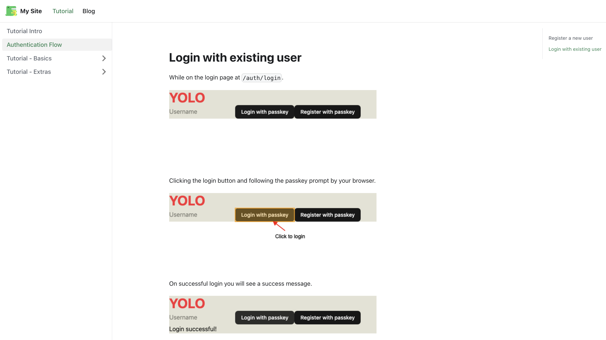

### Test redirecting to Dashboard
So we don't want to just show a success message. After we successfully login, we want to actually land on the Applications Dashboard page. So let's update the test to capture this intended functionality.

```diff title="tests/authentication.spec.ts"
-await test.step("\n\nOn successful login you will see a success message.\n\n", async () => {
-  await expect(sharedPage.getByText("Login successful!")).toBeVisible()
+await test.step("\n\nOn successful login you will be taken to the applications page.\n\n", async () => {
+  await expect(
+    sharedPage.getByRole("heading", { name: "Applications" }),
+  ).toBeVisible()

  await screenshot(testInfo, sharedPage, {
    clip,
  })
})
```

### Implement redirect to Dashboard
First we need to add the new route for our dashboard to our app's links.

```ts title="src/app/shared/links.ts" {7}
import { defineLinks } from "rwsdk/router"

export const link = defineLinks([
  "/",
  "/auth/login",
  "/auth/signup",
  "/applications",
])
```

We'll add a placeholder route for now, and refactor it later with the real implementation.

We'll also take the time to refactor how the auth interceptor works.

```tsx title="src/worker.tsx"{2-9,15,17-19}
...
const isAuthenticated = ({ ctx }: { ctx: AppContext }) => {
  if (!ctx.session?.userId) {
    return new Response(null, {
      status: 302,
      headers: { Location: "/auth/login" },
    })
  }
}

export default defineApp([
  setCommonHeaders(),
  setupPasskeyAuth(),
  render(Document, [
    index([isAuthenticated, Home]),
    prefix("/auth", authRoutes()),
    prefix("/applications", [
      route("/", [isAuthenticated, () => <h1>Applications</h1>]),
    ]),
  ]),
])
```

Lastly, we need to update the login success logic to redirect us to our new route.

```ts title="src/passkey/components/Login.tsx" {6}
...
if (!success) {
  setResult("Login failed")
} else {
  setResult("Login successful!")
  window.location.href = link("/applications")
}
...
```

### Test protected route
So adding the new dashboard route reminded me we need to test that our interceptor works. So, we'll break our TTD approach and add a test retro actively.

```ts title="tests/authentication.spec.ts"
test.describe(withDocMeta("Protected Routes", {}), () => {
  test("Unauthenticated users are redirected to login page when accessing protected routes", async ({
    page,
  }) => {
    await test.step("- `/applications`", async () => {
      await page.goto("/applications")

      await expect(page).toHaveURL("/auth/login")
    })

    await test.step("- `/`", async () => {
      await page.goto("/")

      await expect(page).toHaveURL("/auth/login")
    })
  })
})
```

We added a new describe block to the bottom of the test. We can also add it to a new file, but for now the `authentication.spec.ts` isn't so large that we need to make that decision yet. So let's follow YAGNI principles (**You Aren't Gonna Need It**), and we can refactor this block in to another file when we feel this test file is doing too much.

### Simplify Login
Currently, the login also has a registration button, which we don't want to maintain. And since we're following YAGNI, let's remove this functionality, as we're not going to need it. And less code, more better.

Also, let's remove the `useState` that manages the username. In fact it doesn't appear that we need the username input at all, but we'll leave it for now, since it is apart of the final design.

```ts title="src/passkey/components/Login.tsx"
export function Login() {
  const [result, setResult] = useState("")
  const [isPending, startTransition] = useTransition()

  const passkeyLogin = async () => {
    try {
      // 1. Get a challenge from the worker
      const options = await startPasskeyLogin()

      // 2. Ask the browser to sign the challenge
      const login = await startAuthentication({ optionsJSON: options })
      // 3. Give the signed challenge to the worker to finish the login process
      const success = await finishPasskeyLogin(login)

      if (!success) {
        setResult("Login failed")
      } else {
        setResult("Login successful!")
        window.location.href = link("/applications")
      }
    } catch (error: unknown) {
      setResult(
        `Login error: ${
          error instanceof Error ? error.message : "Unknown error"
        }`,
      )
    }
  }

  const handlePerformPasskeyLogin = () => {
    startTransition(() => void passkeyLogin())
  }

  return (
    <main className="bg-bg">
      <h1 className="text-4xl font-bold text-red-500">YOLO</h1>
      <input type="text" placeholder="Username" />
      <Button onClick={handlePerformPasskeyLogin} disabled={isPending}>
        {isPending ?
          <>...</>
        : "Login with passkey"}
      </Button>
      {result && <div>{result}</div>}
    </main>
  )
}
```

If you run the tests again, everything should still pass.

## Styling the Login Page
Now that we know our authentication code is working, let's add some styles and make it look good.

If we take a look at [the final design within Figma](https://www.figma.com/design/nqBPIIfe0MO4W8zOfW4oae/RedwoodSDK---Applywize?node-id=239-604&t=FgZ9fCMuzDNcOmRO-4), this is what we're aiming for:

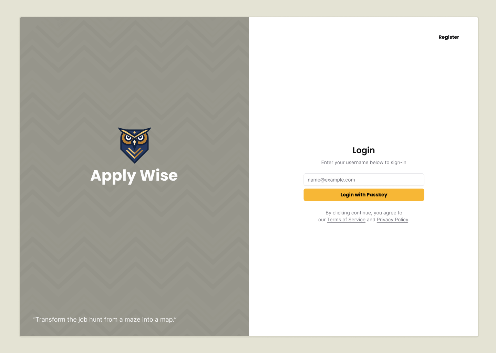

This is similar to the final sign up page. The only difference between the login and registration pages is the content on the right side.

Let's create a layout component, that we can use in both places.

### Creating a Layout Component

When we installed shadcn/ui, it added a lot of variables to the bottom of our `styles.css` file. In CSS, order matters. So, let's move our `@theme` definition to the bottom of the file, but above the `@layer base` definition so that it reads as more important and will override any shadcn/ui default values.


#### Updated `styles.css` file

```css title="src/app/styles.css"
@import url('https://fonts.googleapis.com/css2?family=Poppins:wght@500;700&display=swap');
@import url('https://fonts.googleapis.com/css2?family=Inter:wght@400;700&display=swap');

@import "tailwindcss";

@import "tw-animate-css";

@custom-variant dark (&:is(.dark *));

body {
  font-family: var(--font-body);
}

:root {
  --radius: 0.625rem;
  --background: oklch(1 0 0);
  --foreground: oklch(0.145 0 0);
  --card: oklch(1 0 0);
  --card-foreground: oklch(0.145 0 0);
  --popover: oklch(1 0 0);
  --popover-foreground: oklch(0.145 0 0);
  --primary: oklch(0.205 0 0);
  --primary-foreground: oklch(0.985 0 0);
  --secondary: oklch(0.97 0 0);
  --secondary-foreground: oklch(0.205 0 0);
  --muted: oklch(0.97 0 0);
  --muted-foreground: oklch(0.556 0 0);
  --accent: oklch(0.97 0 0);
  --accent-foreground: oklch(0.205 0 0);
  --destructive: oklch(0.577 0.245 27.325);
  --border: oklch(0.922 0 0);
  --input: oklch(0.922 0 0);
  --ring: oklch(0.708 0 0);
  --chart-1: oklch(0.646 0.222 41.116);
  --chart-2: oklch(0.6 0.118 184.704);
  --chart-3: oklch(0.398 0.07 227.392);
  --chart-4: oklch(0.828 0.189 84.429);
  --chart-5: oklch(0.769 0.188 70.08);
  --sidebar: oklch(0.985 0 0);
  --sidebar-foreground: oklch(0.145 0 0);
  --sidebar-primary: oklch(0.205 0 0);
  --sidebar-primary-foreground: oklch(0.985 0 0);
  --sidebar-accent: oklch(0.97 0 0);
  --sidebar-accent-foreground: oklch(0.205 0 0);
  --sidebar-border: oklch(0.922 0 0);
  --sidebar-ring: oklch(0.708 0 0);
}

.dark {
  --background: oklch(0.145 0 0);
  --foreground: oklch(0.985 0 0);
  --card: oklch(0.205 0 0);
  --card-foreground: oklch(0.985 0 0);
  --popover: oklch(0.205 0 0);
  --popover-foreground: oklch(0.985 0 0);
  --primary: oklch(0.922 0 0);
  --primary-foreground: oklch(0.205 0 0);
  --secondary: oklch(0.269 0 0);
  --secondary-foreground: oklch(0.985 0 0);
  --muted: oklch(0.269 0 0);
  --muted-foreground: oklch(0.708 0 0);
  --accent: oklch(0.269 0 0);
  --accent-foreground: oklch(0.985 0 0);
  --destructive: oklch(0.704 0.191 22.216);
  --border: oklch(1 0 0 / 10%);
  --input: oklch(1 0 0 / 15%);
  --ring: oklch(0.556 0 0);
  --chart-1: oklch(0.488 0.243 264.376);
  --chart-2: oklch(0.696 0.17 162.48);
  --chart-3: oklch(0.769 0.188 70.08);
  --chart-4: oklch(0.627 0.265 303.9);
  --chart-5: oklch(0.645 0.246 16.439);
  --sidebar: oklch(0.205 0 0);
  --sidebar-foreground: oklch(0.985 0 0);
  --sidebar-primary: oklch(0.488 0.243 264.376);
  --sidebar-primary-foreground: oklch(0.985 0 0);
  --sidebar-accent: oklch(0.269 0 0);
  --sidebar-accent-foreground: oklch(0.985 0 0);
  --sidebar-border: oklch(1 0 0 / 10%);
  --sidebar-ring: oklch(0.556 0 0);
}

@theme inline {
  --radius-sm: calc(var(--radius) - 4px);
  --radius-md: calc(var(--radius) - 2px);
  --radius-lg: var(--radius);
  --radius-xl: calc(var(--radius) + 4px);
  --color-background: var(--background);
  --color-foreground: var(--foreground);
  --color-card: var(--card);
  --color-card-foreground: var(--card-foreground);
  --color-popover: var(--popover);
  --color-popover-foreground: var(--popover-foreground);
  --color-primary: var(--primary);
  --color-primary-foreground: var(--primary-foreground);
  --color-secondary: var(--secondary);
  --color-secondary-foreground: var(--secondary-foreground);
  --color-muted: var(--muted);
  --color-muted-foreground: var(--muted-foreground);
  --color-accent: var(--accent);
  --color-accent-foreground: var(--accent-foreground);
  --color-destructive: var(--destructive);
  --color-border: var(--border);
  --color-input: var(--input);
  --color-ring: var(--ring);
  --color-chart-1: var(--chart-1);
  --color-chart-2: var(--chart-2);
  --color-chart-3: var(--chart-3);
  --color-chart-4: var(--chart-4);
  --color-chart-5: var(--chart-5);
  --color-sidebar: var(--sidebar);
  --color-sidebar-foreground: var(--sidebar-foreground);
  --color-sidebar-primary: var(--sidebar-primary);
  --color-sidebar-primary-foreground: var(--sidebar-primary-foreground);
  --color-sidebar-accent: var(--sidebar-accent);
  --color-sidebar-accent-foreground: var(--sidebar-accent-foreground);
  --color-sidebar-border: var(--sidebar-border);
  --color-sidebar-ring: var(--sidebar-ring);
}

@theme {
  --font-display: "Poppins", sans-serif;
  --font-body: "Inter", sans-serif;

  --color-bg: #e4e3d4;
  --color-border: #eeeef0;

  --color-primary: #f7b736;
  --color-secondary: #f1f1e8;
  --color-destructive: #ef533f;

  --color-tag-applied: #b1c7c0;
  --color-tag-interview: #da9b7c;
  --color-tag-new: #db9a9f;
  --color-tag-rejected: #e4e3d4;
  --color-tag-offer: #aae198;
}

@layer base {
  * {
    @apply border-border outline-ring/50;
  }
  body {
    @apply bg-background text-foreground;
  }
}
```

If you take a look in the browser, by changing the position of the `@theme` block, it also changed the button's background color to yellow, our primary color. Perfect.

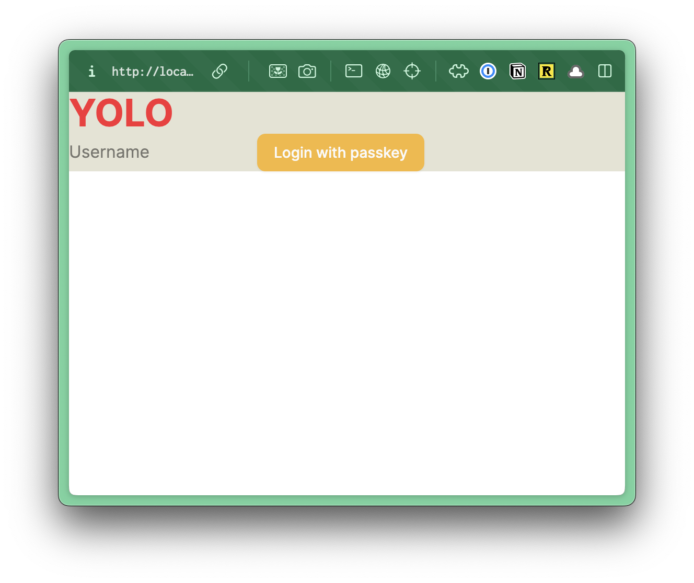

#### Building a Layout
RedwoodSDK supports layouts. This is perfect for creating shared UI layouts across multiple routes, allowing you to maintain consistent page structures and avoid code duplication.

Inside our `app` directory, create a new folder called `layouts`. Then, a new file called `AuthLayout.tsx`:

Let's start by stubbing out our component:

```tsx title="src/app/layouts/AuthLayout.tsx"
import { type LayoutProps } from "rwsdk/router"

export const AuthLayout = ({ children }: LayoutProps) => {
  return <div className="bg-bg min-h-screen min-w-screen p-12">{children}</div>
}
```
---
Our layout component types are imported from `rwsdk/router`. This includes an object containing `children` and `requestInfo`. It's worth noting that the `requestInfo` object is only passed to server components ([additional documentation](https://docs.rwsdk.com/guides/frontend/layouts/#layout-props)).

On our wrapping `div`, I've added a few Tailwind styles.
- `bg-bg` uses the custom background color we set up previously.
- `min-h-screen` and `min-w-screen` ensures that the background color will take up the full screen.
- `p-12` adds `48px` of padding around the entire screen.
---
As we continue to make adjustments, we want to be able to see the changes we're making within the browser.

To wrap all our `/auth` pages with the new `AuthLayout` component, let's go back to our `worker.tsx` file.

At the top of our file, import the `layout` function from `rwsdk/router` and import our `AuthLayout` component:

```tsx title="src/worker.tsx"
import { render, index, prefix, route, layout } from "rwsdk/router"
...
import { AuthLayout } from "@/app/layouts/AuthLayout"
```
Now, let's jump down to our `prefix` function:

```tsx title="src/worker.tsx"
prefix("/auth", authRoutes()),
```

Wrap this code with the `layout` function we just imported:

```tsx title="src/worker.tsx"
layout(AuthLayout, [prefix("/auth", authRoutes())]),
```

The first parameter is the layout component we want to wrap our routes with. The second parameter is the routes we want to wrap.

If we head over to the browser, we should see something like this:

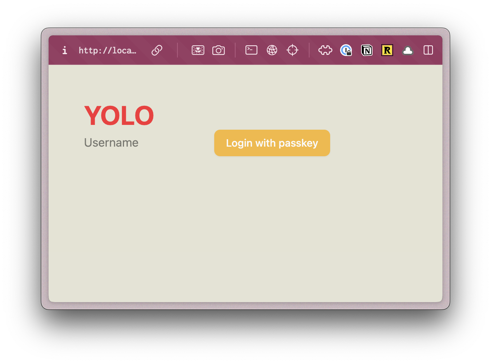
For reference, this was before our `AuthLayout` component:
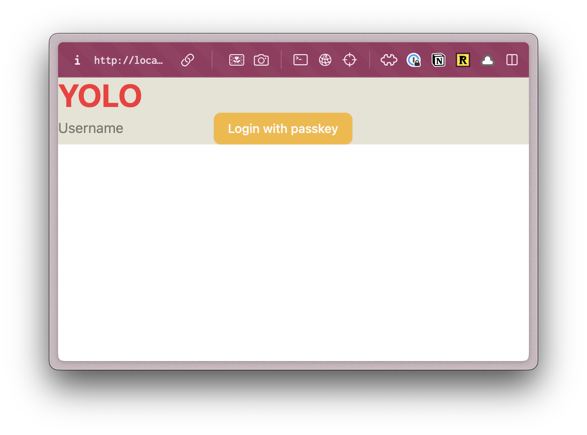

Sweet! Let's keep going.

#### Making two column layout

Inside our wrapping `div`, let's set up our two column grid:

```tsx title="src/app/layouts/AuthLayout.tsx"
return (
    <div className="bg-bg min-h-screen min-w-screen p-12">
      <div className="grid grid-cols-2 min-h-[calc(100vh-96px)] rounded-xl border-2 border-[#D6D5C5]">
        {children}
      </div>
    </div>
  );
```

---
- `grid` sets the display to `grid`, then we can specify that there are two columns with `grid-cols-2`
- We want the grid to take up the full height of the screen. If we use `min-h-screen`, it will set the minimum height to `100vh`, but it will also introduce a scrollbar because we gave the wrapping `div` padding of `p-12`. There's no way to know exactly what the height of the screen is, but we can have the browser calculate it for us with `calc(100vh-96px)`. `p-12` puts `48px` of padding on the top and bottom or `96px` total. You could also use `6rem` if you want to avoid using `px` units.
- `rounded-xl` adds rounded corners
- `border-2 border-[#D6D5C5]` adds a `2px` solid border to our container. The border color we're using is darker than the content border color we established in the `styles.css` file earlier. Since we're only using this color once, it's not worth creating a CSS property for it. We can set it as an arbitrary value with `[]`.
---

Inside our `grid`, we need two `div`s for our two columns. Our `{children}` will go in the second column, on the right side.

```tsx title="src/app/layouts/AuthLayout.tsx"
return (
  <div className="bg-bg min-h-screen min-w-screen p-12">
    <div className="grid grid-cols-2 min-h-[calc(100vh-96px)] rounded-xl border-2 border-[#D6D5C5]">
      <div></div>
      <div>{children}</div>
    </div>
  </div>
);
```

#### Styling the Left side

For the column on the left, we have a repeating background image. You can export this image from Figma yourself, or [grab all the image assets for this project here](https://github.com/ahaywood/applywize/tree/main/assets).

Inside the root of our project, create a new folder called `public`. Inside, I'm going to create another folder called `images` and drop the image inside. `public/images/`.

For our left column `div`:

```tsx title="src/app/layouts/AuthLayout.tsx"
<div className="bg-bg min-h-screen min-w-screen p-12">
  <div className="grid grid-cols-2 min-h-[calc(100vh-96px)] rounded-xl border-2 border-[#D6D5C5]">
    <div className="bg-[url('/images/bg.png')] bg-repeat rounded-l-xl">
      
      <div>
        Apply Wize
      </div>
    </div>
    <div>
      {children}
    </div>
  </div>
</div>
```
---
- This is the only place we're using our background image, so let's reach for an another arbitrary Tailwind class, using `[]`. Since we've put our images inside the `public/images` directory, this will be available from the root and we can access it with an absolute path: `/images/bg.png`.
- We want the background to repeat in the x and y directions with `bg-repeat`.
- `rounded-l-xl` adds rounded corners to the left side.
- I also used a standard `img` tag to display the logo and added the `Apply Wize` text with a wrapping `div`
---

Let's check our progress in the browser:

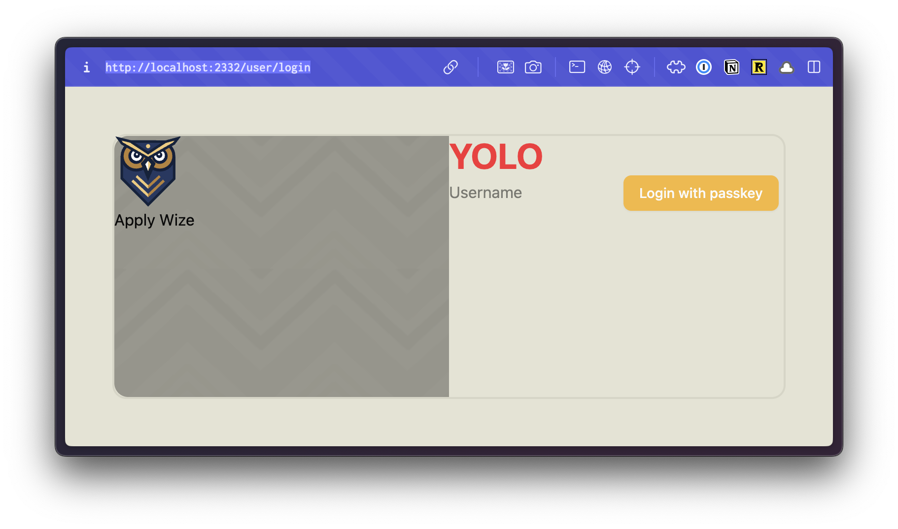
Cool. 😎 We're almost there, we just need to tighten up a few more things.

I want the content to be centered vertically and horizontally. You can do this by adding a class of `flex` and `items-center` and `justify-center`. But, I do this a lot. So, let's turn this into a utility function that we can reuse.

Inside our `styles.css` file, let's add a new utility function. Below our `@theme` definition, add:

```css title="src/styles.css"
@utility center {
  @apply flex items-center justify-center;
}
```

---

Within Tailwind v4, you can add custom utility functions with the `@utility` directive. _NOTE:_ `center` does not have a `.` in front, like a class would.

---

Now, we can use this on both of our columns:

```tsx title="src/app/layouts/AuthLayout.tsx"
  return (
    <div className="bg-bg min-h-screen min-w-screen p-12">
      <div className="grid grid-cols-2 min-h-[calc(100vh-96px)] rounded-xl border-2 border-[#D6D5C5]">
        <div className="center bg-[url('/images/bg.png')] bg-repeat rounded-l-xl">
          
          <div>Apply Wize</div>
        </div>
        <div className="center">{children}</div>
      </div>
    </div>
  );
```

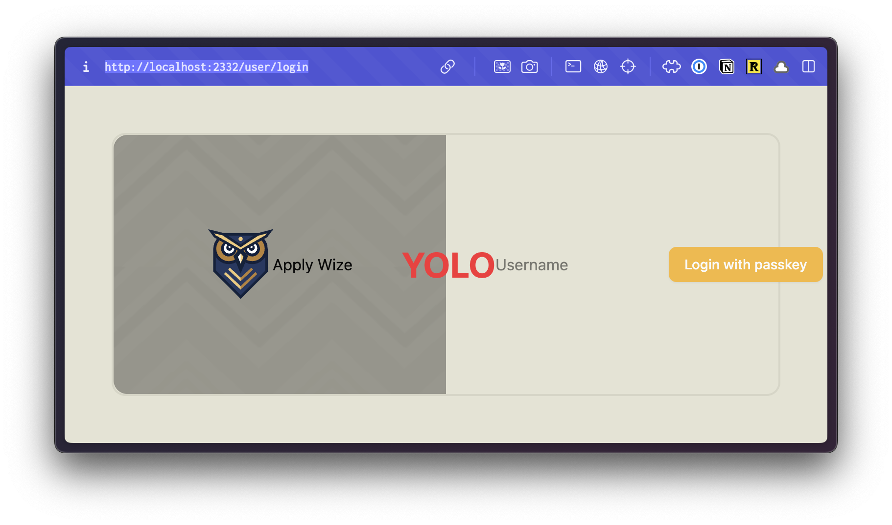

It's centering our content, but it's also horizontally aligning everything. Let's wrap our column content with another `div`.

```tsx title="src/app/layouts/AuthLayout.tsx" {5,8,11}
return (
  <div className="bg-bg min-h-screen min-w-screen p-12">
    <div className="grid grid-cols-2 min-h-[calc(100vh-96px)] rounded-xl border-2 border-[#D6D5C5]">
      <div className="center bg-[url('/images/bg.png')] bg-repeat rounded-l-xl">
        <div>
          
          <div>Apply Wize</div>
        </div>
      </div>
      <div className="center">
        <div>{children}</div>
      </div>
    </div>
  </div>
);
```

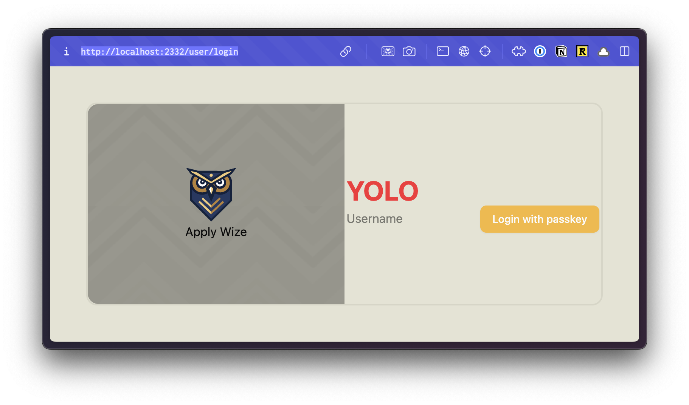

To center the owl, we can use the `mx-auto` class. This will set the left and right margins to `auto`.

```tsx title="src/app/layouts/AuthLayout.tsx"

```

Now, let's style the Apply Wize text.

```tsx title="src/app/layouts/AuthLayout.tsx"
<div className="text-5xl text-white font-bold">Apply Wize</div>
```
---
- We'll set the font size `48px` with `text-5xl`
- The color to white with `text-white`
- The font weight to bold with `font-bold`
---

In our mock-up, we also had a quote in the bottom left corner:

> "Transform the job hunt from a maze into a map."

<figure>
  
  <figcaption>Final login page mock-up</figcaption>
</figure>

We want this to be fixed to the bottom of the left column. So, this needs to be inside our left column `div`, but outside of the `div` containing our logo.


```tsx title="src/app/layouts/AuthLayout.tsx" {6-8}
<div className="center bg-[url('/images/bg.png')] bg-repeat rounded-l-xl">
  <div>
    
    <div className="text-5xl text-white font-bold">Apply Wize</div>
  </div>
  <div>
    &ldquo;Transform the job hunt from a maze into a map.&rdquo;
  </div>
</div>
```

To style the text:

```tsx title="src/app/layouts/AuthLayout.tsx" startLineNumber=12 {1}
<div className="text-white text-sm absolute bottom-0 left-0 right-0 p-10">
  &ldquo;Transform the job hunt from a maze into a map.&rdquo;
</div>
```
---
- We want to it to be white, `text-white` and small (`14px`) `text-sm`
- Then, we can position it absolutely to the bottom left corner with `absolute bottom-0 left-0`
- We want to add a little bit of spacing from the edge with `p-10` which is `40px` of padding
---

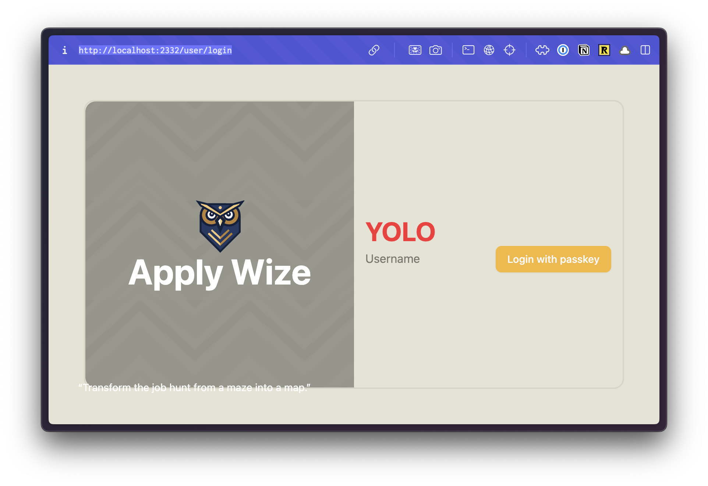

This looks good-ish. The text is styled correctly, but the placement is off. We could adjust our our `top` and `left` values, but that's not the real problem. In CSS, positioning is relative. Meaning, it takes the parent container and it's positioning into consideration.

Our parent `div` doesn't have any positioning applied (by default it's `static`). Therefore, it looks to the page. And, yes, our quote is positioned to the bottom left corner of the page, with `40px` of padding.

If we add a class of `relative` to our parent `div`, then it will position our quote _relative_ to the parent container.

```tsx title="src/app/layouts/AuthLayout.tsx" {2}
<div className="grid grid-cols-2 min-h-[calc(100vh-96px)] rounded-xl border-2 border-[#D6D5C5]">
  <div className="relative center bg-[url('/images/bg.png')] bg-repeat rounded-l-xl">
    <div>
```

If you take a look inside the browser:

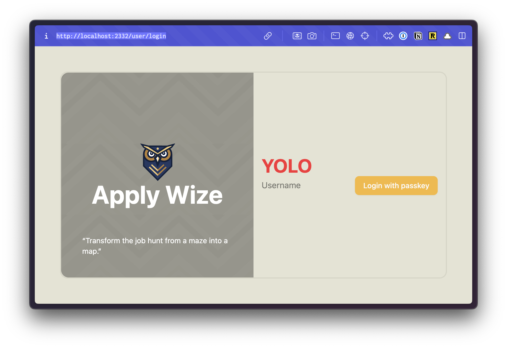

Notice, this also allows our quote to "live" inside the container and wrap appropriately.

It's tempting to call the styling for the left side done, but with the quote it looks bottom heavy. Even though the logo is programmatically centered, it's not optically centered. We can shift it up:

```tsx title="src/app/layouts/AuthLayout.tsx" {1} startLineNumber=8
<div className="-top-[100px] relative">
  
  <div className="text-5xl text-white font-bold">
    Apply Wize
  </div>
</div>
```
---
- We moved the logo up `100px` with `-top-[100px]`
- In order for `top` to work, we need also need to add a position of `relative`, so that the browser knows we're moving it _relative_ to it's current position.
---

If we take a look in the browser:

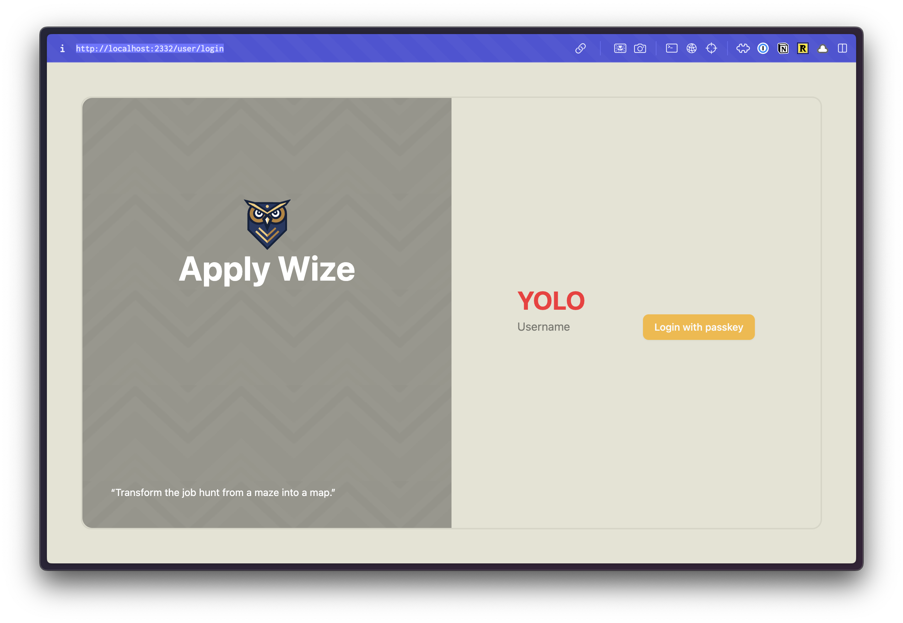

The left side is finished! 🎉

#### Styling the right side

Now, let's style the right side. This is easy!

```tsx title="src/app/layouts/AuthLayout.tsx"
<div className="center bg-white rounded-r-xl">
  <div className="w-full">{children}</div>
</div>
```
---
- The background should be white: `bg-white`
- And the corners on the right should be rounded, `rounded-r-xl`
- For the `div` that wraps `{children}`, we want it to take the full width of it's container with `w-full`
---

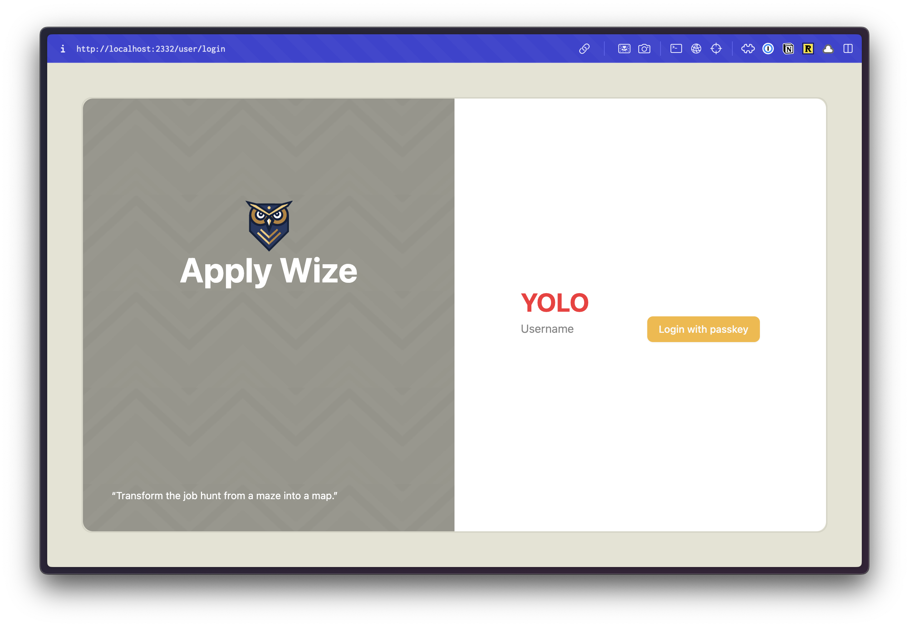

The styling for `AuthLayout` component is complete 🎉.

<details>
<summary>Final `src/app/layouts/AuthLayout.tsx` code </summary>

```tsx title="src/app/layouts/AuthLayout.tsx"
import { type LayoutProps } from "rwsdk/router"

export const AuthLayout = ({ children }: LayoutProps) => {
  return (
    <div className="bg-bg min-h-screen min-w-screen p-12">
      <div className="grid grid-cols-2 min-h-[calc(100vh-96px)] rounded-xl border-2 border-[#D6D5C5]">
        <div className="relative center bg-[url('/images/bg.png')] bg-repeat rounded-l-xl">
          <div className="-top-[110px] relative">
            
            <div className="text-5xl text-white font-bold">Apply Wize</div>
          </div>
          <div className="text-white text-sm absolute bottom-0 left-0 right-0 p-10">
            &ldquo;Transform the job hunt from a maze into a map.&rdquo;
          </div>
        </div>
        <div className="center bg-white rounded-r-xl">
          <div className="w-full">{children}</div>
        </div>
      </div>
    </div>
  )
}
```
</details>

### Styling the Login Content

Now, we can jump over to our `Login` component and style it.

Let's update our test first. We'll be changing the **YOLO** header to **Login**, so we'll reflect that first.

```ts title="" {4,23}
...
await test.step("\n\nOn successful registration you will be redirect to login page.", async () => {
    await expect(
      sharedPage.getByRole("heading", { name: "Login" }),
    ).toBeVisible()

    await screenshot(testInfo, sharedPage, {
      clip,
    })

    const result = await client.send("WebAuthn.getCredentials", {
      authenticatorId,
    })
    expect(result.credentials).toHaveLength(1)
  })
})

test("Login with existing user", async ({}, testInfo) => {
  await test.step("While on the login page at `/auth/login`.\n\n", async () => {
    await sharedPage.goto("auth/login")

    await expect(
      sharedPage.getByRole("heading", { name: "Login" }),
    ).toBeVisible()
  ...
```

We can delete our `h1`, **YOLO** text. We can also remove the `bg-bg` class from our wrapping `main` tag to help style the Login page to what we want.

```tsx title="src/passkey/components/Login.tsx"
<main>
  <input type="text" placeholder="Username" />
  <Button onClick={handlePerformPasskeyLogin} disabled={isPending}>
    {isPending ?
      <>...</>
    : "Login with passkey"}
  </Button>
  {result && <div>{result}</div>}
</main>
```

Now, let's just work from top to bottom.

In the top, right corner, we have a link to the signup page. This is similar to how we styled the quote in our layout component, except this time we want it positioned to the top, right corner.

We'll write some tests for this in a bit when we want to more navigation implemented.

```tsx title="src/app/pages/user/Login.tsx"
return (
  <main>
    <div className="absolute top-0 right-0 p-10">
      <a
        href="#"
        className="font-display font-bold text-black text-sm underline underline-offset-8 hover:decoration-primary"
      >
        Register
      </a>
    </div>
    ...
```
---
- We're positioning the link with `absolute` to the top right, `top-0 right-0` and adding `p-10` or `40px` of padding
- For the Register link, we want to use the font Poppins or `font-display`, make it bold `font-bold`, black `text-black`, and small `text-sm`
- I want to make sure this looks like a link. Let's add a class of `underline` and offset with `underline-offset-8` to give it some space from the text. Then, when we hover, let's just change the underline color with `hover:decoration-primary`
---

Now, we have the same positioning "problem" that we had with our quote. We need the link to be positioned relative to the container. Let's go back to the `AuthLayout` component and add a class of `relative`:

```tsx title="src/app/layouts/AuthLayout.tsx"
<div className="center bg-white rounded-r-xl relative">
  <div className="w-full">{children}</div>
</div>
```

Next up, let's wrap all of our form content with a `div` and add the text at the top of our form:

```tsx title="src/app/pages/user/Login.tsx" {1-3}
<div className="max-w-[400px] w-full mx-auto px-10">
  <h1 className="text-center">Login</h1>
  <p className="py-6">Enter your username below to sign-in.</p>

  <input type="text" placeholder="Username" />
  <Button onClick={handlePerformPasskeyLogin} disabled={isPending}>
    {isPending ?
      <>...</>
    : "Login with Passkey"}
  </Button>
  {result && <div>{result}</div>}
</div>
```
---
- On our wrapping `div` I don't want the content to be more than `400px` wide with `max-w-[400px]`. But, I want it to take up as much space as possible with `w-full`.
- I want it to be centered with `mx-auto`.
- On smaller screens, I want to ensure there's some horizontal padding with `px-10`
- Our `h1` should be centered with `text-center`
- I also want to add some vertical spacing with `py-6`
---

Let's also add some text below our form, and give some space for it away from the button:

```tsx title="src/app/pages/user/Login.tsx" {3,11-14}
<Button
  onClick={handlePerformPasskeyLogin}
  disabled={isPending}
  className="font-display w-full mb-6"
>
  {isPending ?
    <>...</>
  : "Login with passkey"}
</Button>
{result && <div>{result}</div>}
<p>
  By clicking continue, you agree to our <a href="#">Terms of Service</a>{" "}
  and <a href="#">Privacy Policy</a>.
</p>
```

I want to add some more styling, but I want to be able to reuse these styles on our Signup page, so let's stick these updates inside our `styles.css` file.

In CSS order matters. The [`@layer` CSS at-rule](https://developer.mozilla.org/en-US/docs/Web/CSS/@layer) makes it easy to declare a _layer_ and set the order of preference.

We'll be ordering our CSS:
1. **Base styles** are at the top. These are for styling generic HTML elements. No classes, just tags.
2. **Component styles.** These are for styling classes that get used across multiple components and pages.
3. **Page specific styles.** These are for styling elements on a specific page.

Based on this ordering, we get more specific as we move down the file.

Let's start by setting up `@layer` for each grouping.

At the very bottom of our `styles.css` file, we already have a `@layer base` that shadcn/ui created.

```css title="src/styles.css" {1,12-16}
@layer base, components, page;

@layer base {
  * {
    @apply border-border outline-ring/50;
  }
  body {
    @apply bg-background text-foreground;
  }
}

@layer components {
}

@layer page {
}
```

For all our headings (`h1, h2, h3, etc.`), we want to use the font Poppins, `font-display`, and make it bold `font-bold`. Let's stick this inside our base layer:

```css title="src/styles.css" {3-7}
@layer base {
  ...
  h1,
  h2,
  h3 {
    @apply font-display font-bold;
  }
}
```

Then, let's also add some more specific styles for our `h1` since it's a page title:

```css title="src/styles.css" {2-4}
@layer components {
  .page-title {
    @apply text-3xl
  }
}
```
---
- We're setting the font size to `30px` with `text-3xl`
---

Back in our `Login` component, let's add the class of `page-title` to our `h1`:

```tsx title="src/app/pages/user/Login.tsx"
<h1 className="page-title text-center">Login</h1>
```

We have a couple of paragraphs of text, but I only want these classes to be applied to paragraphs on our authentication pages. Let's add a class of `auth-form` to our wrapping `div`:

```tsx title="src/app/pages/user/Login.tsx" {1}
<div className="auth-form max-w-[400px] w-full mx-auto px-10">
  <h1 className="text-center page-title">Login</h1>
  ...
```

In our `styles.css` file, let's target the `auth-form` class:

```css title="src/styles.css" startLineNumber=161
@layer page {
  .auth-form {
    p {
      @apply text-sm text-zinc-500 text-center;
      a {
        @apply text-zinc-500 hover:text-black underline whitespace-nowrap;
      }
    }
  }
}
```
---
- You'll notice I'm using CSS nesting to target the `p` and `a` tags inside the `auth-form` class. This gets rendered as `.auth-form p` and `.auth-form p a`.
- For the paragraph, I want the text to be small `text-sm`, gray `text-zinc-500` (this is a Tailwind color), and centered `text-center`.
- For a link inside our paragraph, the color should be gray `text-zinc-500`, but when we hover over it, it should be black `hover:text-black`.
- Let's `underline` the link so that we it's obvious it's a link.
- I'm also going to add a class of `whitespace-nowrap` to prevent the link from wrapping to a new line. Meaning, "Terms of Service" or "Privacy Policy" will fit on a single line.
---

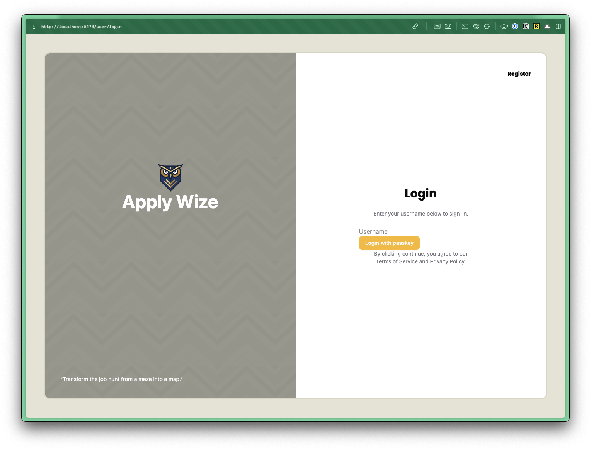

If we take a look in the browser, this looks great. The only thing we lack is the input field and button styles. Let's head back to our `styles.css` file:
```css title="src/styles.css" {3-5}
@layer base {
  ...
  input[type="text"] {
    @apply border-border border-1 rounded-md px-3 h-9 block w-full mb-2 text-base;
  }
}
```
---
- Let's target an `input` with a `type` of `text` with `input[type="text"]`. Since, we're styling a base tag, we can stick this in the `base` layer.
- We want to add a border with a color of border `border-border` and a width of `1px` with `border-1`.
- Let's round the corners with `rounded-md`
- Add some horizontal padding `px-3`
- Set the height to `36px` with `h-9`
- Give our input a `display` of `block`. This ensure that the `input` has it's own line.
- It should span the entire width of its container `w-full`.
- Let's add some spacing to the bottom with `mb-2` (`8px`)
- Set the font size to `16px` with `text-base`
---

For the button, we're using the shadcn/ui button component. Let's crack it open:
```tsx title="src/components/ui/button.tsx"
const buttonVariants = cva(
  "font-bold inline-flex items-center justify-center gap-2 whitespace-nowrap rounded-md text-sm transition-all disabled:pointer-events-none disabled:opacity-50 [&_svg]:pointer-events-none [&_svg:not([class*='size-'])]:size-4 shrink-0 [&_svg]:shrink-0 outline-none focus-visible:border-ring focus-visible:ring-ring/50 focus-visible:ring-[3px] aria-invalid:ring-destructive/20 dark:aria-invalid:ring-destructive/40 aria-invalid:border-destructive",
  {
    variants: {
      variant: {
        default:
          "bg-primary text-primary-foreground hover:bg-primary/90",
        ...
```
---
- Near the top of the file, there's a variable called `buttonVariants` that contains all the Tailwind styling.
- Let's make the button text bold by adding a class of `font-bold` within the first list of classes. This ensures that all button variants will be bold. You'll also need to remove `font-medium` from the list. Otherwise, the two classes will conflict.
- The first variant is the `default` variant and has a class of `bg-primary`. This is why our button is using our yellow, primary color. We've already set `--color-primary` within our `styles.css` file.
---

The button text is appearing white because of the `text-primary-foreground` class. Lets' remove this class and add a `text-black` class:

```tsx title="src/app/components/ui/button.tsx"
variant: {
  default: "bg-primary text-black hover:bg-primary/90",
```

Let's take a look at the final result within the browser:

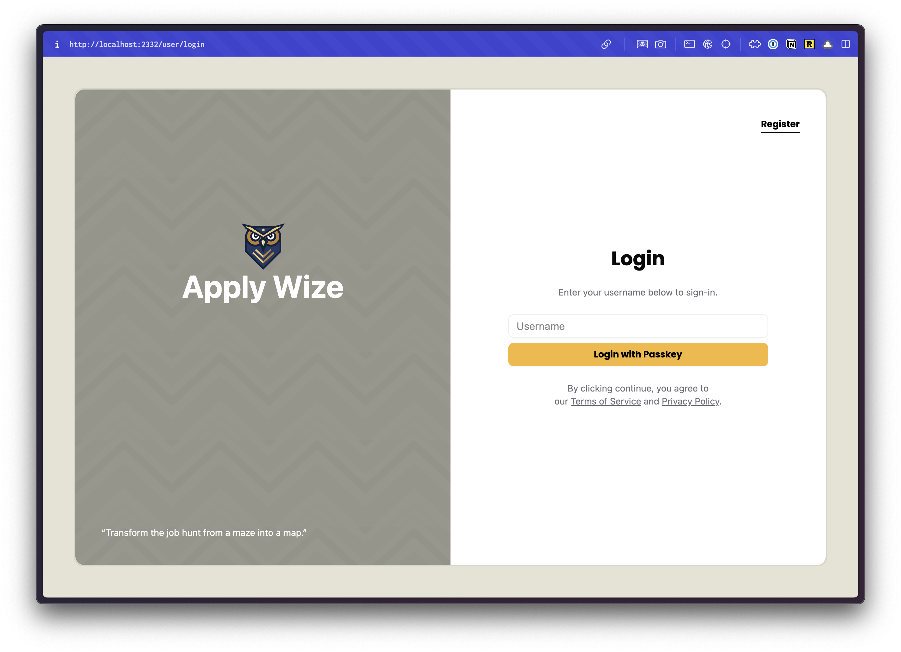

👏 Well done!

But, there's one more thing. Let's move the `result` message at the bottom of the form to the top.

```tsx title="src/app/pages/user/Login.tsx" {4}
<div className="auth-form max-w-[400px] w-full mx-auto px-10">
  <h1 className="page-title text-center">Login</h1>
  <p className="py-6">Enter your username below to sign-in.</p>
  {result && <div>{result}</div>}

  <input
    type="text"
    value={username}
    onChange={(e) => setUsername(e.target.value)}
    placeholder="Username"
  />
  <Button
    onClick={handlePerformPasskeyLogin}
    disabled={isPending}
    className="font-display w-full mb-6"
  >
    {isPending ? <>...</> : "Login with passkey"}
  </Button>
  <p>
    By clicking continue, you agree to our{" "}
    <a href="#">Terms of Service</a> and <a href="#">Privacy Policy</a>.
  </p>
</div>
```

We can also style this, using an `<Alert />` shadcn/ui component. We just need to import our component at the top and wrap our `{result}`.

```tsx title="src/app/pages/user/Login.tsx" showLineNumbers=false
import { Alert, AlertTitle } from "@/app/components/ui/alert";
import { AlertCircle } from "lucide-react";
...
{result && (
  <Alert variant="destructive" className="mb-5">
    <AlertCircle className="h-4 w-4"/>
    <AlertTitle>{result}</AlertTitle>
  </Alert>
)}
```
---
- `Alert`, `AlertCircle`, and `AlertTitle` are all from the shadcn/ui `Alert` component. [You can find the full documentation here.](https://ui.shadcn.com/docs/components/alert)
- Let's set the `variant` to `destructive`
- and add some margin to the bottom with `mb-5`
---

You'll need to login unsuccessfully to see the alert (or comment out the redirect).

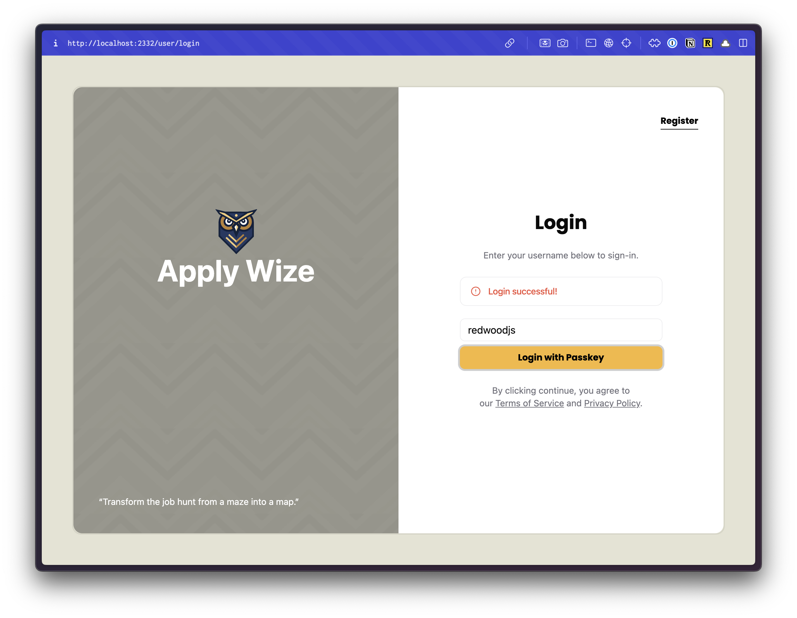

🥳 Excellent!

But, there's one more thing (there's always one more thing). We need to add links to our Register, Terms of Service, and Privacy Policy pages.

## Linking between the Login and Signup Pages

The links between pages is functionality that we will want to insure works, so we'll write a test to capture this behavior.

Since the navigation between these pages does not require us to be logged in, we won't need to use the `sharedPage` context, and we'll set this up in its own describe block.

```ts title="tests/authentication.spec.ts"
test.describe(
  withDocMeta("Auth Navigation", {
    sidebar_position: 2,
    description: "Links to and from the sign up and login pages",
  }),
  () => {},
)
```

Let's add our first test case.

```ts title="tests/authentication.spec.ts"
test("Link to the sign up page", async ({ page }, testInfo) => {
  await test.step("On the Login page ", async () => {
    await page.goto("/auth/login")
  })

  await test.step("there is a link.", async () => {
    const signUpLink = page.getByRole("link", { name: "Register" })

    await expect(signUpLink).toBeVisible()
    await screenshot(testInfo, signUpLink, {
      annotation: { text: "Click to go to the sign up page" },
    })

    await signUpLink.click()
  })

  await test.step("The link will take you to the Sign Up page.", async () => {
    await expect(
      page.getByRole("heading", { name: "Sign up" }),
    ).toBeVisible()
  })
})
```

So we like to have that annotation arrow pointing to our highlighted element, so let's turn that on by default for all screenshot annotations by adding some default values in our `playwright-test2doc.config.ts`.

```ts title="playwright-test2doc.config.ts" {2,5-9}
import { defineConfig, devices } from "@playwright/test"
import "@test2doc/playwright/types"
...
  use: {
    test2doc: {
      annotationDefaults: {
        showArrow: true,
      }
    },
    baseURL: "http://localhost:5173",
  },
...
```

- We import `import "@test2doc/playwright/types"` at the top to get the test2doc options added to the `PlaywrightTestOptions`.
- We add set `use.test2doc.annotationDefaults.showArrow` to true. If you like, you can change any of the [annotations](https://test2doc.com/docs/user-guide/screenshots/annotation#annotation-object-properties) to have a default property.
- No we can go back and remove the `showArrow: true` option in our `screenshot` calls in our test file.

### Implement redirect
To make this test pass is pretty simple, we just update the href on our link using out `link` function.

```ts title="src/passkey/components/Login.tsx" {2}
<a
  href={link("/auth/signup")}
  className="font-display font-bold text-black text-sm underline underline-offset-8 hover:decoration-primary"
>
  Register
</a>
```

## Linking to Privacy Policy and Terms of Service
We won't be building full Privacy Policy or Terms of Service pages. We'll just be stubbing them out for later implementation when or if this becomes a real app.

But since we do want this functionliaty we'll make some tests for this at the least.

We're going to do something a bit different for this describe block and use the `withDocCategory` function to group the generated docs under a Docusaurus Category.

```ts title="tests/authentication.spec.ts"
test.describe(
  withDocCategory("Links to legal documentation", {
    label: "Legal Documentation",
    position: 3,
  }),
  () => {},
)
```

And inside of this describe block, we'll setup another describe block for Privacy Policy and another for Terms of Service.

```ts title="tests/authentication.spec.ts" {7-19}
test.describe(
  withDocCategory("Links to legal documentation", {
    label: "Legal Documentation",
    position: 3,
  }),
  () => {
    test.describe(
      withDocMeta("Privacy Policy", {
        description: "Where to find the Privacy Policy",
      }),
      () => {},
    )

    test.describe(
      withDocMeta("Terms of Service", {
        description: "Where to find the Terms of Service",
      }),
      () => {},
    )
  },
)
```

### Test for the Legal Pages
Now that we got our boilerplate setup, let's write our tests for the Privacy Policy and Terms of Service.

```ts title="tests/authentication.spec.ts" {7-20}
...
test.describe(
  withDocMeta("Privacy Policy", {
    description: "Where to find the Privacy Policy",
  }),
  () => {
    test("Login page", async ({ page }, testInfo) => {
      await test.step("Contains a link to the Privacy Policy", async () => {
        await page.goto("/auth/login")
        const link = page.getByRole("link", { name: "Privacy Policy" })
        await screenshot(testInfo, link, {
          annotation: { text: "Link to Privacy Policy" },
        })

        await link.click()
        await expect(
          page.getByRole("heading", { name: "Privacy Policy" }),
        ).toBeVisible()
      })
    })
  },
)

test.describe(
  withDocMeta("Terms of Service", {
    description: "Where to find the Terms of Service",
  }),
  () => {
    test("Login page", async ({ page }, testInfo) => {
      await test.step("Contains a link to the Terms of Service", async () => {
        await page.goto("/auth/login")
        const link = page.getByRole("link", {
          name: "Terms of Service",
        })
        await screenshot(testInfo, link, {
          annotation: { text: "Link to Terms of Service" },
        })

        await link.click()
        await expect(
          page.getByRole("heading", { name: "Terms of Service" }),
        ).toBeVisible()
      })
    })
  },
)
...
```

### Implement Stubs for Legal Pages
Let's add to our `link` function.

```ts title="src/app/shared/links.ts" {6-7}
export const link = defineLinks([
  "/",
  "/auth/login",
  "/auth/signup",
  "/applications",
  "/legal/privacy",
  "/legal/terms",
])
```

Now that we've added our routes to the links, let's link to the pages.

```ts title="src/passkey/components/Login.tsx" {3-4}
<p>
  By clicking continue, you agree to our{" "}
  <a href={link("/legal/terms")}>Terms of Service</a> and{" "}
  <a href={link("/legal/privacy")}>Privacy Policy</a>.
</p>
```

The test just needs one more thing to pass, a stub. So let's go to the worker.

```ts title="src/worker.tsx" {7-10}
render(Document, [
  index([isAuthenticated, Home]),
  layout(AuthLayout, [prefix("/auth", authRoutes())]),
  prefix("/applications", [
    route("/", [isAuthenticated, () => <h1>Applications</h1>]),
  ]),
  prefix("/legal", [
    route("/privacy", () => <h1>Privacy Policy</h1>),
    route("/terms", () => <h1>Terms of Service</h1>),
  ]),
]),
```

Tests should pass and we should have a nice docs generated documenting the linking.

## Styling the Signup Page

😅 Don't worry, we've already done all the heavy lifting. This will be a breeze, because we already wrapped our `UserRoutes` with a `layout` function.

Now, let's add a login link at the top of our signup page. And by that I mean, we'll add the test for it first.

```ts title="tests/authentication.spec.ts" {4-23}
test.describe(
  withDocMeta("Auth Navigation", {
    ...
    test("Link to the login page", async ({ page }, testInfo) => {
      await test.step("On the Signup page ", async () => {
        await page.goto("/auth/signup")
      })

      await test.step("there is a link.", async () => {
        const signUpLink = page.getByRole("link", { name: "Login" })

        await expect(signUpLink).toBeVisible()
        await screenshot(testInfo, signUpLink, {
          annotation: { text: "Click to go to the login page" },
        })

        await signUpLink.click()
      })

      await test.step("The link will take you to the Login page.", async () => {
        await expect(page.getByRole("heading", { name: "Login" })).toBeVisible()
      })
    })
  ...
```

Now we'll add the link to the Login page and use the same styles we used earlier for the link to the Signup page. And since we're updating the styling a bit, let's remove the `bg-bg` class off of the `main` tags.

```tsx title="src/passkey/components/Signup.tsx"
return (
  <main>
    <div className="absolute top-0 right-0 p-10">
      <a
        href={link("/auth/login")}
        className="font-display font-bold text-black text-sm underline underline-offset-8 hover:decoration-primary"
      >
        Login
      </a>
    </div>
    ...
```
---
- Our Login link is using the exact same styles as the Register link on the Login page. The only difference is we changed the link to point to our `/auth/login` route and the label is `Login`.
---


Next, let's wrap the rest of our content with a `div` with the `.auth-form` class:

```tsx title="src/app/pages/user/Signup.tsx" {2-11}
  ...
  <div className="auth-form max-w-[400px] w-full mx-auto px-10">
    <h1 className="text-4xl font-bold text-red-500">Sign up</h1>
    <input type="text" placeholder="Username" ref={username} />
    <Button onClick={handlePerformPasskeyRegister} disabled={isPending}>
      {isPending ?
        <>...</>
      : "Register with passkey"}
    </Button>
    {result && <div>{result}</div>}
  </div>
</main>
...
```
---
- We're using the same styles as our login page.
- We have a class `auth-form` that will style our `p` and `a` tags.
- We've set the maximum width of our form to `400px`, but we want it to take up as much space as possible `min-w-full`.
- Center it on the page `mx-auto`.
- Added `40px` padding to the left and right with `px-10`.
---

We'll update our heading and add a paragraph:

```tsx title="src/app/pages/user/Signup.tsx" {3-4}
...
<div className="auth-form max-w-[400px] w-full mx-auto px-10">
  <h1 className="page-title text-center">Create an Account</h1>
  <p className="py-6">Enter a username to setup an account.</p>
  <input type="text" placeholder="Username" ref={username} />
  ...
```

Because we just updated the copy of the text we'll also need to go and update the name of the headings we were testing against.

### Refactor the Tests to be more DRY

This is the second time we've had to change a selector for a test. The problem is as our tests grow, if we ever need to update copy on the page, we might end up breaking multipe tests. This is obviously brittle and not ideal.

There are a few options we can use to solve this problem. [Page object models](https://playwright.dev/docs/pom) (POM) are a very popular way to abstract away selectors. I however, do not like them because I find their boilerplate to be a bit verbose. (The irony of the writer making you write a bunch of test boilerplate to generate docs; does not escape me.) I also find the POMs sometimes abstract away too much details making it slightly harder to understand tests.

So I'm going to recommend a medium level of abstraction in creating a `Selector Tuple` object. Which will, simply put, be an object with tuple selectors values that we can pass to a locator to select an element on the DOM.

```ts title="tests/util.ts" {3-14}
import type { CDPSession, Page } from "@playwright/test"
...
export const selectors = {
  headingSignup: ["heading", { name: "Create an Account" }],
  headingLogin: ["heading", { name: "Login" }],
  headingApplications: ["heading", { name: "Applications" }],
  headingPrivacyPolicy: ["heading", { name: "Privacy Policy" }],
  headingTermsOfService: ["heading", { name: "Terms of Service" }],
  inputUsername: ["textbox", { name: "Username" }],
  buttonRegister: ["button", { name: "Register with passkey" }],
  buttonLogin: ["button", { name: "Login with passkey" }],
  linkRegister: ["link", { name: "Register" }],
  linkLogin: ["link", { name: "Login" }],
  linkPrivacyPolicy: ["link", { name: "Privacy Policy" }],
  linkTermsOfService: ["link", { name: "Terms of Service" }],
} satisfies Record<string, Parameters<Page["getByRole"]>>
```

Now we need to swap out all the `getByRole` calls to use the [spread operator](https://developer.mozilla.org/en-US/docs/Web/JavaScript/Reference/Operators/Spread_syntax) for the values from our `selector` object.

```ts title="tests/authentication.spec.ts"
...
await expect(
  sharedPage.getByRole(...selectors.headingSignup),
).toBeVisible()
...
```

<details>
<summary>Updated `tests/authentication.spec.ts` code</summary>

```ts title="tests/authentication.spec.ts" {8,57,69,78,82,94,100,119,128,138,144,167,178,188,199,219,226,241,248}
import {
  test,
  expect,
  CDPSession,
  Page,
  BrowserContext,
} from "@playwright/test"
import { selectors, simulateSuccessfulPasskeyInput } from "./util"
import { withDocCategory, withDocMeta } from "@test2doc/playwright/DocMeta"
import { screenshot } from "@test2doc/playwright/screenshots"

const clip = { x: 0, y: 0, width: 550, height: 200 }

test.describe.serial(
  withDocMeta("Authentication Flow", { sidebar_position: 1 }),
  () => {
    const username = `testuser-${Date.now()}`
    let client: CDPSession
    let authenticatorId: string
    let sharedContext: BrowserContext
    let sharedPage: Page

    test.beforeAll(async ({ browser }) => {
      // Create shared context for both tests
      sharedContext = await browser.newContext()
      sharedPage = await sharedContext.newPage()
    })

    test.afterAll(async () => {
      await client?.detach()
      await sharedContext?.close()
    })

    test("Register a new user", async ({}, testInfo) => {
      await test.step("We support [Passkeys](https://docs.github.com/en/authentication/authenticating-with-a-passkey/about-passkeys) by [WebAuthn](https://en.wikipedia.org/wiki/WebAuthn).\n\n", async () => {
        client = await sharedPage.context().newCDPSession(sharedPage)
        await client.send("WebAuthn.enable")

        const result = await client.send("WebAuthn.addVirtualAuthenticator", {
          options: {
            protocol: "ctap2",
            transport: "internal",
            hasResidentKey: true,
            hasUserVerification: true,
            isUserVerified: true,
            automaticPresenceSimulation: true,
          },
        })

        authenticatorId = result.authenticatorId
      })

      await test.step("To get started with registration, goto the sign up page at `/auth/signup`.", async () => {
        await sharedPage.goto("auth/signup")

        await expect(
          sharedPage.getByRole(...selectors.headingSignup),
        ).toBeVisible()

        await screenshot(testInfo, sharedPage, { clip })

        const result = await client.send("WebAuthn.getCredentials", {
          authenticatorId,
        })
        expect(result.credentials).toHaveLength(0)
      })

      await test.step("\n\nFilling out the registration form and ", async () => {
        const usernameInput = sharedPage.getByRole(...selectors.inputUsername)
        await usernameInput.fill(username)
      })

      await test.step("submitting the registration form. Then follow the passkey registration prompt by your browser.\n\n", async () => {
        await screenshot(
          testInfo,
          [
            {
              target: sharedPage.getByRole(...selectors.inputUsername),
              options: { annotation: { text: "Input username here" } },
            },
            {
              target: sharedPage.getByRole(...selectors.buttonRegister),
              options: { annotation: { text: "Click to register" } },
            },
          ],
          {
            clip,
          },
        )
        await simulateSuccessfulPasskeyInput(
          client,
          authenticatorId,
          async () =>
            await sharedPage.getByRole(...selectors.buttonRegister).click(),
        )
      })

      await test.step("\n\nOn successful registration you will be redirect to login page.", async () => {
        await expect(
          sharedPage.getByRole(...selectors.headingLogin),
        ).toBeVisible()

        await screenshot(testInfo, sharedPage, {
          clip,
        })

        const result = await client.send("WebAuthn.getCredentials", {
          authenticatorId,
        })
        expect(result.credentials).toHaveLength(1)
      })
    })

    test("Login with existing user", async ({}, testInfo) => {
      await test.step("While on the login page at `/auth/login`.\n\n", async () => {
        await sharedPage.goto("auth/login")

        await expect(
          sharedPage.getByRole(...selectors.headingLogin),
        ).toBeVisible()

        await screenshot(testInfo, sharedPage, { clip })
      })

      await test.step("\n\nClicking the login button and following the passkey prompt by your browser.\n\n", async () => {
        await screenshot(
          testInfo,
          sharedPage.getByRole(...selectors.buttonLogin),
          {
            annotation: { text: "Click to login" },
            clip,
          },
        )
        await simulateSuccessfulPasskeyInput(
          client,
          authenticatorId,
          async () =>
            await sharedPage.getByRole(...selectors.buttonLogin).click(),
        )
      })

      await test.step("\n\nOn successful login you will be taken to the applications page.\n\n", async () => {
        await expect(
          sharedPage.getByRole(...selectors.headingApplications),
        ).toBeVisible()

        await screenshot(testInfo, sharedPage, {
          clip,
        })
      })
    })
  },
)

test.describe(
  withDocMeta("Auth Navigation", {
    sidebar_position: 2,
    description: "Links to and from the sign up and login pages",
  }),
  () => {
    test("Link to the sign up page", async ({ page }, testInfo) => {
      await test.step("On the Login page ", async () => {
        await page.goto("/auth/login")
      })

      await test.step("there is a link.", async () => {
        const signUpLink = page.getByRole(...selectors.linkRegister)

        await expect(signUpLink).toBeVisible()
        await screenshot(testInfo, signUpLink, {
          annotation: { text: "Click to go to the sign up page" },
        })

        await signUpLink.click()
      })

      await test.step("The link will take you to the Sign Up page.", async () => {
        await expect(page.getByRole(...selectors.headingSignup)).toBeVisible()
      })
    })

    test("Link to the login page", async ({ page }, testInfo) => {
      await test.step("On the Signup page ", async () => {
        await page.goto("/auth/signup")
      })

      await test.step("there is a link.", async () => {
        const signUpLink = page.getByRole(...selectors.linkLogin)

        await expect(signUpLink).toBeVisible()
        await screenshot(testInfo, signUpLink, {
          annotation: { text: "Click to go to the login page" },
        })

        await signUpLink.click()
      })

      await test.step("The link will take you to the Login page.", async () => {
        await expect(page.getByRole(...selectors.headingLogin)).toBeVisible()
      })
    })
  },
)

test.describe(
  withDocCategory("Links to legal documentation", {
    label: "Legal Documentation",
    position: 3,
  }),
  () => {
    test.describe(
      withDocMeta("Privacy Policy", {
        description: "Where to find the Privacy Policy",
      }),
      () => {
        test("Login page", async ({ page }, testInfo) => {
          await test.step("Contains a link to the Privacy Policy", async () => {
            await page.goto("/auth/login")
            const link = page.getByRole(...selectors.linkPrivacyPolicy)
            await screenshot(testInfo, link, {
              annotation: { text: "Link to Privacy Policy" },
            })

            await link.click()
            await expect(
              page.getByRole(...selectors.headingPrivacyPolicy),
            ).toBeVisible()
          })
        })
      },
    )

    test.describe(
      withDocMeta("Terms of Service", {
        description: "Where to find the Terms of Service",
      }),
      () => {
        test("Login page", async ({ page }, testInfo) => {
          await test.step("Contains a link to the Terms of Service", async () => {
            await page.goto("/auth/login")
            const link = page.getByRole(...selectors.linkTermsOfService)
            await screenshot(testInfo, link, {
              annotation: { text: "Link to Terms of Service" },
            })

            await link.click()
            await expect(
              page.getByRole(...selectors.headingTermsOfService),
            ).toBeVisible()
          })
        })
      },
    )
  },
)

test.describe(withDocMeta("Protected Routes", {}), () => {
  test("Unauthenticated users are redirected to login page when accessing protected routes", async ({
    page,
  }) => {
    await test.step("- `/applications`", async () => {
      await page.goto("/applications")

      await expect(page).toHaveURL("/auth/login")
    })

    await test.step("- `/`", async () => {
      await page.goto("/")

      await expect(page).toHaveURL("/auth/login")
    })
  })
})
```
</details>

Now with our tests a bit more [DRY](https://en.wikipedia.org/wiki/Don%27t_repeat_yourself) we can get back to styling.

### Back to styling

Let's move our `result` message to appear right below our heading:


```tsx title="src/app/pages/user/Signup.tsx" {2-3,8-13}
...
import { Alert, AlertTitle } from "@/app/components/ui/alert"
import { AlertCircle } from "lucide-react"
...
<div className="auth-form max-w-[400px] w-full mx-auto px-10">
  <h1 className="page-title text-center">Create an Account</h1>
  <p className="py-6">Enter a username to setup an account.</p>
  {result && (
    <Alert variant="destructive" className="mb-5">
      <AlertCircle className="h-4 w-4" />
      <AlertTitle>{result}</AlertTitle>
    </Alert>
  )}
  <input type="text" placeholder="Username" ref={username} />
  ...
```

Jumping down a little bit, on our `Button` component, let's add a few classes to the end:

```tsx title="src/app/pages/user/Signup.tsx" {5}
  <input type="text" placeholder="Username" ref={username} />
  <Button
    onClick={handlePerformPasskeyRegister}
    disabled={isPending}
    className="font-display w-full mb-6"
  >
    {isPending ?
      <>...</>
    : "Register with passkey"}
  </Button>
</div>
```
---
- We want to use the font Poppins, `font-display`.
- Make the button span the entire width of the container, `w-full`.
- Add some spacing to the bottom, `mb-6`.
---

Lastly we we'll add the legal statement just under the buttons. So let's write our 2 last tests before we implemnet those links.
```ts title="tests/authentication.spec.ts"
...
test.describe(
  withDocMeta("Privacy Policy", {
    description: "Where to find the Privacy Policy",
  }),
  () => {
    test("Login page", async ({ page }, testInfo) => {
    ...
    test("Signup page", async ({ page }, testInfo) => {
      await test.step("Contains a link to the Privacy Policy", async () => {
        await page.goto("/auth/signup")
        const link = page.getByRole(...selectors.linkPrivacyPolicy)
        await screenshot(testInfo, link, {
          annotation: { text: "Link to Privacy Policy" },
        })

        await link.click()
        await expect(
          page.getByRole(...selectors.headingPrivacyPolicy),
        ).toBeVisible()
      })
    })
...
test.describe(
  withDocMeta("Terms of Service", {
    description: "Where to find the Terms of Service",
  }),
  () => {
    test("Login page", async ({ page }, testInfo) => {
    ...
    test("Signup page", async ({ page }, testInfo) => {
      await test.step("Contains a link to the Terms of Service", async () => {
        await page.goto("/auth/signup")
        const link = page.getByRole(...selectors.linkTermsOfService)
        await screenshot(testInfo, link, {
          annotation: { text: "Link to Terms of Service" },
        })

        await link.click()
        await expect(
          page.getByRole(...selectors.headingTermsOfService),
        ).toBeVisible()
      })
    })
    ...
```

These tests are almost identical to the Login page equivolaents.

Now to implement the links:

```tsx title="src/passkey/components/Signup.tsx" {3-8}
...
  </Button>
  <p>
    By clicking continue, you agree to our
    <a href={link("/legal/terms")}>Terms of Service</a>
    and
    <a href={link("/legal/privacy")}>Privacy Policy</a>.
  </p>
</div>
...
```

All tests should pass, and we can regenerate the docs with `pnpm doc`. But you might now notice that the screenshots, don't look as good now that we've styled these pages.

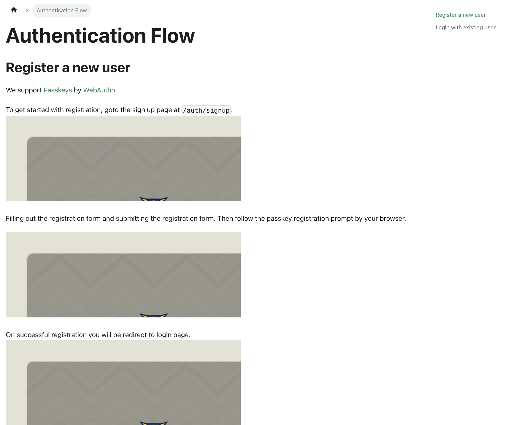

We need to remove the `clip` options from our test as it is no longer of use.

<details>
<summary>Updated final test spec for `tests/authentication.spec.ts`</summary>

```ts title="tests/authentication.spec.ts"
import {
  test,
  expect,
  CDPSession,
  Page,
  BrowserContext,
} from "@playwright/test"
import { selectors, simulateSuccessfulPasskeyInput } from "./util"
import { withDocCategory, withDocMeta } from "@test2doc/playwright/DocMeta"
import { screenshot } from "@test2doc/playwright/screenshots"

test.describe.serial(
  withDocMeta("Authentication Flow", { sidebar_position: 1 }),
  () => {
    const username = `testuser-${Date.now()}`
    let client: CDPSession
    let authenticatorId: string
    let sharedContext: BrowserContext
    let sharedPage: Page

    test.beforeAll(async ({ browser }) => {
      // Create shared context for both tests
      sharedContext = await browser.newContext()
      sharedPage = await sharedContext.newPage()
    })

    test.afterAll(async () => {
      await client?.detach()
      await sharedContext?.close()
    })

    test("Register a new user", async ({}, testInfo) => {
      await test.step("We support [Passkeys](https://docs.github.com/en/authentication/authenticating-with-a-passkey/about-passkeys) by [WebAuthn](https://en.wikipedia.org/wiki/WebAuthn).\n\n", async () => {
        client = await sharedPage.context().newCDPSession(sharedPage)
        await client.send("WebAuthn.enable")

        const result = await client.send("WebAuthn.addVirtualAuthenticator", {
          options: {
            protocol: "ctap2",
            transport: "internal",
            hasResidentKey: true,
            hasUserVerification: true,
            isUserVerified: true,
            automaticPresenceSimulation: true,
          },
        })

        authenticatorId = result.authenticatorId
      })

      await test.step("To get started with registration, goto the sign up page at `/auth/signup`.", async () => {
        await sharedPage.goto("auth/signup")

        await expect(
          sharedPage.getByRole(...selectors.headingSignup),
        ).toBeVisible()

        await screenshot(testInfo, sharedPage)

        const result = await client.send("WebAuthn.getCredentials", {
          authenticatorId,
        })
        expect(result.credentials).toHaveLength(0)
      })

      await test.step("\n\nFilling out the registration form and ", async () => {
        const usernameInput = sharedPage.getByRole(...selectors.inputUsername)
        await usernameInput.fill(username)
      })

      await test.step("submitting the registration form. Then follow the passkey registration prompt by your browser.\n\n", async () => {
        await screenshot(testInfo, [
          {
            target: sharedPage.getByRole(...selectors.inputUsername),
            options: { annotation: { text: "Input username here" } },
          },
          {
            target: sharedPage.getByRole(...selectors.buttonRegister),
            options: { annotation: { text: "Click to register" } },
          },
        ])
        await simulateSuccessfulPasskeyInput(
          client,
          authenticatorId,
          async () =>
            await sharedPage.getByRole(...selectors.buttonRegister).click(),
        )
      })

      await test.step("\n\nOn successful registration you will be redirect to login page.", async () => {
        await expect(
          sharedPage.getByRole(...selectors.headingLogin),
        ).toBeVisible()

        await screenshot(testInfo, sharedPage)

        const result = await client.send("WebAuthn.getCredentials", {
          authenticatorId,
        })
        expect(result.credentials).toHaveLength(1)
      })
    })

    test("Login with existing user", async ({}, testInfo) => {
      await test.step("While on the login page at `/auth/login`.\n\n", async () => {
        await sharedPage.goto("auth/login")

        await expect(
          sharedPage.getByRole(...selectors.headingLogin),
        ).toBeVisible()

        await screenshot(testInfo, sharedPage)
      })

      await test.step("\n\nClicking the login button and following the passkey prompt by your browser.\n\n", async () => {
        await screenshot(
          testInfo,
          sharedPage.getByRole(...selectors.buttonLogin),
          {
            annotation: { text: "Click to login" },
          },
        )
        await simulateSuccessfulPasskeyInput(
          client,
          authenticatorId,
          async () =>
            await sharedPage.getByRole(...selectors.buttonLogin).click(),
        )
      })

      await test.step("\n\nOn successful login you will be taken to the applications page.\n\n", async () => {
        await expect(
          sharedPage.getByRole(...selectors.headingApplications),
        ).toBeVisible()

        await screenshot(testInfo, sharedPage)
      })
    })
  },
)

test.describe(
  withDocMeta("Auth Navigation", {
    sidebar_position: 2,
    description: "Links to and from the sign up and login pages",
  }),
  () => {
    test("Link to the sign up page", async ({ page }, testInfo) => {
      await test.step("On the Login page ", async () => {
        await page.goto("/auth/login")
      })

      await test.step("there is a link.", async () => {
        const signUpLink = page.getByRole(...selectors.linkRegister)

        await expect(signUpLink).toBeVisible()
        await screenshot(testInfo, signUpLink, {
          annotation: { text: "Click to go to the sign up page" },
        })

        await signUpLink.click()
      })

      await test.step("The link will take you to the Sign Up page.", async () => {
        await expect(page.getByRole(...selectors.headingSignup)).toBeVisible()
      })
    })

    test("Link to the login page", async ({ page }, testInfo) => {
      await test.step("On the Signup page ", async () => {
        await page.goto("/auth/signup")
      })

      await test.step("there is a link.", async () => {
        const signUpLink = page.getByRole(...selectors.linkLogin)

        await expect(signUpLink).toBeVisible()
        await screenshot(testInfo, signUpLink, {
          annotation: { text: "Click to go to the login page" },
        })

        await signUpLink.click()
      })

      await test.step("The link will take you to the Login page.", async () => {
        await expect(page.getByRole(...selectors.headingLogin)).toBeVisible()
      })
    })
  },
)

test.describe(
  withDocCategory("Links to legal documentation", {
    label: "Legal Documentation",
    position: 3,
  }),
  () => {
    test.describe(
      withDocMeta("Privacy Policy", {
        description: "Where to find the Privacy Policy",
      }),
      () => {
        test("Login page", async ({ page }, testInfo) => {
          await test.step("Contains a link to the Privacy Policy", async () => {
            await page.goto("/auth/login")
            const link = page.getByRole(...selectors.linkPrivacyPolicy)
            await screenshot(testInfo, link, {
              annotation: { text: "Link to Privacy Policy" },
            })

            await link.click()
            await expect(
              page.getByRole(...selectors.headingPrivacyPolicy),
            ).toBeVisible()
          })
        })

        test("Signup page", async ({ page }, testInfo) => {
          await test.step("Contains a link to the Privacy Policy", async () => {
            await page.goto("/auth/signup")
            const link = page.getByRole(...selectors.linkPrivacyPolicy)
            await screenshot(testInfo, link, {
              annotation: { text: "Link to Privacy Policy" },
            })

            await link.click()
            await expect(
              page.getByRole(...selectors.headingPrivacyPolicy),
            ).toBeVisible()
          })
        })
      },
    )

    test.describe(
      withDocMeta("Terms of Service", {
        description: "Where to find the Terms of Service",
      }),
      () => {
        test("Login page", async ({ page }, testInfo) => {
          await test.step("Contains a link to the Terms of Service", async () => {
            await page.goto("/auth/login")
            const link = page.getByRole(...selectors.linkTermsOfService)
            await screenshot(testInfo, link, {
              annotation: { text: "Link to Terms of Service" },
            })

            await link.click()
            await expect(
              page.getByRole(...selectors.headingTermsOfService),
            ).toBeVisible()
          })
        })

        test("Signup page", async ({ page }, testInfo) => {
          await test.step("Contains a link to the Terms of Service", async () => {
            await page.goto("/auth/signup")
            const link = page.getByRole(...selectors.linkTermsOfService)
            await screenshot(testInfo, link, {
              annotation: { text: "Link to Terms of Service" },
            })

            await link.click()
            await expect(
              page.getByRole(...selectors.headingTermsOfService),
            ).toBeVisible()
          })
        })
      },
    )
  },
)

test.describe(withDocMeta("Protected Routes", {}), () => {
  test("Unauthenticated users are redirected to login page when accessing protected routes", async ({
    page,
  }) => {
    await test.step("- `/applications`", async () => {
      await page.goto("/applications")

      await expect(page).toHaveURL("/auth/login")
    })

    await test.step("- `/`", async () => {
      await page.goto("/")

      await expect(page).toHaveURL("/auth/login")
    })
  })
})
```
</details>

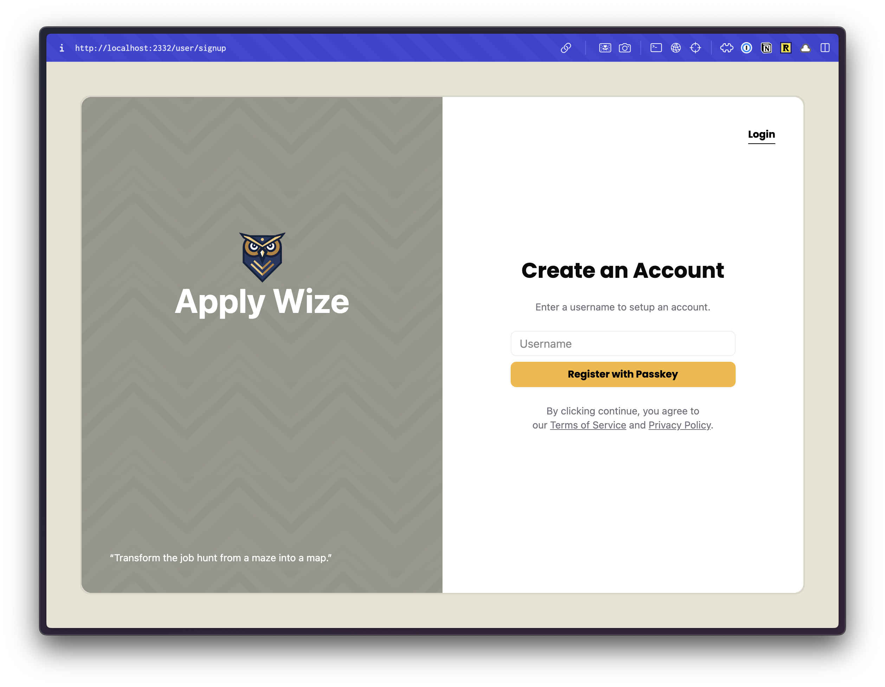

See, I told you! Easy peasy. 🍋

## Code on GitHub
You can find the final code for this step on [GitHub](https://github.com/dethstrobe/applywize2/tree/tutorial-4)

## Further reading
- [Passkeys E2E Playwright Testing via WebAuthn Virtual Authenticator](https://www.corbado.com/blog/passkeys-e2e-playwright-testing-webauthn-virtual-authenticator)
- An even more [detailed guide to how Authentication works and the reasoning behind some of the decisions we made](https://docs.rwsdk.com/core/authentication/)

## What's Coming Next?

Now we got working authentication with the ability to register new users and login.

Next Lesson we'll:

- Learn to seed the DB with test data
- Create the Applications Dashboard
- Get data from our DB and display it
